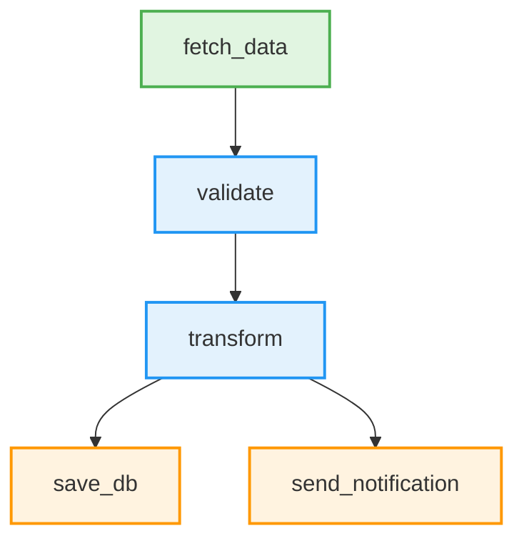

# Issue #31: Mermaid図生成

**Phase:** 2c
**優先度:** 中
**依存関係:** #26 (graph.yaml定義), #27 (依存関係解決エンジン)
**見積もり:** 2日

---

## 概要

グラフ定義から Mermaid 形式のダイアグラムを自動生成します。
ワークフローの依存関係を可視化し、理解とデバッグを容易にします。

---

## TDD実装手順

### Step 1: Mermaid生成のテスト (Red)

```python
# tests/unit/visualization/test_mermaid_generator.py
"""Tests for Mermaid diagram generation."""
import pytest


class TestMermaidGenerator:
    """Test Mermaid diagram generation."""

    def test_generate_simple_graph(self):
        """Should generate Mermaid for simple linear graph."""
        from railway.visualization.mermaid import MermaidGenerator
        from railway.core.graph import Graph, Node

        graph = Graph()
        graph.add_node(Node("fetch", "source"))
        graph.add_node(Node("process", "transform"))
        graph.add_node(Node("save", "sink"))
        graph.add_edge("fetch", "process")
        graph.add_edge("process", "save")

        generator = MermaidGenerator()
        mermaid = generator.generate(graph)

        expected = """graph TB
    fetch[fetch]
    process[process]
    save[save]
    fetch --> process
    process --> save"""

        assert mermaid.strip() == expected.strip()

    def test_generate_parallel_graph(self):
        """Should generate Mermaid for parallel execution."""
        from railway.visualization.mermaid import MermaidGenerator
        from railway.core.graph import Graph, Node

        graph = Graph()
        graph.add_node(Node("fetch", "source"))
        graph.add_node(Node("api1", "transform"))
        graph.add_node(Node("api2", "transform"))
        graph.add_node(Node("merge", "transform"))
        graph.add_node(Node("save", "sink"))

        graph.add_edge("fetch", "api1")
        graph.add_edge("fetch", "api2")
        graph.add_edge("api1", "merge")
        graph.add_edge("api2", "merge")
        graph.add_edge("merge", "save")

        generator = MermaidGenerator()
        mermaid = generator.generate(graph)

        # Verify parallel branches exist
        assert "fetch --> api1" in mermaid
        assert "fetch --> api2" in mermaid
        assert "api1 --> merge" in mermaid
        assert "api2 --> merge" in mermaid

    def test_generate_with_node_types(self):
        """Should use different styles for different node types."""
        from railway.visualization.mermaid import MermaidGenerator
        from railway.core.graph import Graph, Node

        graph = Graph()
        graph.add_node(Node("fetch", "source"))
        graph.add_node(Node("process", "transform"))
        graph.add_node(Node("save", "sink"))
        graph.add_edge("fetch", "process")
        graph.add_edge("process", "save")

        generator = MermaidGenerator(style=True)
        mermaid = generator.generate(graph)

        # Check for styling
        assert "classDef source" in mermaid
        assert "classDef transform" in mermaid
        assert "classDef sink" in mermaid
        assert "class fetch source" in mermaid
        assert "class save sink" in mermaid

    def test_save_to_file(self):
        """Should save Mermaid diagram to file."""
        from railway.visualization.mermaid import MermaidGenerator
        from railway.core.graph import Graph, Node
        import tempfile
        import os

        graph = Graph()
        graph.add_node(Node("test", "source"))

        generator = MermaidGenerator()

        with tempfile.NamedTemporaryFile(mode='w', delete=False, suffix='.mmd') as f:
            filepath = f.name

        try:
            generator.save(graph, filepath)

            assert os.path.exists(filepath)
            with open(filepath) as f:
                content = f.read()
            assert "graph TB" in content
            assert "test[test]" in content
        finally:
            if os.path.exists(filepath):
                os.unlink(filepath)


class TestMermaidCLI:
    """Test Mermaid CLI command."""

    def test_railway_visualize_command(self, tmp_path):
        """Should generate diagram via CLI."""
        from railway.cli.visualize import visualize_graph
        import os

        # Create test graph.yaml
        graph_yaml = tmp_path / "graph.yaml"
        graph_yaml.write_text("""
nodes:
  - name: fetch
    type: source
  - name: process
    type: transform
  - name: save
    type: sink

edges:
  - from: fetch
    to: process
  - from: process
    to: save
""")

        output_file = tmp_path / "workflow.mmd"

        # Run CLI
        visualize_graph(
            str(graph_yaml),
            output=str(output_file),
            format="mermaid"
        )

        assert output_file.exists()
        content = output_file.read_text()
        assert "graph TB" in content
        assert "fetch --> process" in content
```

```bash
# 実行して失敗を確認 (Red)
pytest tests/unit/visualization/test_mermaid_generator.py -v
# Expected: FAILED (MermaidGenerator not implemented)
```

---

### Step 2: Mermaid生成の実装 (Green)

```python
# railway/visualization/__init__.py
"""Visualization utilities."""

# railway/visualization/mermaid.py
"""Mermaid diagram generator."""

from typing import Optional, TextIO
from railway.core.graph import Graph


class MermaidGenerator:
    """
    Generate Mermaid flowchart diagrams from Railway graphs.

    Supports:
    - Linear pipelines
    - Parallel execution
    - Node type styling
    - Custom themes
    """

    def __init__(self, style: bool = False, direction: str = "TB"):
        """
        Initialize Mermaid generator.

        Args:
            style: Enable node type styling
            direction: Graph direction (TB/BT/LR/RL)
        """
        self.style = style
        self.direction = direction

    def generate(self, graph: Graph) -> str:
        """
        Generate Mermaid diagram from graph.

        Args:
            graph: Railway graph to visualize

        Returns:
            Mermaid flowchart syntax
        """
        lines = [f"graph {self.direction}"]

        # Add nodes
        for node in graph.nodes:
            lines.append(f"    {node.name}[{node.name}]")

        # Add edges
        for edge in graph.edges:
            lines.append(f"    {edge.from_node} --> {edge.to_node}")

        # Add styling if enabled
        if self.style:
            lines.append("")
            lines.extend(self._generate_styles(graph))

        return "\n".join(lines)

    def _generate_styles(self, graph: Graph) -> list[str]:
        """Generate style definitions for node types."""
        styles = [
            "    classDef source fill:#e1f5e1,stroke:#4caf50,stroke-width:2px",
            "    classDef transform fill:#e3f2fd,stroke:#2196f3,stroke-width:2px",
            "    classDef sink fill:#fff3e0,stroke:#ff9800,stroke-width:2px",
        ]

        # Apply styles to nodes
        for node in graph.nodes:
            styles.append(f"    class {node.name} {node.type}")

        return styles

    def save(self, graph: Graph, filepath: str) -> None:
        """
        Save Mermaid diagram to file.

        Args:
            graph: Railway graph
            filepath: Output file path (.mmd extension recommended)
        """
        mermaid = self.generate(graph)

        with open(filepath, 'w', encoding='utf-8') as f:
            f.write(mermaid)

    def generate_with_metadata(self, graph: Graph) -> dict:
        """
        Generate Mermaid with additional metadata.

        Returns:
            Dictionary with 'mermaid' and 'stats'
        """
        return {
            "mermaid": self.generate(graph),
            "stats": {
                "nodes": len(graph.nodes),
                "edges": len(graph.edges),
                "sources": len([n for n in graph.nodes if n.type == "source"]),
                "transforms": len([n for n in graph.nodes if n.type == "transform"]),
                "sinks": len([n for n in graph.nodes if n.type == "sink"]),
            }
        }


# railway/cli/visualize.py
"""Visualization CLI command."""

import typer
from pathlib import Path
from railway.core.graph import load_graph_from_yaml
from railway.visualization.mermaid import MermaidGenerator
from loguru import logger

app = typer.Typer(help="Visualization commands")


@app.command()
def visualize_graph(
    graph_file: str = typer.Argument(..., help="Path to graph.yaml"),
    output: str = typer.Option("workflow.mmd", help="Output file path"),
    format: str = typer.Option("mermaid", help="Output format (mermaid)"),
    style: bool = typer.Option(True, help="Enable node type styling"),
    direction: str = typer.Option("TB", help="Graph direction (TB/BT/LR/RL)"),
):
    """
    Generate visual diagram from graph definition.

    Example:
        railway visualize graph.yaml --output workflow.mmd
    """
    try:
        # Load graph
        logger.info(f"Loading graph from {graph_file}")
        graph = load_graph_from_yaml(graph_file)

        # Generate diagram
        logger.info(f"Generating {format} diagram")
        if format == "mermaid":
            generator = MermaidGenerator(style=style, direction=direction)
            generator.save(graph, output)
        else:
            raise ValueError(f"Unsupported format: {format}")

        logger.success(f"✓ Diagram saved to {output}")

        # Show stats
        stats = generator.generate_with_metadata(graph)["stats"]
        logger.info(
            f"Graph statistics: {stats['nodes']} nodes, "
            f"{stats['edges']} edges"
        )

    except Exception as e:
        logger.error(f"Failed to generate diagram: {e}")
        raise typer.Exit(1)


if __name__ == "__main__":
    app()
```

```bash
# 実行して成功を確認 (Green)
pytest tests/unit/visualization/test_mermaid_generator.py -v
# Expected: PASSED
```

---

### Step 3: リファクタリングと最適化 (Refactor)

- エッジケース処理 (空グラフ、循環参照)
- パフォーマンス最適化
- ドキュメント充実

---

## 完了条件

- [ ] `MermaidGenerator` クラスの実装
- [ ] グラフ → Mermaid変換
- [ ] ノードタイプ別スタイリング
- [ ] `railway visualize` コマンド
- [ ] ファイル保存機能
- [ ] テスト (8テスト以上)
- [ ] テストカバレッジ 90%以上
- [ ] ドキュメント更新
- [ ] サンプルダイアグラム

---

## 出力例



---

## 関連Issue

- Issue #26: graph.yaml定義
- Issue #27: 依存関係解決エンジン
- Issue #33: WebUI基本実装 (Mermaid表示)

---

## 拡張案

- PNG/SVG出力 (mermaid-cli連携)
- インタラクティブ図 (クリックで詳細表示)
- 実行状態の可視化 (成功/失敗/実行中)
