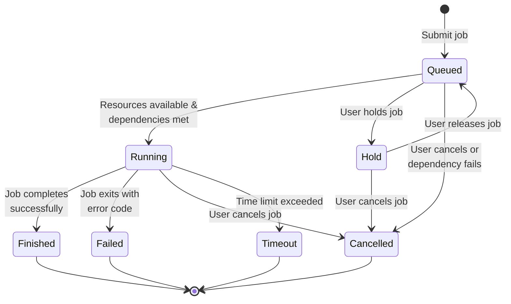
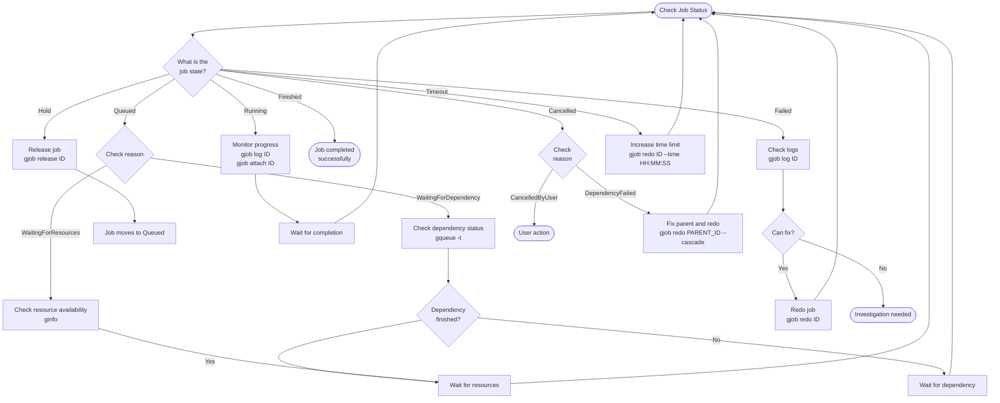

# Job Lifecycle

This guide explains the complete lifecycle of jobs in gflow, including state transitions, status checking, and recovery operations.

## Job States

gflow jobs can be in one of seven states:

| State | Short | Description |
|-------|-------|-------------|
| **Queued** | PD | Job is waiting to run (pending dependencies or resources) |
| **Hold** | H | Job is on hold by user request |
| **Running** | R | Job is currently executing |
| **Finished** | CD | Job completed successfully |
| **Failed** | F | Job terminated with an error |
| **Cancelled** | CA | Job was cancelled by user or system |
| **Timeout** | TO | Job exceeded its time limit |

### State Categories

**Active States** (job is not yet complete):
- Queued, Hold, Running

**Completed States** (job has finished):
- Finished, Failed, Cancelled, Timeout

## State Transition Diagram

The following diagram shows all possible state transitions in gflow:

### State Transition Rules

**From Queued**:
- → **Running**: When dependencies are met AND resources are available
- → **Hold**: User runs `gjob hold <job_id>`
- → **Cancelled**: User runs `gcancel <job_id>` OR a dependency fails (with auto-cancel enabled)

**From Hold**:
- → **Queued**: User runs `gjob release <job_id>`
- → **Cancelled**: User runs `gcancel <job_id>`

**From Running**:
- → **Finished**: Job script/command exits with code 0
- → **Failed**: Job script/command exits with non-zero code
- → **Cancelled**: User runs `gcancel <job_id>`
- → **Timeout**: Job exceeds its time limit (set with `--time`)

**From Completed States**:
- No transitions (final states)
- Use `gjob redo <job_id>` to create a new job with the same parameters

## Job State Reasons

Jobs in certain states have an associated reason that provides more context:

| State | Reason | Description |
|-------|--------|-------------|
| Queued | `WaitingForDependency` | Job is waiting for parent jobs to finish |
| Queued | `WaitingForResources` | Job is waiting for available GPUs/memory |
| Hold | `JobHeldUser` | Job was put on hold by user request |
| Cancelled | `CancelledByUser` | User explicitly cancelled the job |
| Cancelled | `DependencyFailed:<job_id>` | Job was auto-cancelled because job `<job_id>` failed |
| Cancelled | `SystemError:<msg>` | Job was cancelled due to a system error |

View the reason with `gjob show <job_id>` or `gqueue -f JOBID,ST,REASON`.

## Status Checking Workflow

The following diagram shows how to check job status and take appropriate actions:

## See Also

- [Job Dependencies](./job-dependencies) - Complete guide to job dependencies
- [Job Submission](./job-submission) - Job submission options
- [Time Limits](./time-limits) - Managing job timeouts
