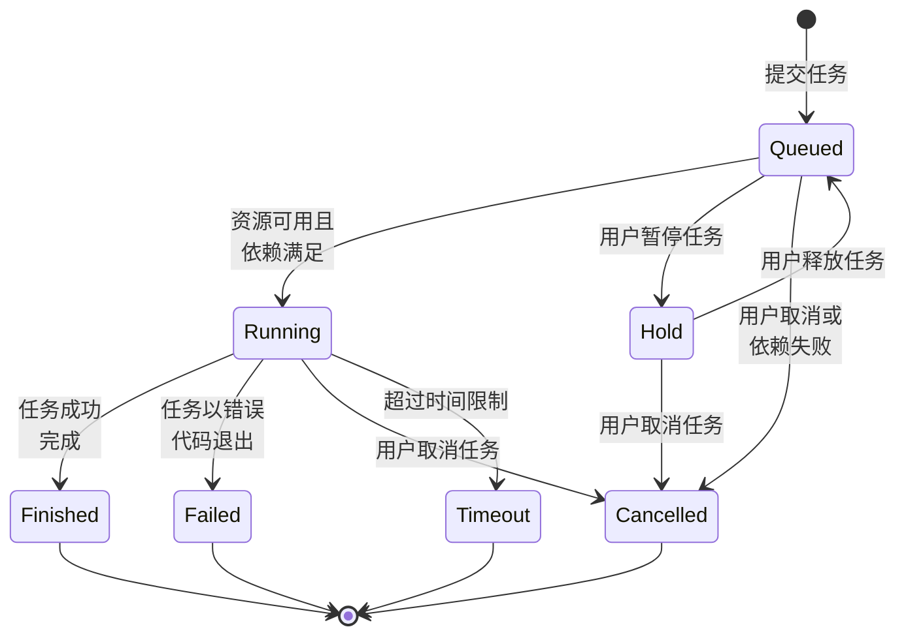
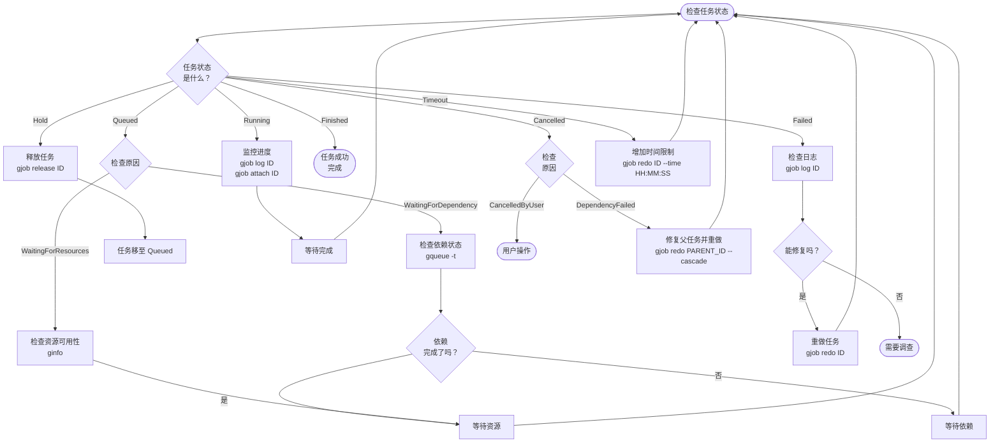

# 任务生命周期

本指南解释了 gflow 中任务的完整生命周期，包括状态转换、状态检查和恢复操作。

## 任务状态

gflow 任务可以处于以下七种状态之一：

| 状态 | 简写 | 描述 |
|------|------|------|
| **Queued** | PD | 任务正在等待运行（等待依赖或资源） |
| **Hold** | H | 任务被用户暂停 |
| **Running** | R | 任务正在执行 |
| **Finished** | CD | 任务成功完成 |
| **Failed** | F | 任务因错误终止 |
| **Cancelled** | CA | 任务被用户或系统取消 |
| **Timeout** | TO | 任务超过时间限制 |

### 状态分类

**活动状态**（任务尚未完成）：
- Queued、Hold、Running

**完成状态**（任务已结束）：
- Finished、Failed、Cancelled、Timeout

## 状态转换图

以下图表显示了 gflow 中所有可能的状态转换：

### 状态转换规则

**从 Queued**：
- → **Running**：当依赖满足且资源可用时
- → **Hold**：用户运行 `gjob hold <job_id>`
- → **Cancelled**：用户运行 `gcancel <job_id>` 或依赖失败（启用自动取消时）

**从 Hold**：
- → **Queued**：用户运行 `gjob release <job_id>`
- → **Cancelled**：用户运行 `gcancel <job_id>`

**从 Running**：
- → **Finished**：任务脚本/命令以代码 0 退出
- → **Failed**：任务脚本/命令以非零代码退出
- → **Cancelled**：用户运行 `gcancel <job_id>`
- → **Timeout**：任务超过时间限制（使用 `--time` 设置）

**从完成状态**：
- 无转换（最终状态）
- 使用 `gjob redo <job_id>` 创建具有相同参数的新任务

## 任务状态原因

某些状态的任务有关联的原因，提供更多上下文：

| 状态 | 原因 | 描述 |
|------|------|------|
| Queued | `WaitingForDependency` | 任务正在等待父任务完成 |
| Queued | `WaitingForResources` | 任务正在等待可用的 GPU/内存 |
| Hold | `JobHeldUser` | 任务被用户暂停 |
| Cancelled | `CancelledByUser` | 用户明确取消了任务 |
| Cancelled | `DependencyFailed:<job_id>` | 任务因任务 `<job_id>` 失败而自动取消 |
| Cancelled | `SystemError:<msg>` | 任务因系统错误而取消 |

使用 `gjob show <job_id>` 或 `gqueue -f JOBID,ST,REASON` 查看原因。

## 状态检查工作流

以下图表显示了如何检查任务状态并采取适当的操作：

## 另请参阅

- [任务依赖](./job-dependencies) - 任务依赖完整指南
- [任务提交](./job-submission) - 任务提交选项
- [时间限制](./time-limits) - 管理任务超时
