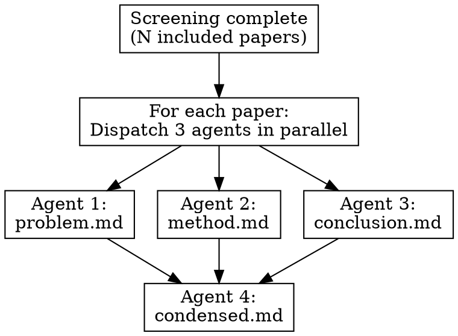

# Extracting

Parallel evidence extraction from included papers using specialized subagents.

## Overview

After screening completes, extract evidence from all INCLUDED papers using **parallel subagents** to maximize throughput.

**Core principle:** Dispatch 3 agents per paper in parallel, then combine results.

**Prerequisite:** Screening must be complete (scimesh:screening).

## Directory Structure (per paper)

```
{paper-slug}/
├── index.yaml       # Metadata + screening
├── fulltext.pdf     # PDF (if available)
├── problem.md       # Extracted: problem/context
├── method.md        # Extracted: methodology
├── conclusion.md    # Extracted: results/conclusions
└── condensed.md     # Combined summary with frontmatter
```

## Workflow



## Agent Prompts

**Launch all 3 extraction agents IN PARALLEL using Task tool:**

```python
# In a SINGLE message, call Task tool 3 times for the same paper:
Task(
    subagent_type="scientific-paper-condenser",
    prompt=PROBLEM_PROMPT.format(paper_path=path, pdf_path=pdf),
    description=f"Extract problem: {paper_slug}"
)
Task(
    subagent_type="scientific-paper-condenser",
    prompt=METHOD_PROMPT.format(paper_path=path, pdf_path=pdf),
    description=f"Extract method: {paper_slug}"
)
Task(
    subagent_type="scientific-paper-condenser",
    prompt=CONCLUSION_PROMPT.format(paper_path=path, pdf_path=pdf),
    description=f"Extract conclusion: {paper_slug}"
)
```

### PROBLEM_PROMPT

```
Extract the PROBLEM/CONTEXT from this paper.

Paper: {paper_path}/index.yaml
PDF: {paper_path}/{pdf_path}

Focus on:
1. What problem does this paper address?
2. Why is it important? (motivation)
3. What gap in existing work does it fill?
4. What are the research questions or hypotheses?

Output format: Write to {paper_path}/problem.md

Keep it concise (300-500 words). Use bullet points where appropriate.
Do NOT include methodology or results - only the problem context.
```

### METHOD_PROMPT

```
Extract the METHODOLOGY from this paper.

Paper: {paper_path}/index.yaml
PDF: {paper_path}/{pdf_path}

Focus on:
1. What method/approach does the paper propose?
2. Key technical components (architecture, algorithms, loss functions)
3. Datasets used for evaluation
4. Baselines compared against
5. Evaluation metrics

Output format: Write to {paper_path}/method.md

Keep it concise (400-600 words). Include key equations/formulas if central.
Do NOT include results or conclusions - only methodology.
```

### CONCLUSION_PROMPT

```
Extract the RESULTS/CONCLUSIONS from this paper.

Paper: {paper_path}/index.yaml
PDF: {paper_path}/{pdf_path}

Focus on:
1. Main experimental results (quantitative)
2. Key findings and insights
3. Limitations acknowledged by authors
4. Future work suggested
5. Practical implications

Output format: Write to {paper_path}/conclusion.md

Keep it concise (300-500 words). Include key numbers/metrics.
Do NOT include methodology - only results and conclusions.
```

### CONDENSE_PROMPT

After the 3 parallel agents complete, run a 4th agent:

```
Combine the extracted sections into a single condensed summary.

Paper: {paper_path}/index.yaml
Sections:
- {paper_path}/problem.md
- {paper_path}/method.md
- {paper_path}/conclusion.md

Create {paper_path}/condensed.md with this EXACT structure:

---
title: "{paper title}"
authors: [{first author} et al.]
year: {year}
doi: "{doi}"
method_category: "{category}"  # e.g., "diffusion", "vae", "gan", "transformer"
key_contribution: "{one-line summary}"
datasets: [{list of datasets used}]
metrics: [{list of evaluation metrics}]
---

## Problem

{Summarize problem.md in 2-3 sentences}

## Method

{Summarize method.md in 3-5 sentences, highlighting key innovation}

## Results

{Summarize conclusion.md in 2-3 sentences with key numbers}

## Relevance

{2-3 sentences on how this paper relates to the review's research question}
```

## Batch Processing

Process papers in batches of 5:

```
Batch 1: Papers 1-5
├── Paper 1: [problem] [method] [conclusion] → [condensed]
├── Paper 2: [problem] [method] [conclusion] → [condensed]
└── ...

# 15 parallel agents for extraction + 5 sequential for combining
```

## Progress Tracking

Create Tasks for extraction visibility:

```python
for paper in included_papers:
    TaskCreate(
        subject=f"Extract: {paper_title[:40]}...",
        description=f"Extract problem/method/conclusion from {paper_slug}",
        activeForm=f"Extracting {paper_slug}..."
    )
```

## Handling Missing PDFs

If paper doesn't have a PDF:
1. Check if abstract is substantial in index.yaml
2. If abstract exists: Extract what's possible from abstract only
3. If no abstract: Mark in condensed.md frontmatter:

```yaml
---
title: "Paper Title"
extraction_status: incomplete
extraction_note: "No PDF or abstract available"
---
```

## When to Skip Extraction

Ask user before starting:

```python
{
    "question": f"Screening complete. {included_count} papers included. Extract evidence?",
    "header": "Extract?",
    "options": [
        {"label": "Yes, extract all (Rec)", "description": f"Dispatch agents for {included_count} papers"},
        {"label": "Extract subset", "description": "Choose which papers to extract"},
        {"label": "Skip to synthesis", "description": "Generate PRISMA without extraction"}
    ],
    "multiSelect": False
}
```

## Next Step

After extraction is complete, use **scimesh:synthesizing** to generate PRISMA and synthesis.
