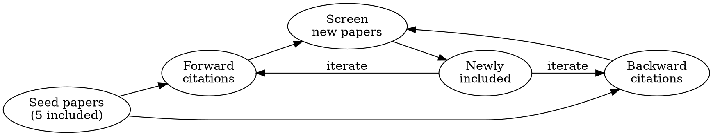

# Snowballing

Citation-based paper discovery through forward and backward snowballing.

## Overview

Expand a systematic review by following citation chains from key papers.

**Forward snowballing:** Find papers that CITE a key paper (newer work building on it)
**Backward snowballing:** Find papers CITED BY a key paper (foundational work it builds on)

## Commands

### Forward Citations (papers citing this one)

```bash
uvx scimesh vault snowball {review_path}/ "10.1234/key-paper" --direction in -n 50
```

### Backward Citations (references)

```bash
uvx scimesh vault snowball {review_path}/ "10.1234/key-paper" --direction out -n 50
```

### Both Directions

```bash
uvx scimesh vault snowball {review_path}/ "10.1234/key-paper" --direction both -n 50
```

## Command Options

```bash
uvx scimesh vault snowball {review_path}/ "DOI" \
    --direction in|out|both \     # Citation direction
    -p openalex,semantic_scholar \ # Providers (default: both)
    -n 50 \                        # Max results per direction
    --scihub                       # Enable Sci-Hub for PDFs (optional)
```

## Provider Support

| Provider | Forward | Backward |
|----------|---------|----------|
| openalex | Yes | Yes |
| semantic_scholar | Yes | Yes |
| scopus | Yes (in only) | No |
| crossref | No | No |
| arxiv | No | No |

## Workflow

### Step 1: Identify Seed Papers

After screening, identify 3-5 highly relevant papers to use as seeds:

```python
{
    "question": "Which papers should we use as seeds for snowballing?",
    "header": "Seeds",
    "options": [
        {"label": "Top cited (Rec)", "description": "Use 5 most-cited included papers"},
        {"label": "Most relevant", "description": "Choose based on relevance to RQ"},
        {"label": "Seminal works", "description": "Known foundational papers"}
    ],
    "multiSelect": False
}
```

### Step 2: Run Snowballing

For each seed paper:

```bash
# Forward: who cites this?
uvx scimesh vault snowball {review_path}/ "DOI" --direction in -n 100

# Backward: who does this cite?
uvx scimesh vault snowball {review_path}/ "DOI" --direction out -n 50

# Both at once
uvx scimesh vault snowball {review_path}/ "DOI" --direction both -n 50
```

### Step 3: Automatic Deduplication

The vault snowball command automatically:
- Deduplicates against existing papers in `papers.yaml`
- Records in `searches.yaml` with `type: snowball`, `seed_doi`, `direction`
- Papers track which searches found them via `search_ids`
- Downloads PDFs when available (Open Access)
- Updates vault stats

### Step 4: Screen New Papers

Use **scimesh:screening** to screen the newly added papers.

## Iterative Snowballing

For comprehensive reviews, repeat snowballing on newly included papers until saturation (no new relevant papers found).



## Example Session

```
User: "Let's do snowballing on the included papers"

Agent: Lists included papers, identifies top 5 by citation count

Agent: For each seed:
       uvx scimesh vault snowball ./review/ "DOI" --direction both -n 50

Agent: Reports: "Added 127 new papers (89 forward, 38 backward, 23 duplicates removed)"

Agent: [Uses scimesh:screening to screen new papers]
```

## Integration with SLR Workflow

Snowballing typically happens AFTER initial screening:

1. **scimesh:protocoling** - Define protocol
2. **scimesh:searching** - Initial search
3. **scimesh:screening** - Screen initial results
4. **scimesh:snowballing** - Expand via citations (YOU ARE HERE)
5. **scimesh:screening** - Screen snowballed papers
6. **scimesh:extracting** - Extract evidence
7. **scimesh:synthesizing** - Generate PRISMA
