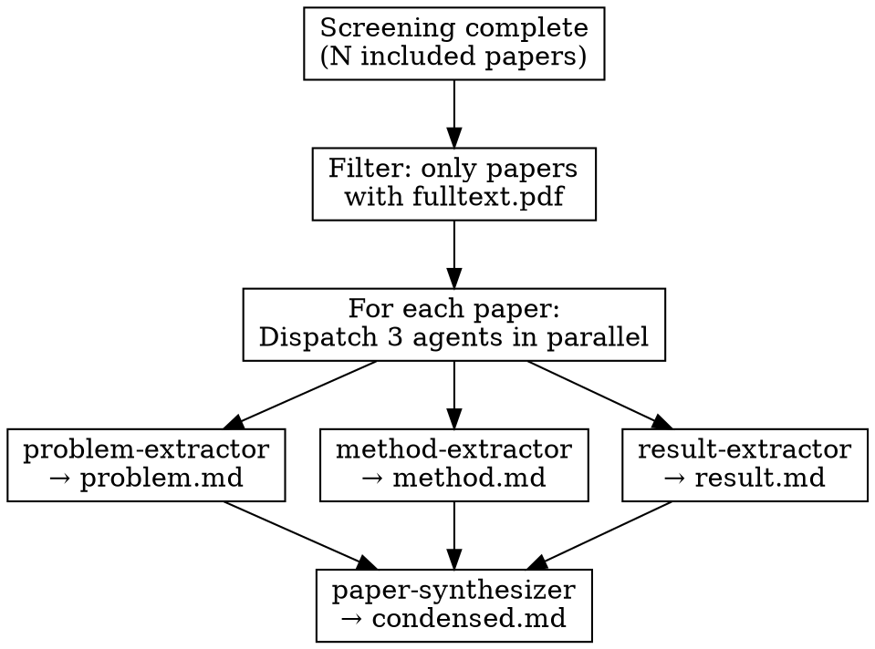

# Extracting

Parallel evidence extraction from included papers using specialized subagents.

## Overview

After screening completes, extract evidence from all INCLUDED papers using **parallel subagents** to maximize throughput.

**Core principle:** Dispatch 3 agents per paper in parallel, then synthesize.

**Prerequisite:** Screening must be complete (scimesh:screening).

**Requirement:** Papers must have `fulltext.pdf` available.

## Directory Structure

```
{review_path}/
├── index.yaml           # Protocol + stats
└── papers/
    └── {year}/                  # Organized by publication year
        └── {paper-slug}/
            ├── index.yaml       # Metadata + screening
            ├── fulltext.pdf     # PDF (required)
            ├── problem.md       # Extracted: problem/context
            ├── method.md        # Extracted: methodology
            ├── result.md        # Extracted: results/conclusions
            └── condensed.md     # Combined summary with frontmatter
```

## Agents

| Agent | Responsibility | Input | Output |
|-------|----------------|-------|--------|
| `problem-extractor` | "What problem does this paper solve?" | PDF | `problem.md` |
| `method-extractor` | "How did they solve it?" | PDF | `method.md` |
| `result-extractor` | "What did they discover?" | PDF | `result.md` |
| `paper-synthesizer` | "How does this paper contribute to my review?" | PDF + 3 files + protocol | `condensed.md` |

## Workflow



## Launching Agents

**Step 1: Launch 3 extraction agents IN PARALLEL (single message, 3 Task calls):**

```python
# All 3 in the SAME message for parallelism
Task(
    subagent_type="problem-extractor",
    prompt=f"Extract problem from: {paper_path}/fulltext.pdf\nWrite to: {paper_path}/problem.md",
    description=f"Extract problem: {paper_slug}"
)
Task(
    subagent_type="method-extractor",
    prompt=f"Extract method from: {paper_path}/fulltext.pdf\nWrite to: {paper_path}/method.md",
    description=f"Extract method: {paper_slug}"
)
Task(
    subagent_type="result-extractor",
    prompt=f"Extract results from: {paper_path}/fulltext.pdf\nWrite to: {paper_path}/result.md",
    description=f"Extract result: {paper_slug}"
)
```

**Step 2: After all 3 complete, launch synthesizer:**

```python
Task(
    subagent_type="paper-synthesizer",
    prompt=f"""Synthesize paper extractions:
PDF: {paper_path}/fulltext.pdf
Problem: {paper_path}/problem.md
Method: {paper_path}/method.md
Result: {paper_path}/result.md
Protocol: {review_path}/index.yaml
Output: {paper_path}/condensed.md""",
    description=f"Synthesize: {paper_slug}"
)
```

## Batch Processing

Process papers in batches of 5:

```
Batch 1: Papers 1-5
├── Paper 1: [problem] [method] [result] → [synthesize]
├── Paper 2: [problem] [method] [result] → [synthesize]
└── ...

# 15 parallel agents for extraction + 5 sequential for synthesizing
```

## Progress Tracking

Create Tasks for extraction visibility:

```python
for paper in included_papers_with_pdf:
    TaskCreate(
        subject=f"Extract: {paper_title[:40]}...",
        description=f"Extract problem/method/result from {paper_slug}",
        activeForm=f"Extracting {paper_slug}..."
    )
```

## Handling Papers Without PDF

**Skip papers without PDF.** Before starting extraction:

```bash
# List papers with PDFs (organized by year)
find {review_path}/papers -name "fulltext.pdf" -exec dirname {} \;

# Example: papers/2023/smith-diffusion-tabular/fulltext.pdf
```

If a paper doesn't have a PDF, mark it in the paper's index.yaml:

```yaml
extraction_status: skipped
extraction_note: "No PDF available"
```

## Pre-Extraction Check

Ask user before starting:

```python
{
    "question": f"Found {with_pdf_count}/{total_count} papers with PDFs. Extract evidence from {with_pdf_count} papers?",
    "header": "Extract?",
    "options": [
        {"label": f"Yes, extract {with_pdf_count} (Rec)", "description": "Dispatch agents for papers with PDFs"},
        {"label": "Select specific papers", "description": "Choose which papers to extract"},
        {"label": "Skip to synthesis", "description": "Generate PRISMA without extraction"}
    ],
    "multiSelect": False
}
```

## Next Step

After extraction is complete, use **scimesh:synthesizing** to generate PRISMA and synthesis.
