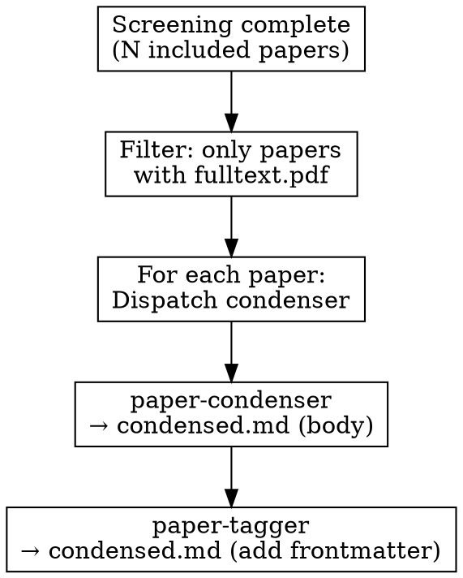

# Extracting

Parallel evidence extraction from included papers using specialized subagents.

## Overview

After screening completes, extract evidence from all INCLUDED papers using **parallel subagents** to maximize throughput.

**Core principle:** Dispatch 2 agents per paper sequentially (condense → tag).

**Prerequisite:** Screening must be complete (scimesh:screening).

**Requirement:** Papers must have `fulltext.pdf` available.

## Directory Structure

```
{review_path}/
├── index.yaml           # Protocol + stats
└── papers/
    └── {year}/                  # Organized by publication year
        └── {paper-slug}/
            ├── index.yaml       # Metadata + screening
            ├── fulltext.pdf     # PDF (required)
            └── condensed.md     # Complete extraction with frontmatter
```

## Agents

| Agent | Responsibility | Input | Output |
|-------|----------------|-------|--------|
| `paper-condenser` | Extract all content (problem, method, results) in one pass | PDF | `condensed.md` (body) |
| `paper-tagger` | Add frontmatter with tags and relevance | `condensed.md` + protocol | `condensed.md` (with frontmatter) |

## Workflow



## Launching Agents

**Step 1: Launch condenser agent for each paper (can run multiple papers in parallel):**

```python
# Process multiple papers in parallel - each gets a condenser
Task(
    subagent_type="paper-condenser",
    prompt=f"Extract from: {paper_path}/fulltext.pdf\nWrite to: {paper_path}/condensed.md",
    description=f"Condense: {paper_slug}"
)
```

**Step 2: After condenser completes, launch tagger:**

```python
Task(
    subagent_type="paper-tagger",
    prompt=f"""Add frontmatter to condensed paper:
Condensed: {paper_path}/condensed.md
Protocol: {review_path}/index.yaml
Output: {paper_path}/condensed.md (prepend frontmatter)""",
    description=f"Tag: {paper_slug}"
)
```

## Batch Processing

Process papers in batches - condensers can run in parallel, taggers run after their respective condenser:

```
Batch 1: Papers 1-10
├── Paper 1: [condense] → [tag]
├── Paper 2: [condense] → [tag]
├── Paper 3: [condense] → [tag]
└── ...

# Launch up to 10 condensers in parallel
# Each tagger waits for its condenser to finish
```

**Maximum parallelism:** Launch all condensers for a batch in a single message:

```python
# Single message with multiple Task calls
Task(subagent_type="paper-condenser", prompt=f"...", description=f"Condense: paper1")
Task(subagent_type="paper-condenser", prompt=f"...", description=f"Condense: paper2")
Task(subagent_type="paper-condenser", prompt=f"...", description=f"Condense: paper3")
# ... up to 10 papers
```

## Progress Tracking

Create Tasks for extraction visibility:

```python
for paper in included_papers_with_pdf:
    TaskCreate(
        subject=f"Extract: {paper_title[:40]}...",
        description=f"Condense and tag {paper_slug}",
        activeForm=f"Extracting {paper_slug}..."
    )
```

## Handling Papers Without PDF

**Skip papers without PDF.** Before starting extraction:

```bash
# List papers with PDFs (organized by year)
find {review_path}/papers -name "fulltext.pdf" -exec dirname {} \;

# Example: papers/2023/smith-diffusion-tabular/fulltext.pdf
```

If a paper doesn't have a PDF, mark it in the paper's index.yaml:

```yaml
extraction_status: skipped
extraction_note: "No PDF available"
```

## Pre-Extraction Check

Ask user before starting:

```python
{
    "question": f"Found {with_pdf_count}/{total_count} papers with PDFs. Extract evidence from {with_pdf_count} papers?",
    "header": "Extract?",
    "options": [
        {"label": f"Yes, extract {with_pdf_count} (Rec)", "description": "Dispatch agents for papers with PDFs"},
        {"label": "Select specific papers", "description": "Choose which papers to extract"},
        {"label": "Skip to synthesis", "description": "Generate PRISMA without extraction"}
    ],
    "multiSelect": False
}
```

## Next Step

After extraction is complete, use **scimesh:synthesizing** to generate PRISMA and synthesis.
