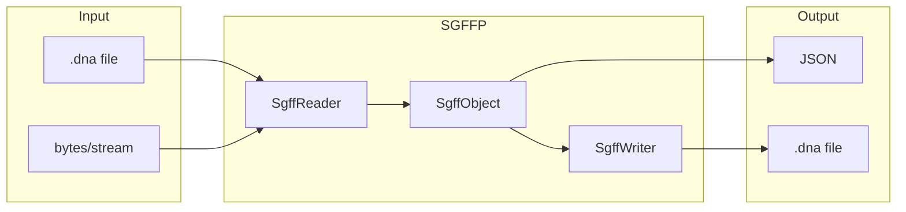

# SnapGene File Format Parser

SnapGene File Format Parser (SGFFP for short) is a reverse-engineered parser for SnapGene DNA, RNA, and protein file formats.

> [!Important]
> Found an unknown block type? Run `sff check your_file.dna -l` and look for `[NEW]` markers. Please report them in [#1](https://github.com/merv1n34k/sgffp/issues/1) with a dump (`sff check your_file.dna -d`). Help us decode more blocks!

The parser reads SnapGene files into Python objects and exports to JSON, with a writer for creating new SnapGene files.

The project aims to be a minimalistic, fast, and useful tool for molecular biologists who need to parse large libraries of SnapGene files, or for developers building SnapGene-compatible applications.

## Architecture



## Installation

```bash
pip install sgffp
```

Or with uv:

```bash
uv add sgffp
```

For development:

```bash
git clone https://github.com/merv1n34k/sgffp.git
cd sgffp
uv sync --all-extras
```

### Quick Start

```python
from sgffp import SgffReader, SgffWriter

# Read a SnapGene file
sgff = SgffReader.from_file("plasmid.dna")

# Access data via typed properties
print(sgff.sequence.value)
print(sgff.features[0].name)

# Modify and write back
sgff.sequence.topology = "circular"
SgffWriter.to_file(sgff, "output.dna")
```

### CLI Tool

```bash
uv run sff check plasmid.dna    # Inspect file blocks
uv run sff parse plasmid.dna    # Export to JSON
uv run sff info plasmid.dna     # Show file information
```

## File Format

SnapGene uses a Type-Length-Value (TLV) binary format where each block contains:

| Field  | Size    | Description              |
|--------|---------|--------------------------|
| Type   | 1 byte  | Block type identifier    |
| Length | 4 bytes | Payload size (big-endian)|
| Data   | N bytes | Block payload            |

Data encoding varies by block type: UTF-8 for sequences, XML for annotations, 2-bit encoding for compressed DNA (GATC → 00/01/10/11), and LZMA compression for history blocks.

## Block Types

All known SnapGene block types and their encoding formats:

| ID | Block Type           | Format        | ID | Block Type           | Format        |
|----|----------------------|---------------|----|----------------------|---------------|
| 0  | DNA Sequence         | UTF-8         | 17 | Alignable Sequences  | XML           |
| 1  | Compressed DNA       | 2-bit GATC    | 18 | Sequence Trace       | ZTR           |
| 5  | Primers              | XML           | 21 | Protein Sequence     | UTF-8         |
| 6  | Notes                | XML           | 28 | Enzyme Visualization | XML           |
| 7  | History Tree         | LZMA + XML    | 29 | History Modifier     | LZMA + XML    |
| 8  | Sequence Properties  | XML           | 30 | History Content      | LZMA + TLV    |
| 10 | Features             | XML           | 32 | RNA Sequence         | UTF-8         |
| 11 | History Nodes        | Binary + TLV  | 14 | Custom Enzymes       | XML           |

Blocks not listed (2-4, 9, 12-13, 15-16, 19-20, 22-27, 31) are either unknown or internal SnapGene data.

## Supported Block Types

The table below shows which block types can be read from and written to SnapGene files. Blocks marked with a Model have typed Python classes for convenient access (e.g., `sgff.sequence`, `sgff.features`, `sgff.history`).

| ID | Block Type                    | Read | Write | Model |
|----|-------------------------------|------|-------|-------|
| 0  | DNA Sequence                  | +    | +     | +     |
| 1  | Compressed DNA                | +    | +     | +     |
| 5  | Primers (XML)                 | +    | +     | +     |
| 6  | Notes (XML)                   | +    | +     | +     |
| 7  | History Tree (XML)            | +    | +     | +     |
| 8  | Sequence Properties (XML)     | +    | +     | +     |
| 10 | Features (XML)                | +    | +     | +     |
| 11 | History Nodes                 | +    | +     | +     |
| 14 | Custom Enzymes (XML)          | +    | +     | -     |
| 17 | Alignable Sequences (XML)     | +    | +     | +     |
| 21 | Protein Sequence              | +    | +     | +     |
| 28 | Enzyme Visualization (XML)    | +    | +     | -     |
| 29 | History Modifier (XML)        | +    | +     | +     |
| 30 | History Content (Nested)      | +    | +     | +     |
| 32 | RNA Sequence                  | +    | +     | +     |


## Roadmap

- [x] Improve SGFF parsing, unify TLV strategy
- [x] Understand whole file structure
- [x] Correctly parse into readable format from all common blocks
- [x] Create writer for supported block types
- [x] Add comprehensive test suite (199 tests)
- [x] Parse XML into pure JSON format
- [x] Add write support for history blocks (LZMA compression)
- [x] Add typed model classes for easy data access
- [ ] Documentation improvements

## Acknowledgments

This project would not have been possible without previous work done by
- **Damien Goutte-Gattat**, see his PDF on SGFF structure: https://incenp.org/dvlpt/docs/binary-sequence-formats/binary-sequence-formats.pdf
- **Isaac Luo**, for his version of SnapGene reader: https://github.com/IsaacLuo/SnapGeneFileReader

## License

Distributed under MIT licence, see `LICENSE` for more.
