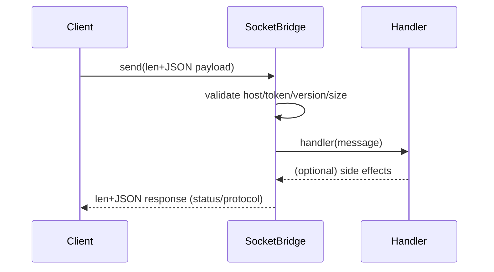

# SocketBridge

Lightweight, stdlib-only TCP IPC bridge for local agents and tools.

## Features
- Length-prefixed JSON frames (no partial or merged reads)
- Loopback-by-default bind
- Auth token + host allowlist
- Max-bytes cap and protocol version check
- Zero dependencies (pure Python stdlib)

## Quick Start (once published)
```bash
pip install socketbridge
```

```python
from socketbridge.server import SocketServer

def handler(message):
    print("got", message)

srv = SocketServer("127.0.0.1", 7002, handler=handler)
srv.start()
# ... send messages with an auth_token ...
srv.stop()
```

Client helper (planned):
```python
from socketbridge.client import send
resp = send("127.0.0.1", 7002, {"type": "ping"}, token="secret")
print(resp)
```

## Examples
- `examples/example_server.py` — minimal server that echos back notifications.
- `examples/example_client.py` — sends a JSON payload with optional auth token.

Run them:
```bash
python examples/example_server.py &
python examples/example_client.py --text "hello" --token secret
```

## Security Defaults
- Binds 127.0.0.1 unless you override host
- Optional auth token via `SOCKETBRIDGE_TOKEN`
- Optional allowlist via `SOCKETBRIDGE_ALLOWLIST` (comma separated)
- Payload cap via `SOCKETBRIDGE_MAX_BYTES` (default 1MB)
- Not for internet-facing use without additional hardening (TLS/mTLS)

## Architecture (conceptual)
```
Client
  |
  | 4-byte length + JSON (auth_token, protocol_version, payload)
  v
SocketBridge Server (loopback, token/allowlist/max-bytes)
  |--> handler(message)   # your code runs here
  |
  ^ 4-byte length + JSON response (status, message, protocol_version)
```

Mermaid sequence (for docs that render it):


## Why
Provides a clean side-band channel for agents, test harnesses, and helper processes without touching stdout/stderr or adding external dependencies.

## License
MIT
