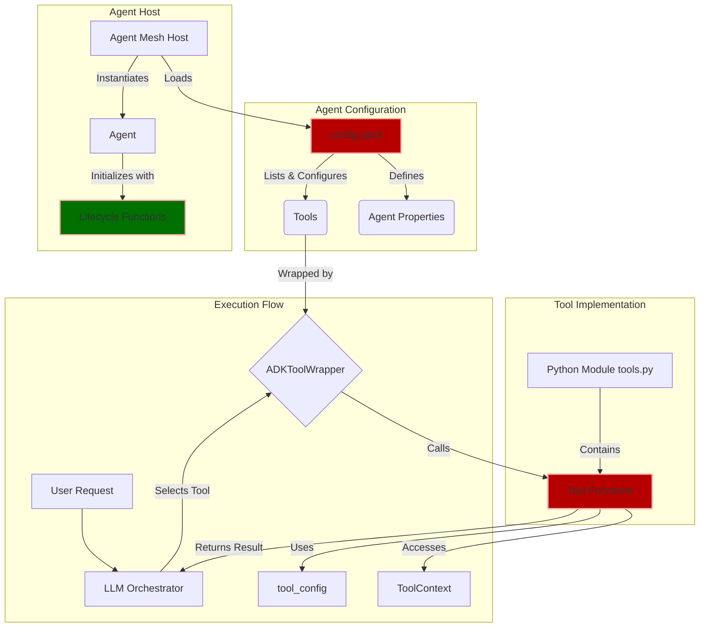
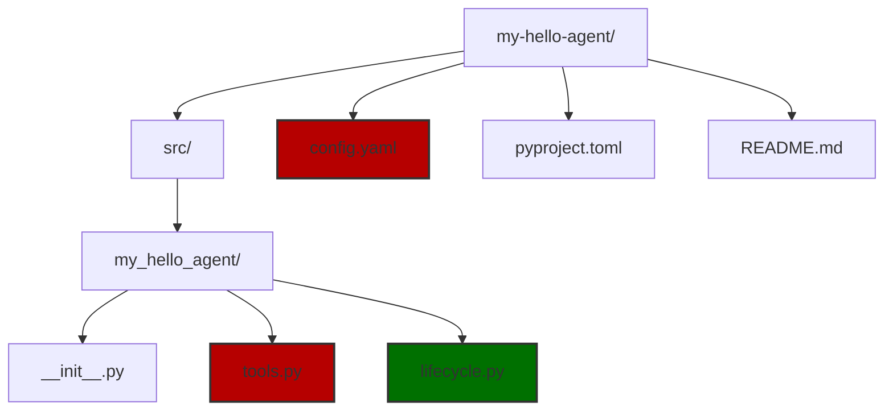

:::tip
For a more comprehensive tutorial example, see the [Build Your Own Agent](tutorials/custom-agent.md) guide.
This page walks through the fundamental concepts for creating agents in Agent Mesh.
:::

Agent Mesh is a powerful platform that enables you to create intelligent agents that can communicate with each other and perform complex tasks. At its core, Agent Mesh uses a tool-based architecture where LLM-powered agents are equipped with specific capabilities (tools) that they can use to accomplish user requests.

Before continuing with this tutorial, make sure you are familiar with the basic [agent concept](../components/agents.md).

This tutorial guides you through creating your first Agent Mesh agent from scratch. You will learn how to define tools as Python functions, configure an agent using YAML, and set up agent lifecycle functions. By the end of this tutorial, you should have a working "Hello World" agent that demonstrates the fundamental concepts of Agent Mesh agent development.

## Understanding the Architecture

Before diving into implementation, you need to understand how the different components of an Agent Mesh agent work together. This architectural overview will help you see the big picture before you start building.



When a user sends a request to your agent, the LLM orchestrator analyzes the request and decides which tool to use. The framework wraps your tool functions and provides them with context and configuration. Your tool executes its logic and returns results to the LLM, which then formulates a response to the user.

## Core Concepts

Understanding these fundamental concepts will help you build effective agents.

### Tools: The Building Blocks

Tools are the fundamental building blocks of Agent Mesh agents. Each tool is implemented as a Python function that performs a specific task. The LLM orchestrating your agent decides which tools to use based on the user's request and the tool descriptions you provide.

Tools can process text and data, interact with external APIs, create and manipulate files, communicate with other agents, and access databases and services. You write tools as standard Python functions, and the framework handles the integration with the LLM.

:::tip
Agent Mesh provides a set of [built-in tools](../components/builtin-tools/builtin-tools.md) plus support for [model context protocol (MCP)](tutorials/mcp-integration.md) servers, which can be configured in the tools list of your agent configuration.
:::

### Configuration File: The Blueprint

The `config.yaml` (for plugin template) or `agent-name.yaml` (for agent instances) file is the blueprint of your agent. This YAML file defines your agent's identity (name, description, and capabilities), model configuration (which LLM to use), tools list (which tools the agent can access and how they're configured), lifecycle functions (setup and cleanup procedures), framework services (session management, artifact storage, and so on), and [agent card](../components/agents.md#agent-card) (metadata describing the agent capabilities, skills and its visibility in the system).

The configuration file connects all the pieces together. It tells the framework where to find your tool functions, how to configure them, and what instructions to give the LLM about your agent's purpose.

### Tool Configuration: Customizing Behavior

Within the `tools` list in your YAML config, each tool can have its own `tool_config` section. This allows you to configure the same tool function for different purposes, pass specific parameters to tool instances, and customize tool behavior per agent.

This design pattern enables code reuse. You can write a single generic tool function and configure it multiple times with different parameters to serve different purposes within the same agent.

:::info
For tools of type "python", you can also use the `tool_name` and `tool_description` to overwrite the function name and description in the tool docstring.

This is useful when using a generic tool function for multiple purposes, allowing you to provide a more descriptive name and description for each instance.
:::

### ToolContext: Accessing Framework Services

The `ToolContext` object (passed as one of the arguments to your tool function) provides your tools with access to Agent Mesh core services. Through this context object, your tools can access structured logging for debugging and monitoring, the artifact service for file storage and retrieval, session information about the current user and session context, and agent state for sharing data between tool calls.

The framework automatically provides this context to your tool functions. You don't need to create or manage it yourself.

### Lifecycle Functions: Managing Resources

Lifecycle functions allow you to manage resources that should persist for the agent's lifetime. The `agent_init_function` runs when the agent starts (for example, to establish database connections), and the `agent_cleanup_function` runs when the agent shuts down (for example, to close connections gracefully).

These functions are optional but recommended for managing resources effectively. They ensure that your agent properly initializes any required resources and cleans them up when shutting down.

:::note
Lifecycle functions are optional but recommended for managing resources effectively.
:::

## Creating Your First Agent: Step-by-Step

Now that you understand the core concepts, you can create a simple agent that demonstrates how these pieces work together. You will build a "Hello World" agent that can greet users and say goodbye.

### Step 1: Initialize Your Agent Plugin

You can create an agent either by using the `sam add agent` command or by creating a new plugin of type agent with `sam plugin create my-hello-agent --type agent`.

:::tip
For information and recommendations about these options, see [`Agent or Plugin: Which To use?`](../components/plugins.md#agent-or-plugin-which-to-use).
:::

In this tutorial, you create a new agent by creating a new plugin of type agent. For an example of custom agents, see [Build Your Own Agent](tutorials/custom-agent.md) guide.

Although the directory structure for plugins is slightly different than the one for agents, both require a YAML configuration file, and a python module with the tools and lifecycle functions you want.

To create a new agent plugin, run the following command:

```bash
sam plugin create my-hello-agent --type agent
```

Follow the prompts to set up your agent. The prompts create a new directory structure for your agent:

```
my-hello-agent/
├── src/
│   └── my_hello_agent/
│       ├── __init__.py
│       ├── tools.py
│       └── lifecycle.py # This file won't be automatically created
├── config.yaml
├── pyproject.toml
└── README.md
```



The `config.yaml` file will contain your agent configuration, `tools.py` will contain your tool functions, and `lifecycle.py` (which you'll create manually) will contain your lifecycle functions. The `pyproject.toml` file manages your plugin's dependencies and metadata.

### Step 2: Create Your Tool Functions

Tools are where your agent's actual capabilities live. You will create two simple tools: one to greet users and one to say goodbye.

Create your tool functions in the `src/my_hello_agent/tools.py` file. For a complete guide on creating python tools, see our [Creating Python Tools](./creating-python-tools.md) documentation.

```python
# src/my_hello_agent/tools.py
"""
Tools for the Hello World agent.
"""

from typing import Any, Dict, Optional
from google.adk.tools import ToolContext
from solace_ai_connector.common.log import log


async def hello_tool(
    name: str,
    tool_context: Optional[ToolContext] = None,
    tool_config: Optional[Dict[str, Any]] = None
) -> Dict[str, Any]:
    """
    Greets a user with a personalized message.
    
    Args:
        name: The name of the person to greet
    
    Returns:
        A dictionary with the greeting message
    """
    log_identifier = "[HelloTool]"
    log.info(f"{log_identifier} Greeting user: {name}")
    
    # Get configuration from tool_config
    greeting_prefix = "Hello"
    if tool_config:
        greeting_prefix = tool_config.get("greeting_prefix", "Hello")
    
    # Create the greeting message
    greeting_message = f"{greeting_prefix}, {name}! Welcome to Agent Mesh!"
    
    log.info(f"{log_identifier} Generated greeting: {greeting_message}")
    
    return {
        "status": "success",
        "message": greeting_message,
        "greeted_name": name
    }


async def farewell_tool(
    name: str,
    tool_context: Optional[ToolContext] = None,
    tool_config: Optional[Dict[str, Any]] = None
) -> Dict[str, Any]:
    """
    Says goodbye to a user.
    
    Args:
        name: The name of the person to say goodbye to
    
    Returns:
        A dictionary with the farewell message
    """
    log_identifier = "[FarewellTool]"
    log.info(f"{log_identifier} Saying goodbye to user: {name}")
    
    # Get configuration from tool_config
    farewell_prefix = "Goodbye"
    if tool_config:
        farewell_prefix = tool_config.get("farewell_prefix", "Goodbye")
    
    # Create the farewell message
    farewell_message = f"{farewell_prefix}, {name}! Thanks for using Agent Mesh!"
    
    log.info(f"{log_identifier} Generated farewell: {farewell_message}")
    
    return {
        "status": "success",
        "message": farewell_message,
        "farewell_name": name
    }
```

Let's examine what makes these tool functions work. All tool functions must be asynchronous (defined with `async def`) because the framework uses asynchronous execution. The framework automatically provides two special parameters: `tool_context` gives you access to framework services like logging and artifact storage, and `tool_config` contains any custom configuration you define in your YAML file.

The function signature includes regular parameters (like `name`) that the LLM will provide when calling the tool. The docstring is important because the LLM uses it to understand what the tool does and when to use it. You should always write clear, descriptive docstrings.

The tool retrieves its configuration from the `tool_config` dictionary. This allows you to customize the tool's behavior without changing the code. In this example, you can configure different greeting prefixes for different use cases.

The tool returns a dictionary with at least a `status` field. This structured format makes it easy for the LLM to understand the result. You can include any additional data that might be useful for the LLM or for debugging.

The logging statements help you track what your tool is doing. The framework provides a logger that you should use for consistent logging across your agent.

### Step 3: Configure Your Agent

Now you need to tell the framework about your agent and its tools. Create the main configuration file for your agent in `config.yaml`:

```yaml
# File: config.yaml (at root of project directory)
# ... (additional services and configurations)

apps:
  - name: my-hello-agent
    app_module: solace_agent_mesh.agent.sac.app 
    broker:
      # Can be found in configs/shared_config.yaml after running sam init
      <<: *broker_connection
    
    # Agent-specific configuration
    app_config:
      # Basic agent identity
      namespace: ${NAMESPACE} 
      supports_streaming: true 
      agent_name: "HelloAgent"
      display_name: "Hello World Agent"
      
      # LLM model configuration
      model: *general_model 
      
      # Agent instructions (system prompt)
      instruction: |
        You are a friendly Hello World agent. Your purpose is to greet users and 
        demonstrate the capabilities of Agent Mesh. You can:
        
        1. Greet users with personalized messages using the hello_tool
        2. Say goodbye to users using the farewell_tool
        
        Always be polite and helpful. When greeting someone, ask for their name 
        if they haven't provided it.
      
      # Lifecycle functions
      agent_init_function:
        module: "my_hello_agent.lifecycle" # This should point to your lifecycle python module
        name: "initialize_hello_agent"
        base_path: .
        config:
          startup_message: "Hello Agent is starting up!"
          log_level: "INFO"
      
      agent_cleanup_function:
        module: "my_hello_agent.lifecycle"
        base_path: .
        name: "cleanup_hello_agent"
      
      # Tools configuration
      tools:
        # Hello tool with custom greeting
        - tool_type: python
          component_module: "my_hello_agent.tools"
          component_base_path: .
          function_name: "hello_tool"
          tool_name: "greet_user" # Renaming the tool, must use this name in the agent card
          tool_config:
            greeting_prefix: "Hello there"
        
        # Farewell tool with custom farewell
        - tool_type: python
          component_module: "my_hello_agent.tools"
          component_base_path: .
          function_name: "farewell_tool"
          tool_name: "say_goodbye"
          tool_config:
            farewell_prefix: "See you later"
        
        # Built-in artifact tools for file operations
        - tool_type: builtin-group
          group_name: "artifact_management"
      
      # Agent card (describes the agent's capabilities)
      agent_card:
        description: "A friendly Hello World agent that demonstrates Agent Mesh capabilities"
        defaultInputModes: ["text"]
        defaultOutputModes: ["text"]
        skills:
          - id: "greet_user"
            name: "Greet User"
            description: "Greets users with personalized messages"
          - id: "say_goodbye"
            name: "Say Goodbye"
            description: "Says goodbye to users"
          - id: "file_operations"
            name: "File Operations"
            description: "Create, read, and manage files and artifacts"
      
      # Session and artifact services
      session_service: *default_session_service
      artifact_service: *default_artifact_service
# ... (additional services and configurations)
```

This configuration file connects all the pieces of your agent. Let's examine each section to understand its purpose.

The `namespace` uniquely identifies your agent in the mesh. This allows multiple agents to coexist and communicate. The `agent_name` and `display_name` provide human-readable identifiers for your agent.

The `model` section specifies which LLM to use. The `*general_model` reference points to a model configuration defined elsewhere in your configuration files (typically in `shared_config.yaml`). This allows you to centrally manage model configurations across multiple agents.

The `instruction` field contains the system prompt that defines your agent's personality and behavior. This text tells the LLM what role it should play and what capabilities it has. You
should write clear, specific instructions that help the LLM understand its role.

The `tools` section lists all the tools your agent can use. Each tool entry specifies the `tool_type` (python for custom functions, builtin-group for built-in tools), the `component_module` that contains the function, the `function_name` to call, and optionally a `tool_name` to rename the tool for the LLM. The `tool_config` section passes custom configuration to each tool instance. This is where you provide the `greeting_prefix` and `farewell_prefix` values that your tool functions read.

Notice that you can configure the same function multiple times with different names and configurations. The `hello_tool` function is configured as `greet_user` with one greeting prefix, but you could add another configuration with a different prefix for formal greetings.

The `agent_card` section describes your agent's capabilities to other parts of the system. The `skills` list should match the tools you've configured. Each skill has an `id` that corresponds to a tool name, making it discoverable by other agents and the user interface.

The `session_service` and `artifact_service` references connect your agent to framework services for managing user sessions and storing files. These services are typically defined in your shared configuration.

### Step 4: Create Lifecycle Functions

Lifecycle functions manage resources that should persist for your agent's lifetime. Although these functions are optional, they demonstrate how to properly initialize and clean up resources.

The lifecycle file is not automatically created, so you need to create it manually:

```bash
touch src/my_hello_agent/lifecycle.py
```

Now add your lifecycle functions:

```python
# src/my_hello_agent/lifecycle.py
"""
Lifecycle functions for the Hello World agent.
"""

from typing import Any, Dict
from pydantic import BaseModel, Field
from solace_ai_connector.common.log import log


class HelloAgentInitConfig(BaseModel):
    """
    Configuration model for the Hello Agent initialization.
    """
    startup_message: str = Field(description="Message to log on startup")
    log_level: str = Field(default="INFO", description="Logging level for the agent")


def initialize_hello_agent(host_component: Any, init_config: HelloAgentInitConfig):
    """
    Initializes the Hello World agent.
    
    Args:
        host_component: The agent host component
        init_config: Validated initialization configuration
    """
    log_identifier = f"[{host_component.agent_name}:init]"
    log.info(f"{log_identifier} Starting Hello Agent initialization...")
    
    # Log the startup message from config
    log.info(f"{log_identifier} {init_config.startup_message}")
    
    # You could initialize shared resources here, such as:
    # - Database connections
    # - API clients
    # - Caches or shared data structures
    
    # Store any shared state in the agent
    host_component.set_agent_specific_state("initialized_at", "2024-01-01T00:00:00Z")
    host_component.set_agent_specific_state("greeting_count", 0)
    
    log.info(f"{log_identifier} Hello Agent initialization completed successfully")


def cleanup_hello_agent(host_component: Any):
    """
    Cleans up resources when the Hello World agent shuts down.
    
    Args:
        host_component: The agent host component
    """
    log_identifier = f"[{host_component.agent_name}:cleanup]"
    log.info(f"{log_identifier} Starting Hello Agent cleanup...")
    
    # Retrieve any shared state
    greeting_count = host_component.get_agent_specific_state("greeting_count", 0)
    log.info(f"{log_identifier} Agent processed {greeting_count} greetings during its lifetime")
    
    # Clean up resources here, such as:
    # - Closing database connections
    # - Shutting down background tasks
    # - Saving final state
    
    log.info(f"{log_identifier} Hello Agent cleanup completed")
```

The lifecycle functions follow a specific pattern. The `initialize_hello_agent` function receives two parameters: `host_component` provides access to the agent instance and its methods, and `init_config` contains the validated configuration from your YAML file's `agent_init_function.config` section.

Using a Pydantic model for `init_config` provides automatic validation. The framework validates your configuration against this model when the agent starts, catching configuration errors early. This is better than manually checking configuration values in your code.

The `host_component` object provides methods for managing agent state. The `set_agent_specific_state` method stores data that persists across tool calls within the same agent instance. This is useful for tracking statistics, caching data, or maintaining connections. The state is specific to this agent instance and is not shared with other agents.

The `cleanup_hello_agent` function runs when the agent shuts down. This is your opportunity to gracefully close connections, save final state, or perform any other cleanup tasks. The function receives only the `host_component` parameter because cleanup typically doesn't need additional configuration.

In this example, you retrieve the greeting count from the agent state and log it. In a real application, you might close database connections, flush caches to disk, or notify other services that the agent is shutting down.

## Running Your Agent

Now that you have created all the necessary components, you can run your agent. The process involves building your plugin and adding it to your Agent Mesh project.

### Building and Installing the Plugin

To properly instantiate your plugin agent, first build the plugin. The following command will produce a python wheel file under `dist` directory:

```bash
sam plugin build
```

This command packages your agent code, configuration, and dependencies into a distributable wheel file. The wheel file is a standard Python package format that can be installed into any Python environment.

Check into [your Agent Mesh project directory](../getting-started/try-agent-mesh.md), and add the plugin wheel with a given name:

```bash
sam plugin add my-first-weather-agent --plugin PATH/TO/weather-agent/dist/weather-agent.whl
```

:::note
Using the `sam plugin add` command installs your plugin as a python dependency into your python environment.
This also means changing the source code without reinstalling the plugin will not reflect the changes.
:::

The `sam plugin add` command does several things. It installs your plugin package into your Python environment, making your tool functions and lifecycle functions importable. It also creates a configuration file in your project's `configs/agents/` directory that references your plugin. This configuration file is what the framework loads when you run your agent.

Now, you can run the complete Agent Mesh application along with your newly added agent:

```bash
sam run
```

Alternatively, only run the newly added agent using `sam run configs/agents/my-first-weather-agent.yaml`

### Quick Debug Mode

:::tip[Quick Debug]

For debugging or isolated development testing, you can run your agent from the `src` directory directly using the Agent Mesh CLI.

```bash
cd src
sam run ../config.yaml
```

Changing to the src directory allows the module path to be set correctly so that Agent Mesh can find your functions without your having to install them in your python environment as a plugin package.
:::

This quick debug mode is useful during development because you can make changes to your code and immediately test them without rebuilding and reinstalling the plugin. However, you should always test with the full plugin installation process before deploying to production.

## Advanced Concepts

Once you understand the basics, you can explore more advanced patterns for building sophisticated agents.

### Working with Artifacts

The artifact service allows your tools to create, store, and retrieve files. You can enhance your hello tool to save greetings to a file using the artifact service:

```python

from datetime import datetime
from solace_agent_mesh.agent.utils.artifact_helpers import save_artifact_with_metadata

async def hello_tool_with_artifact(
    name: str,
    save_to_file: bool = False,
    tool_context: Optional[ToolContext] = None,
    tool_config: Optional[Dict[str, Any]] = None
) -> Dict[str, Any]:
    """
    Greets a user and optionally saves the greeting to a file.
    """
    log_identifier = "[HelloToolWithArtifact]"
    
    # Generate greeting (same as before)
    greeting_prefix = tool_config.get("greeting_prefix", "Hello") if tool_config else "Hello"
    greeting_message = f"{greeting_prefix}, {name}! Welcome to Agent Mesh!"
    
    result = {
        "status": "success",
        "message": greeting_message,
        "greeted_name": name
    }
    
    # Save to artifact if requested
    if save_to_file and tool_context:
        try:
            # Prepare content
            timestamp = datetime.now(timezone.utc)
            filename = f"greeting_{name}_{timestamp}.txt"
            content = f"Greeting: {greeting_message}\nTimestamp: {timestamp}\n"
            
            # Save artifact
            artifact_service = tool_context._invocation_context.artifact_service
            await save_artifact_with_metadata(
                artifact_service=artifact_service,
                app_name=tool_context._invocation_context.app_name,
                user_id=tool_context._invocation_context.user_id,
                session_id=tool_context._invocation_context.session.id,
                filename=filename,
                content_bytes=content.encode('utf-8'),
                mime_type="application/json",
                metadata_dict={
                    "description": "Greeting message",
                    "source": "Greeting Agent",
                },
                timestamp=timestamp
            )
            
            result["artifact_saved"] = filename
            log.info(f"{log_identifier} Saved greeting to artifact: {filename}")
        
        except Exception as e:
            log.error(f"{log_identifier} Failed to save artifact: {e}")
            result["artifact_error"] = str(e)
    
    return result
```

This enhanced tool demonstrates several important concepts. The `save_to_file` parameter allows the LLM to decide whether to save the greeting based on the user's request. This gives your agent flexibility in how it uses the tool.

The `tool_context` object provides access to the artifact service through its `_invocation_context` property. The invocation context contains information about the current execution environment, including the user ID, session ID, and app name. These identifiers are necessary for properly organizing and retrieving artifacts.

The `save_artifact_with_metadata` helper function handles the details of saving files to the artifact service. You provide the content as bytes, specify a MIME type, and include metadata that describes the artifact. The metadata makes it easier to search for and manage artifacts later.

Error handling is important when working with external services. The try-except block ensures that if artifact saving fails, your tool can still return a successful greeting. The error is logged and included in the result, allowing the LLM to inform the user about the issue.

### Using Multiple Tool Configurations

You can configure the same tool function multiple times with different settings. This pattern is useful when you want to provide the LLM with multiple variations of the same capability:

```yaml
tools:
  # Formal greeting
  - tool_type: python
    component_module: "my_hello_agent.tools"
    function_name: "hello_tool"
    tool_name: "formal_greeting"
    tool_config:
      greeting_prefix: "Good day"
  
  # Casual greeting
  - tool_type: python
    component_module: "my_hello_agent.tools"
    function_name: "hello_tool"
    tool_name: "casual_greeting"
    tool_config:
      greeting_prefix: "Hey there"
  
  # Enthusiastic greeting
  - tool_type: python
    component_module: "my_hello_agent.tools"
    function_name: "hello_tool"
    tool_name: "enthusiastic_greeting"
    tool_config:
      greeting_prefix: "Hello and welcome"
```

This configuration creates three different tools from the same function. The LLM sees these as distinct capabilities and can choose the appropriate greeting style based on the context of the conversation. For example, it might use the formal greeting for business contexts and the casual greeting for friendly conversations.

Each tool configuration should have a unique `tool_name` and should be listed in your agent card's skills section. This makes each variation discoverable and allows you to provide specific descriptions for each greeting style.

## Quick Start: Using the CLI

If you want to get started quickly without manually creating all the files, you can use the Agent Mesh CLI to generate the basic structure:

```bash
sam add agent my-first-agent
```

This command launches an interactive setup (or use `--gui` for browser-based configuration) that generates the necessary files and configuration, and sets up the basic agent structure.

Note that creating an agent as a plugin is preferred over creating an agent directly because plugins are more portable and easier to share.

### CLI Options

You can customize the agent creation with provided CLI options. For a complete list of options, run:

```bash
sam add agent --help
```

The CLI tool is useful for quickly scaffolding new agents, but understanding the manual process helps you customize and troubleshoot your agents more effectively.

## Best Practices

Following these best practices will help you create robust, maintainable agents.

### Tool Design

Each tool should do one thing well. This single responsibility principle makes your tools easier to test, debug, and reuse. Instead of creating one large tool that handles multiple tasks, create several focused tools that each handle a specific task.

Write detailed docstrings for your tools. The LLM uses these docstrings to understand what each tool does and when to use it. Include descriptions of all parameters, return values, and any important behavior or limitations.

Always return structured error responses. When something goes wrong, your tool should return a dictionary with a status field indicating failure and a message explaining what went wrong. This allows the LLM to understand the error and potentially retry with different parameters or inform the user about the issue.

Use consistent logging for debugging and monitoring. Log important events, parameter values, and results. This makes it much easier to troubleshoot issues when your agent is running in production.

### Configuration

Use environment variables for sensitive data like API keys, database passwords, and other credentials. Never hardcode sensitive information in your configuration files or source code.

Use Pydantic models for configuration validation. This catches configuration errors early and provides clear error messages when something is wrong. It also serves as documentation for what configuration options are available.

Comment your configuration files thoroughly. YAML files can become complex, and clear comments help other developers (and your future self) understand what each section does and why it's configured that way.

### Testing

Write unit tests for your tool functions independently. Test them with various inputs, including edge cases and error conditions. Mock the `tool_context` and `tool_config` parameters to isolate your tool logic from the framework.

Write integration tests that test your agent with real Agent Mesh infrastructure. These tests verify that your configuration is correct and that your tools work properly when called by the LLM.

Mock external dependencies for reliable testing. If your tools call external APIs or databases, create mock versions for testing. This makes your tests faster and more reliable because they don't depend on external services being available.