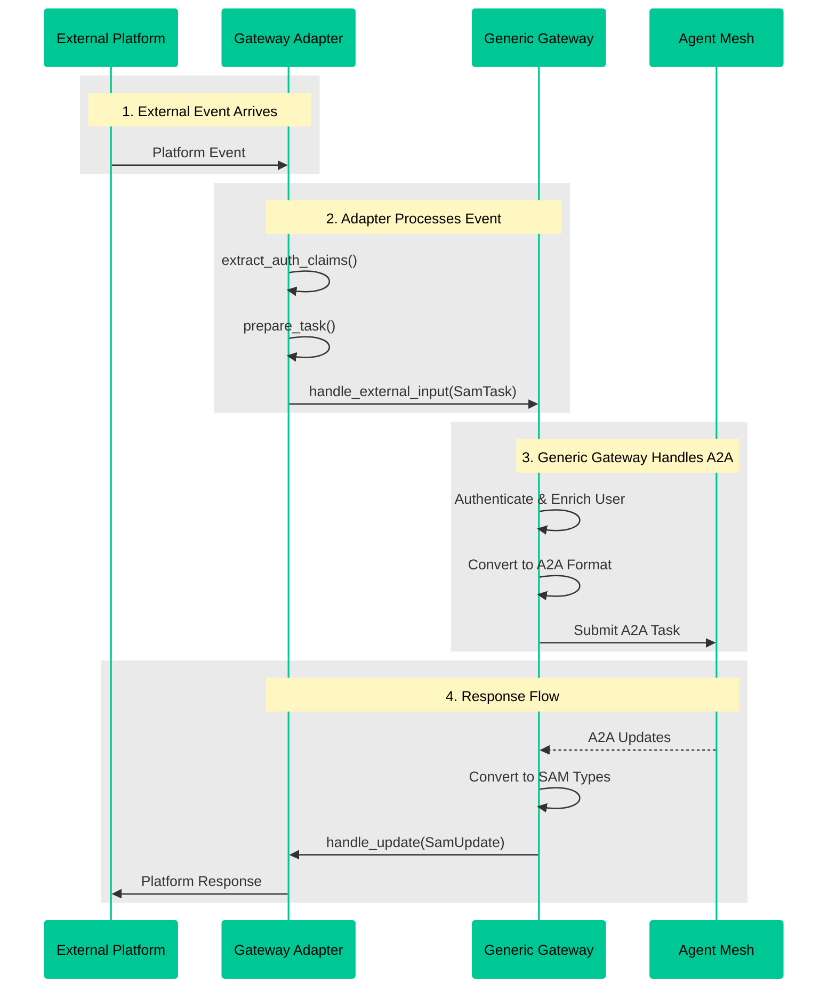

# Creating Custom Gateways

Gateway adapters connect external systems to the Agent Mesh through custom interfaces. They translate between platform-specific formats (Slack messages, HTTP requests, webhook payloads) and the standardized A2A protocol that agents understand. Gateway adapters handle platform events, extract user identity, and deliver agent responses back to users in the appropriate format.

This guide walks you through creating custom gateways using the gateway adapter pattern.

:::tip[In one sentence]
Gateway adapters are custom interfaces that connect external platforms to the agent mesh by translating events and responses between platform formats and the A2A protocol.
:::

## Key Functions

Gateway adapters provide the following capabilities:

1. **Platform Integration**: Connect external systems such as Slack, webhooks, REST APIs, or custom protocols to the agent mesh. Handle incoming events, commands, and messages from these platforms.

2. **Authentication**: Extract user identity from platform events (OAuth tokens, API keys, platform user IDs) and integrate with identity providers for user enrichment.

3. **Message Translation**: Convert platform-specific message formats into standardized content that agents can process. Transform agent responses back into platform-native formats.

4. **Streaming Responses**: Deliver real-time updates from agents to users as they are generated. Handle text streaming, status updates, and progress indicators.

5. **File Management**: Process file uploads from users and deliver agent-generated artifacts (reports, images, data files) back to the platform in the appropriate format.

6. **Built-in Services**: Access state management for maintaining conversation context, timer scheduling for delayed operations, and feedback collection for gathering user ratings.

## Architecture Overview

Gateway adapters work alongside a generic gateway component to connect platforms to the agent mesh:

- **Gateway Adapter**: Your platform-specific code that receives events from external systems and formats responses for delivery back to users
- **Generic Gateway Component**: Handles A2A protocol communication, authentication flow, user enrichment, message routing, and artifact management

The following diagram illustrates the complete flow from external platform to agent mesh and back:



## Core Concepts

### The Gateway Adapter Contract

Gateway adapters extend the `GatewayAdapter` base class and implement methods for handling platform-specific events:

- Extract authentication information from platform events
- Convert platform events into standardized task format
- Format and send responses back to the platform

### The Gateway Context

When your adapter initializes, it receives a `GatewayContext` object that provides access to framework services:

- Task submission and cancellation
- Artifact loading and management
- User feedback collection
- State management (task-level and session-level)
- Timer scheduling

### The Type System

Gateway adapters use a standardized type system for messages:

- **SamTask**: An inbound request with content parts and metadata
- **SamUpdate**: An outbound update containing one or more content parts
- **SamTextPart**: Text content in tasks or updates
- **SamFilePart**: File content with bytes or URI
- **SamDataPart**: Structured data with metadata
- **AuthClaims**: User authentication information
- **ResponseContext**: Context provided with each outbound callback

## Adapter Lifecycle

Gateway adapters follow a simple lifecycle:

### Initialization

The `init()` method is called when the gateway starts:

```python
async def init(self, context: GatewayContext) -> None:
    """
    Initialize the gateway adapter.

    This is where you should:
    - Store the context for later use
    - Start platform listeners (WebSocket, HTTP server, etc.)
    - Connect to external services
    """
    self.context = context
    # Initialize your platform connection
    await self.start_platform_listener()
```

### Active Processing

During normal operation, the generic gateway calls your adapter methods:

- `extract_auth_claims()` - Extract user identity from platform events
- `prepare_task()` - Convert platform events to SamTask format
- `handle_update()` - Process updates from agents
- `handle_task_complete()` - Handle task completion
- `handle_error()` - Handle errors

### Cleanup

The `cleanup()` method is called during shutdown:

```python
async def cleanup(self) -> None:
    """
    Clean up resources on shutdown.

    This is where you should:
    - Stop platform listeners
    - Close connections
    - Release resources
    """
    await self.stop_platform_listener()
```

## Implementing an Adapter

### Required Configuration

Define a configuration model for your adapter using Pydantic:

```python
from pydantic import BaseModel, Field

class MyAdapterConfig(BaseModel):
    """Configuration model for MyAdapter."""

    api_token: str = Field(..., description="API token for the platform.")
    webhook_url: str = Field(..., description="Webhook URL to listen on.")
    timeout_seconds: int = Field(default=30, description="Request timeout.")
```

Set the `ConfigModel` class attribute:

```python
from solace_agent_mesh.gateway.adapter.base import GatewayAdapter

class MyAdapter(GatewayAdapter):
    ConfigModel = MyAdapterConfig
```

### Authentication: extract_auth_claims()

Extract user identity from platform events:

```python
async def extract_auth_claims(
    self,
    external_input: Dict,
    endpoint_context: Optional[Dict[str, Any]] = None,
) -> Optional[AuthClaims]:
    """
    Extract authentication claims from platform input.

    Return AuthClaims with user info, or None to use config-based auth.
    """
    user_id = external_input.get("user_id")
    user_email = external_input.get("user_email")

    if user_id and user_email:
        return AuthClaims(
            id=user_email,
            email=user_email,
            source="platform_api",
            raw_context={"platform_user_id": user_id}
        )

    return None
```

### Inbound: prepare_task()

Convert platform events into standardized task format:

```python
async def prepare_task(
    self,
    external_input: Dict,
    endpoint_context: Optional[Dict[str, Any]] = None,
) -> SamTask:
    """
    Prepare a task from platform input.

    This method is called after authentication succeeds. Convert your
    platform's event format into a SamTask with parts.
    """
    message_text = external_input.get("message", "")
    conversation_id = external_input.get("conversation_id")

    # Create content parts
    parts = [self.context.create_text_part(message_text)]

    # Handle file attachments if present
    if "attachments" in external_input:
        for attachment in external_input["attachments"]:
            file_bytes = await self._download_attachment(attachment)
            parts.append(
                self.context.create_file_part_from_bytes(
                    name=attachment["filename"],
                    content_bytes=file_bytes,
                    mime_type=attachment["mime_type"]
                )
            )

    return SamTask(
        parts=parts,
        session_id=conversation_id,
        target_agent=self.context.config.get("default_agent_name", "default"),
        platform_context={
            "conversation_id": conversation_id,
            # Store any platform-specific data needed for responses
        }
    )
```

### Outbound: handle_update()

Process updates from agents and send them to your platform:

```python
async def handle_update(self, update: SamUpdate, context: ResponseContext) -> None:
    """
    Handle an update from the agent.

    By default, this dispatches to individual part handlers.
    Override for custom batch processing.
    """
    # Default implementation handles each part type
    for part in update.parts:
        if isinstance(part, SamTextPart):
            await self.handle_text_chunk(part.text, context)
        elif isinstance(part, SamFilePart):
            await self.handle_file(part, context)
        elif isinstance(part, SamDataPart):
            await self.handle_data_part(part, context)
```

Implement individual part handlers:

```python
async def handle_text_chunk(self, text: str, context: ResponseContext) -> None:
    """Handle streaming text chunk from the agent."""
    conversation_id = context.platform_context["conversation_id"]
    await self.platform_api.send_message(conversation_id, text)

async def handle_file(self, file_part: SamFilePart, context: ResponseContext) -> None:
    """Handle file/artifact from the agent."""
    conversation_id = context.platform_context["conversation_id"]
    await self.platform_api.upload_file(
        conversation_id,
        filename=file_part.name,
        content=file_part.content_bytes
    )

async def handle_data_part(self, data_part: SamDataPart, context: ResponseContext) -> None:
    """Handle structured data part from the agent."""
    # Check for special data part types
    if data_part.data.get("type") == "agent_progress_update":
        status_text = data_part.data.get("status_text")
        if status_text:
            await self.handle_status_update(status_text, context)

async def handle_status_update(self, status_text: str, context: ResponseContext) -> None:
    """Handle agent status update (progress indicator)."""
    conversation_id = context.platform_context["conversation_id"]
    await self.platform_api.update_status(conversation_id, status_text)
```

### Completion: handle_task_complete()

Handle task completion notification:

```python
async def handle_task_complete(self, context: ResponseContext) -> None:
    """Handle task completion notification."""
    conversation_id = context.platform_context["conversation_id"]
    await self.platform_api.send_message(
        conversation_id,
        "✅ Task complete."
    )
```

### Error Handling: handle_error()

Handle errors from the agent or gateway:

```python
async def handle_error(self, error: SamError, context: ResponseContext) -> None:
    """Handle error from the agent or gateway."""
    conversation_id = context.platform_context.get("conversation_id")

    if error.category == "CANCELED":
        error_message = "🛑 Task canceled."
    else:
        error_message = f"❌ Error: {error.message}"

    if conversation_id:
        await self.platform_api.send_message(conversation_id, error_message)
```

## Gateway Context Services

The `GatewayContext` provides access to framework services:

### Task Management

```python
# Submit a new task to the agent mesh
task_id = await self.context.handle_external_input(
    external_input=platform_event,
    endpoint_context={"source": "webhook"}
)

# Cancel an in-flight task
await self.context.cancel_task(task_id)
```

### Artifact Management

```python
# Load artifact content
content_bytes = await self.context.load_artifact_content(
    context=response_context,
    filename="report.pdf",
    version="latest"
)

# List available artifacts
artifacts = await self.context.list_artifacts(response_context)
for artifact in artifacts:
    print(f"{artifact.filename}: {artifact.version}")
```

### Feedback Collection

```python
# Submit user feedback
feedback = SamFeedback(
    task_id=task_id,
    session_id=session_id,
    rating="up",  # or "down"
    comment="Great response!",
    user_id=user_id
)
await self.context.submit_feedback(feedback)
```

### State Management

```python
# Task-level state (expires after 1 hour)
self.context.set_task_state(task_id, "status_message_id", message_id)
message_id = self.context.get_task_state(task_id, "status_message_id")

# Session-level state (expires after 24 hours)
self.context.set_session_state(session_id, "user_preferences", preferences)
preferences = self.context.get_session_state(session_id, "user_preferences")
```

### Timer Management

```python
# Schedule a one-time callback
timer_id = self.context.add_timer(
    delay_ms=5000,
    callback=self.my_async_callback
)

# Schedule a recurring callback
timer_id = self.context.add_timer(
    delay_ms=1000,
    callback=self.my_async_callback,
    interval_ms=1000
)

# Cancel a timer
self.context.cancel_timer(timer_id)
```

## Configuration

Configure a gateway adapter in your YAML file:

```yaml
apps:
  - name: my_gateway_app
    app_base_path: .
    app_module: solace_agent_mesh.gateway.generic.app

    broker:
      # Broker connection configuration
      <<: *broker_connection

    app_config:
      # Required: namespace for A2A topics
      namespace: ${NAMESPACE}

      # Required: path to your adapter class
      gateway_adapter: my_package.adapters.MyAdapter

      # Adapter-specific configuration
      adapter_config:
        api_token: ${MY_PLATFORM_API_TOKEN}
        webhook_url: ${WEBHOOK_URL}
        timeout_seconds: 30

      # Standard gateway configuration
      default_agent_name: OrchestratorAgent

      # Artifact service configuration
      artifact_service:
        type: "filesystem"
        base_path: "/tmp/artifacts"
        artifact_scope: "namespace"

      # System purpose and response format
      system_purpose: >
        The system is an AI assistant that helps users
        accomplish tasks through natural language interaction.

      response_format: >
        Responses should be clear, concise, and formatted
        appropriately for the platform.
```

## Example: Slack Adapter

The Slack gateway adapter demonstrates a complete implementation of the adapter pattern. It handles:

- **Socket Mode Connection**: Maintains WebSocket connection to Slack
- **Event Handling**: Processes messages, mentions, slash commands, and button actions
- **Message Queuing**: Manages streaming updates with proper ordering
- **File Uploads**: Handles artifact uploads to Slack
- **Markdown Conversion**: Converts standard Markdown to Slack format
- **Feedback Collection**: Provides thumbs up/down buttons for user feedback

Key highlights from the Slack adapter implementation:

### Configuration Model

```python
class SlackAdapterConfig(BaseModel):
    slack_bot_token: str = Field(..., description="Slack Bot Token (xoxb-...).")
    slack_app_token: str = Field(..., description="Slack App Token (xapp-...).")
    slack_initial_status_message: str = Field(
        "Got it, thinking...",
        description="Message posted to Slack upon receiving a user request."
    )
    correct_markdown_formatting: bool = Field(
        True,
        description="Attempt to convert common Markdown to Slack's format."
    )
    feedback_enabled: bool = Field(
        False,
        description="Enable thumbs up/down feedback buttons."
    )
```

### Authentication with Caching

The Slack adapter extracts user email from Slack's API and caches the results:

```python
async def extract_auth_claims(
    self,
    external_input: Dict,
    endpoint_context: Optional[Dict[str, Any]] = None,
) -> Optional[AuthClaims]:
    slack_user_id = external_input.get("user")

    # Check cache first
    if cached_email := self.get_cached_email(slack_user_id):
        return AuthClaims(id=cached_email, email=cached_email, source="slack_api")

    # Fetch from Slack API
    profile = await self.slack_app.client.users_profile_get(user=slack_user_id)
    user_email = profile.get("profile", {}).get("email")

    if user_email:
        self.cache_email(slack_user_id, user_email)
        return AuthClaims(id=user_email, email=user_email, source="slack_api")
```

### Streaming Updates with Message Queue

The Slack adapter uses a message queue to handle streaming updates efficiently:

```python
async def handle_update(self, update: SamUpdate, context: ResponseContext) -> None:
    task_id = context.task_id
    queue = await self._get_or_create_queue(task_id, channel_id, thread_ts)

    for part in update.parts:
        if isinstance(part, SamTextPart):
            await queue.queue_text_update(part.text)
        elif isinstance(part, SamFilePart):
            await queue.queue_file_upload(part.name, part.content_bytes)
```

For the complete Slack adapter implementation, see `src/solace_agent_mesh/gateway/slack/adapter.py`.

## Creating Your Own Adapter

### Option 1: Create as a Plugin (Recommended)

For reusable adapters that you plan to share or use across multiple projects:

```bash
sam plugin create my-gateway-plugin
```

Select "Gateway Plugin" when prompted. This creates a complete plugin structure with:

- Python package structure
- Sample adapter implementation
- Configuration template
- Build tooling

After implementing your adapter, build and distribute:

```bash
cd my-gateway-plugin
sam plugin build
```

For more information on plugins, see [Plugins](../components/plugins.md).

### Option 2: Add to Existing Project

For project-specific adapters, create your adapter class in your project:

1. Create your adapter module:

```python
# my_project/gateways/my_adapter.py
from solace_agent_mesh.gateway.adapter.base import GatewayAdapter
from solace_agent_mesh.gateway.adapter.types import (
    AuthClaims,
    GatewayContext,
    ResponseContext,
    SamTask,
    SamUpdate
)

class MyAdapter(GatewayAdapter):
    async def init(self, context: GatewayContext) -> None:
        self.context = context
        # Initialize your platform connection

    async def prepare_task(self, external_input, endpoint_context=None) -> SamTask:
        # Convert platform event to SamTask
        pass

    async def handle_update(self, update: SamUpdate, context: ResponseContext) -> None:
        # Send update to platform
        pass
```

2. Reference it in your configuration:

```yaml
app_config:
  gateway_adapter: my_project.gateways.my_adapter.MyAdapter
  adapter_config:
    # Your adapter configuration
```

## Advanced: Full Custom Gateways

For most use cases, gateway adapters provide all the functionality you need to connect external platforms to the agent mesh. However, if you have highly specialized requirements, you can create a full custom gateway that implements the complete gateway lifecycle and A2A protocol handling from scratch.

Consider a full custom gateway only if you need:

- Highly specialized authentication flows not supported by the standard flow
- Custom A2A protocol behavior or extensions
- Complex multi-stage processing pipelines with custom state management
- Fine-grained control over every aspect of the gateway lifecycle

Full custom gateways extend `BaseGatewayComponent` directly and implement all protocol handling manually. This approach requires significantly more code and expertise but provides complete control over the gateway behavior.

## Related Documentation

- [Gateways](../components/gateways.md) - Overview of gateway concepts and types
- [Plugins](../components/plugins.md) - Creating and distributing gateway plugins
