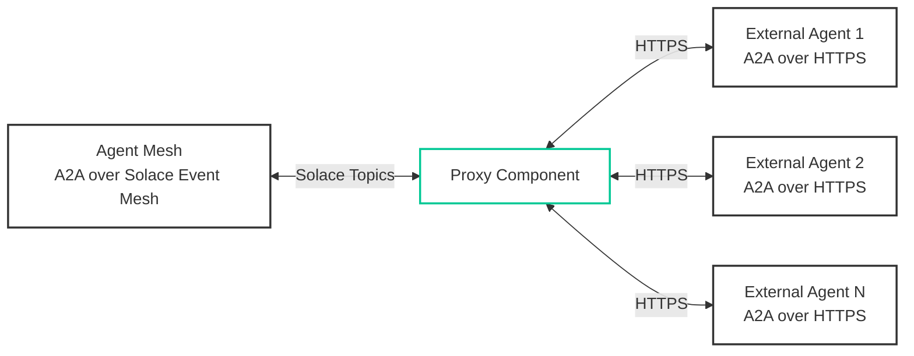

# Proxies

Proxies act as protocol bridges that connect Agent Mesh to external A2A agents. By translating between A2A over Solace event mesh and A2A over HTTPS protocols, proxies enable agents within the mesh to delegate tasks to external agents and include them in collaborative workflows.

A single proxy instance can manage multiple external agents, each with its own URL, authentication configuration, and timeout settings.

:::tip[In one sentence]
Proxies are protocol bridges that connect multiple external A2A-over-HTTPS agents to the Solace event mesh, enabling hybrid agent architectures.
:::

## Key Functions

1. **Protocol Translation**: Proxies translate between A2A over HTTPS and A2A over Solace event mesh, enabling external agents to communicate with agents on the mesh without modification.

2. **Authentication Management**: Proxies handle authentication to downstream agents, supporting multiple authentication schemes including static bearer tokens, API keys, and OAuth 2.0 client credentials flow with automatic token refresh.

3. **Agent Discovery**: Proxies fetch agent cards from external agents and publish them to the mesh discovery topic, making external agents discoverable to other agents in the system.

4. **Artifact Handling**: Proxies manage artifact flow between the mesh and external agents, resolving artifact URIs to byte content before forwarding requests and saving returned artifacts to the mesh's artifact service.

5. **Task Lifecycle Management**: Proxies track active tasks, handle cancellation requests, and ensure proper cleanup when tasks complete or fail.

6. **Automatic Retry Logic**: For OAuth 2.0 authenticated agents, proxies automatically detect authentication failures (401 responses), refresh tokens, and retry requests without manual intervention.

## When to Use a Proxy

Proxies are the right choice when you need:

- **Integration with Third-Party Agents**: Connect to external A2A agents provided by vendors or partners that run on their own infrastructure.

- **Hybrid Cloud Architectures**: Bridge agents running in different cloud environments or on-premises systems with your Solace mesh.

- **Legacy System Integration**: Connect existing A2A agents that cannot be modified to use Solace messaging directly.

- **Gradual Migration**: Incrementally migrate agents to the Solace mesh while maintaining compatibility with external systems.

- **Service Isolation**: Keep certain agents isolated on separate infrastructure while still enabling them to participate in collaborative workflows.

### Proxy vs. Native Agent

| Aspect | Proxy | Native Agent |
|--------|-------|--------------|
| **Communication** | A2A over HTTPS to external agent | A2A over Solace event mesh directly |
| **Deployment** | External agent runs separately | Runs within Agent Mesh |
| **Authentication** | Proxy handles auth to external agent | Mesh-level authentication |
| **Latency** | Additional HTTP hop | Direct mesh communication |
| **Task Initiation** | Can only receive tasks from mesh agents | Can initiate tasks to any agent |
| **Use Case** | External/third-party agents | Agents you control |

## Architecture Overview

The proxy sits between the Solace event mesh and external A2A agents, performing bidirectional protocol translation:



The proxy performs these operations:

1. **Request Flow**: Receives A2A requests from Agent Mesh, resolves artifact URIs to byte content, forwards HTTPS requests to external agents, and streams responses back to Agent Mesh.

2. **Response Flow**: Receives responses from external agents, saves artifacts to Agent Mesh's artifact service, replaces byte content with artifact URIs, and publishes responses to Agent Mesh topics.

3. **Discovery Flow**: Periodically fetches agent cards from external agents, updates the local registry, and publishes cards to the Agent Mesh discovery topic.

## Configuration

Proxies are configured through YAML files that specify the namespace, downstream agents, authentication, and service settings.

### Basic Configuration

A single proxy can manage multiple external agents. Each agent in the `proxied_agents` list can have its own URL, authentication, and timeout configuration:

```yaml
app:
  class_name: solace_agent_mesh.agent.proxies.a2a.app.A2AProxyApp
  name: my-a2a-proxy
  app_config:
    namespace: "myorg/production"
    proxied_agents:
      - name: "external-data-agent"
        url: "https://api.example.com/agent"
        request_timeout_seconds: 120
        # Optional: Apply auth to agent card fetching
        # use_auth_for_agent_card: true
        # Optional: Use configured URL instead of agent card URL for tasks
        # use_agent_card_url: false
        # Optional: Custom headers for agent card fetching
        # agent_card_headers:
        #   - name: "X-API-Version"
        #     value: "v2"
        # Optional: Custom headers for task invocations
        # task_headers:
        #   - name: "X-Tenant-ID"
        #     value: "${TENANT_ID}"
      - name: "external-analytics-agent"
        url: "https://analytics.example.com/agent"
        request_timeout_seconds: 180
      - name: "external-reporting-agent"
        url: "https://reports.example.com/agent"
    artifact_service:
      type: "filesystem"
      base_path: "/tmp/proxy-artifacts"
    discovery_interval_seconds: 60
    default_request_timeout_seconds: 300

broker:
  # Broker configuration inherited from environment or specified here
```

### Configuration Parameters

- `namespace`: The topic prefix for A2A communication (for example, "myorg/production").
- `proxied_agents`: A list of external agents to proxy. Each agent can have its own URL, authentication, and timeout settings (see Authentication Types below).
  - `use_auth_for_agent_card`: If true, applies the configured authentication when fetching agent cards. If false (default), agent card requests are made without authentication.
  - `use_agent_card_url`: If true (default), uses the URL from the agent card for task invocations. If false, uses the configured URL directly for all task invocations. Note: The configured URL is always used to fetch the agent card itself.
  - `agent_card_headers`: Custom HTTP headers to include when fetching the agent card. These headers are added alongside authentication headers.
  - `task_headers`: Custom HTTP headers to include when invoking A2A tasks. These headers are added alongside authentication headers.
  - `convert_progress_updates`: If true (default), converts TextParts in status updates to AgentProgressUpdateData DataParts for consistent UI behavior. If false, preserves original text parts.
- `artifact_service`: Configuration for storing artifacts. This is shared across all proxied agents. This is configured in the same manner as agents and gateways
- `discovery_interval_seconds`: How often to refresh agent cards from all external agents (default: 60).
- `default_request_timeout_seconds`: Default timeout for requests to external agents. Individual agents can override this (default: 300).

## Authentication Types

The proxy supports three authentication schemes for connecting to downstream agents. Each agent in the `proxied_agents` list can use a different authentication type, allowing you to integrate agents with varying security requirements in a single proxy instance.

By default, authentication is only applied to A2A task invocations, not to agent card fetching. You can enable authentication for agent card fetching by setting `use_auth_for_agent_card: true` in the agent configuration.

### Static Bearer Token

Use static bearer tokens for agents that require a fixed authentication token.

```yaml
proxied_agents:
  - name: "secure-agent"
    url: "https://api.example.com/agent"
    authentication:
      type: "static_bearer"
      token: "${AGENT_BEARER_TOKEN}"  # Use environment variable
    # use_auth_for_agent_card: true  # Optional: Apply auth to agent card fetching
```

### Static API Key

Use static API keys for agents that require API key authentication.

```yaml
proxied_agents:
  - name: "api-key-agent"
    url: "https://api.example.com/agent"
    authentication:
      type: "static_apikey"
      token: "${AGENT_API_KEY}"
    # use_auth_for_agent_card: true  # Optional: Apply auth to agent card fetching
```

### OAuth 2.0 Client Credentials

Use OAuth 2.0 client credentials flow for agents that require dynamic token acquisition. The proxy automatically handles token refresh and retry logic.

```yaml
proxied_agents:
  - name: "oauth-agent"
    url: "https://api.example.com/agent"
    authentication:
      type: "oauth2_client_credentials"
      token_url: "https://auth.example.com/oauth/token"
      client_id: "${OAUTH_CLIENT_ID}"
      client_secret: "${OAUTH_CLIENT_SECRET}"
      scope: "agent.read agent.write"  # Optional
      token_cache_duration_seconds: 3300  # Optional, default: 3300 (55 minutes)
    # use_auth_for_agent_card: true  # Optional: Apply auth to agent card fetching
```

The proxy caches OAuth tokens and automatically refreshes them when they expire. If a request receives a 401 Unauthorized response, the proxy invalidates the cached token and retries the request once with a fresh token.

:::note[Security Best Practice]
Always use environment variables for sensitive credentials. Never commit tokens or secrets directly in configuration files.
:::

## Custom HTTP Headers

The proxy supports custom HTTP headers for both agent card fetching and A2A task invocations. This is useful for scenarios like API versioning, tenant identification, custom authentication schemes, or any other header-based requirements.

### Header Configuration

Custom headers are defined as name-value pairs and can be configured separately for agent card fetching (`agent_card_headers`) and task invocations (`task_headers`):

```yaml
proxied_agents:
  - name: "custom-header-agent"
    url: "https://api.example.com/agent"
    authentication:
      type: "static_bearer"
      token: "${AGENT_TOKEN}"
    agent_card_headers:
      - name: "X-API-Version"
        value: "v2"
      - name: "X-Tenant-ID"
        value: "${TENANT_ID}"
    task_headers:
      - name: "X-API-Version"
        value: "v2"
      - name: "X-Request-Priority"
        value: "high"
```

### Header Precedence Rules

When both authentication and custom headers are configured:

1. **Authentication headers take precedence**: The proxy applies authentication headers (like `Authorization` or `X-API-Key`) based on the authentication type configured. These are applied by the A2A SDK's authentication layer after custom headers are set.

2. **Custom headers are for metadata, not authentication**: Custom headers should be used for non-authentication purposes such as API versioning, tenant identification, or request metadata. They cannot override authentication headers.

3. **For custom authentication**: If you need custom authentication logic, omit the `authentication` configuration block and use `task_headers` to set your custom authentication header directly.

### Use Cases

**API Versioning**: Specify the API version your integration requires:

```yaml
agent_card_headers:
  - name: "X-API-Version"
    value: "v2"
task_headers:
  - name: "X-API-Version"
    value: "v2"
```

**Tenant Identification**: Pass tenant or organization identifiers:

```yaml
task_headers:
  - name: "X-Tenant-ID"
    value: "${TENANT_ID}"
  - name: "X-Organization"
    value: "acme-corp"
```

**Custom Authentication**: If you need custom authentication, omit the `authentication` block and use headers directly:

```yaml
# Note: Do NOT configure the 'authentication' block if using custom auth headers
task_headers:
  - name: "Authorization"
    value: "Bearer ${CUSTOM_AUTH_TOKEN}"
  # Or use a custom auth scheme:
  - name: "X-Custom-Auth"
    value: "${CUSTOM_AUTH_TOKEN}"
```

**Request Metadata**: Add metadata for tracking or routing:

```yaml
task_headers:
  - name: "X-Request-Source"
    value: "agent-mesh"
  - name: "X-Request-Priority"
    value: "high"
```

## Artifact Handling

The proxy manages artifact flow in both directions to ensure seamless integration between Agent Mesh and external agents.

### Request Flow: Agent Mesh to External Agent

When it forwards requests to external agents, the proxy resolves artifact URIs to byte content using the following sequence of operations:

1. The proxy receives an A2A request containing artifact references (for example, `artifact://app/user/session/data.csv?version=1`).
2. The proxy loads the artifact content from Agent Mesh's artifact service.
3. The proxy replaces the URI with the actual byte content in the request.
4. The proxy forwards the modified request to the external agent.

This process ensures that external agents receive complete artifact data without needing access to Agent Mesh's artifact service.

### Response Flow: External Agent to Agent Mesh

When it receives responses from external agents, the proxy saves artifacts to Agent Mesh as follows:

1. The external agent returns artifacts with byte content in the response.
2. The proxy saves each artifact to Agent Mesh's artifact service.
3. The proxy replaces the byte content with an artifact URI.
4. The proxy publishes the modified response to Agent Mesh.

This process ensures that artifacts are stored centrally and can be accessed by other agents in Agent Mesh.

### Artifact Metadata

The proxy automatically generates metadata for saved artifacts, including:

- `proxied_from_artifact_id`: The original artifact ID from the external agent
- `description`: Extracted from the artifact or generated from context
- `produced_artifacts`: A manifest of all artifacts created during task execution

## Status Update Conversion

The proxy can automatically convert text-based status updates from external A2A agents to match the native SAM agent format, ensuring consistent UI behavior across all agents in your mesh.

### Conversion Scope

The `convert_progress_updates` setting only affects intermediate status updates:

- **Applies to**: `TaskStatusUpdateEvent` messages (streaming progress updates)
- **Does not apply to**: Final `Task` responses, artifact content, or other message types

This means that final responses from external agents remain as text parts, preserving the agent's intended final output format.

### When to Disable

Set `convert_progress_updates: false` if:

- The external agent sends structured status updates that should be preserved exactly as-is
- You have custom UI handling for text-based status updates
- You need to preserve original TextParts for debugging or custom processing
- The external agent already sends progress updates as DataParts

Example configuration with conversion disabled:

```yaml
proxied_agents:
  - name: "legacy-agent"
    url: "https://legacy.example.com/agent"
    convert_progress_updates: false  # Preserve original text parts
```

When disabled, all status update content passes through unchanged, allowing you to implement custom handling in your gateway or UI layer.

## Discovery and Health

The proxy maintains agent discovery and health monitoring through periodic agent card fetching.

### Initial Discovery

When the proxy starts, it performs synchronous discovery of all configured agents by:

1. Fetching agent cards from each external agent's `/.well-known/agent-card.json` endpoint.
2. Updating the local agent registry with agent capabilities.
3. Publishing agent cards to the Agent Mesh discovery topic.

This process ensures that external agents are immediately discoverable when the proxy starts.

### Periodic Refresh

The proxy periodically refreshes agent cards based on the configured `discovery_interval_seconds`. When the configured interval elapses, the proxy fetches updated agent cards from external agents, updates the local registry with any changes, and then publishes the updated cards to Agent Mesh. This process ensures that Agent Mesh has current information about external agent capabilities and availability.

### Agent Card Transformation

The proxy transforms agent cards to make external agents appear as native Agent Mesh agents:

- The `name` field is set to the configured alias (the name you specify in `proxied_agents`).
- The `url` field is rewritten to use the Solace topic format (for example, `solace:myorg/production/agent/external-data-agent`).

These agent cards allow other agents to interact with external agents using the standard A2A protocol over Solace event mesh, without knowing they are proxied.

### URL Behavior

The proxy handles URLs in two contexts:

1. **Agent Card Fetching**: Always uses the configured URL in the `proxied_agents` list to fetch the agent card from the external agent's `/.well-known/agent-card.json` endpoint.

2. **Task Invocations**: By default, uses the URL specified in the agent card returned by the external agent. This allows external agents to advertise their preferred endpoint (which may differ from the agent card endpoint). You can override this behavior by setting `use_agent_card_url: false` to always use the configured URL for both agent card fetching and task invocations.

## Task Lifecycle Management

The proxy tracks active tasks and manages their lifecycle from initiation to completion.

### Task Initiation

When a request arrives from Agent Mesh, the proxy:

1. Creates a task context to track the task's state.
2. Resolves inbound artifacts.
3. Forwards the request to the external agent.
4. Begins streaming responses back to Agent Mesh.

### Task Cancellation

When a cancellation request arrives, the proxy:

1. Looks up the active task context.
2. Forwards the cancellation request to the external agent.
3. Publishes the cancellation response to Agent Mesh.

### Task Completion

When a task completes, the proxy:

1. Processes any final artifacts.
2. Publishes the final task response to Agent Mesh.
3. Removes the task context from active tracking.

## Error Handling and Retry Logic

The proxy implements robust error handling and automatic retry logic for authentication failures.

### OAuth 2.0 Automatic Retry

When using OAuth 2.0 authentication, the proxy automatically handles token expiration using the following sequence:

1. A request receives a 401 Unauthorized response from the external agent.
2. The proxy invalidates the cached token.
3. The proxy removes all cached clients for the agent/session.
4. The proxy fetches a fresh token from the OAuth provider.
5. The proxy retries the request once with the new token.

This sequence ensures seamless operation even when tokens expire during long-running tasks.

### Connection Errors

The proxy provides clear error messages for connection failures:

- Connection refused or agent unreachable
- Timeout errors with configurable timeout values
- JSON-RPC protocol errors from external agents

### Error Responses

When errors occur, the proxy publishes standard A2A error responses to Agent Mesh, including:

- `InternalError`: For unexpected proxy errors
- `InvalidRequestError`: For malformed requests
- `TaskNotFoundError`: For cancellation requests on unknown tasks

## Creating a Proxy

Proxies are configured using standard YAML configuration files, similar to agents and gateways.

### Creating the Configuration File

Create a new YAML file in your `configs` directory (for example, `configs/my-proxy.yaml`):

```yaml
log:
  stdout_log_level: INFO
  log_file_level: DEBUG
  log_file: my-proxy.log

# Include shared configuration (broker connection, etc.)
!include shared_config.yaml

apps:
  - name: my_a2a_proxy
    app_module: solace_agent_mesh.agent.proxies.a2a.app
    broker:
      <<: *broker_connection

    app_config:
      namespace: "${NAMESPACE}"
      
      artifact_service:
        type: "filesystem"
        base_path: "/tmp/proxy-artifacts"
        artifact_scope: "namespace"
      
      discovery_interval_seconds: 60
      default_request_timeout_seconds: 300
      
      proxied_agents:
        - name: "external-agent-1"
          url: "https://api.example.com/agent"
          request_timeout_seconds: 120
          authentication:
            type: "static_bearer"
            token: "${AGENT_TOKEN}"
```

You can use the example file at `examples/a2a_proxy.yaml` as a template.

### Running the Proxy

Run the proxy along with your other Agent Mesh components:

```bash
sam run
```

The proxy automatically subscribes to the appropriate Solace topics and begins proxying requests to external agents.

### Multiple Proxy Configurations

While a single proxy can manage multiple external agents, you may want to create separate proxy configurations to:

- Organize agents by domain or team
- Isolate agents with different security requirements
- Distribute load across multiple proxy instances

```bash
configs/
├── data-agents-proxy.yaml      # Proxies 3 data-related agents
├── analytics-agents-proxy.yaml # Proxies 2 analytics agents
└── third-party-agents-proxy.yaml # Proxies external vendor agents
```

Run all proxies together:

```bash
sam run
```

Or run specific proxy configurations:

```bash
sam run configs/data-agents-proxy.yaml
```

## Advanced Configuration

### Per-Agent Timeout Override

You can override the default timeout for specific agents:

```yaml
proxied_agents:
  - name: "slow-agent"
    url: "https://slow.example.com/agent"
    request_timeout_seconds: 600  # 10 minutes
```

### Custom Headers with Authentication

Combine authentication with custom headers for complex integration requirements:

```yaml
proxied_agents:
  - name: "enterprise-agent"
    url: "https://enterprise.example.com/agent"
    authentication:
      type: "oauth2_client_credentials"
      token_url: "https://auth.example.com/oauth/token"
      client_id: "${OAUTH_CLIENT_ID}"
      client_secret: "${OAUTH_CLIENT_SECRET}"
    use_auth_for_agent_card: true  # Apply OAuth to agent card fetching
    agent_card_headers:
      - name: "X-API-Version"
        value: "v2"
      - name: "X-Client-Type"
        value: "agent-mesh"
    task_headers:
      - name: "X-API-Version"
        value: "v2"
      - name: "X-Tenant-ID"
        value: "${TENANT_ID}"
      - name: "X-Request-Priority"
        value: "high"
```

### URL Override for Task Invocations

By default, the proxy uses the URL from the agent card for task invocations. This allows external agents to specify their preferred endpoint. However, you can override this behavior by setting `use_agent_card_url: false`:

```yaml
proxied_agents:
  - name: "fixed-url-agent"
    url: "https://api.example.com/agent"
    use_agent_card_url: false  # Always use the configured URL
    authentication:
      type: "static_bearer"
      token: "${AGENT_TOKEN}"
```

**Important notes:**

- The configured URL is always used to fetch the agent card, regardless of this setting
- When `use_agent_card_url: false`, all task invocations use the configured URL
- When `use_agent_card_url: true` (default), the agent card's URL is used for tasks

### Custom Artifact Service Scope

Configure artifact storage scope for the proxy:

```yaml
artifact_service:
  type: "filesystem"
  base_path: "/data/proxy-artifacts"
  artifact_scope: "namespace"  # Options: namespace, app, custom
```

### Multiple Proxies

You can run multiple proxy instances to distribute load or isolate different sets of external agents. Each proxy instance can manage multiple agents:

```yaml
# data-agents-proxy.yaml
app:
  name: data-agents-proxy
  app_config:
    proxied_agents:
      - name: "data-agent-1"
        url: "https://data1.example.com/agent"
      - name: "data-agent-2"
        url: "https://data2.example.com/agent"
      - name: "data-agent-3"
        url: "https://data3.example.com/agent"

# analytics-agents-proxy.yaml
app:
  name: analytics-agents-proxy
  app_config:
    proxied_agents:
      - name: "analytics-agent-1"
        url: "https://analytics1.example.com/agent"
      - name: "analytics-agent-2"
        url: "https://analytics2.example.com/agent"
```

## Troubleshooting

### Agent Not Discoverable

If an external agent does not appear in Agent Mesh:

1. Check that the agent's URL is accessible from the proxy.
2. Verify that the agent exposes `/.well-known/agent-card.json`.
3. Check the proxy logs for discovery errors.
4. Ensure that `discovery_interval_seconds` is set appropriately and is more frequent than the `health_check_ttl_seconds` that is set on the calling agents and gateways.

### Authentication Failures

If requests fail with 401 errors:

1. Verify that the credentials are correctly set in environment variables.
2. For OAuth 2.0, check that `token_url`, `client_id`, and `client_secret` are correct.
3. Ensure that the OAuth token URL uses HTTPS (required for security).
4. Check the proxy logs for token acquisition errors.

### Timeout Errors

If requests timeout:

1. Increase `request_timeout_seconds` for slow agents.
2. Check the network connectivity between the proxy and the external agent.
3. Verify that the external agent is responding within the timeout period.

### Artifact Issues

If artifacts are not flowing correctly:

1. Verify that the artifact service is properly configured.
2. Check that the proxy has write permissions to the artifact storage location.
3. Ensure that the artifact URIs are correctly formatted.
4. Check the proxy logs for artifact save/load errors.

### Strands SDK Streaming Issues

If streaming responses from Strands SDK agents appear as status updates instead of chat content, the agent may be using legacy streaming mode. Strands agents require the `enable_a2a_compliant_streaming` option to be enabled on their `A2AServer` instance to properly send streaming content. See the [Strands A2AServer documentation](https://strandsagents.com/latest/documentation/docs/api-reference/python/multiagent/a2a/server/?h=enable_a2a_compliant_streaming#strands.multiagent.a2a.server.A2AServer.__init__) for details.

### Issues Running A2A Samples with `Containerfile`

If you encounter a `ValueError: Invalid context_id: ... is not a valid UUID.` when running A2A samples using a `Containerfile`, it may be due to outdated dependencies in the `uv.lock` file. This can happen if the sample is pinned to an older version of the `a2a-sdk` package. For more details, see [this GitHub issue](https://github.com/a2aproject/a2a-samples/issues/399).

To resolve this, navigate to the sample's directory and upgrade the dependencies:

```bash
uv lock --upgrade
```

This will update the `uv.lock` file to use the latest version of `a2a-sdk`, which includes the necessary bug fixes.
