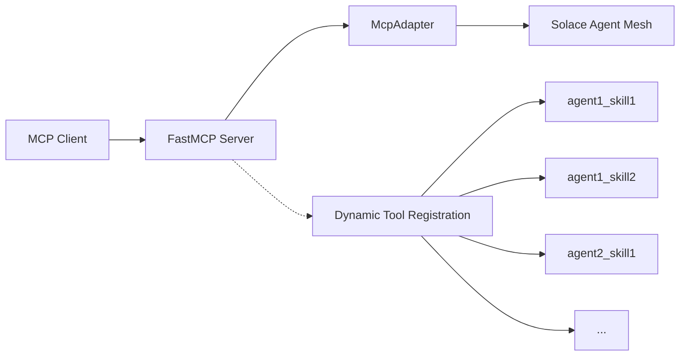

# MCP Gateway

This tutorial walks you through setting up the MCP Gateway, which exposes Solace Agent Mesh agents as a Model Context Protocol (MCP) server. This allows any MCP-compatible client (such as Claude Desktop, MCP Inspector, or custom applications) to interact with Solace Agent Mesh agents through a standardized interface.

:::info[Learn about gateways]
Read about [Gateways](../../components/gateways.md) before you start this tutorial.
:::

## Overview

The MCP Gateway adapter:
- **Dynamically discovers agents** from the Solace Agent Mesh agent registry
- **Creates MCP tools automatically** based on agent skills
- **Streams responses** in real-time back to MCP clients
- **Handles files intelligently** by returning inline content or resource links based on size
- **Maintains session isolation** ensuring secure multi-client access

## Setting Up the Environment

First, you need to [install Agent Mesh and the Agent Mesh CLI](../../installing-and-configuring/installation.md), and then [create a new Agent Mesh project](../../installing-and-configuring/run-project.md).

## Adding the MCP Gateway Plugin

Once you have your project set up, add the MCP Gateway plugin:

```sh
sam plugin add my-mcp-gateway --plugin sam-mcp-server-gateway-adapter
```

You can use any name for your gateway. In this tutorial we use `my-mcp-gateway`.

This command:
1. Installs the `sam-mcp-server-gateway-adapter` plugin
2. Creates a new gateway configuration named `my-mcp-gateway` in your `configs/gateways/` directory

## Configuration

You can customize the gateway by editing the `configs/gateways/my-mcp-gateway.yaml` file.

### Key Configuration Options

```yaml
adapter_config:
  # Server identity
  mcp_server_name: "Solace Agent Mesh MCP Gateway"
  mcp_server_description: "Access to Solace Agent Mesh agents via MCP"

  # Transport: "http" or "stdio"
  transport: http

  # HTTP settings (when transport = "http")
  host: "0.0.0.0"
  port: 8090

  # Authentication
  default_user_identity: "mcp_user"

  # Streaming
  stream_responses: true

  # Task timeout (in seconds)
  task_timeout_seconds: 300  # 5 minutes default

  # File size thresholds for inline content
  inline_image_max_bytes: 5242880      # 5MB
  inline_audio_max_bytes: 10485760     # 10MB
  inline_text_max_bytes: 1048576       # 1MB
  inline_binary_max_bytes: 524288      # 512KB

  # Tool filtering (optional)
  include_tools: []  # Include only these tools (empty = all)
  exclude_tools: []  # Exclude these tools
```

:::info[Host and Port]
The `host` and `port` settings defined above needs to be exposed in your deployment environment (e.g., Docker, Kubernetes) so that MCP clients can connect.

The path `/mcp` should point to the gateway service address.

<details>
    <summary>MCP Server Gateway with Authentication </summary>

If you have [authentication enabled in your gateway](../../enterprise/auth-proxy.md#gateway-configuration), you'd need to expose and map the following routes to your gateway service address:

- `/oauth/authorize`
- `/oauth/callback`
- `/oauth/token`
- `/oauth/register`
- `/.well-known/oauth-authorization-server`

Example for Kubernetes Service and Ingress configuration:

```yaml
apiVersion: v1
kind: Service
metadata:
  name: solace-agent-mesh-mcp-service
spec:
  selector:
    app: solace-agent-mesh
  type: ClusterIP
  ports:
    - name: http
      protocol: TCP
      targetPort: http-mcp
      port: 8090

---

apiVersion: networking.k8s.io/v1
kind: Ingress
metadata:
  name: solace-agent-mesh-ingress
  labels:
    app: solace-agent-mesh-ingress
spec:
  ingressClassName: alb
  rules:
  - http:
      paths:
      - path: /mcp
        pathType: Prefix
        backend:
          service:
            name: solace-agent-mesh-mcp-service
            port:
              number: 8090
      - path: /oauth/authorize
        pathType: Prefix
        backend:
          service:
            name: solace-agent-mesh-mcp-service
            port:
              number: 8090
      - path: /oauth/callback
        pathType: Prefix
        backend:
          service:
            name: solace-agent-mesh-mcp-service
            port:
              number: 8090
      - path: /oauth/token
        pathType: Prefix
        backend:
          service:
            name: solace-agent-mesh-mcp-service
            port:
              number: 8090
      - path: /oauth/register
        pathType: Prefix
        backend:
          service:
            name: solace-agent-mesh-mcp-service
            port:
              number: 8090
      - path: /.well-known/oauth-authorization-server
        pathType: Prefix
        backend:
          service:
            name: solace-agent-mesh-mcp-service
            port:
              number: 8090
```

</details>
:::

## Running the MCP Gateway

To run the MCP Gateway, use the following command:

```sh
sam run configs/gateways/my-mcp-gateway.yaml
```

The gateway starts and automatically:
1. Queries the agent registry for available agents
2. Creates MCP tools for each agent skill
3. Starts listening for MCP client connections

## Connecting MCP Clients

To connect to Solace Agent Mesh via MCP, configure your MCP client (e.g., Claude Desktop) to point to the gateway URL:

```
http://<gateway-host>:<gateway-port>/mcp
```

Make sure to select the appropriate transport (HTTP) and enable OAuth2.0 authentication if configured.

## How It Works

### Architecture



### Tool Naming

Each agent skill becomes an MCP tool with the naming pattern:

```
{agent_name}_{skill_name}
```

For example:
- Agent: `WeatherAgent`, Skill: `Get Forecast` → Tool: `weather_agent_get_forecast`
- Agent: `CodeAssistant`, Skill: `Review Code` → Tool: `code_assistant_review_code`

Tool names are automatically sanitized to be valid MCP identifiers (lowercase, alphanumeric with underscores).

### Dynamic Agent Discovery

As agents join and leave the Solace Agent Mesh mesh:

1. **Agent Joins**: When a new agent publishes its AgentCard.
   - The adapter detects the new agent
   - Registers new MCP tools for the agent's skills
   - FastMCP sends `tools/list_changed` notification to connected clients
   - MCP clients automatically refresh their tool list

2. **Agent Leaves**: When an agent is removed.
   - The adapter detects the removal
   - Removes the agent's tools from the MCP server
   - FastMCP notifies clients of the change
   - Stale tools disappear from the client's tool list

## Tool Filtering

The MCP adapter supports filtering which agent tools are exposed through the MCP server. This is useful for:
- Limiting tool visibility to specific agents or skills
- Hiding debug/internal tools from clients
- Creating specialized MCP servers with curated tool sets

### Configuration

```yaml
adapter_config:
  # Include only data-related tools
  include_tools:
    - "data_.*"           # Regex: any tool starting with "data_"
    - "fetch_user_info"   # Exact: specific tool name

  # Exclude debug tools and test agents
  exclude_tools:
    - ".*_debug"          # Regex: any tool ending with "_debug"
    - "TestAgent"         # Exact: specific agent name
```

### How Filtering Works

**What Gets Checked**: Filters check against **all three** of:
1. Original agent name (e.g., `"DataAgent"`)
2. Original skill name (e.g., `"Fetch User"`)
3. Final sanitized tool name (e.g., `"data_agent_fetch_user"`)

**Pattern Types**: The adapter automatically detects pattern types:
- **Regex patterns**: Contain special characters like `.*+?[]{}()^$|\`
- **Exact matches**: Plain strings without special characters

**Priority Order** (highest to lowest):
1. **Exclude exact match** - If pattern matches exactly, tool is rejected
2. **Include exact match** - If pattern matches exactly, tool is accepted
3. **Exclude regex match** - If regex pattern matches, tool is rejected
4. **Include regex match** - If regex pattern matches, tool is accepted
5. **Default** - If `include_tools` is empty, accept; otherwise reject

### Filter Examples

**Example 1: Include only specific tools**
```yaml
include_tools:
  - "weather_agent_.*"                 # All tools from weather_agent
  - "code_assistant_review_code"       # One specific tool
exclude_tools: []
```

**Example 2: Exclude debug/internal tools**
```yaml
include_tools: []          # Empty = include all
exclude_tools:
  - ".*_debug"             # Exclude all debug tools
  - ".*_internal"          # Exclude all internal tools
  - "TestAgent"            # Exclude entire test agent
```

## File Handling

The MCP gateway intelligently returns files based on their type and size:

### Content Type Strategy

**Images** (`image/*` MIME types):
- **Small (< 5MB)**: Returned inline as `ImageContent` with base64 encoding
- **Large (≥ 5MB)**: Returned as `ResourceLink` for separate download

**Audio** (`audio/*` MIME types):
- **Small (< 10MB)**: Returned inline as `AudioContent` with base64 encoding
- **Large (≥ 10MB)**: Returned as `ResourceLink`

**Text Files**:
- **Small (< 1MB)**: Returned as `EmbeddedResource` with `TextResourceContents`
- **Large (≥ 1MB)**: Returned as `ResourceLink`

**Other Binary Files**:
- **Small (< 512KB)**: Returned as `EmbeddedResource` with `BlobResourceContents`
- **Large (≥ 512KB)**: Returned as `ResourceLink`

### Mixed Content Responses

When a tool response includes both text and files, the MCP gateway returns a list of content blocks:

```python
[
    TextContent(type="text", text="Here is the result..."),
    ImageContent(type="image", data="base64...", mimeType="image/png"),
    ResourceLink(type="resource_link", uri="artifact://session/report.pdf", ...)
]
```


## Troubleshooting

### No tools appearing in MCP client

- Check that agents are registered in the agent registry
- Verify agents have skills defined in their AgentCard
- Check gateway logs for tool registration messages
- Review tool filter configuration if using `include_tools` or `exclude_tools`
- If authentication is enabled, ensure RBAC permissions are set correctly.

### Connection refused

- Verify the MCP server is running (check logs)
- Ensure the configured port is not in use
- Check firewall settings (for HTTP transport)


### Files not appearing or timing out

- Check file size thresholds in configuration
- Verify artifact service is configured correctly
- Review session management in logs
