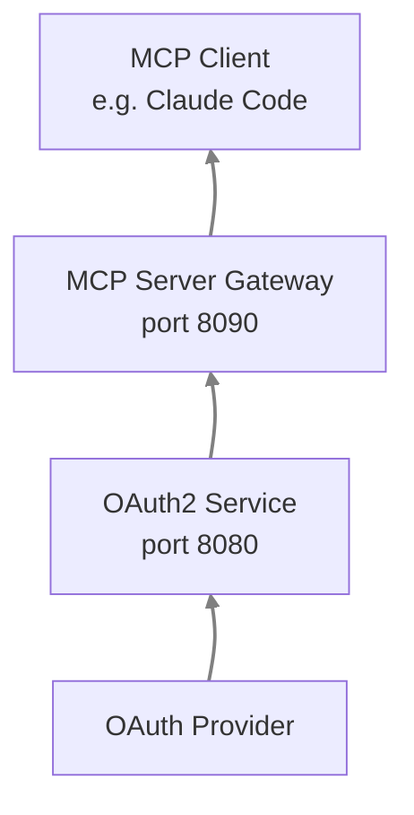
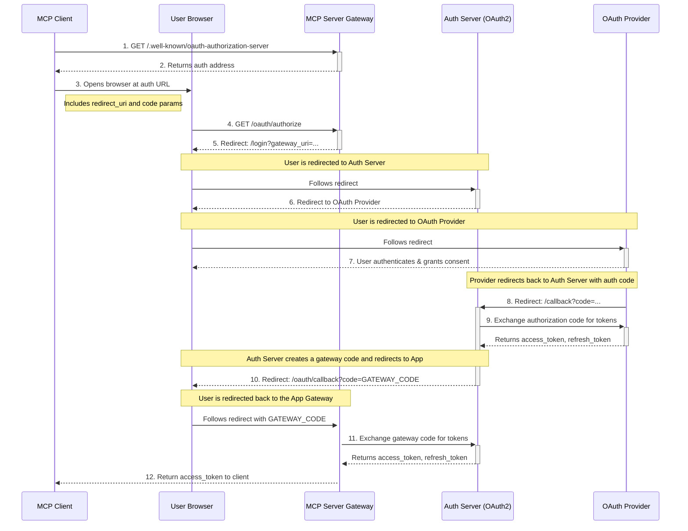

# Authentication Proxy

Gateway OAuth enables apps and gateways (like MCP) to authenticate via the OAuth2 service without registering separate redirect URIs with OAuth providers. Apps redirect directly to the auth server, which handles the OAuth flow and returns a gateway code that can be exchanged for tokens.


## How It Works

High-level flow of the authentication proxy:




Detailed sequence diagram of the OAuth2 authentication proxy flow:



## Configuration
To enable the authentication proxy, add the following to your OAuth2 YAML configuration, usually named `oauth2_config.yaml`

```yaml
# This enables apps to redirect through this auth server for OAuth
proxy_oauth:
  enabled: true
  # Whitelist of allowed gateway callback URIs
  # Apps with URIs in this list can use this auth server for OAuth proxy
  allowed_redirect_uris:
    - "http://localhost:8090/oauth/callback"  # MCP gateway
    - "http://localhost:*"  # Wildcard for development - requires strict_uri_validation set to `false`
    - "https://mcp.example.com/oauth/callback"  # Production Example

  # Gateway code time-to-live in seconds (default: 300 = 5 minutes)
  # Codes expire after this time for security
  gateway_code_ttl_seconds: 300

  # URI validation mode (default: false = wildcard matching allowed)
  # Set to true for production to require exact URI matches
  strict_uri_validation: false
```

Update `allowed_redirect_uris` with the actual callback URIs of your gateways.

:::info
The path `/gateway-oauth` must be exposed and accessible in your deployment environment (e.g., Docker, Kubernetes) and it should point to the Auth Server service port.
:::

### Gateway Configuration

In your MCP Gateway configuration YAML (e.g. `my-mcp-gateway.yaml`), update the `adapter` section to enable OAuth and point to the Auth Server:

```yaml
adapter_config:
    enable_auth: ${OAUTH2_ENABLED}

    external_auth_service_url: ${EXTERNAL_AUTH_SERVICE_URL, http://localhost:8080}
    external_auth_provider: ${EXTERNAL_AUTH_PROVIDER, azure}
```