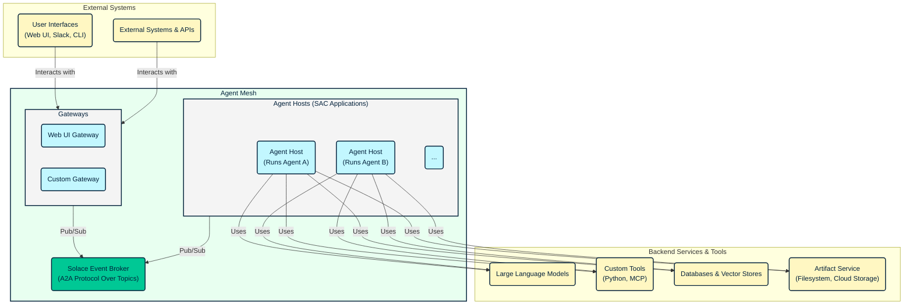

Agent Mesh is an event-driven framework that creates a distributed ecosystem of collaborative AI agents. The architecture decouples agent logic from communication and orchestration, enabling you to build scalable, resilient, and modular AI systems.

The framework integrates three primary technologies:
- **Solace Event Broker**: Provides the messaging fabric for all asynchronous communication, utilizing topic-based routing for the Agent-to-Agent (A2A) protocol
- **Solace AI Connector (SAC)**: Serves as the runtime environment for hosting and managing the lifecycle of all system components
- **Google Agent Development Kit (ADK)**: Provides the core logic for individual agents, including LLM interaction, tool execution, and state management

## Architectural Principles

The design of Agent Mesh is founded on several key architectural principles:

- **Event-Driven Architecture (EDA)**: All interactions between major components are asynchronous and mediated by the Solace event broker. This eliminates direct dependencies, allowing components to be developed, deployed, and scaled independently.
- **Component Decoupling**: Gateways, Agent Hosts, and other services communicate through standardized A2A protocol messages over the event mesh. They do not require knowledge of each other's network location, implementation language, or internal logic.
- **Scalability and Resilience**: The architecture supports horizontal scaling of Agent Hosts and Gateways. The Solace event broker provides fault tolerance and guaranteed message delivery, ensuring system resilience even if individual components fail or are restarted.

## System Components

The architecture comprises several distinct types of components that interact through the Solace Event Broker. External systems connect through gateways, which translate requests into the A2A protocol, while agent hosts run individual agents that can communicate with each other and access backend services like LLMs and databases. For detailed information about each component, see [Components](../components/components.md). The architecture diagram below illustrates how these components work together.

### Solace Event Broker

The Solace Event Broker serves as the central messaging fabric that enables all communication within the agent mesh. It routes A2A protocol messages between components using a hierarchical topic structure, supporting patterns like request/reply, streaming updates, and publish/subscribe for agent discovery. See [Event Broker](https://solace.com/products/event-broker/) for more information.

### Gateways

Gateways are SAC applications that act as bridges between external systems and the agent mesh. They handle protocol translation, converting external protocols (such as HTTP, WebSockets, or Slack RTM) into the standardized A2A protocol and vice versa. Gateways also manage authentication and authorization, authenticate incoming requests, and use a pluggable AuthorizationService to retrieve user permission scopes. Additionally, they manage external user sessions and map them to A2A task lifecycles, while handling asynchronous responses and status updates from agents.

The Gateway Development Kit (GDK) provides BaseGatewayApp and BaseGatewayComponent classes that abstract common gateway logic, including A2A protocol handling, agent discovery, and late-stage embed resolution. For more information about gateways, see [Gateways](../components/gateways.md).

### Agent Hosts and Agents

An Agent Host is a SAC application (SamAgentApp) that hosts a single ADK-based agent. It manages the lifecycle of the ADK Runner and LlmAgent, handles A2A protocol translation between incoming requests and ADK Task objects, enforces permission scopes by filtering available tools, and initializes ADK services like the ArtifactService and MemoryService.

An agent is the logical entity within an Agent Host that performs tasks. Each agent is defined by its configuration, which includes instructions that define its persona and capabilities, LLM configuration specifying which large language model to use, and a toolset containing built-in tools, custom Python functions, or MCP Toolsets. For more information about agents, see [Agents](../components/agents.md).

## Key Architectural Flows

The following flows illustrate how data moves through the system and demonstrate the relationships between components in the event-driven architecture.

### User Task Processing Flow

When you submit a request through any gateway, the system processes it through several stages:

1. An external client sends a request to a gateway
2. The gateway authenticates the request, retrieves your permission scopes via its AuthorizationService, and translates the request into an A2A task message, including the scopes in the Solace message's user properties
3. The gateway publishes the message to the target agent's request topic on the Solace Broker
4. The corresponding Agent Host receives the message, with the SamAgentComponent extracting the scopes and initiating an ADK task
5. The ADK LlmAgent processes the task, with a before_model_callback filtering the available tools based on your scopes before invoking the LLM
6. As the agent executes, the SamAgentComponent translates ADK events into A2A status and artifact update messages, publishing them to the originating gateway's status topic
7. The gateway receives these streaming updates, performs any necessary late-stage processing (such as resolving artifact_content embeds), and forwards them to you
8. Upon completion, the Agent Host sends a final A2A response message to the gateway, which delivers it to you

### Agent-to-Agent Delegation Flow

Agents can delegate subtasks to other agents while maintaining security context:

1. Agent A, while processing a task, determines that a subtask should be delegated to Agent B
2. Agent A uses its PeerAgentTool to construct a new A2A task request for Agent B, propagating the original user's permission scopes to maintain the security context
3. The request is published to Agent B's request topic
4. Agent B's Host receives and processes the subtask, enforcing the propagated scopes on its own toolset
5. Agent B sends status updates and a final response to topics designated by Agent A
6. Agent A receives the results and incorporates them into its ongoing task

### Agent Discovery Flow

The system automatically discovers available agents through a publish-subscribe mechanism:

1. On startup and periodically, each Agent Host publishes an AgentCard (a JSON document describing its agent's capabilities) to a well-known discovery topic
2. Gateways and other Agent Hosts subscribe to this topic
3. Upon receiving an AgentCard, components update their local AgentRegistry, making them aware of available agents for user selection (at gateways) or peer delegation (at agents)

## A2A Protocol and Topic Structure

The A2A protocol is based on JSON-RPC 2.0 and defines the message formats for all interactions between components. Communication is routed via a hierarchical topic structure on the Solace event broker, which allows for precise, point-to-point routing in a decoupled, asynchronous environment.

| Purpose                  | Topic Pattern                                                    |
| ------------------------ | ---------------------------------------------------------------- |
| **Agent Discovery**      | `{namespace}/a2a/v1/discovery/agentcards`                        |
| **Task Requests**        | `{namespace}/a2a/v1/agent/request/{target_agent_name}`           |
| **Status Updates**       | `{namespace}/a2a/v1/gateway/status/{gateway_id}/{task_id}`       |
| **Final Responses**      | `{namespace}/a2a/v1/gateway/response/{gateway_id}/{task_id}`     |
| **Peer Delegation Status** | `{namespace}/a2a/v1/agent/status/{delegating_agent_name}/{sub_task_id}` |
| **Peer Delegation Response** | `{namespace}/a2a/v1/agent/response/{delegating_agent_name}/{sub_task_id}`|

For more information about the CLI tools that help you work with these components, see [CLI](../components/cli.md). To learn about extending the system with custom functionality, see [Plugins](../components/plugins.md).
