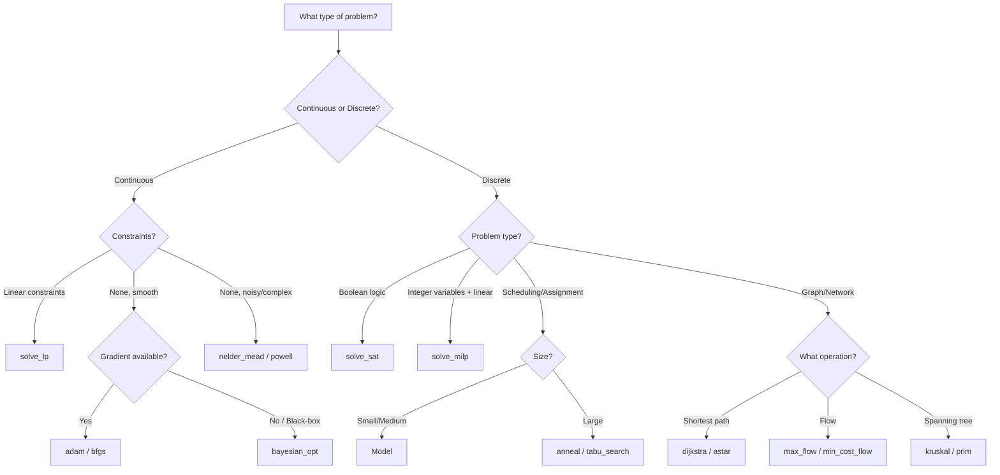

# Choosing a Solver

40+ algorithms is a lot. Use this decision tree to find the right one without reading all the docs.

## Quick Decision Tree



## By Problem Category

### Linear Programming

| Solver | Use When |
|--------|----------|
| `solve_lp` | Continuous variables, linear constraints |
| `solve_milp` | Integer/binary variables required |

### Constraint Satisfaction

| Solver | Use When |
|--------|----------|
| `solve_sat` | Pure boolean satisfiability |
| `Model` | Complex constraints, scheduling, puzzles |
| `solve_exact_cover` | Exact cover problems (Sudoku, pentominos) |

### Continuous Optimization

| Solver | Use When |
|--------|----------|
| `adam` | Deep learning, large-scale gradients |
| `bfgs` / `lbfgs` | Smooth functions, few variables |
| `nelder_mead` | No gradients, noisy functions |
| `powell` | No gradients, coordinate-wise optimization |
| `bayesian_opt` | Expensive black-box functions |
| `differential_evolution` | Global optimization, many local minima |
| `particle_swarm` | Global optimization, parallelizable |

### Metaheuristics

| Solver | Use When |
|--------|----------|
| `anneal` | Large combinatorial problems |
| `tabu_search` | TSP, scheduling with memory |
| `evolve` | Population-based search |
| `lns` / `alns` | Improve existing solutions |

### Graph Algorithms

| Solver | Use When |
|--------|----------|
| `dijkstra` | Shortest path, non-negative weights |
| `astar` | Shortest path with heuristic |
| `bellman_ford` | Shortest path, negative weights OK |
| `floyd_warshall` | All-pairs shortest paths |
| `max_flow` | Maximum flow in network |
| `min_cost_flow` | Minimum cost flow |
| `kruskal` / `prim` | Minimum spanning tree |

### Combinatorial Problems

| Solver | Use When |
|--------|----------|
| `solve_knapsack` | 0/1 knapsack problem |
| `solve_bin_pack` | Bin packing |
| `solve_job_shop` | Job shop scheduling |
| `solve_vrptw` | Vehicle routing with time windows |
| `solve_hungarian` | Assignment problem |

## Performance Considerations

- **Small problems (< 100 variables)**: Exact methods (`solve_lp`, `solve_milp`, `Model`)
- **Medium problems (100-10000)**: Hybrid approaches, consider time limits
- **Large problems (> 10000)**: Metaheuristics (`anneal`, `tabu_search`, `lns`)

## Example: Choosing for a Real Problem

**Problem**: Schedule 50 nurses across 30 days with complex constraints.

1. It has discrete decisions (who works when) → Not LP
2. Has complex constraints (no consecutive nights, skill requirements) → Constraint programming is good
3. Size is medium (50 × 30 = 1500 decisions) → Exact method should work

**Answer**: Use `Model` with appropriate constraints.

```python
from solvor import Model

model = Model()
# ... define variables and constraints
result = model.solve(solution_limit=1)
```
