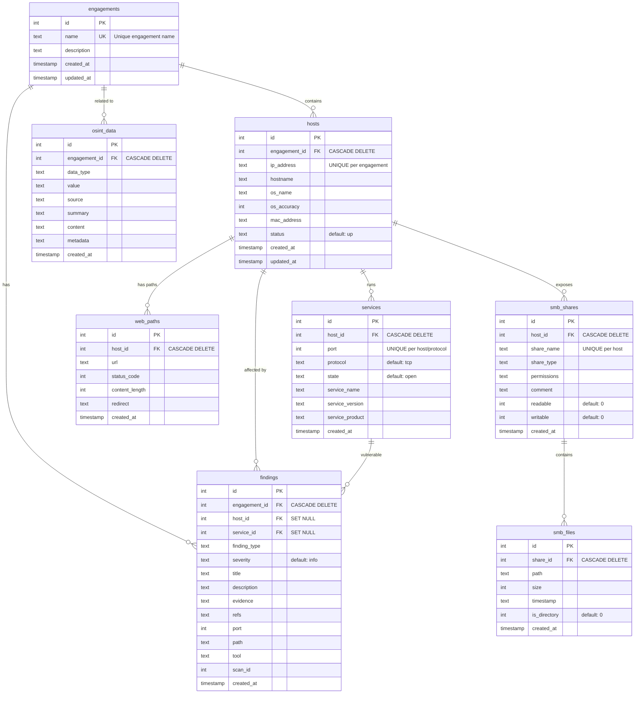

# Database Schema - Entity Relationship Diagram

## Visual Diagram (Mermaid)



## Relationships Explained

### Engagement → Hosts (1:N, CASCADE)
- One engagement can have many hosts discovered
- Deleting an engagement removes all its hosts

### Engagement → Findings (1:N, CASCADE)
- One engagement can have many findings
- Deleting an engagement removes all its findings

### Engagement → OSINT Data (1:N, CASCADE)
- One engagement can have many OSINT records
- Deleting an engagement removes all its OSINT data

### Host → Services (1:N, CASCADE)
- One host can run many services
- Deleting a host removes all its services

### Host → Findings (1:N, SET NULL)
- One host can have many findings
- Deleting a host sets finding.host_id to NULL (finding persists under engagement)

### Host → Web Paths (1:N, CASCADE)
- One host can have many discovered web paths
- Deleting a host removes all its web paths

### Host → SMB Shares (1:N, CASCADE)
- One host can expose many SMB shares
- Deleting a host removes all its shares

### Service → Findings (1:N, SET NULL)
- One service can have many findings
- Deleting a service sets finding.service_id to NULL (finding persists)

### SMB Share → SMB Files (1:N, CASCADE)
- One share can contain many files
- Deleting a share removes all its file records

## Data Integrity Rules

### Foreign Key Constraints
All foreign keys enforce referential integrity:
- **CASCADE DELETE**: Child records deleted when parent is deleted
- **SET NULL**: Child records kept but FK set to NULL when parent deleted

### Unique Constraints
Prevent duplicate data:
- **engagements.name**: Engagement names must be unique globally
- **hosts(engagement_id, ip_address)**: IP addresses must be unique per engagement
- **services(host_id, port, protocol)**: Service ports must be unique per host/protocol
- **smb_shares(host_id, share_name)**: Share names must be unique per host

### Performance Indexes
14 indexes optimize common queries:
- **Engagement lookups**: idx_hosts_engagement, idx_findings_engagement, idx_osint_engagement
- **Host lookups**: idx_hosts_ip, idx_findings_host, idx_web_paths_host, idx_smb_shares_host
- **Service lookups**: idx_services_host, idx_services_port, idx_services_name
- **Finding analysis**: idx_findings_severity
- **Web discovery**: idx_web_paths_url
- **OSINT analysis**: idx_osint_type
- **SMB navigation**: idx_smb_files_share

## Common Query Patterns

### Get all hosts for an engagement
```sql
SELECT * FROM hosts WHERE engagement_id = ?;
-- Uses: idx_hosts_engagement
```

### Get all findings for a host
```sql
SELECT * FROM findings WHERE host_id = ?;
-- Uses: idx_findings_host
```

### Get all services on a specific port
```sql
SELECT * FROM services WHERE port = 445;
-- Uses: idx_services_port
```

### Get high-severity findings for an engagement
```sql
SELECT * FROM findings 
WHERE engagement_id = ? AND severity = 'high';
-- Uses: idx_findings_engagement, idx_findings_severity
```

### Get all SMB files in a share
```sql
SELECT * FROM smb_files WHERE share_id = ?;
-- Uses: idx_smb_files_share
```
