# Spatial Memory MCP Server — Architecture Diagrams

> Visual architecture reference for the Spatial Memory MCP Server

> **Status**: All components shown are fully implemented. See [README.md](README.md) for details.

---

## 1. High-Level System Architecture

```mermaid
flowchart TB
    subgraph Clients["🤖 Any LLM Client"]
        Claude["Claude"]
        GPT["GPT-4/5"]
        Gemini["Gemini"]
        Llama["Llama/Mistral"]
        Local["Local LLMs"]
    end

    subgraph MCP["📡 MCP Protocol Layer"]
        Server["Spatial Memory<br/>MCP Server"]
    end

    subgraph Tools["🔧 Tool Categories"]
        direction LR
        Core["Core<br/>───────<br/>remember<br/>recall<br/>nearby<br/>forget"]
        Spatial["Spatial<br/>───────<br/>journey<br/>wander<br/>regions<br/>visualize"]
        Lifecycle["Lifecycle<br/>───────<br/>consolidate<br/>extract<br/>decay<br/>reinforce"]
        Utility["Utility<br/>───────<br/>stats<br/>namespaces<br/>export<br/>import"]
    end

    subgraph Services["⚙️ Service Layer"]
        MemService["Memory Service"]
        SpatialService["Spatial Service"]
        LifecycleService["Lifecycle Service"]
        VizService["Visualization Service"]
    end

    subgraph Embedding["🧠 Embedding Layer"]
        Router["Embedding Router"]
        LocalEmbed["Local Model<br/>(sentence-transformers)"]
        APIEmbed["API Model<br/>(OpenAI)"]
    end

    subgraph Storage["💾 Storage Layer"]
        LanceDB["LanceDB"]
        Memories[(memories table)]
        Meta[(metadata)]
    end

    Clients -->|"Tool Calls"| Server
    Server --> Core & Spatial & Lifecycle & Utility
    Core --> MemService
    Spatial --> SpatialService
    Lifecycle --> LifecycleService
    Utility --> MemService
    
    MemService & SpatialService --> Router
    Router --> LocalEmbed & APIEmbed
    
    MemService & SpatialService & LifecycleService & VizService --> LanceDB
    LanceDB --> Memories & Meta
```

---

## 2. Tool Ecosystem

---

## 3. Data Flow — Remember Operation

```mermaid
sequenceDiagram
    autonumber
    participant LLM as 🤖 LLM Client
    participant MCP as 📡 MCP Server
    participant MS as ⚙️ Memory Service
    participant ES as 🧠 Embedding Service
    participant DB as 💾 LanceDB

    LLM->>MCP: remember(content, metadata)
    MCP->>MS: store_memory(content, metadata)
    MS->>ES: embed(content)
    
    alt Local Model
        ES->>ES: sentence-transformers encode
    else API Model
        ES->>ES: OpenAI API call
    end
    
    ES-->>MS: vector[384]
    
    MS->>MS: Generate UUID
    MS->>MS: Add timestamps
    MS->>MS: Set importance
    
    MS->>DB: INSERT (id, content, vector, metadata)
    DB-->>MS: success
    
    MS-->>MCP: {id, content, created_at}
    MCP-->>LLM: Memory stored ✓
```

---

## 4. Data Flow — Recall Operation

```mermaid
sequenceDiagram
    autonumber
    participant LLM as 🤖 LLM Client
    participant MCP as 📡 MCP Server
    participant MS as ⚙️ Memory Service
    participant ES as 🧠 Embedding Service
    participant DB as 💾 LanceDB

    LLM->>MCP: recall(query, limit, filters)
    MCP->>MS: search_memories(query, limit, filters)
    MS->>ES: embed(query)
    ES-->>MS: query_vector[384]
    
    alt Pure Vector Search
        MS->>DB: vector_search(query_vector, limit)
    else Hybrid Search
        MS->>DB: vector_search(query_vector)
        MS->>DB: keyword_search(query)
        MS->>MS: RRF fusion
    end
    
    DB-->>MS: raw_results[]
    
    MS->>MS: Apply filters
    MS->>MS: Update access_count
    MS->>MS: Update last_accessed
    
    MS-->>MCP: memories[]
    MCP-->>LLM: [{id, content, similarity, metadata}...]
```

---

## 5. Data Flow — Journey Operation (SLERP)

```mermaid
sequenceDiagram
    autonumber
    participant LLM as 🤖 LLM Client
    participant MCP as 📡 MCP Server
    participant SS as 🧭 Spatial Service
    participant DB as 💾 LanceDB

    LLM->>MCP: journey(start_id, end_id, steps=5)
    MCP->>SS: create_journey(start_id, end_id, 5)
    
    SS->>DB: get_vector(start_id)
    DB-->>SS: start_vector
    SS->>DB: get_vector(end_id)
    DB-->>SS: end_vector
    
    loop For each step (0 to 5)
        SS->>SS: SLERP interpolate at t
        SS->>DB: nearest_neighbor(interpolated_vector)
        DB-->>SS: closest_memory
        SS->>SS: Record step + distance
    end
    
    SS-->>MCP: {path: [...], total_distance, density}
    MCP-->>LLM: Journey with discovered concepts
```

---

## 6. Data Flow — Regions Operation (Clustering)

---

## 7. Module Structure

---

## 8. Memory Data Model

---

## 9. Embedding Router Logic

---

## 10. Lifecycle — Decay Algorithm

---

## 11. Visualization Output Formats

```mermaid
flowchart LR
    subgraph Input
        Memories[(Memory<br/>Vectors)]
    end
    
    subgraph Processing
        UMAP["UMAP<br/>Dimensionality<br/>Reduction"]
        Cluster["HDBSCAN<br/>Clustering"]
    end
    
    subgraph Output
        JSON["JSON<br/>─────────<br/>{nodes, edges,<br/>clusters, bounds}"]
        Mermaid["Mermaid<br/>─────────<br/>mindmap or<br/>flowchart syntax"]
        SVG["SVG<br/>─────────<br/>Rendered scatter<br/>plot image"]
    end
    
    Memories --> UMAP
    UMAP --> Cluster
    Cluster --> JSON & Mermaid & SVG
```

---

## 12. Comparison: Official MCP Memory vs Ours

---

## 13. Integration with RLM Pattern

---

## 14. Development Timeline

---

*Generated for Spatial Memory MCP Server v0.1.0*
