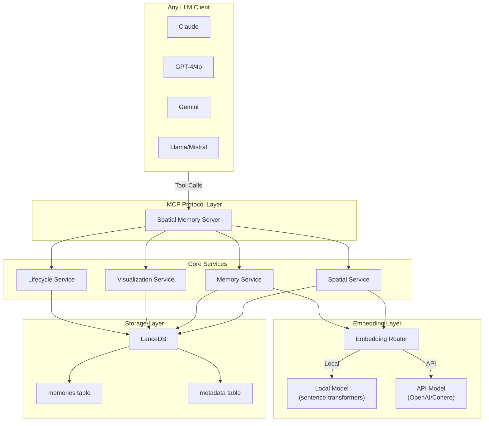
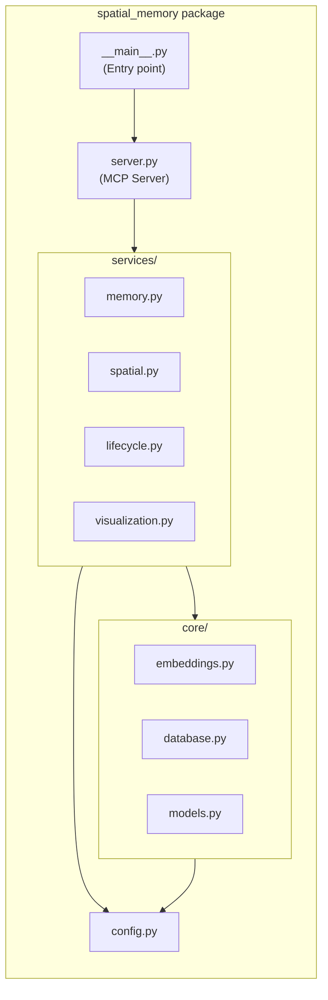
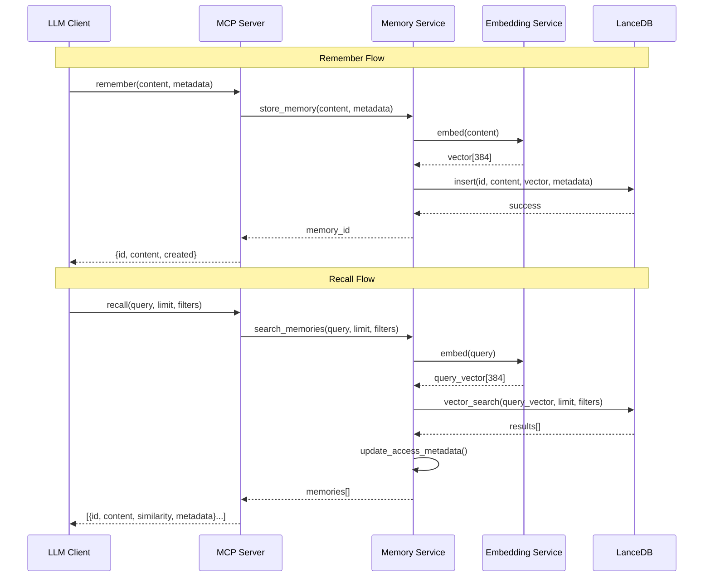

# Spatial Memory MCP Server — Development Plan

> A vector-based spatial memory system that treats knowledge as a navigable landscape, not a filing cabinet.

**Version:** 1.0.0  
**Created:** 2026-01-13  
**Target:** Claude Code Opus 4.5  

---

## Table of Contents

1. [Project Overview](#1-project-overview)
2. [Technical Stack](#2-technical-stack)
3. [Architecture](#3-architecture)
4. [Data Models](#4-data-models)
5. [Tool Specifications](#5-tool-specifications)
6. [Algorithm Implementations](#6-algorithm-implementations)
7. [Configuration System](#7-configuration-system)
8. [Error Handling](#8-error-handling)
9. [Project Structure](#9-project-structure)
10. [Development Phases](#10-development-phases)
11. [Testing Requirements](#11-testing-requirements)
12. [MCP Protocol Integration](#12-mcp-protocol-integration)

---

## 1. Project Overview

### 1.1 What This Is

A Model Context Protocol (MCP) server that provides **spatial bidirectional persistent memory** for any LLM. Unlike traditional memory systems that act as key-value stores or tagged databases, this system treats memories as points in geometric vector space—enabling semantic navigation, path interpolation, clustering, and visual exploration.

### 1.2 Core Value Proposition

Most memory systems treat storage as a **filing cabinet**—you put things in, you search, you get results. This system treats memory as a **landscape you can explore**:

- **Spatial Navigation**: `journey` and `wander` let LLMs discover connections they didn't know to ask for
- **Visual Understanding**: Real-time visualization (Mermaid/SVG/JSON) shows how knowledge is organized
- **Cognitive Dynamics**: Memories consolidate, decay, and reinforce like human cognition
- **Semantic Discovery**: `regions` auto-clusters related concepts without manual tagging

### 1.3 Target Users

Technical workers: developers, architects, team leads who need:
- **Cognitive offloading** — externalize knowledge without losing access
- **Low-friction capture** — store information with minimal resistance  
- **Selective loading** — retrieve only what's relevant to current context

### 1.4 Design Principles

1. **OS Agnostic**: Works on Windows, macOS, Linux without modification
2. **LLM Agnostic**: Works with any LLM via MCP protocol or RAG injection
3. **Local-First**: No cloud dependencies for core functionality
4. **Privacy-Respecting**: Default embedding model runs entirely locally
5. **Configurable**: Embedding model, storage path, and behavior are customizable

---

## 2. Technical Stack

### 2.1 Core Dependencies

| Dependency | Version | Purpose |
|------------|---------|---------|
| Python | ≥3.10 | Runtime |
| `lancedb` | ≥0.6.0 | Vector database (embedded) |
| `sentence-transformers` | ≥2.2.0 | Local embedding models |
| `mcp` | ≥1.0.0 | MCP SDK for server protocol |
| `numpy` | ≥1.24.0 | Vector operations, SLERP |
| `hdbscan` | ≥0.8.33 | Density-based clustering |
| `umap-learn` | ≥0.5.5 | Dimensionality reduction for visualization |
| `pydantic` | ≥2.0.0 | Data validation and settings |

### 2.2 Optional Dependencies

| Dependency | Version | Purpose |
|------------|---------|---------|
| `openai` | ≥1.0.0 | OpenAI embeddings (optional) |
| `tiktoken` | ≥0.5.0 | Token counting for OpenAI |

### 2.3 Development Dependencies

| Dependency | Version | Purpose |
|------------|---------|---------|
| `pytest` | ≥7.0.0 | Testing framework |
| `pytest-asyncio` | ≥0.21.0 | Async test support |
| `pytest-cov` | ≥4.0.0 | Coverage reporting |
| `ruff` | ≥0.1.0 | Linting and formatting |
| `mypy` | ≥1.0.0 | Type checking |

### 2.4 Why LanceDB Over ChromaDB

| Criteria | LanceDB | ChromaDB |
|----------|---------|----------|
| Architecture | Single-file embedded | Client-server or embedded |
| Dependencies | Minimal (Rust core) | Heavy (ClickHouse, etc.) |
| Stability | Mature, production-ready | Historical stability issues |
| Versioning | Built-in automatic versioning | Manual |
| Performance | Excellent for local workloads | Good |
| Storage Format | Lance columnar (efficient) | SQLite + Parquet |

### 2.5 Default Embedding Model

**Model**: `all-MiniLM-L6-v2`

| Property | Value |
|----------|-------|
| Dimensions | 384 |
| Size | ~80MB |
| Speed | ~14,000 sentences/sec (CPU) |
| Quality | Good for general-purpose semantic search |
| License | MIT (free, local, private) |

---

## 3. Architecture

### 3.1 High-Level Architecture



### 3.2 Module Architecture



### 3.3 Data Flow



---

## 4. Data Models

### 4.1 Memory Schema (LanceDB Table)

```python
# LanceDB table schema for memories
MEMORY_SCHEMA = {
    "id": "string",           # UUID, primary key
    "content": "string",      # Original text content
    "vector": "vector[384]",  # Embedding (dimension matches model)
    "created_at": "timestamp", # Creation timestamp (UTC)
    "updated_at": "timestamp", # Last modification timestamp (UTC)
    "last_accessed": "timestamp", # Last retrieval timestamp (UTC)
    "access_count": "int32",  # Number of times retrieved
    "importance": "float32",  # Importance score (0.0 - 1.0)
    "namespace": "string",    # Namespace for multi-tenant isolation
    "tags": "list<string>",   # User-defined tags
    "source": "string",       # Origin (manual, extracted, consolidated)
    "metadata": "string",     # JSON string for arbitrary metadata
}
```

### 4.2 Pydantic Models

```python
from pydantic import BaseModel, Field
from datetime import datetime
from typing import Optional
from enum import Enum

class MemorySource(str, Enum):
    MANUAL = "manual"           # Explicitly stored via remember()
    EXTRACTED = "extracted"     # Auto-extracted from conversation
    CONSOLIDATED = "consolidated"  # Result of consolidation

class Memory(BaseModel):
    """A single memory in the spatial memory system."""
    id: str = Field(..., description="Unique identifier (UUID)")
    content: str = Field(..., description="Text content of the memory")
    created_at: datetime = Field(default_factory=datetime.utcnow)
    updated_at: datetime = Field(default_factory=datetime.utcnow)
    last_accessed: datetime = Field(default_factory=datetime.utcnow)
    access_count: int = Field(default=0, ge=0)
    importance: float = Field(default=0.5, ge=0.0, le=1.0)
    namespace: str = Field(default="default")
    tags: list[str] = Field(default_factory=list)
    source: MemorySource = Field(default=MemorySource.MANUAL)
    metadata: dict = Field(default_factory=dict)

class MemoryResult(BaseModel):
    """A memory with similarity score from search."""
    id: str
    content: str
    similarity: float = Field(..., ge=0.0, le=1.0)
    metadata: dict
    created_at: datetime
    importance: float

class ClusterInfo(BaseModel):
    """Information about a discovered cluster/region."""
    cluster_id: int
    label: str  # Auto-generated or centroid-based
    size: int
    centroid_memory_id: str  # Memory closest to centroid
    sample_memories: list[str]  # Sample content from cluster
    membership_strength: float  # Average membership probability

class JourneyStep(BaseModel):
    """A step in a journey between two memories."""
    step: int
    position: list[float]  # Interpolated vector position
    nearest_memory: Optional[MemoryResult]  # Closest actual memory
    distance_to_path: float  # How far the nearest memory is from ideal path

class VisualizationData(BaseModel):
    """Data for visualizing the memory space."""
    nodes: list[dict]  # {id, x, y, label, cluster, importance}
    edges: list[dict]  # {from, to, weight} - optional connections
    clusters: list[dict]  # {id, label, color, center_x, center_y}
```

### 4.3 Filter Schema

```python
class FilterOperator(str, Enum):
    EQ = "eq"       # Equal
    NE = "ne"       # Not equal
    GT = "gt"       # Greater than
    GTE = "gte"     # Greater than or equal
    LT = "lt"       # Less than
    LTE = "lte"     # Less than or equal
    IN = "in"       # In list
    NIN = "nin"     # Not in list
    CONTAINS = "contains"  # String/list contains

class Filter(BaseModel):
    """A single filter condition."""
    field: str
    operator: FilterOperator
    value: any

class FilterGroup(BaseModel):
    """A group of filters with logical operator."""
    operator: Literal["and", "or"] = "and"
    filters: list[Filter | FilterGroup]
```

---

## 5. Tool Specifications

### 5.1 Core Memory Operations

#### `remember`

Store a memory in vector space.

```python
@tool
def remember(
    content: str,
    namespace: str = "default",
    tags: list[str] = [],
    importance: float = 0.5,
    metadata: dict = {}
) -> dict:
    """
    Store a memory in vector space.
    
    Args:
        content: The text content to remember (required)
        namespace: Namespace for organization (default: "default")
        tags: List of tags for filtering (default: [])
        importance: Initial importance score 0.0-1.0 (default: 0.5)
        metadata: Arbitrary key-value metadata (default: {})
    
    Returns:
        {
            "id": "uuid-string",
            "content": "stored content",
            "namespace": "default",
            "created_at": "2026-01-13T10:30:00Z"
        }
    
    Example:
        remember(
            content="Use repository pattern for database access in this project",
            namespace="project-alpha",
            tags=["architecture", "patterns"],
            importance=0.8
        )
    """
```

#### `remember_batch`

Store multiple memories efficiently.

```python
@tool
def remember_batch(
    memories: list[dict],
    namespace: str = "default"
) -> dict:
    """
    Store multiple memories in a single operation.
    
    Args:
        memories: List of memory objects, each containing:
            - content (required): Text content
            - tags (optional): List of tags
            - importance (optional): Importance score
            - metadata (optional): Arbitrary metadata
        namespace: Default namespace for all memories (can be overridden per-memory)
    
    Returns:
        {
            "stored": 5,
            "ids": ["uuid-1", "uuid-2", ...],
            "failed": 0,
            "errors": []
        }
    
    Example:
        remember_batch(
            memories=[
                {"content": "React uses virtual DOM", "tags": ["react"]},
                {"content": "Vue uses reactive data binding", "tags": ["vue"]},
            ],
            namespace="frontend"
        )
    """
```

#### `recall`

Find memories semantically similar to a query.

```python
@tool
def recall(
    query: str,
    limit: int = 5,
    namespace: str | None = None,
    filters: dict | None = None,
    min_similarity: float = 0.0,
    hybrid_alpha: float | None = None
) -> dict:
    """
    Find memories semantically similar to the query.
    
    Args:
        query: Search query text (required)
        limit: Maximum number of results (default: 5, max: 100)
        namespace: Filter to specific namespace (default: search all)
        filters: Metadata filters (see Filter Schema)
        min_similarity: Minimum similarity threshold 0.0-1.0 (default: 0.0)
        hybrid_alpha: If set (0.0-1.0), enables hybrid search:
            - 0.0 = pure keyword/BM25 search
            - 1.0 = pure vector/semantic search
            - 0.5 = balanced hybrid (recommended)
    
    Returns:
        {
            "memories": [
                {
                    "id": "uuid",
                    "content": "memory content",
                    "similarity": 0.89,
                    "namespace": "default",
                    "tags": ["tag1"],
                    "importance": 0.7,
                    "created_at": "2026-01-13T10:30:00Z"
                },
                ...
            ],
            "total": 5,
            "query_embedding_time_ms": 12
        }
    
    Example:
        recall(
            query="How should I structure React components?",
            limit=10,
            namespace="frontend",
            filters={"tags": {"contains": "patterns"}},
            min_similarity=0.5
        )
    """
```

#### `nearby`

Find memories spatially close to a specific memory.

```python
@tool
def nearby(
    memory_id: str,
    limit: int = 5,
    exclude_self: bool = True
) -> dict:
    """
    Find memories spatially close to a given memory.
    
    Args:
        memory_id: ID of the reference memory (required)
        limit: Maximum number of neighbors (default: 5)
        exclude_self: Exclude the reference memory from results (default: True)
    
    Returns:
        {
            "reference": {
                "id": "uuid",
                "content": "reference memory content"
            },
            "neighbors": [
                {
                    "id": "uuid",
                    "content": "neighbor content",
                    "similarity": 0.92,
                    ...
                },
                ...
            ]
        }
    
    Example:
        nearby(memory_id="abc-123", limit=10)
    """
```

#### `forget`

Remove a memory from the space.

```python
@tool
def forget(
    memory_id: str | None = None,
    filters: dict | None = None,
    namespace: str | None = None
) -> dict:
    """
    Remove memories from the space.
    
    Args:
        memory_id: Specific memory ID to delete (optional)
        filters: Delete memories matching filters (optional)
        namespace: Delete all memories in namespace (optional)
        
        Note: At least one of memory_id, filters, or namespace must be provided.
        Use with caution - deletion is permanent.
    
    Returns:
        {
            "deleted": 1,
            "ids": ["uuid-deleted"]
        }
    
    Example:
        forget(memory_id="abc-123")
        forget(filters={"importance": {"lt": 0.1}})
        forget(namespace="temp-workspace")
    """
```

#### `forget_batch`

Remove multiple memories by ID.

```python
@tool
def forget_batch(
    memory_ids: list[str]
) -> dict:
    """
    Remove multiple memories by their IDs.
    
    Args:
        memory_ids: List of memory IDs to delete
    
    Returns:
        {
            "deleted": 5,
            "failed": 0,
            "not_found": []
        }
    """
```

### 5.2 Spatial Operations

#### `journey`

Interpolate a path between two memories through vector space.

```python
@tool
def journey(
    start_id: str,
    end_id: str,
    steps: int = 5
) -> dict:
    """
    Create an interpolated path between two memories through vector space.
    
    Uses SLERP (Spherical Linear Interpolation) to walk through the
    high-dimensional space, finding actual memories near each step.
    
    Args:
        start_id: ID of starting memory (required)
        end_id: ID of ending memory (required)
        steps: Number of intermediate steps (default: 5, min: 1, max: 20)
    
    Returns:
        {
            "start": {"id": "...", "content": "..."},
            "end": {"id": "...", "content": "..."},
            "path": [
                {
                    "step": 0,
                    "nearest_memory": {
                        "id": "uuid",
                        "content": "memory along the path",
                        "similarity": 0.85
                    },
                    "distance_to_ideal": 0.12
                },
                ...
            ],
            "total_distance": 0.45,
            "path_density": 0.78  # How many steps had nearby memories
        }
    
    Example:
        journey(
            start_id="memory-about-react",
            end_id="memory-about-databases",
            steps=7
        )
        
        # Might reveal: React → State Management → Event Sourcing → 
        #               CQRS → Domain Events → Database Patterns
    """
```

#### `wander`

Random walk through memory space for serendipitous discovery.

```python
@tool
def wander(
    seed: str | None = None,
    seed_id: str | None = None,
    steps: int = 5,
    randomness: float = 0.3
) -> dict:
    """
    Take a random walk through memory space for discovery.
    
    Starts from a seed (query or memory) and takes stochastic steps,
    balancing between staying near known concepts and exploring.
    
    Args:
        seed: Text query to start from (optional)
        seed_id: Memory ID to start from (optional)
            Note: Provide either seed OR seed_id, not both.
            If neither provided, starts from a random memory.
        steps: Number of steps to take (default: 5, max: 20)
        randomness: How random vs. directed (0.0-1.0, default: 0.3)
            - 0.0 = always go to nearest unvisited neighbor
            - 1.0 = completely random jumps
            - 0.3 = mostly local with occasional jumps (recommended)
    
    Returns:
        {
            "journey": [
                {
                    "step": 0,
                    "memory": {"id": "...", "content": "..."},
                    "jump_type": "start"
                },
                {
                    "step": 1, 
                    "memory": {"id": "...", "content": "..."},
                    "jump_type": "neighbor"  # or "random"
                },
                ...
            ],
            "unique_clusters_visited": 3,
            "total_distance_traveled": 1.24
        }
    
    Example:
        wander(seed="authentication patterns", steps=10, randomness=0.4)
    """
```

#### `regions`

Discover conceptual regions through clustering.

```python
@tool
def regions(
    num_clusters: int | None = None,
    namespace: str | None = None,
    min_cluster_size: int = 3
) -> dict:
    """
    Discover conceptual regions in memory space via clustering.
    
    Uses HDBSCAN for density-based clustering that automatically
    determines cluster count and identifies outliers.
    
    Args:
        num_clusters: Suggested number of clusters (optional)
            Note: HDBSCAN auto-detects optimal count; this is a hint.
        namespace: Cluster only within namespace (optional)
        min_cluster_size: Minimum memories per cluster (default: 3)
    
    Returns:
        {
            "clusters": [
                {
                    "cluster_id": 0,
                    "label": "Frontend Patterns",  # Auto-generated
                    "size": 12,
                    "centroid_memory": {
                        "id": "uuid",
                        "content": "Most central memory"
                    },
                    "sample_contents": [
                        "React component patterns",
                        "Vue composition API",
                        "State management strategies"
                    ],
                    "coherence": 0.82  # How tight the cluster is
                },
                ...
            ],
            "outliers": {
                "count": 3,
                "memories": [...]  # Memories not in any cluster
            },
            "total_memories": 45,
            "clustering_quality": 0.67  # Silhouette score
        }
    
    Example:
        regions(min_cluster_size=5, namespace="project-alpha")
    """
```

#### `visualize`

Generate visual representation of memory space.

```python
@tool
def visualize(
    format: Literal["json", "mermaid", "svg"] = "json",
    namespace: str | None = None,
    include_edges: bool = False,
    max_memories: int = 100,
    highlight_ids: list[str] = []
) -> dict:
    """
    Generate a 2D visualization of memory space.
    
    Uses UMAP for dimensionality reduction from high-dimensional
    embedding space to 2D coordinates suitable for visualization.
    
    Args:
        format: Output format (default: "json")
            - "json": Raw coordinate data for custom rendering
            - "mermaid": Mermaid mindmap/flowchart syntax
            - "svg": Rendered SVG image
        namespace: Visualize only this namespace (optional)
        include_edges: Include similarity edges between nodes (default: False)
        max_memories: Maximum memories to include (default: 100)
        highlight_ids: Memory IDs to highlight (default: [])
    
    Returns:
        For format="json":
        {
            "nodes": [
                {
                    "id": "uuid",
                    "x": 0.23,
                    "y": -0.45,
                    "label": "React patterns...",  # Truncated content
                    "cluster": 0,
                    "importance": 0.7,
                    "highlighted": false
                },
                ...
            ],
            "edges": [  # If include_edges=True
                {"from": "id1", "to": "id2", "weight": 0.89},
                ...
            ],
            "clusters": [
                {"id": 0, "label": "Frontend", "color": "#4A90D9", "center": [0.1, -0.3]},
                ...
            ],
            "bounds": {"x_min": -1, "x_max": 1, "y_min": -1, "y_max": 1}
        }
        
        For format="mermaid":
        {
            "mermaid": "mindmap\n  root((Memory Space))\n    Frontend Patterns\n      React patterns\n      ...",
            "node_count": 45
        }
        
        For format="svg":
        {
            "svg": "<svg>...</svg>",
            "width": 800,
            "height": 600
        }
    
    Example:
        visualize(format="mermaid", namespace="project-alpha", max_memories=50)
    """
```

### 5.3 Memory Lifecycle Operations

#### `consolidate`

Merge similar or duplicate memories.

```python
@tool
def consolidate(
    similarity_threshold: float = 0.9,
    namespace: str | None = None,
    strategy: Literal["keep_newest", "keep_oldest", "merge"] = "merge",
    dry_run: bool = False
) -> dict:
    """
    Find and merge similar/duplicate memories.
    
    Args:
        similarity_threshold: Minimum similarity to consider duplicates (default: 0.9)
        namespace: Consolidate only within namespace (optional)
        strategy: How to handle duplicates (default: "merge")
            - "keep_newest": Keep most recent, delete others
            - "keep_oldest": Keep oldest, delete others
            - "merge": Combine content and metadata, keep highest importance
        dry_run: Preview changes without applying (default: False)
    
    Returns:
        {
            "groups_found": 5,  # Number of duplicate groups
            "memories_affected": 12,
            "memories_after": 7,  # After consolidation
            "consolidated": [
                {
                    "kept": {"id": "uuid", "content": "..."},
                    "merged_from": ["id1", "id2"],
                    "similarity": 0.94
                },
                ...
            ],
            "dry_run": false
        }
    
    Example:
        consolidate(similarity_threshold=0.85, strategy="merge", dry_run=True)
    """
```

#### `extract`

Auto-extract memories from conversation text.

```python
@tool
def extract(
    text: str,
    namespace: str = "default",
    min_importance: float = 0.3,
    types: list[str] = ["fact", "decision", "preference", "insight"]
) -> dict:
    """
    Automatically extract memorable information from text.
    
    Parses the input text to identify facts, decisions, preferences,
    and insights worth remembering. Uses NLP heuristics and patterns.
    
    Args:
        text: Conversation or document text to analyze (required)
        namespace: Namespace for extracted memories (default: "default")
        min_importance: Minimum importance to store (default: 0.3)
        types: Types of information to extract (default: all)
            - "fact": Factual statements
            - "decision": Decisions made
            - "preference": User preferences
            - "insight": Insights or learnings
    
    Returns:
        {
            "extracted": [
                {
                    "id": "uuid",
                    "content": "User prefers TypeScript over JavaScript",
                    "type": "preference",
                    "importance": 0.7,
                    "source_snippet": "I always use TypeScript..."
                },
                ...
            ],
            "total_extracted": 4,
            "skipped": 2,  # Below importance threshold
            "text_length": 1500
        }
    
    Example:
        extract(
            text="In our meeting, we decided to use PostgreSQL for the database. 
                  John mentioned he prefers REST over GraphQL for this project.
                  Key insight: caching will be critical for performance.",
            types=["decision", "preference", "insight"]
        )
    """
```

#### `decay`

Reduce importance of stale memories.

```python
@tool
def decay(
    strategy: Literal["time", "access", "combined"] = "combined",
    decay_rate: float = 0.1,
    min_importance: float = 0.05,
    namespace: str | None = None,
    dry_run: bool = False
) -> dict:
    """
    Apply decay to reduce importance of stale/unused memories.
    
    Args:
        strategy: Decay strategy (default: "combined")
            - "time": Decay based on age
            - "access": Decay based on access frequency
            - "combined": Both time and access (recommended)
        decay_rate: Rate of decay 0.0-1.0 (default: 0.1)
            Higher = more aggressive decay
        min_importance: Floor for importance (default: 0.05)
            Memories won't decay below this threshold
        namespace: Apply only to namespace (optional)
        dry_run: Preview changes without applying (default: False)
    
    Returns:
        {
            "affected": 23,
            "unchanged": 15,  # Already at minimum or recently accessed
            "decay_applied": [
                {
                    "id": "uuid",
                    "content": "...",
                    "importance_before": 0.6,
                    "importance_after": 0.48,
                    "reason": "not accessed in 30 days"
                },
                ...
            ],
            "dry_run": false
        }
    
    Example:
        decay(strategy="combined", decay_rate=0.15, dry_run=True)
    """
```

#### `reinforce`

Boost importance of a memory.

```python
@tool
def reinforce(
    memory_id: str,
    boost: float = 0.1,
    max_importance: float = 1.0
) -> dict:
    """
    Increase the importance of a memory.
    
    Called when a memory proves useful, reinforcing its value.
    
    Args:
        memory_id: ID of memory to reinforce (required)
        boost: Amount to increase importance (default: 0.1)
        max_importance: Maximum importance cap (default: 1.0)
    
    Returns:
        {
            "id": "uuid",
            "content": "memory content",
            "importance_before": 0.5,
            "importance_after": 0.6,
            "access_count": 5
        }
    
    Example:
        reinforce(memory_id="abc-123", boost=0.2)
    """
```

### 5.4 Utility Operations

#### `stats`

Get statistics about the memory system.

```python
@tool
def stats(
    namespace: str | None = None
) -> dict:
    """
    Get statistics about the memory system.
    
    Args:
        namespace: Get stats for specific namespace (optional)
    
    Returns:
        {
            "total_memories": 1234,
            "namespaces": {
                "default": 500,
                "project-alpha": 234,
                "work": 500
            },
            "embedding_model": "all-MiniLM-L6-v2",
            "embedding_dimensions": 384,
            "storage_path": "/path/to/.spatial-memory",
            "storage_size_mb": 45.2,
            "oldest_memory": "2025-06-15T...",
            "newest_memory": "2026-01-13T...",
            "average_importance": 0.52,
            "tag_distribution": {
                "architecture": 45,
                "frontend": 89,
                ...
            }
        }
    
    Example:
        stats()
        stats(namespace="project-alpha")
    """
```

#### `namespaces`

Manage namespaces.

```python
@tool
def namespaces(
    action: Literal["list", "create", "delete"] = "list",
    name: str | None = None
) -> dict:
    """
    Manage memory namespaces.
    
    Args:
        action: Action to perform (default: "list")
            - "list": List all namespaces with counts
            - "create": Create a new namespace
            - "delete": Delete namespace and all its memories
        name: Namespace name for create/delete (required for those actions)
    
    Returns:
        For action="list":
        {
            "namespaces": [
                {"name": "default", "count": 500, "created": "2025-01-01T..."},
                {"name": "project-alpha", "count": 234, "created": "2025-06-15T..."},
                ...
            ]
        }
        
        For action="create":
        {
            "created": "new-namespace",
            "message": "Namespace created successfully"
        }
        
        For action="delete":
        {
            "deleted": "old-namespace",
            "memories_removed": 45
        }
    
    Example:
        namespaces()  # List all
        namespaces(action="create", name="project-beta")
        namespaces(action="delete", name="temp-workspace")
    """
```

#### `export_memories`

Export memories to JSON.

```python
@tool
def export_memories(
    namespace: str | None = None,
    include_vectors: bool = False
) -> dict:
    """
    Export memories to JSON format.
    
    Args:
        namespace: Export only this namespace (optional, default: all)
        include_vectors: Include embedding vectors (default: False)
            Warning: Significantly increases export size
    
    Returns:
        {
            "export": {
                "version": "1.0.0",
                "exported_at": "2026-01-13T...",
                "embedding_model": "all-MiniLM-L6-v2",
                "memories": [
                    {
                        "id": "uuid",
                        "content": "...",
                        "namespace": "default",
                        "tags": [...],
                        "importance": 0.7,
                        "created_at": "...",
                        "metadata": {...},
                        "vector": [...]  # If include_vectors=True
                    },
                    ...
                ]
            },
            "count": 1234,
            "size_bytes": 245678
        }
    
    Example:
        export_memories(namespace="project-alpha")
    """
```

#### `import_memories`

Import memories from JSON.

```python
@tool
def import_memories(
    data: dict,
    namespace_override: str | None = None,
    skip_duplicates: bool = True,
    recompute_vectors: bool = True
) -> dict:
    """
    Import memories from JSON export.
    
    Args:
        data: Export data from export_memories (required)
        namespace_override: Override namespace for all imported (optional)
        skip_duplicates: Skip memories with same content (default: True)
        recompute_vectors: Recompute embeddings with current model (default: True)
            Set False only if export was made with same embedding model
    
    Returns:
        {
            "imported": 120,
            "skipped_duplicates": 5,
            "failed": 0,
            "errors": []
        }
    
    Example:
        import_memories(data=exported_data, namespace_override="restored")
    """
```

---

## 6. Algorithm Implementations

### 6.1 SLERP (Spherical Linear Interpolation)

Used by `journey` to interpolate between embedding vectors.

```python
import numpy as np

def slerp(v0: np.ndarray, v1: np.ndarray, t: float) -> np.ndarray:
    """
    Spherical linear interpolation between two vectors.
    
    SLERP is preferred over linear interpolation for normalized vectors
    because it maintains constant angular velocity and stays on the
    hypersphere surface where embeddings concentrate.
    
    Args:
        v0: Start vector (normalized)
        v1: End vector (normalized)
        t: Interpolation parameter [0, 1]
            t=0 returns v0, t=1 returns v1
    
    Returns:
        Interpolated vector (normalized)
    """
    # Ensure normalization
    v0 = v0 / np.linalg.norm(v0)
    v1 = v1 / np.linalg.norm(v1)
    
    # Compute cosine of angle between vectors
    dot = np.clip(np.dot(v0, v1), -1.0, 1.0)
    
    # If vectors are very close, use linear interpolation to avoid numerical issues
    if dot > 0.9995:
        result = v0 + t * (v1 - v0)
        return result / np.linalg.norm(result)
    
    # Calculate angle and interpolate
    theta_0 = np.arccos(dot)
    theta = theta_0 * t
    
    # Compute orthogonal vector
    v2 = v1 - v0 * dot
    v2 = v2 / np.linalg.norm(v2)
    
    # Interpolate
    return v0 * np.cos(theta) + v2 * np.sin(theta)


def journey_interpolate(
    start_vec: np.ndarray,
    end_vec: np.ndarray,
    steps: int
) -> list[np.ndarray]:
    """
    Generate interpolated path between two vectors.
    
    Args:
        start_vec: Starting embedding vector
        end_vec: Ending embedding vector
        steps: Number of intermediate points
    
    Returns:
        List of interpolated vectors including start and end
    """
    path = []
    for i in range(steps + 2):  # +2 to include start and end
        t = i / (steps + 1)
        path.append(slerp(start_vec, end_vec, t))
    return path
```

### 6.2 HDBSCAN Clustering

Used by `regions` for automatic cluster discovery.

```python
import hdbscan
import numpy as np

def cluster_memories(
    vectors: np.ndarray,
    min_cluster_size: int = 3,
    min_samples: int = None,
    cluster_selection_epsilon: float = 0.0
) -> tuple[np.ndarray, np.ndarray, float]:
    """
    Cluster memory vectors using HDBSCAN.
    
    HDBSCAN advantages over K-means:
    - Automatic cluster count discovery
    - Identifies outliers (noise points)
    - Handles varying density clusters
    - Provides membership probabilities
    
    Args:
        vectors: Array of embedding vectors (n_samples, n_dimensions)
        min_cluster_size: Minimum points for a cluster (default: 3)
        min_samples: Core point threshold (default: min_cluster_size)
        cluster_selection_epsilon: Cluster merge threshold (default: 0.0)
    
    Returns:
        labels: Cluster labels (-1 for noise/outliers)
        probabilities: Membership probabilities [0, 1]
        silhouette: Clustering quality score [-1, 1]
    """
    clusterer = hdbscan.HDBSCAN(
        min_cluster_size=min_cluster_size,
        min_samples=min_samples or min_cluster_size,
        cluster_selection_epsilon=cluster_selection_epsilon,
        metric='euclidean',  # Works well for normalized embeddings
        cluster_selection_method='eom',  # Excess of mass
        prediction_data=True  # Enable soft clustering
    )
    
    labels = clusterer.fit_predict(vectors)
    probabilities = clusterer.probabilities_
    
    # Calculate silhouette score (excluding noise points)
    from sklearn.metrics import silhouette_score
    mask = labels >= 0
    if mask.sum() > 1 and len(set(labels[mask])) > 1:
        silhouette = silhouette_score(vectors[mask], labels[mask])
    else:
        silhouette = 0.0
    
    return labels, probabilities, silhouette


def generate_cluster_labels(
    cluster_id: int,
    memory_contents: list[str],
    method: str = "centroid"
) -> str:
    """
    Generate human-readable label for a cluster.
    
    Args:
        cluster_id: Numeric cluster identifier
        memory_contents: Text contents of memories in cluster
        method: Labeling method
            - "centroid": Use content of memory closest to centroid
            - "common_words": Extract common significant words
            - "first_n": Use first N characters of centroid memory
    
    Returns:
        Human-readable cluster label
    """
    if not memory_contents:
        return f"Cluster {cluster_id}"
    
    if method == "centroid" or method == "first_n":
        # Centroid memory content is passed as first item
        label = memory_contents[0][:50]
        if len(memory_contents[0]) > 50:
            label += "..."
        return label
    
    elif method == "common_words":
        # Extract common significant words
        from collections import Counter
        words = []
        for content in memory_contents:
            words.extend(content.lower().split())
        
        # Filter stopwords and short words
        stopwords = {'the', 'a', 'an', 'is', 'are', 'was', 'were', 'to', 'for', 'in', 'on', 'of', 'and', 'or'}
        filtered = [w for w in words if len(w) > 3 and w not in stopwords]
        
        common = Counter(filtered).most_common(3)
        return " ".join(word for word, _ in common) or f"Cluster {cluster_id}"
    
    return f"Cluster {cluster_id}"
```

### 6.3 UMAP Visualization

Used by `visualize` for dimensionality reduction.

```python
import umap
import numpy as np

def reduce_for_visualization(
    vectors: np.ndarray,
    n_components: int = 2,
    n_neighbors: int = 15,
    min_dist: float = 0.1,
    metric: str = 'cosine'
) -> np.ndarray:
    """
    Reduce high-dimensional vectors to 2D/3D for visualization.
    
    UMAP advantages over t-SNE:
    - Much faster (O(n) vs O(n²))
    - Better preserves global structure
    - Scales to millions of points
    - Deterministic with random_state
    
    Args:
        vectors: High-dimensional vectors (n_samples, n_dimensions)
        n_components: Output dimensions (default: 2)
        n_neighbors: Local neighborhood size (default: 15)
            - Higher = more global structure
            - Lower = more local structure
        min_dist: Minimum distance between points (default: 0.1)
            - Lower = tighter clusters
            - Higher = more spread out
        metric: Distance metric (default: 'cosine')
    
    Returns:
        Reduced vectors (n_samples, n_components)
    """
    reducer = umap.UMAP(
        n_components=n_components,
        n_neighbors=n_neighbors,
        min_dist=min_dist,
        metric=metric,
        random_state=42  # Reproducibility
    )
    
    return reducer.fit_transform(vectors)


def generate_mermaid_mindmap(
    clusters: list[dict],
    max_items_per_cluster: int = 5
) -> str:
    """
    Generate Mermaid mindmap syntax for memory visualization.
    
    Args:
        clusters: List of cluster info dicts with 'label' and 'sample_contents'
        max_items_per_cluster: Max memories to show per cluster
    
    Returns:
        Mermaid mindmap syntax string
    """
    lines = ["mindmap", "  root((Memory Space))"]
    
    for cluster in clusters:
        # Escape special characters for Mermaid
        label = cluster['label'].replace('"', "'").replace('\n', ' ')
        lines.append(f"    {label}")
        
        for content in cluster['sample_contents'][:max_items_per_cluster]:
            # Truncate and escape content
            safe_content = content[:40].replace('"', "'").replace('\n', ' ')
            if len(content) > 40:
                safe_content += "..."
            lines.append(f"      {safe_content}")
    
    return "\n".join(lines)


def generate_mermaid_flowchart(
    path: list[dict],
    title: str = "Memory Journey"
) -> str:
    """
    Generate Mermaid flowchart syntax for journey visualization.
    
    Args:
        path: List of journey steps with 'memory' and 'similarity' keys
        title: Title for the diagram
    
    Returns:
        Mermaid flowchart syntax string
    """
    lines = ["flowchart LR"]
    
    for i, step in enumerate(path):
        content = step['memory']['content'][:30].replace('"', "'")
        if len(step['memory']['content']) > 30:
            content += "..."
        
        node_id = f"N{i}"
        lines.append(f'    {node_id}["{content}"]')
        
        if i > 0:
            prev_id = f"N{i-1}"
            similarity = step.get('similarity', 0)
            lines.append(f"    {prev_id} -->|{similarity:.2f}| {node_id}")
    
    return "\n".join(lines)


def generate_svg_scatter(
    nodes: list[dict],
    clusters: list[dict],
    width: int = 800,
    height: int = 600
) -> str:
    """
    Generate SVG scatter plot of memory space.
    
    Args:
        nodes: List of nodes with x, y, label, cluster, importance
        clusters: List of clusters with id, label, color
        width: SVG width in pixels
        height: SVG height in pixels
    
    Returns:
        SVG markup string
    """
    # Define color palette for clusters
    colors = ['#4A90D9', '#7B68EE', '#3CB371', '#FFD700', '#FF6B6B', 
              '#4ECDC4', '#95E1D3', '#F38181', '#AA96DA', '#FCBAD3']
    
    # Build SVG
    svg_parts = [
        f'<svg xmlns="http://www.w3.org/2000/svg" viewBox="0 0 {width} {height}">',
        f'<rect width="{width}" height="{height}" fill="#1a1a2e"/>',
        '<style>',
        '  .node { transition: all 0.2s; }',
        '  .node:hover { r: 8; }',
        '  .label { font-family: sans-serif; font-size: 10px; fill: #eee; }',
        '</style>'
    ]
    
    # Scale coordinates to SVG dimensions with padding
    padding = 50
    x_coords = [n['x'] for n in nodes]
    y_coords = [n['y'] for n in nodes]
    x_min, x_max = min(x_coords), max(x_coords)
    y_min, y_max = min(y_coords), max(y_coords)
    
    def scale_x(x):
        if x_max == x_min:
            return width / 2
        return padding + (x - x_min) / (x_max - x_min) * (width - 2 * padding)
    
    def scale_y(y):
        if y_max == y_min:
            return height / 2
        return padding + (y - y_min) / (y_max - y_min) * (height - 2 * padding)
    
    # Draw nodes
    for node in nodes:
        x = scale_x(node['x'])
        y = scale_y(node['y'])
        cluster_id = node.get('cluster', 0)
        color = colors[cluster_id % len(colors)] if cluster_id >= 0 else '#666'
        importance = node.get('importance', 0.5)
        radius = 3 + importance * 4  # Size based on importance
        
        svg_parts.append(
            f'<circle class="node" cx="{x:.1f}" cy="{y:.1f}" r="{radius:.1f}" '
            f'fill="{color}" opacity="0.8">'
            f'<title>{node["label"]}</title></circle>'
        )
    
    svg_parts.append('</svg>')
    return '\n'.join(svg_parts)
```

### 6.4 Hybrid Search (RRF)

Used by `recall` when hybrid_alpha is specified.

```python
def reciprocal_rank_fusion(
    vector_results: list[tuple[str, float]],  # (id, similarity)
    keyword_results: list[tuple[str, float]],  # (id, bm25_score)
    alpha: float = 0.5,
    k: int = 60
) -> list[tuple[str, float]]:
    """
    Combine vector and keyword search results using Reciprocal Rank Fusion.
    
    RRF is preferred over simple score combination because:
    - Works regardless of score scales (BM25 vs cosine similarity)
    - Robust to outlier scores
    - Simple and effective
    
    Args:
        vector_results: Results from vector similarity search
        keyword_results: Results from keyword/BM25 search
        alpha: Weight for vector vs keyword (0.0-1.0)
            - 1.0 = pure vector
            - 0.0 = pure keyword
            - 0.5 = balanced
        k: Ranking constant (default: 60, standard value)
    
    Returns:
        Fused results sorted by combined score
    """
    scores = {}
    
    # Score from vector results (weighted by alpha)
    for rank, (doc_id, _) in enumerate(vector_results):
        scores[doc_id] = scores.get(doc_id, 0) + alpha * (1 / (k + rank + 1))
    
    # Score from keyword results (weighted by 1-alpha)
    for rank, (doc_id, _) in enumerate(keyword_results):
        scores[doc_id] = scores.get(doc_id, 0) + (1 - alpha) * (1 / (k + rank + 1))
    
    # Sort by fused score
    fused = sorted(scores.items(), key=lambda x: x[1], reverse=True)
    return fused
```

### 6.5 Memory Extraction Patterns

Used by `extract` to identify memorable content.

```python
import re
from dataclasses import dataclass

@dataclass
class ExtractionPattern:
    pattern: re.Pattern
    memory_type: str
    importance_base: float
    transform: callable = None  # Optional content transformation

# Patterns for extracting different types of memories
EXTRACTION_PATTERNS = [
    # Decisions
    ExtractionPattern(
        pattern=re.compile(
            r"(?:we |I |they |the team )?(?:decided|chose|agreed|determined|concluded|resolved)(?: to| that)?\s+(.+?)(?:\.|$)",
            re.IGNORECASE
        ),
        memory_type="decision",
        importance_base=0.7
    ),
    
    # Preferences
    ExtractionPattern(
        pattern=re.compile(
            r"(?:I |we |user )?(?:prefer|like|want|favor|always use|recommend)\s+(.+?)(?:\s+(?:over|instead of|rather than)\s+.+?)?(?:\.|$)",
            re.IGNORECASE
        ),
        memory_type="preference",
        importance_base=0.6
    ),
    
    # Facts/Definitions
    ExtractionPattern(
        pattern=re.compile(
            r"(.+?)\s+(?:is|are|was|were|means|refers to|consists of)\s+(.+?)(?:\.|$)",
            re.IGNORECASE
        ),
        memory_type="fact",
        importance_base=0.5,
        transform=lambda m: f"{m.group(1)} is {m.group(2)}"
    ),
    
    # Insights/Learnings
    ExtractionPattern(
        pattern=re.compile(
            r"(?:key insight|important|learned that|realized|discovered|found out|turns out)\s*:?\s*(.+?)(?:\.|$)",
            re.IGNORECASE
        ),
        memory_type="insight",
        importance_base=0.75
    ),
    
    # Requirements/Constraints
    ExtractionPattern(
        pattern=re.compile(
            r"(?:must|should|need to|have to|required to|it's critical to)\s+(.+?)(?:\.|$)",
            re.IGNORECASE
        ),
        memory_type="requirement",
        importance_base=0.65
    ),
    
    # Problems/Issues
    ExtractionPattern(
        pattern=re.compile(
            r"(?:problem|issue|bug|error|challenge|difficulty)\s+(?:is|was|:)\s*(.+?)(?:\.|$)",
            re.IGNORECASE
        ),
        memory_type="problem",
        importance_base=0.6
    ),
    
    # Solutions/Fixes
    ExtractionPattern(
        pattern=re.compile(
            r"(?:solution|fix|resolved by|solved by|workaround)\s*(?:is|was|:)\s*(.+?)(?:\.|$)",
            re.IGNORECASE
        ),
        memory_type="solution",
        importance_base=0.7
    ),
]


def extract_memories_from_text(
    text: str,
    types: list[str] = None,
    min_importance: float = 0.3
) -> list[dict]:
    """
    Extract memorable information from text using pattern matching.
    
    Args:
        text: Input text to analyze
        types: Filter to specific memory types (optional)
        min_importance: Minimum importance threshold
    
    Returns:
        List of extracted memory candidates
    """
    memories = []
    seen_contents = set()  # Deduplicate
    
    for pattern_def in EXTRACTION_PATTERNS:
        # Filter by type if specified
        if types and pattern_def.memory_type not in types:
            continue
            
        for match in pattern_def.pattern.finditer(text):
            # Apply transform if defined, otherwise use first group
            if pattern_def.transform:
                content = pattern_def.transform(match)
            else:
                content = match.group(1).strip()
            
            # Skip empty or too short
            if not content or len(content) < 10:
                continue
            
            # Skip duplicates
            content_key = content.lower()
            if content_key in seen_contents:
                continue
            seen_contents.add(content_key)
            
            # Calculate importance (base + length bonus)
            importance = pattern_def.importance_base
            if len(content) > 50:
                importance += 0.05
            if len(content) > 100:
                importance += 0.05
            importance = min(importance, 1.0)
            
            if importance >= min_importance:
                memories.append({
                    "content": content,
                    "type": pattern_def.memory_type,
                    "importance": importance,
                    "source_snippet": match.group(0)[:100]
                })
    
    return memories
```

---

## 7. Configuration System

### 7.1 Configuration File

The server reads configuration from environment variables and/or a config file.

```python
# spatial_memory/config.py

from pydantic_settings import BaseSettings
from pydantic import Field
from pathlib import Path
from typing import Optional

class Settings(BaseSettings):
    """Spatial Memory Server Configuration."""
    
    # Storage
    memory_path: Path = Field(
        default=Path("./.spatial-memory"),
        description="Path to LanceDB storage directory"
    )
    
    # Embedding Model
    embedding_model: str = Field(
        default="all-MiniLM-L6-v2",
        description="Sentence-transformers model name or 'openai:model-name'"
    )
    embedding_dimensions: int = Field(
        default=384,
        description="Embedding vector dimensions (auto-detected if not set)"
    )
    
    # OpenAI (optional)
    openai_api_key: Optional[str] = Field(
        default=None,
        description="OpenAI API key for API-based embeddings"
    )
    openai_embedding_model: str = Field(
        default="text-embedding-3-small",
        description="OpenAI embedding model to use"
    )
    
    # Server
    log_level: str = Field(
        default="INFO",
        description="Logging level (DEBUG, INFO, WARNING, ERROR)"
    )
    
    # Memory Defaults
    default_namespace: str = Field(
        default="default",
        description="Default namespace for memories"
    )
    default_importance: float = Field(
        default=0.5,
        description="Default importance for new memories"
    )
    
    # Limits
    max_batch_size: int = Field(
        default=100,
        description="Maximum memories per batch operation"
    )
    max_recall_limit: int = Field(
        default=100,
        description="Maximum results from recall"
    )
    max_journey_steps: int = Field(
        default=20,
        description="Maximum steps in journey"
    )
    max_wander_steps: int = Field(
        default=20,
        description="Maximum steps in wander"
    )
    max_visualize_memories: int = Field(
        default=500,
        description="Maximum memories in visualization"
    )
    
    # Decay Settings
    decay_time_weight: float = Field(
        default=0.5,
        description="Weight for time-based decay (0-1)"
    )
    decay_access_weight: float = Field(
        default=0.5,
        description="Weight for access-based decay (0-1)"
    )
    decay_days_threshold: int = Field(
        default=30,
        description="Days without access before decay starts"
    )
    
    # Clustering
    min_cluster_size: int = Field(
        default=3,
        description="Minimum memories for a cluster"
    )
    
    # UMAP
    umap_n_neighbors: int = Field(
        default=15,
        description="UMAP neighborhood size"
    )
    umap_min_dist: float = Field(
        default=0.1,
        description="UMAP minimum distance"
    )
    
    class Config:
        env_prefix = "SPATIAL_MEMORY_"
        env_file = ".env"
        env_file_encoding = "utf-8"


# Global settings instance
settings = Settings()
```

### 7.2 Environment Variables

| Variable | Default | Description |
|----------|---------|-------------|
| `SPATIAL_MEMORY_PATH` | `./.spatial-memory` | Storage directory |
| `SPATIAL_MEMORY_EMBEDDING_MODEL` | `all-MiniLM-L6-v2` | Embedding model |
| `SPATIAL_MEMORY_OPENAI_API_KEY` | None | OpenAI API key |
| `SPATIAL_MEMORY_LOG_LEVEL` | `INFO` | Log level |
| `SPATIAL_MEMORY_DEFAULT_NAMESPACE` | `default` | Default namespace |

### 7.3 MCP Configuration

Add to Claude Desktop config (`claude_desktop_config.json`):

```json
{
  "mcpServers": {
    "spatial-memory": {
      "command": "python",
      "args": ["-m", "spatial_memory"],
      "env": {
        "SPATIAL_MEMORY_PATH": "/path/to/memory/storage",
        "SPATIAL_MEMORY_EMBEDDING_MODEL": "all-MiniLM-L6-v2"
      }
    }
  }
}
```

Or with uvx (if published to PyPI):

```json
{
  "mcpServers": {
    "spatial-memory": {
      "command": "uvx",
      "args": ["spatial-memory-mcp"]
    }
  }
}
```

---

## 8. Error Handling

### 8.1 Error Types

```python
# spatial_memory/core/errors.py

class SpatialMemoryError(Exception):
    """Base exception for all spatial memory errors."""
    pass

class MemoryNotFoundError(SpatialMemoryError):
    """Raised when a memory ID doesn't exist."""
    def __init__(self, memory_id: str):
        self.memory_id = memory_id
        super().__init__(f"Memory not found: {memory_id}")

class NamespaceNotFoundError(SpatialMemoryError):
    """Raised when a namespace doesn't exist."""
    def __init__(self, namespace: str):
        self.namespace = namespace
        super().__init__(f"Namespace not found: {namespace}")

class EmbeddingError(SpatialMemoryError):
    """Raised when embedding generation fails."""
    pass

class StorageError(SpatialMemoryError):
    """Raised when database operations fail."""
    pass

class ValidationError(SpatialMemoryError):
    """Raised when input validation fails."""
    pass

class ConfigurationError(SpatialMemoryError):
    """Raised when configuration is invalid."""
    pass

class ClusteringError(SpatialMemoryError):
    """Raised when clustering fails (e.g., too few memories)."""
    pass

class VisualizationError(SpatialMemoryError):
    """Raised when visualization generation fails."""
    pass
```

### 8.2 Error Response Format

All tool errors return a consistent format:

```python
{
    "error": {
        "type": "MemoryNotFoundError",
        "message": "Memory not found: abc-123",
        "details": {
            "memory_id": "abc-123"
        }
    }
}
```

### 8.3 Error Handling Pattern

```python
from functools import wraps
from typing import Callable
import logging

logger = logging.getLogger(__name__)

def handle_errors(func: Callable) -> Callable:
    """Decorator to handle errors consistently across tools."""
    @wraps(func)
    async def wrapper(*args, **kwargs):
        try:
            return await func(*args, **kwargs)
        except MemoryNotFoundError as e:
            logger.warning(f"Memory not found: {e.memory_id}")
            return {"error": {
                "type": "MemoryNotFoundError",
                "message": str(e),
                "details": {"memory_id": e.memory_id}
            }}
        except ValidationError as e:
            logger.warning(f"Validation error: {e}")
            return {"error": {
                "type": "ValidationError", 
                "message": str(e)
            }}
        except EmbeddingError as e:
            logger.error(f"Embedding error: {e}")
            return {"error": {
                "type": "EmbeddingError",
                "message": str(e)
            }}
        except StorageError as e:
            logger.error(f"Storage error: {e}")
            return {"error": {
                "type": "StorageError",
                "message": str(e)
            }}
        except Exception as e:
            logger.exception(f"Unexpected error in {func.__name__}")
            return {"error": {
                "type": "InternalError",
                "message": f"An unexpected error occurred: {str(e)}"
            }}
    return wrapper
```

---

## 9. Project Structure

```
spatial-memory-mcp/
├── README.md                    # Project documentation
├── LICENSE                      # MIT License
├── pyproject.toml              # Package configuration
├── requirements.txt            # Dependencies (generated)
├── requirements-dev.txt        # Dev dependencies
├── .env.example                # Example environment variables
├── .gitignore
│
├── spatial_memory/             # Main package
│   ├── __init__.py            # Package init, version
│   ├── __main__.py            # Entry point: python -m spatial_memory
│   ├── config.py              # Configuration (Pydantic settings)
│   ├── server.py              # MCP server implementation
│   │
│   ├── core/                  # Core components
│   │   ├── __init__.py
│   │   ├── database.py        # LanceDB wrapper
│   │   ├── embeddings.py      # Embedding service (local + API)
│   │   ├── models.py          # Pydantic models
│   │   └── errors.py          # Custom exceptions
│   │
│   ├── services/              # Business logic
│   │   ├── __init__.py
│   │   ├── memory.py          # Core CRUD operations
│   │   ├── spatial.py         # Journey, wander, regions
│   │   ├── lifecycle.py       # Consolidate, extract, decay, reinforce
│   │   └── visualization.py   # Visualize (JSON, Mermaid, SVG)
│   │
│   └── tools/                 # MCP tool definitions
│       ├── __init__.py
│       ├── core_tools.py      # remember, recall, nearby, forget
│       ├── spatial_tools.py   # journey, wander, regions, visualize
│       ├── lifecycle_tools.py # consolidate, extract, decay, reinforce
│       └── utility_tools.py   # stats, namespaces, export, import
│
├── tests/                     # Test suite
│   ├── __init__.py
│   ├── conftest.py           # Pytest fixtures
│   ├── test_memory.py        # Memory service tests
│   ├── test_spatial.py       # Spatial operations tests
│   ├── test_lifecycle.py     # Lifecycle tests
│   ├── test_visualization.py # Visualization tests
│   ├── test_embeddings.py    # Embedding tests
│   ├── test_integration.py   # Integration tests
│   └── fixtures/             # Test data
│       └── sample_memories.json
│
└── docs/                     # Additional documentation
    ├── ARCHITECTURE.md       # Detailed architecture
    ├── API.md               # Tool API reference
    └── EXAMPLES.md          # Usage examples
```

### 9.1 Key File Contents

#### `pyproject.toml`

```toml
[project]
name = "spatial-memory-mcp"
version = "1.0.0"
description = "Spatial bidirectional persistent memory MCP server for LLMs"
readme = "README.md"
license = {text = "MIT"}
requires-python = ">=3.10"
authors = [
    {name = "Your Name", email = "you@example.com"}
]
keywords = ["mcp", "memory", "llm", "vector", "embeddings", "semantic-search"]
classifiers = [
    "Development Status :: 4 - Beta",
    "Intended Audience :: Developers",
    "License :: OSI Approved :: MIT License",
    "Programming Language :: Python :: 3",
    "Programming Language :: Python :: 3.10",
    "Programming Language :: Python :: 3.11",
    "Programming Language :: Python :: 3.12",
]

dependencies = [
    "lancedb>=0.6.0",
    "sentence-transformers>=2.2.0",
    "mcp>=1.0.0",
    "numpy>=1.24.0",
    "hdbscan>=0.8.33",
    "umap-learn>=0.5.5",
    "pydantic>=2.0.0",
    "pydantic-settings>=2.0.0",
]

[project.optional-dependencies]
openai = ["openai>=1.0.0", "tiktoken>=0.5.0"]
dev = [
    "pytest>=7.0.0",
    "pytest-asyncio>=0.21.0",
    "pytest-cov>=4.0.0",
    "ruff>=0.1.0",
    "mypy>=1.0.0",
]

[project.scripts]
spatial-memory = "spatial_memory.__main__:main"

[build-system]
requires = ["hatchling"]
build-backend = "hatchling.build"

[tool.ruff]
line-length = 100
target-version = "py310"

[tool.ruff.lint]
select = ["E", "F", "I", "N", "W", "UP"]

[tool.mypy]
python_version = "3.10"
strict = true

[tool.pytest.ini_options]
asyncio_mode = "auto"
testpaths = ["tests"]
```

#### `spatial_memory/__init__.py`

```python
"""Spatial Memory MCP Server - Vector-based semantic memory for LLMs."""

__version__ = "1.0.0"
__author__ = "Your Name"

from spatial_memory.config import settings
from spatial_memory.core.models import Memory, MemoryResult, ClusterInfo

__all__ = ["settings", "Memory", "MemoryResult", "ClusterInfo", "__version__"]
```

#### `spatial_memory/__main__.py`

```python
"""Entry point for running the Spatial Memory MCP Server."""

import asyncio
import logging
from spatial_memory.server import create_server
from spatial_memory.config import settings

def main():
    """Run the Spatial Memory MCP Server."""
    logging.basicConfig(
        level=getattr(logging, settings.log_level),
        format="%(asctime)s - %(name)s - %(levelname)s - %(message)s"
    )
    
    logger = logging.getLogger(__name__)
    logger.info(f"Starting Spatial Memory MCP Server v{__version__}")
    logger.info(f"Storage path: {settings.memory_path}")
    logger.info(f"Embedding model: {settings.embedding_model}")
    
    server = create_server()
    asyncio.run(server.run())

if __name__ == "__main__":
    main()
```

---

## 10. Development Phases

### Phase 1: Foundation (Week 1)

**Deliverables:**
- [ ] Project structure setup
- [ ] Configuration system (`config.py`)
- [ ] LanceDB integration (`database.py`)
- [ ] Embedding service with local model (`embeddings.py`)
- [ ] Basic data models (`models.py`)
- [ ] Error types (`errors.py`)

**Tests:**
- [ ] Configuration loading
- [ ] Database connection
- [ ] Embedding generation
- [ ] Model validation

### Phase 2: Core Operations (Week 2)

**Deliverables:**
- [ ] `remember` / `remember_batch`
- [ ] `recall` (basic vector search)
- [ ] `nearby`
- [ ] `forget` / `forget_batch`
- [ ] MCP server setup with core tools

**Tests:**
- [ ] CRUD operations
- [ ] Similarity search accuracy
- [ ] Batch operations
- [ ] Filter operations

### Phase 3: Spatial Operations (Week 3)

**Deliverables:**
- [ ] `journey` with SLERP interpolation
- [ ] `wander` with random walk
- [ ] `regions` with HDBSCAN clustering
- [ ] `visualize` (JSON format)

**Tests:**
- [ ] SLERP correctness
- [ ] Journey path quality
- [ ] Cluster coherence
- [ ] Coordinate generation

### Phase 4: Lifecycle & Visualization (Week 4)

**Deliverables:**
- [ ] `consolidate` with merge strategies
- [ ] `extract` with pattern matching
- [ ] `decay` with time/access strategies
- [ ] `reinforce`
- [ ] `visualize` (Mermaid + SVG formats)

**Tests:**
- [ ] Consolidation accuracy
- [ ] Extraction patterns
- [ ] Decay calculations
- [ ] Mermaid/SVG output validity

### Phase 5: Utilities & Polish (Week 5)

**Deliverables:**
- [ ] `stats`
- [ ] `namespaces`
- [ ] `export_memories` / `import_memories`
- [ ] Hybrid search (RRF)
- [ ] OpenAI embedding support
- [ ] Documentation (README, API docs)

**Tests:**
- [ ] Stats accuracy
- [ ] Export/import round-trip
- [ ] Hybrid search quality
- [ ] API embedding integration

### Phase 6: Testing & Release (Week 6)

**Deliverables:**
- [ ] Integration tests
- [ ] Performance benchmarks
- [ ] Edge case handling
- [ ] PyPI package publication
- [ ] Example configurations

**Tests:**
- [ ] Full workflow tests
- [ ] Large dataset handling
- [ ] Error recovery
- [ ] Cross-platform verification

---

## 11. Testing Requirements

### 11.1 Test Categories

| Category | Coverage Target | Description |
|----------|----------------|-------------|
| Unit Tests | >90% | Individual functions and classes |
| Integration Tests | >80% | Service interactions |
| E2E Tests | Key flows | Full MCP tool invocations |
| Performance Tests | Benchmarks | Latency and throughput |

### 11.2 Test Fixtures

```python
# tests/conftest.py

import pytest
import tempfile
from pathlib import Path
from spatial_memory.config import Settings
from spatial_memory.core.database import Database
from spatial_memory.core.embeddings import EmbeddingService
from spatial_memory.services.memory import MemoryService

@pytest.fixture
def temp_storage():
    """Provide temporary storage directory."""
    with tempfile.TemporaryDirectory() as tmpdir:
        yield Path(tmpdir)

@pytest.fixture
def test_settings(temp_storage):
    """Provide test settings with temp storage."""
    return Settings(
        memory_path=temp_storage / "test-memory",
        embedding_model="all-MiniLM-L6-v2",
        log_level="DEBUG"
    )

@pytest.fixture
def database(test_settings):
    """Provide initialized database."""
    db = Database(test_settings.memory_path)
    yield db
    db.close()

@pytest.fixture
def embedding_service(test_settings):
    """Provide embedding service."""
    return EmbeddingService(test_settings.embedding_model)

@pytest.fixture
def memory_service(database, embedding_service):
    """Provide memory service."""
    return MemoryService(database, embedding_service)

@pytest.fixture
def sample_memories():
    """Provide sample memory data."""
    return [
        {"content": "React uses a virtual DOM for efficient rendering", "tags": ["react", "frontend"]},
        {"content": "Vue provides reactive data binding", "tags": ["vue", "frontend"]},
        {"content": "PostgreSQL is a powerful relational database", "tags": ["database", "backend"]},
        {"content": "Redis is used for caching and session storage", "tags": ["cache", "backend"]},
        {"content": "Docker containers provide consistent environments", "tags": ["devops", "containers"]},
    ]
```

### 11.3 Key Test Cases

```python
# tests/test_memory.py

import pytest
from spatial_memory.services.memory import MemoryService

class TestRemember:
    async def test_remember_creates_memory(self, memory_service):
        """Test basic memory creation."""
        result = await memory_service.remember(
            content="Test memory content",
            namespace="test"
        )
        assert "id" in result
        assert result["content"] == "Test memory content"
        assert result["namespace"] == "test"
    
    async def test_remember_with_metadata(self, memory_service):
        """Test memory creation with metadata."""
        result = await memory_service.remember(
            content="Memory with metadata",
            tags=["tag1", "tag2"],
            importance=0.8,
            metadata={"custom": "value"}
        )
        assert result["tags"] == ["tag1", "tag2"]
        assert result["importance"] == 0.8
    
    async def test_remember_batch(self, memory_service, sample_memories):
        """Test batch memory creation."""
        result = await memory_service.remember_batch(sample_memories)
        assert result["stored"] == 5
        assert len(result["ids"]) == 5
        assert result["failed"] == 0


class TestRecall:
    async def test_recall_finds_similar(self, memory_service, sample_memories):
        """Test semantic similarity search."""
        # Store memories
        await memory_service.remember_batch(sample_memories)
        
        # Search for frontend-related content
        results = await memory_service.recall("frontend framework patterns", limit=2)
        
        assert len(results["memories"]) == 2
        # Should find React and Vue memories
        contents = [m["content"] for m in results["memories"]]
        assert any("React" in c for c in contents)
    
    async def test_recall_with_filters(self, memory_service, sample_memories):
        """Test filtered search."""
        await memory_service.remember_batch(sample_memories)
        
        results = await memory_service.recall(
            query="database",
            filters={"tags": {"contains": "backend"}}
        )
        
        # Should find PostgreSQL and Redis
        assert len(results["memories"]) >= 1


class TestNearby:
    async def test_nearby_finds_neighbors(self, memory_service, sample_memories):
        """Test k-nearest neighbor search."""
        ids = (await memory_service.remember_batch(sample_memories))["ids"]
        
        # Find neighbors of first memory (React)
        results = await memory_service.nearby(ids[0], limit=2)
        
        assert results["reference"]["id"] == ids[0]
        assert len(results["neighbors"]) == 2
        # Vue should be nearby (both frontend)
        neighbor_contents = [n["content"] for n in results["neighbors"]]
        assert any("Vue" in c for c in neighbor_contents)
```

```python
# tests/test_spatial.py

import pytest
import numpy as np
from spatial_memory.services.spatial import SpatialService

class TestJourney:
    async def test_journey_creates_path(self, spatial_service, memory_service, sample_memories):
        """Test path interpolation between memories."""
        ids = (await memory_service.remember_batch(sample_memories))["ids"]
        
        result = await spatial_service.journey(
            start_id=ids[0],  # React
            end_id=ids[2],    # PostgreSQL
            steps=3
        )
        
        assert result["start"]["id"] == ids[0]
        assert result["end"]["id"] == ids[2]
        assert len(result["path"]) == 3
    
    async def test_slerp_interpolation(self, spatial_service):
        """Test SLERP produces valid interpolation."""
        v0 = np.array([1, 0, 0])
        v1 = np.array([0, 1, 0])
        
        # Midpoint should be on the unit sphere
        mid = spatial_service._slerp(v0, v1, 0.5)
        
        assert np.isclose(np.linalg.norm(mid), 1.0)
        assert mid[0] > 0 and mid[1] > 0  # Between v0 and v1


class TestRegions:
    async def test_regions_clusters_memories(self, spatial_service, memory_service):
        """Test automatic clustering."""
        # Create enough memories for clustering
        memories = [
            {"content": "React components", "tags": ["frontend"]},
            {"content": "Vue components", "tags": ["frontend"]},
            {"content": "Angular modules", "tags": ["frontend"]},
            {"content": "PostgreSQL queries", "tags": ["database"]},
            {"content": "MySQL optimization", "tags": ["database"]},
            {"content": "MongoDB indexes", "tags": ["database"]},
        ]
        await memory_service.remember_batch(memories)
        
        result = await spatial_service.regions(min_cluster_size=2)
        
        # Should find at least 2 clusters (frontend, database)
        assert len(result["clusters"]) >= 2


class TestWander:
    async def test_wander_explores_space(self, spatial_service, memory_service, sample_memories):
        """Test random exploration."""
        await memory_service.remember_batch(sample_memories)
        
        result = await spatial_service.wander(
            seed="frontend development",
            steps=3,
            randomness=0.2
        )
        
        assert len(result["journey"]) == 4  # Start + 3 steps
        # Should visit unique memories
        visited_ids = [step["memory"]["id"] for step in result["journey"]]
        assert len(visited_ids) == len(set(visited_ids))
```

---

## 12. MCP Protocol Integration

### 12.1 Server Implementation

```python
# spatial_memory/server.py

from mcp.server import Server
from mcp.server.stdio import stdio_server
from mcp.types import Tool, TextContent
import json

from spatial_memory.config import settings
from spatial_memory.core.database import Database
from spatial_memory.core.embeddings import EmbeddingService
from spatial_memory.services.memory import MemoryService
from spatial_memory.services.spatial import SpatialService
from spatial_memory.services.lifecycle import LifecycleService
from spatial_memory.services.visualization import VisualizationService

def create_server() -> Server:
    """Create and configure the MCP server."""
    
    # Initialize services
    db = Database(settings.memory_path)
    embeddings = EmbeddingService(settings.embedding_model)
    memory_service = MemoryService(db, embeddings)
    spatial_service = SpatialService(db, embeddings, memory_service)
    lifecycle_service = LifecycleService(db, embeddings, memory_service)
    visualization_service = VisualizationService(db, memory_service)
    
    # Create MCP server
    server = Server("spatial-memory")
    
    @server.list_tools()
    async def list_tools() -> list[Tool]:
        """List all available tools."""
        return [
            # Core tools
            Tool(
                name="remember",
                description="Store a memory in vector space for later semantic retrieval.",
                inputSchema={
                    "type": "object",
                    "properties": {
                        "content": {
                            "type": "string",
                            "description": "The text content to remember"
                        },
                        "namespace": {
                            "type": "string",
                            "description": "Namespace for organization (default: 'default')"
                        },
                        "tags": {
                            "type": "array",
                            "items": {"type": "string"},
                            "description": "Tags for filtering"
                        },
                        "importance": {
                            "type": "number",
                            "minimum": 0,
                            "maximum": 1,
                            "description": "Importance score (0.0-1.0)"
                        },
                        "metadata": {
                            "type": "object",
                            "description": "Arbitrary metadata"
                        }
                    },
                    "required": ["content"]
                }
            ),
            Tool(
                name="recall",
                description="Find memories semantically similar to a query. Returns ranked results by similarity.",
                inputSchema={
                    "type": "object",
                    "properties": {
                        "query": {
                            "type": "string",
                            "description": "Search query text"
                        },
                        "limit": {
                            "type": "integer",
                            "minimum": 1,
                            "maximum": 100,
                            "description": "Maximum results (default: 5)"
                        },
                        "namespace": {
                            "type": "string",
                            "description": "Filter to namespace"
                        },
                        "min_similarity": {
                            "type": "number",
                            "minimum": 0,
                            "maximum": 1,
                            "description": "Minimum similarity threshold"
                        }
                    },
                    "required": ["query"]
                }
            ),
            Tool(
                name="nearby",
                description="Find memories spatially close to a specific memory in vector space.",
                inputSchema={
                    "type": "object",
                    "properties": {
                        "memory_id": {
                            "type": "string",
                            "description": "ID of reference memory"
                        },
                        "limit": {
                            "type": "integer",
                            "minimum": 1,
                            "maximum": 50,
                            "description": "Number of neighbors (default: 5)"
                        }
                    },
                    "required": ["memory_id"]
                }
            ),
            Tool(
                name="forget",
                description="Remove a memory from the space permanently.",
                inputSchema={
                    "type": "object",
                    "properties": {
                        "memory_id": {
                            "type": "string",
                            "description": "ID of memory to delete"
                        }
                    },
                    "required": ["memory_id"]
                }
            ),
            Tool(
                name="journey",
                description="Create an interpolated path between two memories, discovering concepts along the way.",
                inputSchema={
                    "type": "object",
                    "properties": {
                        "start_id": {
                            "type": "string",
                            "description": "Starting memory ID"
                        },
                        "end_id": {
                            "type": "string",
                            "description": "Ending memory ID"
                        },
                        "steps": {
                            "type": "integer",
                            "minimum": 1,
                            "maximum": 20,
                            "description": "Intermediate steps (default: 5)"
                        }
                    },
                    "required": ["start_id", "end_id"]
                }
            ),
            Tool(
                name="wander",
                description="Take a random walk through memory space for serendipitous discovery.",
                inputSchema={
                    "type": "object",
                    "properties": {
                        "seed": {
                            "type": "string",
                            "description": "Starting query (optional)"
                        },
                        "seed_id": {
                            "type": "string",
                            "description": "Starting memory ID (optional)"
                        },
                        "steps": {
                            "type": "integer",
                            "minimum": 1,
                            "maximum": 20,
                            "description": "Steps to take (default: 5)"
                        },
                        "randomness": {
                            "type": "number",
                            "minimum": 0,
                            "maximum": 1,
                            "description": "Randomness factor (default: 0.3)"
                        }
                    }
                }
            ),
            Tool(
                name="regions",
                description="Discover conceptual regions in memory space through automatic clustering.",
                inputSchema={
                    "type": "object",
                    "properties": {
                        "namespace": {
                            "type": "string",
                            "description": "Limit to namespace"
                        },
                        "min_cluster_size": {
                            "type": "integer",
                            "minimum": 2,
                            "description": "Minimum memories per cluster (default: 3)"
                        }
                    }
                }
            ),
            Tool(
                name="visualize",
                description="Generate a visual representation of memory space.",
                inputSchema={
                    "type": "object",
                    "properties": {
                        "format": {
                            "type": "string",
                            "enum": ["json", "mermaid", "svg"],
                            "description": "Output format (default: 'json')"
                        },
                        "namespace": {
                            "type": "string",
                            "description": "Limit to namespace"
                        },
                        "max_memories": {
                            "type": "integer",
                            "minimum": 1,
                            "maximum": 500,
                            "description": "Maximum memories to include"
                        }
                    }
                }
            ),
            Tool(
                name="consolidate",
                description="Find and merge similar or duplicate memories.",
                inputSchema={
                    "type": "object",
                    "properties": {
                        "similarity_threshold": {
                            "type": "number",
                            "minimum": 0.5,
                            "maximum": 1,
                            "description": "Similarity threshold (default: 0.9)"
                        },
                        "strategy": {
                            "type": "string",
                            "enum": ["keep_newest", "keep_oldest", "merge"],
                            "description": "Merge strategy (default: 'merge')"
                        },
                        "dry_run": {
                            "type": "boolean",
                            "description": "Preview without applying (default: false)"
                        }
                    }
                }
            ),
            Tool(
                name="extract",
                description="Auto-extract memorable information from conversation text.",
                inputSchema={
                    "type": "object",
                    "properties": {
                        "text": {
                            "type": "string",
                            "description": "Text to analyze"
                        },
                        "namespace": {
                            "type": "string",
                            "description": "Namespace for extracted memories"
                        },
                        "types": {
                            "type": "array",
                            "items": {
                                "type": "string",
                                "enum": ["fact", "decision", "preference", "insight"]
                            },
                            "description": "Types to extract"
                        }
                    },
                    "required": ["text"]
                }
            ),
            Tool(
                name="decay",
                description="Apply decay to reduce importance of stale memories.",
                inputSchema={
                    "type": "object",
                    "properties": {
                        "strategy": {
                            "type": "string",
                            "enum": ["time", "access", "combined"],
                            "description": "Decay strategy (default: 'combined')"
                        },
                        "decay_rate": {
                            "type": "number",
                            "minimum": 0,
                            "maximum": 1,
                            "description": "Decay rate (default: 0.1)"
                        },
                        "dry_run": {
                            "type": "boolean",
                            "description": "Preview without applying"
                        }
                    }
                }
            ),
            Tool(
                name="reinforce",
                description="Boost the importance of a useful memory.",
                inputSchema={
                    "type": "object",
                    "properties": {
                        "memory_id": {
                            "type": "string",
                            "description": "Memory ID to reinforce"
                        },
                        "boost": {
                            "type": "number",
                            "minimum": 0,
                            "maximum": 0.5,
                            "description": "Amount to boost (default: 0.1)"
                        }
                    },
                    "required": ["memory_id"]
                }
            ),
            Tool(
                name="stats",
                description="Get statistics about the memory system.",
                inputSchema={
                    "type": "object",
                    "properties": {
                        "namespace": {
                            "type": "string",
                            "description": "Get stats for specific namespace"
                        }
                    }
                }
            ),
            Tool(
                name="namespaces",
                description="List, create, or delete memory namespaces.",
                inputSchema={
                    "type": "object",
                    "properties": {
                        "action": {
                            "type": "string",
                            "enum": ["list", "create", "delete"],
                            "description": "Action (default: 'list')"
                        },
                        "name": {
                            "type": "string",
                            "description": "Namespace name (for create/delete)"
                        }
                    }
                }
            ),
            Tool(
                name="export_memories",
                description="Export memories to JSON format.",
                inputSchema={
                    "type": "object",
                    "properties": {
                        "namespace": {
                            "type": "string",
                            "description": "Export specific namespace"
                        },
                        "include_vectors": {
                            "type": "boolean",
                            "description": "Include embedding vectors (default: false)"
                        }
                    }
                }
            ),
            Tool(
                name="import_memories",
                description="Import memories from JSON export.",
                inputSchema={
                    "type": "object",
                    "properties": {
                        "data": {
                            "type": "object",
                            "description": "Export data to import"
                        },
                        "namespace_override": {
                            "type": "string",
                            "description": "Override namespace for all imports"
                        }
                    },
                    "required": ["data"]
                }
            ),
        ]
    
    @server.call_tool()
    async def call_tool(name: str, arguments: dict) -> list[TextContent]:
        """Handle tool invocations."""
        try:
            # Route to appropriate service
            if name == "remember":
                result = await memory_service.remember(**arguments)
            elif name == "remember_batch":
                result = await memory_service.remember_batch(**arguments)
            elif name == "recall":
                result = await memory_service.recall(**arguments)
            elif name == "nearby":
                result = await memory_service.nearby(**arguments)
            elif name == "forget":
                result = await memory_service.forget(**arguments)
            elif name == "forget_batch":
                result = await memory_service.forget_batch(**arguments)
            elif name == "journey":
                result = await spatial_service.journey(**arguments)
            elif name == "wander":
                result = await spatial_service.wander(**arguments)
            elif name == "regions":
                result = await spatial_service.regions(**arguments)
            elif name == "visualize":
                result = await visualization_service.visualize(**arguments)
            elif name == "consolidate":
                result = await lifecycle_service.consolidate(**arguments)
            elif name == "extract":
                result = await lifecycle_service.extract(**arguments)
            elif name == "decay":
                result = await lifecycle_service.decay(**arguments)
            elif name == "reinforce":
                result = await lifecycle_service.reinforce(**arguments)
            elif name == "stats":
                result = await memory_service.stats(**arguments)
            elif name == "namespaces":
                result = await memory_service.namespaces(**arguments)
            elif name == "export_memories":
                result = await memory_service.export_memories(**arguments)
            elif name == "import_memories":
                result = await memory_service.import_memories(**arguments)
            else:
                result = {"error": f"Unknown tool: {name}"}
            
            return [TextContent(type="text", text=json.dumps(result, indent=2, default=str))]
            
        except Exception as e:
            return [TextContent(type="text", text=json.dumps({
                "error": {
                    "type": type(e).__name__,
                    "message": str(e)
                }
            }))]
    
    return server


async def run_server():
    """Run the MCP server."""
    server = create_server()
    async with stdio_server() as (read_stream, write_stream):
        await server.run(read_stream, write_stream, server.create_initialization_options())
```

### 12.2 Tool Registration Pattern

Each tool is registered with:
1. **Name**: Unique identifier
2. **Description**: What the tool does (shown to LLM)
3. **Input Schema**: JSON Schema for parameters
4. **Handler**: Async function that executes the tool

---

## Summary

This planning document provides a complete specification for building the Spatial Memory MCP Server:

- **19 tools** across 4 categories (Core, Spatial, Lifecycle, Utility)
- **LanceDB** for embedded vector storage
- **sentence-transformers** for local embeddings (configurable to OpenAI)
- **HDBSCAN** for clustering, **UMAP** for visualization, **SLERP** for interpolation
- **6-week development timeline** with clear milestones
- **Comprehensive test coverage** requirements
- **MCP protocol** integration with full tool schemas

The architecture prioritizes:
1. **Developer experience**: Low-friction memory capture and retrieval
2. **Spatial exploration**: Navigate knowledge as a landscape
3. **Cognitive dynamics**: Memories evolve through use
4. **Visual understanding**: See how knowledge is organized
5. **Cross-platform compatibility**: Works anywhere Python runs

---

*End of Planning Document*
