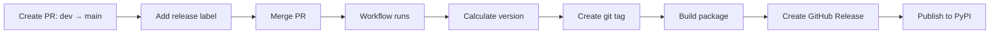

# Release Process

This document describes the complete release process for strapi-kit.

## Overview

strapi-kit uses a **label-based release workflow** with three types of releases:

1. **Production Releases** → PyPI (triggered by merging to `main`)
2. **Test Releases** → TestPyPI (triggered by PRs to `main`)
3. **Dev Releases** → TestPyPI (triggered by pushes to `dev`)

## Current Setup Status

### ✅ What's Working

1. **Automated Workflows**: Three GitHub Actions workflows configured
   - `release.yml` - Production releases to PyPI
   - `publish-testpypi.yml` - Test releases to TestPyPI
   - `dev-release.yml` - Dev releases to TestPyPI

2. **Build Configuration**: Using `hatchling` for package building

3. **Trusted Publishing**: Configured for OIDC authentication (no API tokens needed)

### ⚠️ What Needs Setup

1. **PyPI Trusted Publishing**: Needs to be configured on PyPI.org
2. **TestPyPI Trusted Publishing**: Needs to be configured on test.pypi.org
3. **Dynamic Versioning**: Currently using static version in pyproject.toml

## Version Strategy

### Current Limitation

**Problem**: `pyproject.toml` has static `version = "0.1.0"`, but workflows create dynamic git tags.

**Impact**: When building, the package will always have version 0.1.0 unless we:
1. Update pyproject.toml before building, OR
2. Use dynamic versioning from git tags

### Recommended Solution: Dynamic Versioning

Add `hatch-vcs` for git-based versioning:

```toml
# pyproject.toml
[build-system]
requires = ["hatchling", "hatch-vcs"]
build-backend = "hatchling.build"

[project]
name = "strapi-kit"
dynamic = ["version"]  # Version from git tags
# Remove: version = "0.1.0"

[tool.hatch.version]
source = "vcs"

[tool.hatch.build.hooks.vcs]
version-file = "src/strapi_kit/__version__.py"
```

## Release Types

### 1. Production Release (PyPI)

**Trigger**: Merge PR from `dev` → `main` with release label

**Labels**:
- `release:major` - Breaking changes (1.0.0 → 2.0.0)
- `release:minor` - New features (1.0.0 → 1.1.0)
- `release:patch` - Bug fixes (1.0.0 → 1.0.1)

**Process**:



**Steps**:

1. Create PR from `dev` to `main`
2. Add appropriate release label (`release:major`, `release:minor`, or `release:patch`)
3. Merge the PR
4. Workflow automatically:
   - Calculates new version from latest tag + label
   - Creates and pushes git tag
   - Builds wheel and sdist
   - Creates GitHub Release with notes
   - Publishes to PyPI

**Example**:

```bash
# Current version: v0.1.0
# PR with label: release:minor
# → New version: v0.2.0
```

### 2. Test Release (TestPyPI)

**Trigger**: Create PR from `dev` → `main` with release label

**Process**:

1. Create PR from `dev` to `main`
2. Add release label (`release:major`, `release:minor`, or `release:patch`)
3. Workflow automatically:
   - Calculates version: `{new_version}.dev{pr_number}`
   - Builds package
   - Publishes to TestPyPI
   - Comments on PR with installation instructions

**Version Format**: `0.2.0.dev123` (where 123 is PR number)

**Testing**:

```bash
# Install from TestPyPI
pip install -i https://test.pypi.org/simple/ strapi-kit==0.2.0.dev123

# Test functionality
python -c "import strapi_kit; print(strapi_kit.__version__)"

# Verify
pytest
```

### 3. Dev Release (TestPyPI)

**Trigger**: Push to `dev` branch

**Process**:

1. Push commits to `dev` branch
2. Workflow automatically:
   - Checks for open PR to main with release labels
   - Calculates version: `{new_version}.dev{commit_count}`
   - Builds and publishes to TestPyPI

**Version Format**: `0.2.0.dev5` (where 5 is commit count since last tag)

## Setting Up Trusted Publishing

### PyPI Setup (Production)

1. Go to https://pypi.org/manage/account/publishing/
2. Add a new publisher:
   - **PyPI Project Name**: `strapi-kit`
   - **Owner**: `mehdizare`
   - **Repository name**: `strapi-kit`
   - **Workflow name**: `release.yml`
   - **Environment name**: (leave blank)

3. Save the configuration

### TestPyPI Setup (Testing)

1. Go to https://test.pypi.org/manage/account/publishing/
2. Add a new publisher:
   - **PyPI Project Name**: `strapi-kit`
   - **Owner**: `mehdizare`
   - **Repository name**: `strapi-kit`
   - **Workflow name**: `publish-testpypi.yml`
   - **Environment name**: (leave blank)

3. Add another for dev releases:
   - **Workflow name**: `dev-release.yml`

4. Save the configurations

### First Release Requirements

For the **first release only**, you need to:

1. Create the project on PyPI manually:
   ```bash
   # Build locally
   python -m build

   # Upload manually (one time only)
   twine upload dist/*
   ```

2. After first manual upload, Trusted Publishing will work automatically

**OR** use API tokens for the first release:

```bash
# Create API token on PyPI
# Add as GitHub secret: PYPI_API_TOKEN

# Workflow will use token for first release
# Then switch to Trusted Publishing
```

## Manual Release Process

### Prerequisites

```bash
# Install build tools
uv pip install build twine
```

### Build Package

```bash
# Clean previous builds
rm -rf dist/ build/ *.egg-info

# Build wheel and source distribution
python -m build

# Verify contents
tar -tzf dist/*.tar.gz
unzip -l dist/*.whl
```

### Test Locally

```bash
# Create test environment
python -m venv test-env
source test-env/bin/activate

# Install from wheel
pip install dist/*.whl

# Test
python -c "import strapi_kit; print(strapi_kit.__version__)"
pytest

# Deactivate
deactivate
rm -rf test-env
```

### Upload to TestPyPI

```bash
# Upload to TestPyPI
twine upload --repository testpypi dist/*

# Test installation
pip install -i https://test.pypi.org/simple/ strapi-kit
```

### Upload to PyPI

```bash
# Upload to PyPI (production)
twine upload dist/*

# Verify
pip install strapi-kit
```

## Hotfix Process

For critical bug fixes that need immediate release:

1. Create hotfix branch from `main`:
   ```bash
   git checkout main
   git pull
   git checkout -b hotfix-critical-bug
   ```

2. Make fixes and test thoroughly

3. Create PR from `hotfix-critical-bug` → `main`

4. Add `release:patch` label

5. Merge PR → automatic release

6. Merge back to `dev`:
   ```bash
   git checkout dev
   git merge main
   git push
   ```

## Version Numbering

Follow [Semantic Versioning](https://semver.org/):

- **MAJOR** (X.0.0): Breaking changes
  - API changes that break backward compatibility
  - Removing features
  - Major refactoring

- **MINOR** (0.X.0): New features
  - New functionality
  - New APIs
  - Deprecations (but not removals)

- **PATCH** (0.0.X): Bug fixes
  - Bug fixes
  - Documentation updates
  - Performance improvements (no API changes)

## Troubleshooting

### Build Fails

```bash
# Check build locally
python -m build

# Common issues:
# - Missing __init__.py files
# - Incorrect package structure
# - Syntax errors
```

### Version Mismatch

If built package has wrong version:

```bash
# Check git tags
git tag -l

# Check latest tag
git describe --tags --abbrev=0

# Check built version
tar -xzOf dist/*.tar.gz "*/PKG-INFO" | grep "^Version:"
```

### Upload Fails

```bash
# Check package on PyPI
# https://pypi.org/project/strapi-kit/

# Check Trusted Publishing setup
# https://pypi.org/manage/account/publishing/

# Verify workflow permissions
# - id-token: write (required for OIDC)
# - contents: write (for creating releases)
```

### TestPyPI Installation Issues

TestPyPI doesn't host all dependencies, so use:

```bash
# Install dependencies from PyPI, package from TestPyPI
pip install -i https://test.pypi.org/simple/ \
  --extra-index-url https://pypi.org/simple/ \
  strapi-kit==VERSION
```

## Changelog Management

Update `CHANGELOG.md` before each release:

```markdown
## [0.2.0] - 2025-01-28

### Added
- New feature X
- New API Y

### Changed
- Improved performance of Z

### Fixed
- Bug in component A
```

## Checklist for Releases

Before creating release PR:

- [ ] All tests pass (`make test`)
- [ ] Type checking passes (`make type-check`)
- [ ] Linting passes (`make lint`)
- [ ] Coverage ≥ 85% (`make coverage`)
- [ ] CHANGELOG.md updated
- [ ] Documentation updated
- [ ] Migration guide (if breaking changes)
- [ ] Version number decided (major/minor/patch)

## Further Reading

- [PyPI Trusted Publishing Guide](https://docs.pypi.org/trusted-publishers/)
- [Semantic Versioning](https://semver.org/)
- [Python Packaging Guide](https://packaging.python.org/)
- [Hatch Documentation](https://hatch.pypa.io/)
