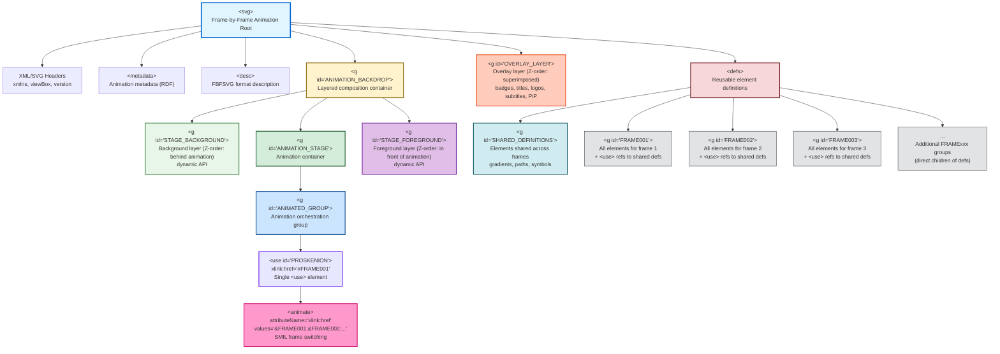

# FBF (Frame-by-Frame) SVG Format

## Overview

The **FBF format** is an optimized SVG structure for frame-by-frame animations created by svg2fbf. It embeds multiple animation frames into a single SVG document using intelligent deduplication, shared element definitions, and SMIL animation timing.

## Key Concepts

### 1. Single-File Animation
Instead of distributing hundreds of separate SVG files, FBF packages all frames into one optimized document.

### 2. Element Deduplication
Identical elements across frames are detected via hashing and stored once in `SHARED_DEFINITIONS`, then referenced using `<use>` elements.

### 3. SMIL Timing
Frame sequencing uses SMIL (Synchronized Multimedia Integration Language) animation to control visibility timing.

### 4. Memory Optimization
Based on research by Concolato et al. (2007) on SVG document fragmentation, FBF structures frames to minimize memory usage during playback.

---

## FBF File Structure



### Structure Components

#### 1. **SVG Root**
- Standard SVG document root with xmlns declarations
- Global viewBox defining canvas dimensions
- SVG version and encoding

#### 2. **metadata & desc**
- Animation metadata (frame count, fps, duration)
- Human-readable description

#### 3. **ANIMATION_BACKDROP** (group)
- **Purpose**: Layered composition container
- **Visibility**: Always visible throughout animation
- **Contains**: STAGE_BACKGROUND, ANIMATION_STAGE, STAGE_FOREGROUND
- **Z-Order**: Provides three customizable layers for dynamic content

#### 4. **STAGE_BACKGROUND** (group)
- **Purpose**: Background layer behind animation
- **Parent**: Nested inside ANIMATION_BACKDROP (before ANIMATION_STAGE)
- **Z-Order**: Behind animation content
- **Dynamic API**: Runtime editing for background SVG elements
- **Resolution**: Same as main viewBox

#### 5. **ANIMATION_STAGE** (group)
- **Purpose**: Animation container
- **Parent**: Nested inside ANIMATION_BACKDROP (between STAGE_BACKGROUND and STAGE_FOREGROUND)
- **Contains**: The ANIMATED_GROUP with frame sequencing
- **Z-Order**: Middle layer

#### 6. **STAGE_FOREGROUND** (group)
- **Purpose**: Foreground layer in front of animation
- **Parent**: Nested inside ANIMATION_BACKDROP (after ANIMATION_STAGE)
- **Z-Order**: In front of animation content
- **Dynamic API**: Runtime editing for foreground SVG elements
- **Resolution**: Same as main viewBox

#### 7. **OVERLAY_LAYER** (group)
- **Purpose**: Overlay layer superimposed on all elements
- **Parent**: Direct child of SVG root (after ANIMATION_BACKDROP)
- **Z-Order**: Superimposed on all other elements
- **Content**: Badges, titles, logos, subtitles, borders, PiP (picture-in-picture)
- **Dynamic API**: Runtime editing for overlay content
- **Resolution**: Same as main viewBox

#### 8. **ANIMATED_GROUP** (group)
- **Purpose**: Orchestrates frame-by-frame animation
- **Parent**: Nested inside ANIMATION_STAGE
- **Contains**: PROSKENION staging area
- **Function**: SMIL animation timing and sequencing

#### 9. **PROSKENION** (`<use>` element)
- **Type**: Single `<use>` element with `id="PROSKENION"`
- **Purpose**: References the currently visible frame
- **Initial State**: `xlink:href="#FRAME001"` (points to first frame)
- **Animation**: Contains `<animate>` child that switches frames
- **Origin**: Greek theatrical term (προσκήνιον) for the stage area in front of the backdrop

#### 10. **defs** (definitions)
Contains all reusable elements organized as follows:

##### a) **SHARED_DEFINITIONS** (group)
- **ID**: `<g id="SHARED_DEFINITIONS">`
- **Purpose**: Elements used by multiple frames
- **Content**:
  - Gradients (linear, radial)
  - Patterns
  - Paths used across frames
  - Symbols
  - Filters
- **Access**: Referenced via `<use xlink:href="#element-id">`
- **Optimization**: Dramatically reduces file size by avoiding duplication

##### b) **Frame Groups** (direct children of defs)
- **IDs**: `<g id="FRAME001">`, `<g id="FRAME002">`, etc.
- **Naming**: Uppercase "FRAME" + zero-padded numbers (001, 002, ...)
- **Purpose**: Each group contains all elements for one animation frame
- **Content**:
  - Elements unique to that frame
  - `<use>` references to SHARED_DEFINITIONS
- **Note**: Frame groups are **direct children of `<defs>`**, not wrapped in a container
- **Visibility**: Only one frame displayed at a time, controlled by PROSKENION's `<animate>` element

---

## Processing Pipeline

```mermaid
graph LR
    INPUT["Input SVG Frames<br/>frame001.svg<br/>frame002.svg<br/>frame003.svg<br/>..."]

    LOAD["Load & Parse<br/>Read all SVG files<br/>Parse XML structure"]

    OPTIMIZE["Optimize Elements<br/>Path optimization<br/>Coordinate precision<br/>Remove redundancy"]

    DEDUPE["Deduplication<br/>Hash elements<br/>Identify duplicates<br/>across frames"]

    GRADIENT["Gradient Merge<br/>Detect identical gradients<br/>Merge into shared defs"]

    ORGANIZE["Organize Structure<br/>Shared → SHARED_DEFINITIONS<br/>Unique → frame groups<br/>Static → BACKDROP"]

    ANIMATE["Add Animation<br/>SMIL timing<br/>Frame sequencing<br/>&lt;use&gt; references"]

    OUTPUT["Output FBF SVG<br/>Single optimized file<br/>with embedded frames"]

    INPUT --> LOAD
    LOAD --> OPTIMIZE
    OPTIMIZE --> DEDUPE
    DEDUPE --> GRADIENT
    GRADIENT --> ORGANIZE
    ORGANIZE --> ANIMATE
    ANIMATE --> OUTPUT

    style INPUT fill:#e1f5ff,stroke:#0366d6,stroke-width:2px
    style LOAD fill:#d4edda,stroke:#155724,stroke-width:2px
    style OPTIMIZE fill:#fff3cd,stroke:#856404,stroke-width:2px
    style DEDUPE fill:#cce5ff,stroke:#004085,stroke-width:2px
    style GRADIENT fill:#e7e7ff,stroke:#6610f2,stroke-width:2px
    style ORGANIZE fill:#d1ecf1,stroke:#0c5460,stroke-width:2px
    style ANIMATE fill:#f8d7da,stroke:#721c24,stroke-width:2px
    style OUTPUT fill:#d4edda,stroke:#155724,stroke-width:3px
```



### Processing Steps

1. **Load & Parse**: Read all input SVG files and parse XML structure
2. **Optimize Elements**:
   - Path data optimization (precision control)
   - Coordinate rounding to specified decimal places
   - Remove redundant attributes
3. **Deduplication**:
   - Hash all SVG elements
   - Identify identical elements across frames
   - Build shared element library
4. **Gradient Merge**:
   - Detect identical gradients with different IDs
   - Merge duplicates into single definitions
5. **Organize Structure**:
   - Shared elements → `SHARED_DEFINITIONS`
   - Unique elements → individual `frame` groups
   - Static elements → `BACKDROP`
6. **Add Animation**:
   - Generate SMIL timing for each frame
   - Create `<use>` references in PROSKENION
   - Set visibility keyframes
7. **Output**: Write optimized single-file FBF SVG

---

## Example FBF Structure

```xml
<svg xmlns="http://www.w3.org/2000/svg"
     xmlns:xlink="http://www.w3.org/1999/xlink"
     viewBox="0 0 800 600"
     width="100%" height="100%"
     preserveAspectRatio="xMidYMid meet">

  <metadata>
    <!-- RDF metadata -->
  </metadata>

  <desc>Frame-by-frame animation with 3 frames at 12 fps</desc>

  <!-- Layered composition container -->
  <g id="ANIMATION_BACKDROP">

    <!-- Background layer (Z-order: behind animation) -->
    <g id="STAGE_BACKGROUND">
      <rect width="800" height="600" fill="#fff"/>
    </g>

    <!-- Animation container -->
    <g id="ANIMATION_STAGE">

      <!-- Animation orchestration -->
      <g id="ANIMATED_GROUP">

        <!-- Single <use> element that references frames -->
        <use id="PROSKENION" xlink:href="#FRAME001">
          <!-- SMIL animation switches xlink:href between frames -->
          <animate attributeName="xlink:href"
                   begin="0s"
                   dur="0.25s"
                   calcMode="discrete"
                   repeatCount="indefinite"
                   values="#FRAME001;#FRAME002;#FRAME003"/>
        </use>

      </g>
    </g>

    <!-- Foreground layer (Z-order: in front of animation) -->
    <g id="STAGE_FOREGROUND">
      <!-- Empty for dynamic content -->
    </g>

  </g>

  <!-- Overlay layer (Z-order: superimposed on all) -->
  <g id="OVERLAY_LAYER">
    <!-- Empty for badges, titles, logos, subtitles, borders, PiP -->
  </g>

  <!-- All definitions -->
  <defs>

    <!-- Shared elements across frames -->
    <g id="SHARED_DEFINITIONS">
      <linearGradient id="grad1">
        <stop offset="0%" stop-color="#ff0"/>
        <stop offset="100%" stop-color="#f00"/>
      </linearGradient>
      <path id="shared-path-abc123" d="M10,10 L50,50"/>
    </g>

    <!-- Frame 1 (direct child of defs) -->
    <g id="FRAME001">
      <circle cx="100" cy="100" r="50" fill="url(#grad1)"/>
      <use xlink:href="#shared-path-abc123"/>
    </g>

    <!-- Frame 2 (direct child of defs) -->
    <g id="FRAME002">
      <circle cx="120" cy="100" r="50" fill="url(#grad1)"/>
      <use xlink:href="#shared-path-abc123"/>
      <rect x="10" y="10" width="30" height="30"/>
    </g>

    <!-- Frame 3 (direct child of defs) -->
    <g id="FRAME003">
      <circle cx="140" cy="100" r="50" fill="url(#grad1)"/>
      <use xlink:href="#shared-path-abc123"/>
    </g>

  </defs>

</svg>
```

---

## Optimization Benefits

### File Size Reduction
- **Without deduplication**: 100 frames × 50KB = 5000KB
- **With FBF deduplication**: ~500KB (90% reduction typical)

### Memory Efficiency
- Shared elements loaded once
- Browser can optimize `<use>` references
- SMIL animation requires minimal JavaScript overhead

### Rendering Performance
- Single DOM tree
- No HTTP requests for additional frames
- Hardware-accelerated SMIL in modern browsers

---

## SMIL Animation Timing

Frame visibility is controlled using a single SMIL `<animate>` element that switches the `xlink:href` attribute of the PROSKENION `<use>` element:

```xml
<use id="PROSKENION" xlink:href="#FRAME001">
  <animate attributeName="xlink:href"
           begin="0s"
           dur="10.0s"          <!-- Total duration: (1/fps) * num_frames -->
           calcMode="discrete"   <!-- No interpolation between values -->
           repeatCount="1"       <!-- Play once (or "indefinite" for loop) -->
           values="#FRAME001;#FRAME002;#FRAME003;#FRAME004;#FRAME005"/>
</use>
```

**Key attributes:**
- `attributeName="xlink:href"`: Animates which frame is referenced
- `calcMode="discrete"`: No interpolation (instant frame switching)
- `dur`: Total animation duration = (1/fps) × number_of_frames
- `values`: Semicolon-separated list of frame IDs in playback order

### Animation Types

| Type | Behavior | SMIL Configuration |
|------|----------|-------------------|
| `once` | Play once, stop on last frame | `repeatCount="1"` |
| `loop` | Loop forever | `repeatCount="indefinite"` |
| `pingpong_loop` | Forward → backward → repeat | Mirror frames + `indefinite` |
| `play_on_click` | Start on click event | `begin="click"` |

---

## Technical Specifications

### Coordinate Precision
- **Fixed precision**: 28 significant digits (maximum precision)
- **Internal handling**: Precision is automatically managed by svg2fbf and not user-configurable
- **Technical details**: Uses 28-digit precision for all coordinate values to ensure lossless conversion and optimal accuracy

### ViewBox Handling
- Automatically adjusts for mixed-size frames
- Preserves aspect ratio with `preserveAspectRatio="xMidYMid meet"`
- Handles negative coordinates correctly

### Element Hashing
Algorithm (adapted from Scour):
1. Serialize element to canonical string
2. Include all attributes (sorted)
3. SHA-256 hash for duplicate detection
4. Elements with identical hashes → shared definition

---

## Browser Compatibility

FBF SVG files work in all modern browsers supporting:
- SVG 1.1+ (all major browsers since 2011)
- SMIL Animation (deprecated in Chrome but still functional)
- SVG `<use>` element (universal support)

### Fallback Considerations
For browsers without SMIL support, consider:
- CSS animation polyfill
- JavaScript-based frame sequencing
- Converting to CSS animations via post-processing

---

## References

### Academic Research
**Concolato, C., Le Feuvre, J., & Moissinac, J. C. (2007).**
*Timed-fragmentation of SVG documents to control the playback memory usage.*
ACM Symposium on Document Engineering, pp. 121-124.
DOI: https://dl.acm.org/doi/abs/10.1145/1284420.1284453

### Code Attribution
Optimization algorithms adapted from **Scour Project**
https://github.com/scour-project/scour

### Standards
- **SVG Specification**: https://www.w3.org/TR/SVG2/
- **SMIL Animation**: https://www.w3.org/TR/smil-animation/

---

## Glossary

**PROSKENION** (προσκήνιον)
: Greek theatrical term for the stage area in front of the backdrop. In FBF, it's the staging container where frame `<use>` references are placed with SMIL timing.

**Deduplication**
: Process of identifying and removing duplicate elements across frames by hashing, storing shared elements once in definitions.

**SMIL** (Synchronized Multimedia Integration Language)
: W3C standard for multimedia synchronization, used in SVG for declarative animations.

**Frame-by-Frame (FBF)**
: Animation technique where each frame is individually defined, as opposed to interpolated/tweened animation.

---

*For implementation details, see the svg2fbf source code and [README.md](../README.md)*
