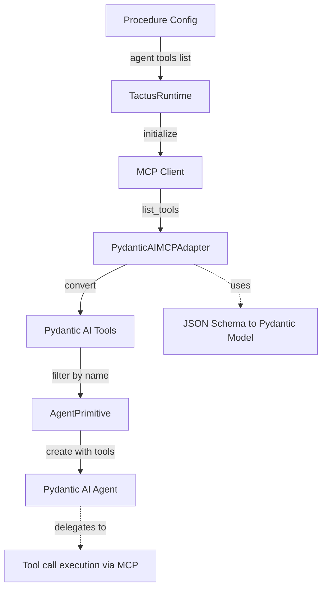
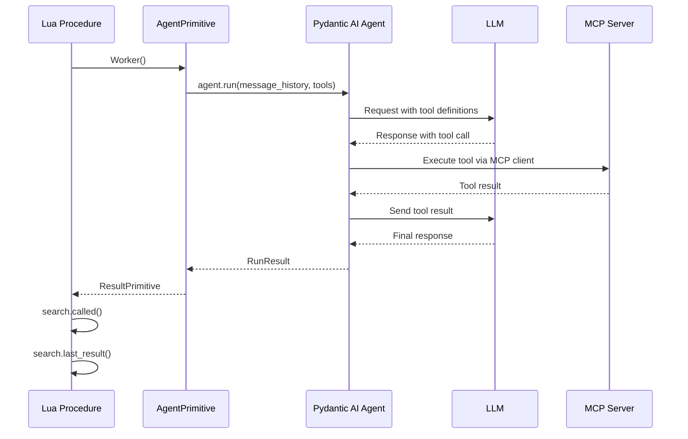

# Tactus Tool Roadmap

## ✅ COMPLETED: Toolset Architecture Migration (December 2024)

**Major architectural update:** Tactus now uses Pydantic AI's composable toolset system throughout.

### Breaking Change

**The `tools` parameter has been REMOVED and replaced with unified toolset architecture.**

**Before (deprecated):**
```lua
agent("worker", {
    tools = {"done"}  -- ❌ NO LONGER SUPPORTED
})
```

**After:**
```lua
-- Define completion tool explicitly (no built-in done tool)
tool("done", {
    description = "Signal completion of the task",
    parameters = {
        reason = {type = "string", required = true, description = "Completion message"}
    }
}, function(args)
    return "Done: " .. args.reason
end)

agent("worker", {
    tools = {"done"}  -- References the explicitly defined tool above
})

-- Or explicitly control toolsets
agent("analyst", {
    tools = {}  -- Explicitly no tools
})
```

### Key Improvements

1. **Unified Architecture**: Both MCP servers and plugin tools use `FunctionToolset`
2. **Explicit Tools**: All tools (including completion tools like "done") must be explicitly defined
3. **Composability**: Foundation for filtering, prefixing, and combining toolsets
4. **Cleaner Code**: Consistent toolset handling throughout the runtime
5. **Multi-Provider Support**: Validated with OpenAI, AWS Bedrock (Claude, Llama, Nova models)

### Migration Guide

- **Define tools explicitly**: Use `tool("done", {...}, handler)` to define a completion tool
- **Reference in toolsets**: Use `tools = {"done"}` to give agents access to the tool
- **For no tools**: Use `tools = {}` for explicitly no tools (e.g., models without tool support)
- **No built-in done tool**: You must explicitly define any completion/done tool you need
- All example files have been migrated
- Tests passing with new architecture

### Provider Support

**Validated Providers:**
- ✅ **OpenAI**: GPT-4o, GPT-4o-mini, GPT-3.5-turbo with tools and streaming
- ✅ **AWS Bedrock - Anthropic**: Claude 4.5 Haiku with tools and streaming
- ✅ **AWS Bedrock - Meta**: Llama 3.1 8B, Llama 3.2 3B (no tool support, streaming disabled)
- ✅ **AWS Bedrock - Amazon**: Nova Micro, Nova Lite (no tool support, streaming disabled)

**See**: [examples/07-basics-bedrock.tac](../examples/07-basics-bedrock.tac), [examples/08-basics-models.tac](../examples/08-basics-models.tac)

### Implementation

- **Built-in toolset**: [tactus/core/runtime.py:596-614](tactus/core/runtime.py:596)
- **PluginLoader toolsets**: [tactus/adapters/plugins.py:41-70](tactus/adapters/plugins.py:41)
- **ToolsetPrimitive**: [tactus/primitives/toolset.py](tactus/primitives/toolset.py:1) (foundation for future DSL features)

---

## ✅ COMPLETED: Advanced Toolset Features (December 2024)

**Full implementation of Pydantic AI toolset composition features.**

### Config-Defined Toolsets

Define reusable toolsets in YAML configuration:

```yaml
# In .tactus/config.yml or sidecar .tac.yml
toolsets:
  # Plugin toolset from local Python files
  financial:
    type: plugin
    paths:
      - "./tools/financial"

  # Filtered toolset (only specific tools)
  search_only:
    type: filtered
    source: web
    pattern: "^search_"

  # Combined toolset (merge multiple sources)
  all_tools:
    type: combined
    sources:
      - financial
      - search_only

# Note: There is no built-in "done" toolset. Define completion tools explicitly via tool().
# default_toolsets can reference any toolsets you've defined in config or via tool() in .tac files.
```

**Supported Toolset Types:**
- `plugin` - Load from local Python files
- `mcp` - Reference MCP server by name
- `filtered` - Filter tools by regex pattern
- `combined` - Merge multiple toolsets
- `builtin` - Custom built-in toolsets (future)

### Toolset Expressions

Compose and transform toolsets in agent definitions:

```lua
agent("analyst", {
    provider = "openai",
    model = "gpt-4o",
    tools = {
        -- Simple reference
        "financial",

        -- Filter to specific tools (include)
        {name = "plexus", include = {"score_info", "evaluation_run"}},

        -- Exclude specific tools
        {name = "web", exclude = {"admin_panel"}},

        -- Add prefix for namespacing
        {name = "mcp_server", prefix = "mcp_"},

        -- Rename tools
        {name = "tools", rename = {old_name = "new_name"}},

        -- Completion tool (must be explicitly defined via tool())
        "done"
    }
})
```

**Expression Operations:**
- **Include filtering**: `{name = "x", include = ["tool1", "tool2"]}`
- **Exclude filtering**: `{name = "x", exclude = ["admin"]}`
- **Prefixing**: `{name = "x", prefix = "namespace_"}`
- **Renaming**: `{name = "x", rename = {old = "new"}}`

### Default Toolsets

Configure directory-wide defaults via config cascade:

```yaml
# examples/.tactus/config.yml
default_toolsets:
  - done
```

**Behavior:**
- **No toolsets key** → Agent gets `default_toolsets`
- **Empty toolsets** `[]` → Agent gets NO tools (explicitly)
- **Specified toolsets** → Agent gets ONLY what's specified (no defaults)

### Directory-Wide Configuration

The config cascade system loads `.tactus/config.yml` from parent directories:

```
examples/
├── .tactus/
│   └── config.yml          # Default toolsets for all examples
├── 01-basic.tac
├── 02-agent.tac
└── subdirectory/
    ├── .tactus/
    │   └── config.yml      # Overrides for this subdirectory
    └── 03-advanced.tac
```

**Priority order (high to low):**
1. CLI arguments
2. Sidecar config (`procedure.tac.yml`)
3. Local directory config (`.tactus/config.yml` in procedure's dir)
4. Parent directory configs (walk up tree)
5. Root config (`.tactus/config.yml` in cwd)
6. Environment variables

### Toolset Registry

All toolsets are registered by name in the runtime:

```python
runtime.toolset_registry = {
    'done': <FunctionToolset>,           # From explicit tool() definition
    'plugin': <FunctionToolset>,         # From tool_paths
    'test_server': <MCPToolset>,         # From MCP server
    'financial': <FunctionToolset>,      # Config-defined
}
```

**Resolution:**
- `runtime.resolve_toolset(name)` → Returns toolset or None
- Used by expression parser and ToolsetPrimitive
- Enables toolset reuse across agents

### Examples

**Complete example:** [examples/16-feature-toolsets-advanced.tac](../examples/16-feature-toolsets-advanced.tac)

**Config example:** [examples/16-feature-toolsets-advanced.tac.yml](../examples/16-feature-toolsets-advanced.tac.yml)

**Directory config:** [examples/.tactus/config.yml](../examples/.tactus/config.yml)

### Implementation Details

**Core files:**
- **Toolset registry**: [tactus/core/runtime.py:140-141](tactus/core/runtime.py:140)
- **Toolset initialization**: [tactus/core/runtime.py:584-666](tactus/core/runtime.py:584)
- **Config parsing**: [tactus/core/runtime.py:668-765](tactus/core/runtime.py:668)
- **Expression parsing**: [tactus/core/runtime.py:767-838](tactus/core/runtime.py:767)
- **Agent setup**: [tactus/core/runtime.py:867-883](tactus/core/runtime.py:867)

**Key features:**
- ✅ Toolset registry with name-based resolution
- ✅ Config-defined toolsets (plugin, mcp, filtered, combined)
- ✅ Default toolsets from config
- ✅ Toolset expressions (include, exclude, prefix, rename)
- ✅ Combined toolsets merging multiple sources
- ✅ Per-agent toolset customization
- ✅ Directory-wide config cascade

---

This document outlines Tactus's tool support strategy, current implementation status, and planned features. Our goal is to provide a thin, elegant layer over Pydantic AI's comprehensive tool ecosystem while maintaining Tactus's Lua-first design philosophy.

## Design Philosophy

**Thin Layer Principle**: Tactus tools should be a minimal abstraction over Pydantic AI's tool features. Anything Pydantic AI supports, Tactus should support with minimal additional complexity.

**Lua-First API**: Tool configuration and usage should feel natural in Lua while mapping cleanly to Pydantic AI's Python API.

**MCP-Native**: Model Context Protocol (MCP) servers are first-class citizens in Tactus, enabling seamless integration with external tool ecosystems.

## Current Implementation Status

**Summary**: Several major features have been implemented with automated unit tests, but require manual testing and user validation before being considered production-ready. Focus should be on testing existing features rather than adding new ones.

### ✅ Implemented and Tested

#### 1. Per-Turn Tool Control
**Status**: ✅ Complete

Dynamic control of tool availability for individual agent turns:

```lua
repeat
    -- Main turn: agent has all tools
    Researcher()

    -- If tool was called, summarize with NO tools
    if search.called() then
        Researcher({
            message = "Summarize the search results",
            tools = {}  -- No tools for this turn
        })
    end
until done.called()
```

**Implementation**:
- `Agent(opts)` accepts optional table with `tools`, `message`, and model parameter overrides
- Uses Pydantic AI's `agent.override(tools=...)` context manager
- Helper methods: `_get_tools_for_turn()`, `_filter_tools_by_name()`

**Use Cases**:
- Tool result summarization (prevent recursive tool calls)
- Stage-specific tool access
- Injected guidance with restricted capabilities

**Example**: [`examples/14-feature-per-turn-tools.tac`](../examples/14-feature-per-turn-tools.tac)

#### 2. Tool Call Tracking
**Status**: ✅ Complete

Track which tools were called and access their results:

```lua
if search.called() then
    local result = search.last_result()
    local call_info = search.last_call()
    -- call_info.args, call_info.result
end
```

**Implementation**: `ToolPrimitive` ([`tactus/primitives/tool.py`](../tactus/primitives/tool.py))

### 🚧 Implemented but Needs Manual Testing

**Status Note**: The following features have been implemented with automated unit tests, but require manual testing and user validation in real-world scenarios.

#### 3. Local Python Plugin Tools
**Status**: 🚧 Implemented, Needs Manual Testing  
**Priority**: High

Enable loading Python functions from local directories as tools without requiring MCP servers.

**Design Philosophy**: Convention over configuration - any Python function in specified directories is automatically loaded as a tool.

**Configuration** (via config cascade - see Configuration section):
```yaml
# In .tactus/config.yml or procedure.tac.yml
tool_paths:
  - "./tools"
  - "./custom_tools/helpers.py"
```

**Tool Definition** (simple Python function):
```python
# tools/my_tools.py
def calculate_mortgage(principal: float, rate: float, years: int) -> float:
    """
    Calculate monthly mortgage payment.
    
    Args:
        principal: Loan amount in dollars
        rate: Annual interest rate (as percentage, e.g., 5.5)
        years: Loan term in years
    
    Returns:
        Monthly payment amount
    """
    monthly_rate = rate / 100 / 12
    num_payments = years * 12
    payment = principal * (monthly_rate * (1 + monthly_rate)**num_payments) / \
              ((1 + monthly_rate)**num_payments - 1)
    return round(payment, 2)
```

**Usage in DSL**:
```lua
agent("financial_advisor", {
    provider = "openai",
    model = "gpt-4o",
    tools = {calculate_mortgage, done}
})
```

**Implementation**:
- `PluginLoader` class in `tactus/adapters/plugins.py`
- Scans directories for `.py` files
- Uses `importlib` for dynamic imports
- Uses `inspect` to find public functions
- Wraps functions in `pydantic_ai.Tool`
- Integrates with `TactusRuntime` alongside MCP tools and Lua-defined tools

**Testing Status**:
- ✅ Unit tests: `tests/adapters/test_plugins.py` (10 tests, all passing)
- ✅ Example tools: `examples/tools/` (search, calculations, data_analysis)
- ✅ Example procedure: `examples/15-feature-local-tools.tac`
- 🚧 **Needs**: Manual end-to-end testing with real LLM calls
- 🚧 **Needs**: User validation with real-world tool definitions
- 🚧 **Needs**: Testing with complex tool signatures (async, optional params, etc.)

**Benefits**:
- Zero boilerplate - just write a Python function
- Type hints become JSON Schema automatically
- Docstrings become tool descriptions for the LLM
- No server setup required
- Fast iteration during development
- Works offline

**Comparison to MCP**:
- **Local Plugins**: Lightweight, simple, fast, good for project-specific tools
- **MCP Servers**: Heavyweight, reusable across projects, good for shared tool ecosystems

#### 4. Configuration Cascade System
**Status**: 🚧 Implemented, Needs Manual Testing  
**Priority**: High

Cascading configuration system that supports sidecar config files, directory-level configs, and root config with clear priority ordering.

**Configuration Cascade (Priority: High to Low)**:
1. CLI Arguments
2. Sidecar Config (`procedure.tac.yml`)
3. Local Directory Config (`.tactus/config.yml` in procedure's directory)
4. Parent Directory Configs (walk up tree)
5. Root Config (`.tactus/config.yml` in cwd)
6. Environment Variables

**Sidecar Config Example** (`examples/mortgage.tac.yml`):
```yaml
# Procedure-specific configuration
tool_paths:
  - "./examples/tools"
default_model: "gpt-4o-mini"
```

**Implementation**:
- `ConfigManager` class in `tactus/core/config_manager.py`
- Sidecar file discovery (`procedure.tac.yml` or `procedure.yml`)
- Directory tree walking for parent configs
- Deep merging with list extension
- Environment variable fallback

**Testing Status**:
- ✅ Unit tests: `tests/core/test_config_manager.py` (17 tests, all passing)
- ✅ Example sidecar: `examples/15-feature-local-tools.tac.yml`
- ✅ Documentation: `docs/CONFIGURATION.md`
- 🚧 **Needs**: Manual testing with real procedures
- 🚧 **Needs**: Validation of merge behavior in complex scenarios
- 🚧 **Needs**: User feedback on configuration ergonomics

**Security Note**: Sidecar configs are NOT sandboxed - they can contain file paths and command execution. Only use trusted sidecar files.

#### 5. Basic Function Tools (Legacy)
**Status**: 🚧 Code exists, never tested

Tools are registered in agent definitions and automatically converted to Pydantic AI `Tool` instances:

```lua
-- Define tools explicitly
tool("done", {
    description = "Signal completion of the task",
    parameters = {reason = {type = "string", required = true}}
}, function(args) return "Done: " .. args.reason end)

agent("worker", {
    provider = "openai",
    model = "gpt-4o",
    system_prompt = "You are a helpful assistant",
    tools = {"search", "analyze", "done"}  -- All must be explicitly defined
})
```

**Implementation**:
- Tools loaded from MCP server via `PydanticAIMCPAdapter` ([`tactus/adapters/mcp.py`](../tactus/adapters/mcp.py))
- Tools defined via `tool()` in Lua are converted to Pydantic AI toolsets
- Tool call tracking via `ToolPrimitive` ([`tactus/primitives/tool.py`](../tactus/primitives/tool.py))

**Pydantic AI Features Used**:
- `Tool` class for tool definitions
- `@agent.tool` and `@agent.tool_plain` decorators (internal)
- Automatic argument validation
- Tool call tracking in message history

**What's Missing**:
- No end-to-end test with real MCP server
- No example file demonstrating MCP tool usage
- Unknown: Does tool execution actually work?
- Unknown: Does JSON Schema conversion work correctly?

#### 3. MCP Server Integration
**Status**: 🚧 Implemented, Needs Real-World Validation  
**Priority**: Critical

Tactus loads tools from MCP servers and makes them available to agents using Pydantic AI's native `MCPServerStdio`:

```lua
-- Tools from MCP server are automatically available
agent("worker", {
    provider = "openai",
    model = "gpt-4o",
    tools = {
        "plexus_score_info",      -- From plexus MCP server
        "filesystem_read_file",   -- From filesystem MCP server
        "done"
    }
})
```

**Implementation**:
- Uses Pydantic AI's native `MCPServerStdio` for stdio transport
- `MCPServerManager` handles multiple server connections
- Automatic tool prefixing with server name (e.g., `plexus_score_info`)
- Environment variable substitution (`${VAR}` syntax)
- Tool call tracking via `process_tool_call` middleware
- Clean lifecycle management with `AsyncExitStack`

**Configuration** (`.tactus/config.yml`):
```yaml
mcp_servers:
  plexus:
    command: "python"
    args: ["-m", "plexus.mcp"]
    env:
      PLEXUS_ACCOUNT_KEY: "${PLEXUS_ACCOUNT_KEY}"
      PLEXUS_API_KEY: "${PLEXUS_API_KEY}"
```

**Features**:
- Multiple MCP servers per procedure
- Automatic tool namespacing (prevents conflicts)
- Stdio transport (command + args)
- Environment variable support
- Proper connection lifecycle management

**Automated Testing Status**:
- ✅ Unit tests: `tests/test_mcp_integration.py` (4 tests, all passing)
- ✅ Integration with test MCP server: `tests/fixtures/test_mcp_server.py` (FastMCP)
- ✅ Example procedures: `examples/40-mcp-test.tac`, `examples/41-mcp-simple.tac`
- ✅ Tool prefixing verified in tests
- ✅ Environment variable substitution tested
- ✅ Connection lifecycle management verified

**🚨 Critical: Real-World Validation Needed**:
- ❌ **NOT YET TESTED** with real Plexus MCP server
- ❌ **NOT YET TESTED** with other production MCP servers (filesystem, github, etc.)
- ❌ **NOT YET TESTED** with multiple real MCP servers simultaneously
- ❌ **NOT YET VALIDATED** by users in real workflows
- ❌ **NOT YET TESTED** with complex tool signatures, large responses, or error cases

**What Needs Real Testing**:
1. **Plexus MCP Server** (Primary Use Case)
   - Connect to actual Plexus MCP server
   - Test all Plexus tools (score_info, evaluation_run, feedback_analysis, etc.)
   - Verify tool namespacing works correctly (`plexus_score_info`)
   - Test with real API keys and authentication
   - Validate tool call results and error handling

2. **Other Production MCP Servers**
   - Filesystem MCP server
   - GitHub MCP server
   - Any other commonly used MCP servers
   - Verify compatibility with different MCP server implementations

3. **Multiple Servers Simultaneously**
   - Configure 2+ real MCP servers in same procedure
   - Verify tool namespacing prevents conflicts
   - Test connection lifecycle (all connect/disconnect properly)
   - Validate performance with multiple servers

4. **Edge Cases and Error Handling**
   - Server connection failures
   - Tool execution errors
   - Large tool responses
   - Timeout scenarios
   - Invalid tool schemas

**Current Limitations**:
- Only supports function tools from MCP (not prompts or resources yet)
- Only stdio transport (no HTTP/SSE yet)

---

## Testing Priorities

### 🧪 Manual Testing Needed

The following features have automated unit tests but require **real-world validation** with actual tools, servers, and user workflows:

1. **Local Python Plugin Tools** - Test with real LLM calls, complex tool signatures, async functions
2. **Configuration Cascade** - Validate merge behavior, sidecar discovery, priority ordering
3. **MCP Server Integration** - **CRITICAL**: Test with real MCP servers (Plexus, filesystem, etc.)

**MCP Server Testing Checklist** (Highest Priority):
- [ ] **Connect to real Plexus MCP server** with actual credentials
- [ ] **Test all Plexus tools** in real workflows (score_info, evaluation_run, feedback_analysis, etc.)
- [ ] **Verify tool namespacing** works correctly (`plexus_score_info` vs `test_server_greet`)
- [ ] **Test multiple real MCP servers** simultaneously (Plexus + filesystem, etc.)
- [ ] **Validate error handling** with real API errors, connection failures, timeouts
- [ ] **Test with complex tool signatures** (nested objects, arrays, optional params)
- [ ] **Performance testing** with high-volume tool calls
- [ ] **User feedback** on ergonomics, documentation, and real-world usage patterns

**General Testing Checklist**:
- [ ] Run example procedures with local plugin tools
- [ ] Test configuration cascade with multiple config files
- [ ] Validate tool discovery and loading
- [ ] Test error handling (missing tools, invalid configs, etc.)
- [ ] User feedback on ergonomics and documentation
- [ ] Performance testing with many tools/configs

## Planned Features

### 🚧 High Priority

#### 1. Manual Testing and Validation
**Status**: 🚧 In Progress  
**Priority**: Critical

Complete manual testing and user validation of implemented features before adding new functionality.

**What Needs Testing**:
1. Local Python Plugin Tools
   - Real-world tool definitions
   - Complex function signatures (async, optional params, type unions)
   - Tool discovery and loading in various directory structures
   - Integration with agent execution

2. Configuration Cascade
   - Sidecar config discovery and loading
   - Config merging behavior (lists, dicts, priority)
   - Directory tree walking
   - Error handling for invalid configs

3. MCP Server Integration (**CRITICAL PRIORITY**)
   - **Real Plexus MCP server** with actual credentials and tools
   - Other production MCP servers (filesystem, github, etc.)
   - Multiple servers simultaneously
   - Tool namespacing and conflict resolution
   - Connection lifecycle management
   - Real-world error scenarios and edge cases
   - Performance with production workloads

**Deliverables**:
- Manual test results and bug reports
- User feedback and ergonomics improvements
- Updated documentation based on real usage
- Performance benchmarks

#### 2. Real-World MCP Server Validation
**Status**: 🚧 In Progress (Automated Tests Complete, Real Servers Pending)  
**Priority**: Critical

**Current State**: MCP integration is implemented and passes all automated tests with a test MCP server. However, it has **NOT been validated** with real production MCP servers.

**What's Been Tested** (Automated):
- ✅ Connection to test MCP server (FastMCP)
- ✅ Tool discovery and loading
- ✅ Tool prefixing (`test_server_greet` → `test_server_greet`)
- ✅ Tool execution end-to-end
- ✅ Environment variable substitution
- ✅ Connection lifecycle management
- ✅ Multiple server support (in tests)

**What Needs Real-World Testing**:
1. **Plexus MCP Server** (Primary Priority)
   - Connect to actual Plexus MCP server with real credentials
   - Test all Plexus tools in real workflows
   - Verify tool names work correctly (`plexus_score_info`, `plexus_evaluation_run`, etc.)
   - Test with real API responses and data
   - Validate error handling with real API errors

2. **Other Production MCP Servers**
   - Filesystem MCP server (`@modelcontextprotocol/server-filesystem`)
   - GitHub MCP server (`@modelcontextprotocol/server-github`)
   - Any other MCP servers in use

3. **Production Scenarios**
   - Multiple real MCP servers in same procedure
   - Long-running procedures with MCP tools
   - High-volume tool calls
   - Network issues and retries

**Deliverables**:
- [ ] Working example with real Plexus MCP server
- [ ] User validation and feedback
- [ ] Bug reports and fixes for real-world issues
- [ ] Performance benchmarks
- [ ] Updated documentation based on real usage

#### 2. LangChain Tool Integration
**Status**: ❌ Not Started  
**Priority**: High

Enable use of LangChain's extensive tool library.

**Pydantic AI Support**: `tool_from_langchain()` and `LangChainToolset`

**Proposed Tactus API**:

```lua
-- Option A: Import LangChain tools in procedure config
langchain_tools = {
    "DuckDuckGoSearchRun",
    "WikipediaQueryRun"
}

agent("researcher", {
    provider = "openai",
    model = "gpt-4o",
    tools = {"search", "done"},  -- MCP tools
    langchain_tools = {"DuckDuckGoSearchRun"}  -- LangChain tools
})
```

**Implementation Plan**:
1. Add `LangChainAdapter` similar to `PydanticAIMCPAdapter`
2. Support `langchain_tools` field in agent config
3. Convert LangChain tools to Pydantic AI format at runtime
4. Document installation requirements (`langchain-community`)

**Benefits**:
- Access to 100+ pre-built tools
- Integration with existing LangChain ecosystems
- Rapid prototyping with community tools

**References**: 
- [Pydantic AI LangChain Tools](https://ai.pydantic.dev/third-party-tools/#langchain-tools)
- [LangChain Tool Library](https://python.langchain.com/docs/integrations/tools/)

#### 3. Built-in Tool Support
**Status**: ❌ Not Started  
**Priority**: High

Support Pydantic AI's built-in tools (web search, code execution, image generation, etc.).

**Pydantic AI Support**: `WebSearchTool`, `CodeExecutionTool`, `ImageGenerationTool`, `WebFetchTool`, `MemoryTool`, `MCPServerTool`

**Proposed Tactus API**:

```lua
agent("researcher", {
    provider = "openai",
    model = "gpt-4o",
    tools = {"done"},
    
    -- Built-in tools provided by model provider
    builtin_tools = {
        {
            type = "web_search",
            search_context_size = "high",
            user_location = {
                city = "San Francisco",
                country = "US"
            }
        },
        {
            type = "code_execution"
        }
    }
})
```

**Implementation Plan**:
1. Add `builtin_tools` field to agent config
2. Parse builtin tool configurations
3. Create Pydantic AI builtin tool instances
4. Pass to `Agent(builtin_tools=[...])`
5. Handle provider-specific limitations

**Supported Tools**:
- `web_search` - Search the web (OpenAI Responses, Anthropic, Google, Groq)
- `code_execution` - Execute code securely (OpenAI, Anthropic, Google)
- `image_generation` - Generate images (OpenAI Responses, Google)
- `web_fetch` - Fetch URL contents (Anthropic, Google)
- `memory` - Persistent memory (Anthropic)
- `mcp_server` - Remote MCP servers (OpenAI Responses, Anthropic)

**References**: [Pydantic AI Built-in Tools](https://ai.pydantic.dev/builtin-tools/)

#### 4. Common Tool Library
**Status**: ❌ Not Started  
**Priority**: Medium

Integrate Pydantic AI's common tools (DuckDuckGo, Tavily).

**Pydantic AI Support**: `duckduckgo_search_tool()`, `tavily_search_tool()`

**Proposed Tactus API**:

```lua
agent("researcher", {
    provider = "openai",
    model = "gpt-4o",
    tools = {"done"},
    
    -- Common tools from Pydantic AI
    common_tools = {
        {
            type = "duckduckgo_search",
            max_results = 5
        },
        {
            type = "tavily_search",
            api_key = env.TAVILY_API_KEY
        }
    }
})
```

**Implementation Plan**:
1. Add `common_tools` field to agent config
2. Create tool instances based on type
3. Handle API key configuration
4. Document installation requirements

**References**: [Pydantic AI Common Tools](https://ai.pydantic.dev/common-tools/)

#### 5. Multiple MCP Server Support
**Status**: ✅ Implemented (Needs Real-World Validation)  
**Priority**: High

Support multiple MCP servers per procedure.

**Current Status**: Implementation complete with automated tests. Needs validation with real MCP servers.

**Proposed Tactus API**:

```lua
-- Define MCP servers at procedure level
mcp_servers = {
    plexus = {
        command = "python",
        args = {"-m", "plexus.mcp"},
        env = {PLEXUS_ACCOUNT_KEY = env.PLEXUS_KEY}
    },
    filesystem = {
        command = "npx",
        args = {"-y", "@modelcontextprotocol/server-filesystem", "/workspace"}
    }
}

agent("worker", {
    provider = "openai",
    model = "gpt-4o",
    -- Tools from different MCP servers
    tools = {
        "plexus_score_info",      -- From plexus server
        "filesystem_read_file",   -- From filesystem server
        "done"
    }
})
```

**Implementation Plan**:
1. Add `mcp_servers` section to procedure config
2. Initialize multiple MCP clients in runtime
3. Namespace tools by server (e.g., `plexus_*`, `filesystem_*`)
4. Load tools from all servers and merge
5. Route tool calls to correct server

**Benefits**:
- Use multiple tool sources in one procedure
- Isolate tool namespaces
- Better organization for complex workflows

---

### 🔮 Medium Priority

#### 6. Tool Retries and Validation
**Status**: ❌ Not Started  
**Priority**: Medium

Expose Pydantic AI's tool retry and validation features.

**Pydantic AI Support**: `ModelRetry` exception, automatic validation retries

**Proposed Tactus API**:

```lua
agent("worker", {
    provider = "openai",
    model = "gpt-4o",
    tools = {"search", "done"},
    
    tool_config = {
        retries = 3,
        retry_delay = 1.0,
        timeout = 30  -- Per-tool timeout
    }
})
```

**Implementation Plan**:
1. Add `tool_config` to agent definition
2. Pass retry settings to Pydantic AI
3. Expose `ModelRetry` in Lua for custom tools
4. Add timeout support

**References**: [Pydantic AI Tool Retries](https://ai.pydantic.dev/tools-advanced/#tool-execution-and-retries)

#### 7. Sequential vs Parallel Tool Execution
**Status**: ❌ Not Started  
**Priority**: Medium

Control whether tools run concurrently or sequentially.

**Pydantic AI Support**: `agent.sequential_tool_calls()` context manager, per-tool `sequential` flag

**Proposed Tactus API**:

```lua
agent("worker", {
    provider = "openai",
    model = "gpt-4o",
    tools = {search, analyze, done},

    tool_execution = "parallel"  -- or "sequential"
})

-- Or per-turn override
Worker({
    tools = {search, analyze},
    sequential = true  -- Force sequential for this turn
})
```

**Implementation Plan**:
1. Add `tool_execution` mode to agent config
2. Use `agent.sequential_tool_calls()` context manager when needed
3. Support per-turn override via `turn(opts)`

**References**: [Pydantic AI Parallel Tool Calls](https://ai.pydantic.dev/tools-advanced/#parallel-tool-calls-concurrency)

#### 8. Tool Output Types (Advanced Returns)
**Status**: ❌ Not Started  
**Priority**: Medium

Support rich tool returns with multi-modal content and metadata.

**Pydantic AI Support**: `ToolReturn` with `return_value`, `content`, and `metadata`

**Use Case**: Tools that return images, documents, or structured data alongside text.

**Proposed Tactus API**:

```lua
-- Custom tool in Lua that returns rich content
function screenshot_tool(x, y)
    local image_data = capture_screen()
    return {
        return_value = "Screenshot captured",
        content = {
            "Captured screen at coordinates:",
            {type = "image", data = image_data}
        },
        metadata = {
            coordinates = {x = x, y = y},
            timestamp = os.time()
        }
    }
end
```

**Implementation Plan**:
1. Support `ToolReturn` in MCP adapter
2. Handle multi-modal content in tool results
3. Expose metadata to Lua via `Tool.last_call()`

**References**: [Pydantic AI Advanced Tool Returns](https://ai.pydantic.dev/tools-advanced/#advanced-tool-returns)

#### 9. Dynamic Tool Preparation (prepare_tools)
**Status**: ❌ Not Started  
**Priority**: Low

Support agent-wide tool preparation function for modifying all tool definitions before each step.

**Pydantic AI Support**: `prepare_tools` parameter to `Agent`, per-tool `prepare` method

**Proposed Tactus API**:

```lua
agent("worker", {
    provider = "openai",
    model = "gpt-4o",
    tools = {"search", "done"},
    
    -- Modify tool definitions before each turn
    prepare_tools = function()
        local context = State.get("search_context") or "general"
        
        return {
            search = {
                description = "Search for information about " .. context
            }
        }
    end
})
```

**Note**: This is more advanced than per-turn tool filtering. Most use cases are covered by `turn({tools = {...}})`.

**References**: [Pydantic AI Dynamic Tools](https://ai.pydantic.dev/tools-advanced/#dynamic-tools)

#### 10. ACI.dev Tool Integration
**Status**: ❌ Not Started  
**Priority**: Low

Support ACI.dev's tool library.

**Pydantic AI Support**: `tool_from_aci()` and `ACIToolset`

**Proposed Tactus API**:

```lua
agent("worker", {
    provider = "openai",
    model = "gpt-4o",
    tools = {"done"},
    
    aci_tools = {
        "OPEN_WEATHER_MAP__CURRENT_WEATHER",
        "OPEN_WEATHER_MAP__FORECAST"
    },
    
    aci_config = {
        linked_account_owner_id = env.ACI_ACCOUNT_ID
    }
})
```

**References**: [Pydantic AI ACI Tools](https://ai.pydantic.dev/third-party-tools/#aci-dev-tools)

---

### 🌙 Future Considerations

#### 11. Deferred Tools (Human-in-the-Loop Tool Approval)
**Status**: ❌ Not Started  
**Priority**: Low

Support tools that require human approval before execution.

**Pydantic AI Support**: `ApprovalRequired` exception, `DeferredToolRequests`, `DeferredToolResults`

**Note**: Tactus already has comprehensive HITL primitives (`Human.approve()`, etc.). This feature would add tool-level approval, which is more granular.

**Proposed Tactus API**:

```lua
agent("admin", {
    provider = "openai",
    model = "gpt-4o",
    tools = {"delete_file", "done"},
    
    tool_approval = {
        delete_file = function(args)
            -- Require approval for protected files
            if args.path:match("^%.env") then
                return true  -- Require approval
            end
            return false  -- No approval needed
        end
    }
})
```

**References**: [Pydantic AI Deferred Tools](https://ai.pydantic.dev/deferred-tools/)

#### 12. External Tool Execution
**Status**: ❌ Not Started  
**Priority**: Low

Support tools executed outside the agent process (long-running tasks, client-side tools).

**Pydantic AI Support**: `CallDeferred` exception, `ExternalToolset`

**Use Cases**:
- Long-running background tasks
- Client-side tools (browser, mobile app)
- Tools requiring external services

**Note**: This is complex and may not fit Tactus's synchronous execution model well.

**References**: [Pydantic AI External Tools](https://ai.pydantic.dev/deferred-tools/#external-tool-execution)

#### 13. Custom Toolsets
**Status**: ❌ Not Started  
**Priority**: Low

Support custom toolset implementations for advanced use cases.

**Pydantic AI Support**: `AbstractToolset`, `FunctionToolset`, `WrapperToolset`, etc.

**Proposed Tactus API**:

```lua
-- Define custom toolset in Lua
toolset("logging_tools", {
    tools = {"log_info", "log_error"},
    
    -- Wrapper that logs all tool calls
    on_call = function(tool_name, args)
        Log.info("Tool called", {name = tool_name, args = args})
    end,
    
    on_result = function(tool_name, result)
        Log.info("Tool completed", {name = tool_name, result = result})
    end
})
```

**References**: [Pydantic AI Toolsets](https://ai.pydantic.dev/toolsets/)

---

## Current Architecture

### Tool Loading Flow



### Tool Call Flow



---

## Design Decisions

### Why Thin Layer?

1. **Leverage Pydantic AI's Maturity**: Pydantic AI has extensive tool support with proper validation, error handling, and retry logic. We don't need to reinvent this.

2. **Stay Focused**: Tactus's value is in Lua orchestration, HITL, and BDD testing. Tools are a means to that end.

3. **Easy Migration**: As Pydantic AI adds tool features, Tactus can adopt them quickly with minimal code changes.

4. **Predictable Behavior**: Users familiar with Pydantic AI tools will understand Tactus tools immediately.

### Tool Naming Convention

**MCP Tools**: Use original names from MCP server (e.g., `plexus_score_info`)

**Built-in Tools**: Use snake_case type names (e.g., `web_search`, `code_execution`)

**LangChain Tools**: Use original class names (e.g., `DuckDuckGoSearchRun`)

**Common Tools**: Use descriptive names (e.g., `duckduckgo_search`, `tavily_search`)

### Configuration Location

**Agent-Level**: Tools are configured per agent, not per procedure. This allows:
- Different agents to have different tool access
- Tool configuration to be reusable
- Clear ownership (which agent can call which tools)

**Procedure-Level**: Only MCP server definitions and global tool settings.

---

## Testing Strategy

### Unit Tests
- Test tool conversion (MCP → Pydantic AI)
- Test tool filtering by name
- Test per-turn tool overrides
- Test tool call tracking

### Integration Tests
- Test MCP server tool loading
- Test tool execution end-to-end
- Test LangChain tool integration
- Test built-in tool usage

### BDD Specifications
- Verify tool call patterns in workflows
- Test tool result handling
- Test error cases (missing tools, failed calls)

### Example Files
- One example per tool integration type
- Real-world patterns (tool result summarization, etc.)
- Performance benchmarks for tool-heavy workflows

---

## Open Questions

### 1. Tool Namespacing with Multiple MCP Servers

**Question**: How do we handle tool name conflicts between MCP servers?

**Options**:
- **A**: Automatic prefixing (e.g., `plexus_score_info`, `filesystem_read_file`)
- **B**: Manual aliasing in config
- **C**: First-come-first-served (later tools override)

**Recommendation**: Option A (automatic prefixing) - most predictable and explicit.

### 2. Built-in Tool Configuration

**Question**: Should built-in tools be in `builtin_tools` array or mixed with regular `tools`?

**Options**:
- **A**: Separate `builtin_tools` field (clearer separation)
- **B**: Mixed in `tools` with special syntax (e.g., `"builtin:web_search"`)

**Recommendation**: Option A (separate field) - clearer intent, easier to validate.

### 3. LangChain Tool Installation

**Question**: How do we handle LangChain tool dependencies?

**Options**:
- **A**: Document in error messages (e.g., "Install langchain-community")
- **B**: Auto-install via pip (risky)
- **C**: Validate at parse time and fail early

**Recommendation**: Option C (validate early) - better UX, clear errors.

---

## References

### Pydantic AI Documentation
- [Function Tools](https://ai.pydantic.dev/tools/)
- [Advanced Tool Features](https://ai.pydantic.dev/tools-advanced/)
- [Toolsets](https://ai.pydantic.dev/toolsets/)
- [Built-in Tools](https://ai.pydantic.dev/builtin-tools/)
- [Common Tools](https://ai.pydantic.dev/common-tools/)
- [Third-Party Tools](https://ai.pydantic.dev/third-party-tools/)
- [Deferred Tools](https://ai.pydantic.dev/deferred-tools/)

### External Resources
- [Model Context Protocol](https://modelcontextprotocol.io/)
- [LangChain Tool Library](https://python.langchain.com/docs/integrations/tools/)
- [ACI.dev Tools](https://www.aci.dev/tools)

---

## Changelog

### v0.x.x (Current)
- ✅ Basic function tools via MCP
- ✅ Per-turn tool control (`turn({tools = {...}})`)
- ✅ Tool call tracking primitives
- ✅ Single MCP server support

### Planned
- 🚧 LangChain tool integration
- 🚧 Built-in tool support
- 🚧 Common tool library
- 🚧 Multiple MCP server support
- 🔮 Tool retries and validation
- 🔮 Sequential vs parallel execution
- 🔮 Advanced tool returns
- 🔮 Dynamic tool preparation
