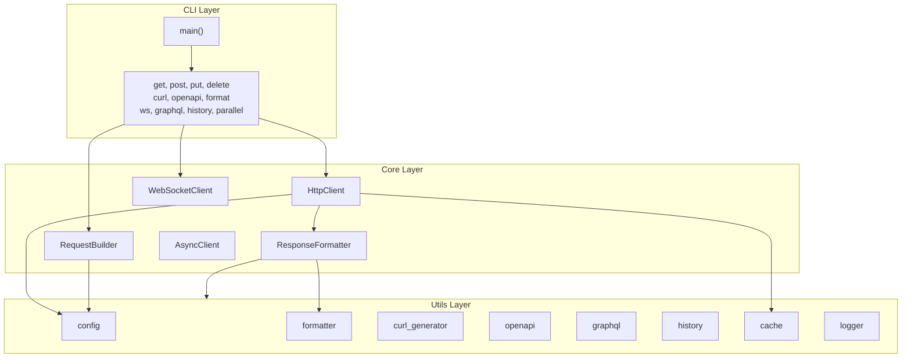
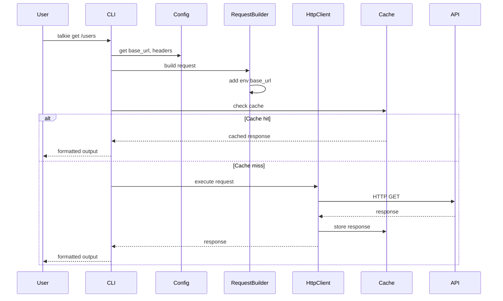
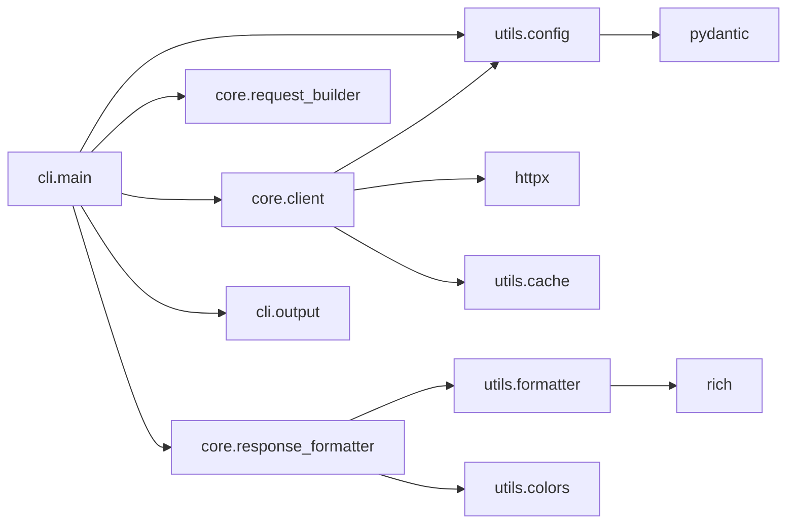

# Architecture

This document describes the architecture of Talkie.

## High-Level Overview

```
┌─────────────────────────────────────────────────────────────────┐
│                         CLI (talkie / tlk)                        │
│                    talkie.cli.main / __main__                     │
└─────────────────────────────────────────────────────────────────┘
                                    │
                                    ▼
┌─────────────────────────────────────────────────────────────────┐
│                          Core Layer                              │
│  ┌─────────────┐ ┌──────────────┐ ┌─────────────────────────┐  │
│  │ HttpClient  │ │RequestBuilder│ │ ResponseFormatter       │  │
│  └─────────────┘ └──────────────┘ └─────────────────────────┘  │
│  ┌─────────────────┐ ┌──────────────────┐                     │
│  │ AsyncClient     │ │ WebSocketClient   │                     │
│  └─────────────────┘ └──────────────────┘                     │
└─────────────────────────────────────────────────────────────────┘
                                    │
                                    ▼
┌─────────────────────────────────────────────────────────────────┐
│                         Utils Layer                              │
│  config │ formatter │ curl_generator │ openapi │ graphql        │
│  history │ colors │ logger │ cache │ validators │ error_handler │
└─────────────────────────────────────────────────────────────────┘
                                    │
                                    ▼
┌─────────────────────────────────────────────────────────────────┐
│                      External Dependencies                       │
│  httpx │ typer │ rich │ pydantic │ pyyaml │ websockets          │
└─────────────────────────────────────────────────────────────────┘
```

## Component Diagram (Mermaid)



## Request Flow



## Module Dependencies



## Directory Structure

```
talkie/
├── __init__.py
├── __main__.py              # Entry point
├── cli/
│   ├── main.py              # CLI commands
│   └── output.py            # Output formatting
├── core/
│   ├── client.py            # HTTP client (sync)
│   ├── async_client.py      # HTTP client (async)
│   ├── request_builder.py    # Request construction
│   ├── response_formatter.py # Response formatting
│   └── websocket_client.py   # WebSocket support
└── utils/
    ├── config.py            # Configuration
    ├── formatter.py         # Data formatting
    ├── curl_generator.py    # Curl command generation
    ├── openapi.py           # OpenAPI inspection
    ├── graphql.py           # GraphQL support
    ├── history.py           # Request history
    ├── cache.py             # Response caching
    ├── colors.py            # Terminal colors
    ├── logger.py            # Logging
    ├── validators.py        # Input validation
    └── error_handler.py     # Error handling
```

## Data Flow

1. **CLI** parses arguments and routes to appropriate handler
2. **Config** provides base URL, headers from active environment
3. **RequestBuilder** constructs full request (URL + params + headers + body)
4. **Cache** checks for cached response (if enabled)
5. **HttpClient** executes request via httpx
6. **ResponseFormatter** formats output (JSON/XML/HTML syntax highlighting)
7. **Output** displays to user via Rich console
