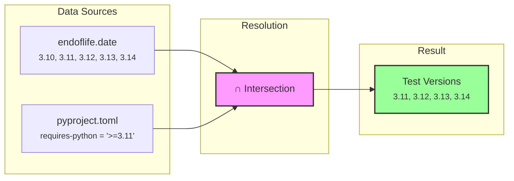
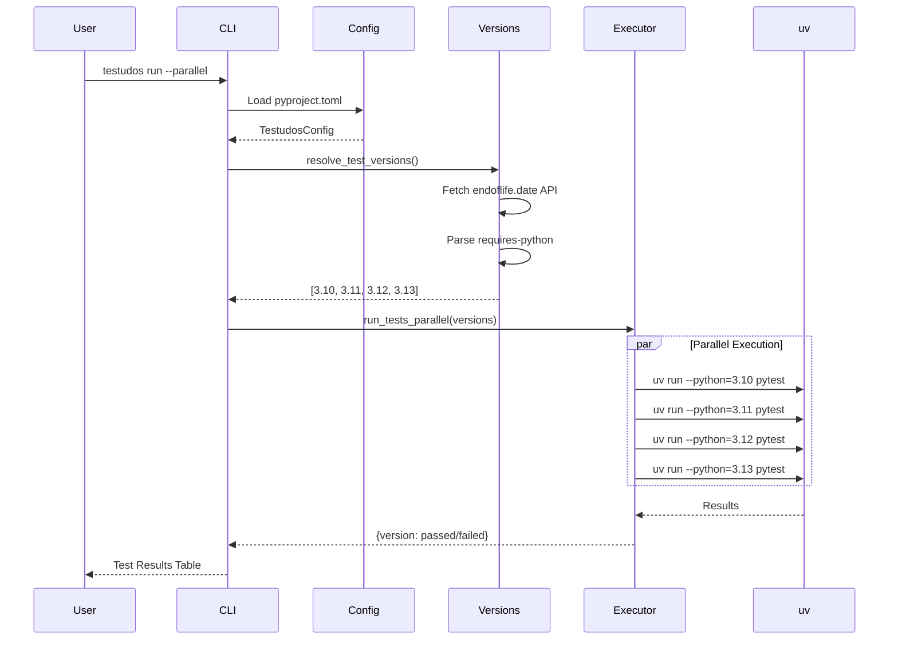
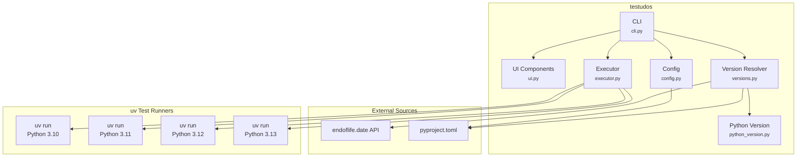
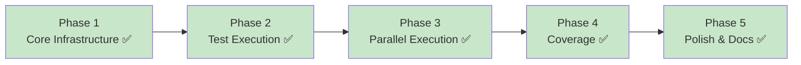

# Testudos Architecture Plan

> A testing harness for Python packages using uv's isolated environments.

## Overview

Testudos provides a simple way to run a Python package's test suite across multiple Python versions. It leverages:

- **[uv](https://docs.astral.sh/uv/)** - Fast Python package manager with built-in version management

The core idea is inspired by approaches outlined in:
- [You Just Don't Need Tox](https://lukasatkinson.de/2025/just-dont-tox/) by Lukas Atkinson
- [uv for testing multiple Python versions](https://daniel.feldroy.com/posts/2025-10-uv-just-for-testing-multiple-python-versions) by Daniel Feldroy
- [Testing multiple versions of Python in parallel](https://sebastian.lauwe.rs/blog/parallelising-makefile-uv/) by Sebastian Lauwers

## Goals

1. **Simplicity**: Minimal configuration required; sensible defaults
2. **Speed**: Leverage uv's caching and support parallel test execution
3. **Flexibility**: Allow customization of Python versions and test commands
4. **Integration**: Work with existing pyproject.toml configurations

---

## Core Concepts

### Python Version Resolution

Testudos determines which Python versions to test against by computing the **intersection** of:

1. **Currently Supported Python Versions** (from [endoflife.date API](https://endoflife.date/api/python.json))
   - Versions in "bugfix" or "security" support phase
   - Currently: 3.10, 3.11, 3.12, 3.13, 3.14

2. **Package-Compatible Versions** (from `pyproject.toml`)
   - Parsed from the `requires-python` field
   - Example: `requires-python = ">=3.9"` → compatible with 3.9, 3.10, 3.11, 3.12, 3.13, 3.14

The intersection ensures tests run only on versions that are both:
- Still supported by the Python community
- Declared compatible by the package



### Test Execution Strategy

Using uv's isolated environments:

```bash
uv run --isolated --python=3.11 pytest
```

Key flags:
- `--isolated`: Creates a temporary, isolated environment (avoids polluting main venv)
- `--python=X.Y`: Specifies the Python version (uv downloads if not present)

### CLI Execution Flow



---

## Architecture

### Component Diagram



### File Structure

```
testudos/
├── pyproject.toml           # Package metadata
├── src/
│   └── testudos/
│       ├── __init__.py      # Public API exports
│       ├── cli.py           # CLI entry point (typer)
│       ├── ui.py            # UI components (Rich tables, progress)
│       ├── runner.py        # TestRunner orchestration layer
│       ├── versions.py      # Python version resolution & caching
│       ├── python_version.py # PythonVersion type with validation
│       ├── config.py        # Configuration loading & validation
│       ├── executor.py      # Test execution (sequential/parallel)
│       └── coverage.py      # Coverage data management
├── tests/
│   └── ...
└── docs/
    ├── ARCHITECTURE.md
    ├── IMPLEMENTATION_ROADMAP.md
    └── ISSUES.md            # Future enhancement issue descriptions
```

---

## Detailed Design

### 1. Version Resolution (`versions.py`)

```python
from packaging.specifiers import SpecifierSet
import httpx

ENDOFLIFE_API = "https://endoflife.date/api/python.json"

def get_supported_python_versions() -> list[str]:
    """Fetch currently supported Python versions from endoflife.date."""
    response = httpx.get(ENDOFLIFE_API)
    data = response.json()

    supported = []
    for release in data:
        # Include versions in bugfix or security phase (not EOL)
        if release.get("eol") is False or release.get("support") is True:
            supported.append(release["cycle"])  # e.g., "3.12"

    return sorted(supported, key=lambda v: tuple(map(int, v.split("."))))

def parse_requires_python(pyproject_path: str) -> SpecifierSet:
    """Parse requires-python from pyproject.toml."""
    import tomllib

    with open(pyproject_path, "rb") as f:
        data = tomllib.load(f)

    requires_python = data.get("project", {}).get("requires-python", ">=3.8")
    return SpecifierSet(requires_python)

def resolve_test_versions(
    pyproject_path: str,
    explicit_versions: list[str] | None = None
) -> list[str]:
    """
    Determine which Python versions to test against.

    Priority:
    1. Explicitly provided versions (if any)
    2. Intersection of supported versions and requires-python
    """
    if explicit_versions:
        return explicit_versions

    supported = get_supported_python_versions()
    specifier = parse_requires_python(pyproject_path)

    # Filter supported versions by requires-python compatibility
    compatible = [v for v in supported if f"{v}.0" in specifier]

    return compatible
```

### 2. Configuration (`config.py`)

Support configuration via `pyproject.toml`:

```toml
[tool.testudos]
# Override default Python versions (optional)
python-versions = ["3.10", "3.11", "3.12", "3.13"]

# Test command (default: "pytest")
test-command = "pytest"

# Additional test arguments
test-args = ["-v", "--tb=short"]

# Parallel execution (default: false for CI stability)
parallel = false

# Max parallel jobs (default: number of versions)
max-jobs = 4
```

```python
from dataclasses import dataclass, field

@dataclass
class TestudosConfig:
    python_versions: list[str] | None = None
    test_command: str = "pytest"
    test_args: list[str] = field(default_factory=list)
    parallel: bool = False
    max_jobs: int | None = None

    @classmethod
    def from_pyproject(cls, path: str) -> "TestudosConfig":
        import tomllib

        with open(path, "rb") as f:
            data = tomllib.load(f)

        tool_config = data.get("tool", {}).get("testudos", {})

        return cls(
            python_versions=tool_config.get("python-versions"),
            test_command=tool_config.get("test-command", "pytest"),
            test_args=tool_config.get("test-args", []),
            parallel=tool_config.get("parallel", False),
            max_jobs=tool_config.get("max-jobs"),
        )
```

### 3. Executor (`executor.py`)

Handles test execution across Python versions:

```python
import subprocess
import asyncio
from concurrent.futures import ThreadPoolExecutor, as_completed

def run_tests_sequential(
    versions: list[str],
    test_command: str,
    test_args: list[str],
) -> dict[str, bool]:
    """Run tests sequentially on each Python version."""
    results = {}

    for version in versions:
        print(f"Testing with Python {version}...")
        cmd = ["uv", "run", "--isolated", f"--python={version}", test_command] + test_args

        result = subprocess.run(cmd)
        results[version] = result.returncode == 0

    return results

def run_tests_parallel(
    versions: list[str],
    test_command: str,
    test_args: list[str],
    max_workers: int | None = None,
) -> dict[str, bool]:
    """Run tests in parallel across Python versions."""
    results = {}

    def run_single(version: str) -> tuple[str, bool]:
        cmd = ["uv", "run", "--isolated", f"--python={version}", test_command] + test_args
        result = subprocess.run(cmd, capture_output=True)
        return version, result.returncode == 0

    with ThreadPoolExecutor(max_workers=max_workers or len(versions)) as executor:
        futures = {executor.submit(run_single, v): v for v in versions}

        for future in as_completed(futures):
            version, success = future.result()
            results[version] = success
            status = "✓" if success else "✗"
            print(f"Python {version}: {status}")

    return results
```

### 4. CLI (`cli.py`)

```python
import typer
from pathlib import Path
from rich.console import Console
from rich.table import Table

app = typer.Typer(help="Testudos - Multi-Python version test harness")
console = Console()

@app.command()
def run(
    path: Path = typer.Argument(Path("."), help="Path to the Python package"),
    versions: list[str] = typer.Option(None, "--python", "-p", help="Python versions to test"),
    parallel: bool = typer.Option(False, "--parallel", "-P", help="Run tests in parallel"),
    jobs: int = typer.Option(None, "--jobs", "-j", help="Max parallel jobs"),
):
    """Run tests across multiple Python versions."""
    from testudos.config import TestudosConfig
    from testudos.versions import resolve_test_versions
    from testudos.executor import run_tests_sequential, run_tests_parallel

    pyproject_path = path / "pyproject.toml"
    config = TestudosConfig.from_pyproject(str(pyproject_path))

    # Resolve versions
    test_versions = versions or config.python_versions
    test_versions = resolve_test_versions(str(pyproject_path), test_versions)

    console.print(f"[bold]Testing Python versions:[/bold] {', '.join(test_versions)}")

    # Execute tests
    use_parallel = parallel or config.parallel
    if use_parallel:
        results = run_tests_parallel(
            test_versions,
            config.test_command,
            config.test_args,
            max_workers=jobs or config.max_jobs,
        )
    else:
        results = run_tests_sequential(
            test_versions,
            config.test_command,
            config.test_args,
        )

    # Display results
    _display_results(results)

    # Exit with error if any tests failed
    if not all(results.values()):
        raise typer.Exit(1)

@app.command()
def versions(
    path: Path = typer.Argument(Path("."), help="Path to the Python package"),
):
    """Show Python versions that would be tested."""
    from testudos.versions import resolve_test_versions, get_supported_python_versions

    pyproject_path = path / "pyproject.toml"

    supported = get_supported_python_versions()
    test_versions = resolve_test_versions(str(pyproject_path))

    table = Table(title="Python Versions")
    table.add_column("Version", style="cyan")
    table.add_column("Supported", style="green")
    table.add_column("Compatible", style="yellow")
    table.add_column("Will Test", style="bold")

    for v in supported:
        compatible = v in test_versions
        table.add_row(
            v,
            "✓",
            "✓" if compatible else "✗",
            "✓" if compatible else "",
        )

    console.print(table)

def _display_results(results: dict[str, bool]):
    """Display test results in a table."""
    table = Table(title="Test Results")
    table.add_column("Python Version", style="cyan")
    table.add_column("Status")

    for version, success in sorted(results.items()):
        status = "[green]PASSED[/green]" if success else "[red]FAILED[/red]"
        table.add_row(version, status)

    console.print(table)

    passed = sum(results.values())
    total = len(results)
    console.print(f"\n[bold]Summary:[/bold] {passed}/{total} passed")

if __name__ == "__main__":
    app()
```

---

## Parallel Execution

The following diagram compares sequential vs parallel execution:

```mermaid
gantt
    title Test Execution Comparison
    dateFormat X
    axisFormat %s

    section Sequential
    Python 3.10    :a1, 0, 3
    Python 3.11    :a2, after a1, 3
    Python 3.12    :a3, after a2, 3
    Python 3.13    :a4, after a3, 3

    section Parallel
    Python 3.10    :b1, 0, 3
    Python 3.11    :b2, 0, 3
    Python 3.12    :b3, 0, 3
    Python 3.13    :b4, 0, 3
```



### Asyncio-based Parallel Execution

Testudos uses asyncio for parallel test execution, providing:

- Full control over concurrency
- Better error handling
- Progress reporting with Rich live display
- Configurable max workers via `--jobs`

---

## Implementation Phases



### Phase 1: Core Infrastructure ✅ COMPLETE
- [x] Project setup with `pyproject.toml`
- [x] Version resolution (`versions.py`)
  - Fetch from endoflife.date API
  - Parse `requires-python` from pyproject.toml
  - Compute intersection
  - API caching with TTL
  - Offline fallback
- [x] Configuration loading (`config.py`)
- [x] Basic CLI skeleton (`cli.py`)

### Phase 2: Test Execution ✅ COMPLETE
- [x] Sequential executor (`executor.py`)
- [x] Integration with uv (`uv run --isolated`)
- [x] Basic result reporting with rich tables
- [x] `testudos run` command
- [x] `testudos versions` command
- [x] Fail-fast behavior

### Phase 3: Parallel Execution ✅ COMPLETE
- [x] Asyncio-based parallel runner
- [x] Output handling for parallel execution (captured to avoid interleaving)
- [x] Max-jobs configuration
- [x] `--parallel` / `-P` flag
- [x] `--jobs` / `-j` flag
- [x] Rich live progress display with status indicators
- [x] Duration tracking for test runs

### Phase 4: Coverage ✅ COMPLETE
- [x] Coverage data collection across Python versions
- [x] Coverage aggregation with `coverage combine`
- [x] Multiple report formats (term, html, xml, json, lcov)
- [x] Coverage threshold enforcement
- [x] `testudos coverage` subcommands

### Phase 5: Polish & Documentation ✅ COMPLETE
- [x] Rich output formatting
- [x] Progress bars for parallel execution (implemented in Phase 3)
- [x] Comprehensive error messages with custom exception types
- [x] PythonVersion type with validation for explicit versions
- [x] CacheConfig object for testable cache configuration
- [x] UI module separation for cleaner architecture
- [x] Comprehensive test suite (150+ tests)
- [x] Documentation and examples

---

## Dependencies

```toml
[project]
dependencies = [
    "typer>=0.9.0",
    "rich>=13.0.0",
    "httpx>=0.25.0",
    "packaging>=23.0",
]

[project.optional-dependencies]
dev = [
    "pytest>=7.0.0",
    "pytest-cov>=4.0.0",
]
```

Note: `tomllib` is included in Python 3.11+ stdlib.

---

## Usage Examples

### Basic Usage

```bash
# Run tests on auto-detected Python versions
testudos run

# Run tests in parallel
testudos run --parallel

# Limit parallel jobs
testudos run --parallel --jobs 2

# Test specific versions only
testudos run --python 3.11 --python 3.12

# Show which versions would be tested
testudos versions

# Run with coverage
testudos run --coverage --coverage-report html
```

### With pyproject.toml Configuration

```toml
[tool.testudos]
test-command = "pytest"
test-args = ["-v", "--cov=mypackage"]
parallel = true
max-jobs = 4
coverage = true
coverage-report = ["html", "xml"]
```

---

## Resolved Design Decisions

1. **Caching**: ✅ API responses are cached to `~/.cache/testudos/endoflife.json` with a 24-hour TTL. The cache location respects `XDG_CACHE_HOME` if set. Cache configuration is injectable via `CacheConfig` for testing.

2. **Offline mode**: ✅ Implemented a fallback chain:
   - Try cache first (if fresh)
   - Try API request
   - Fall back to expired cache (with warning)
   - Fall back to bundled versions `["3.11", "3.12", "3.13", "3.14"]` (with warning)

3. **Custom test runners**: ✅ Configurable via `test-command` in `[tool.testudos]`. Defaults to `pytest` but supports any command.

4. **Version validation**: ✅ Added `PythonVersion` type that validates explicit version strings, preventing invalid versions like `"foo"` or `"3.1.1"` from being passed to uv.

## Recent Enhancements

### TestRunner Orchestration Layer (`runner.py`)

A high-level `TestRunner` class that orchestrates test execution:

```python
from testudos import TestRunner, RunOptions

runner = TestRunner(project_path=Path("."))
plan = runner.plan(RunOptions(parallel=True, dry_run=True))

# Show what would be executed
for cmd in plan.commands:
    print(cmd)

# Actually run tests
results = runner.run(RunOptions(parallel=True))
```

### Dry-Run Mode

Preview commands without execution:

```bash
testudos run --dry-run
testudos run -n
```

Shows a table of settings and the exact commands that would be executed.

### Configuration Validation

Schema-based validation for `[tool.testudos]`:

```python
from testudos import validate_config, ConfigValidationError

config = {"test-command": "pytest", "unknown-key": "value"}
warnings = validate_config(config)  # Returns ["Unknown configuration key: 'unknown-key'"]

config = {"max-jobs": -1}
validate_config(config)  # Raises ConfigValidationError
```

### Input Validation for Commands

Safe command construction with validation:

```python
from testudos import validate_version, validate_test_command, validate_test_args

validate_version("3.11")  # OK
validate_version("invalid")  # Raises CommandValidationError

validate_test_command("pytest")  # OK
validate_test_command("rm -rf /")  # Raises CommandValidationError

validate_test_args(["-v", "--tb=short"])  # OK
validate_test_args(["$(whoami)"])  # Raises CommandValidationError
```

### Cache Configuration Context Manager

For testing and temporary cache configuration changes:

```python
from testudos import CacheConfig, cache_config_context

temp_config = CacheConfig(
    cache_dir=Path("/tmp/testudos"),
    cache_file=Path("/tmp/testudos/cache.json"),
    ttl=timedelta(hours=1),
)

with cache_config_context(temp_config):
    # Uses temp_config for all cache operations
    versions = get_supported_python_versions()
# Original config restored automatically
```

### API Retry with Exponential Backoff

The endoflife.date API fetch now retries failed requests:

- Up to 3 retry attempts
- Exponential backoff: 1s, 2s, 4s (capped at 10s)
- Handles network errors, timeouts, and HTTP errors

## Future Considerations

1. **CI integration**: Generate GitHub Actions workflow
2. **Watch mode**: Re-run tests on file changes
3. **Pre-commit integration**: Run tests automatically on commit

---

## References

- [uv Documentation](https://docs.astral.sh/uv/)
- [Python Packaging Guide - pyproject.toml](https://packaging.python.org/en/latest/specifications/pyproject-toml/)
- [endoflife.date API](https://endoflife.date/docs/api)
- [packaging library](https://pypi.org/project/packaging/)
