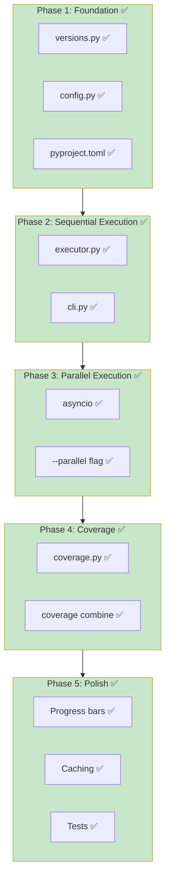
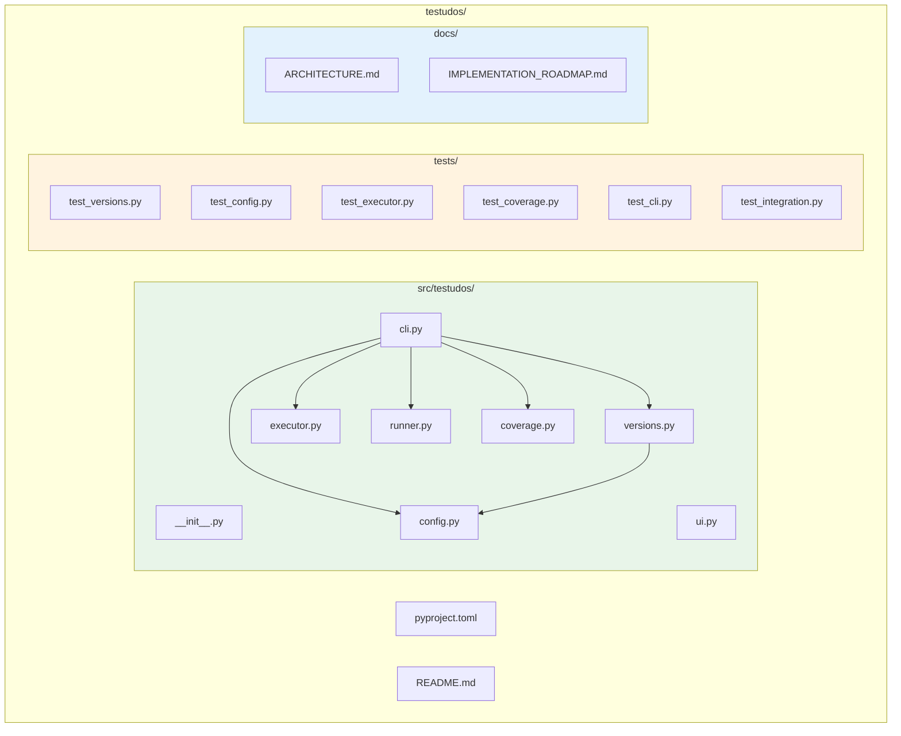
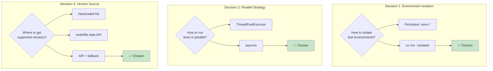

# Testudos Implementation Roadmap

## Quick Summary

Testudos is a multi-Python version testing harness using uv's isolated environments. It automatically determines which Python versions to test based on:

1. **Currently supported Python versions** (from endoflife.date API)
2. **Package compatibility** (from `requires-python` in pyproject.toml)

## Implementation Phases



### Phase 1: Foundation (Core) ✅ COMPLETE

**Files created:**
- ✅ `src/testudos/__init__.py` - Package init
- ✅ `src/testudos/versions.py` - Version resolution logic
- ✅ `src/testudos/config.py` - Configuration loading
- ✅ `pyproject.toml` - Package metadata

**Completed tasks:**
1. ✅ Fetch supported Python versions from `https://endoflife.date/api/python.json`
2. ✅ Parse `requires-python` from target package's pyproject.toml using `packaging.specifiers`
3. ✅ Compute intersection of supported and compatible versions
4. ✅ Define `TestudosConfig` dataclass for `[tool.testudos]` settings
5. ✅ API caching with TTL (24 hours)
6. ✅ Offline fallback to bundled versions

**Test with:**
```bash
python -c "from testudos.versions import resolve_test_versions; print(resolve_test_versions('.'))"
```

### Phase 2: Sequential Execution ✅ COMPLETE

**Files created:**
- ✅ `src/testudos/executor.py` - Test execution logic
- ✅ `src/testudos/cli.py` - CLI entry point

**Completed tasks:**
1. ✅ Implement `run_tests_sequential()` using `subprocess.run()`
2. ✅ Build basic CLI with `typer`: `testudos run`, `testudos versions`
3. ✅ Format output with `rich` tables
4. ✅ Fail-fast behavior (stop on first failure)
5. ✅ Check for `uv` availability

**Core command:**
```bash
uv run --isolated --python=3.11 pytest
```

**Test with:**
```bash
testudos run ./path/to/package
testudos versions
```

### Phase 3: Parallel Execution ✅ COMPLETE

**Files updated:**
- ✅ `src/testudos/executor.py` - Added parallel execution with asyncio
- ✅ `src/testudos/cli.py` - Added parallel flags and Rich live progress display
- ✅ `tests/test_executor.py` - Added comprehensive parallel execution tests

**Completed tasks:**
1. ✅ Implement `run_tests_parallel()` using asyncio
2. ✅ Handle output buffering (avoid interleaved output) with `capture_output=True`
3. ✅ Add `--parallel` / `-P` flag to CLI
4. ✅ Add `--jobs` / `-j` flag for concurrency limit
5. ✅ Rich live display showing real-time test progress with status indicators
6. ✅ Status callback system for progress updates (`TestStatus` enum)
7. ✅ Duration tracking for all test runs

**Test with:**
```bash
testudos run --parallel --jobs 4
testudos run -P -j 2
```

### Phase 4: Coverage ✅ COMPLETE

**Files created:**
- ✅ `src/testudos/coverage.py` - Coverage data management

**Completed tasks:**
1. ✅ Collect coverage data across Python versions
2. ✅ Combine coverage data with `coverage combine`
3. ✅ Generate reports in multiple formats (term, html, xml, json, lcov)
4. ✅ Add `testudos coverage combine` command
5. ✅ Add `testudos coverage report` command
6. ✅ Add `testudos coverage clean` command
7. ✅ Coverage threshold enforcement with `--coverage-fail-under`

**Test with:**
```bash
testudos run --coverage
testudos run --coverage --coverage-report html
testudos coverage combine
testudos coverage report --format html
```

### Phase 5: Polish ✅ COMPLETE

**Files created:**
- ✅ `tests/test_cli.py` - Comprehensive CLI tests
- ✅ `tests/test_integration.py` - Integration and end-to-end tests

**Completed tasks:**
1. ✅ Progress bars for parallel execution (ParallelProgressDisplay with Rich Live)
2. ✅ Error messages are clear and actionable
3. ✅ Add `--verbose` / `-v` flag with detailed output
4. ✅ Cache endoflife.date response (24-hour TTL already in Phase 1)
5. ✅ Handle offline mode gracefully (fallback to cache and bundled versions)
6. ✅ Write comprehensive tests:
   - CLI tests (33 tests)
   - Integration tests (20 tests)
   - Total: 129 tests covering all functionality

**Test coverage:**
```bash
# Run the full test suite
uv run pytest -v

# Results: 129 passed, 5 warnings
```

**What was completed:**
- **Progress Display**: Rich live progress display shows real-time status for parallel execution
- **Verbose Mode**: `--verbose` flag shows test commands, working directory, and detailed output
- **Comprehensive Testing**: Full test coverage including CLI, integration, unit tests
- **Error Handling**: Clear, actionable error messages throughout
- **Caching**: 24-hour TTL cache for API responses with offline fallback

---

## File Structure (Final)



```
testudos/
├── pyproject.toml
├── README.md
├── src/
│   └── testudos/
│       ├── __init__.py
│       ├── cli.py           # typer CLI
│       ├── config.py        # TestudosConfig
│       ├── versions.py      # Version resolution
│       ├── executor.py      # Sequential/parallel runners
│       ├── runner.py        # TestRunner orchestration
│       ├── coverage.py      # Coverage data management
│       └── ui.py            # Rich UI components
├── tests/
│   ├── test_versions.py
│   ├── test_config.py
│   ├── test_executor.py
│   ├── test_coverage.py
│   ├── test_cli.py
│   └── test_integration.py
└── docs/
    ├── ARCHITECTURE.md
    ├── DESIGN_DECISIONS.md
    └── IMPLEMENTATION_ROADMAP.md
```

---

## Dependencies

```toml
[project]
name = "testudos"
version = "0.1.0"
requires-python = ">=3.11"
dependencies = [
    "typer>=0.9.0",
    "rich>=13.0.0",
    "httpx>=0.25.0",
    "packaging>=23.0",
]

[project.scripts]
testudos = "testudos.cli:app"
```

---

## Key Design Decisions



### 1. Use `uv run --isolated` vs persistent venvs

**Chosen: `--isolated`**

Rationale:
- Simpler mental model (no leftover `.venv-*` directories)
- uv's caching makes this nearly as fast
- Avoids version conflicts between test runs

### 2. Parallel strategy: asyncio

**Chosen: asyncio-based parallel execution**

Rationale:
- Full control over concurrency
- Better error handling
- Rich live progress display

### 3. Version source: endoflife.date vs hardcoded list

**Chosen: endoflife.date API with fallback**

Rationale:
- Always up-to-date
- Fallback to cached/hardcoded list if offline

---

## CLI Reference

### Implemented Commands

```
testudos run [PATH] [OPTIONS]
    Run tests across multiple Python versions

    Arguments:
      PATH                 Path to the Python package (default: .)

    Options:
      -p, --python TEXT    Python version(s) to test (can repeat)
      -f, --fail-fast      Stop immediately when a test fails (default, sequential only)
      -F, --no-fail-fast   Continue running tests after failures (sequential only)
      -P, --parallel       Run tests in parallel across Python versions
      -j, --jobs INT       Maximum number of parallel jobs (default: number of versions)
      -v, --verbose        Show verbose output
      -c, --coverage       Collect test coverage data
      --coverage-report    Coverage report format (term, html, xml, json, lcov)
      --coverage-fail-under FLOAT  Fail if coverage below threshold
      --help               Show help

testudos versions [PATH]
    Show Python versions that would be tested

    Arguments:
      PATH                 Path to the Python package (default: .)

testudos coverage combine [PATH]
    Combine coverage data from multiple Python versions

testudos coverage report [PATH] [OPTIONS]
    Generate coverage report from collected data

    Options:
      -f, --format TEXT    Report format (term, html, xml, json, lcov)
      --fail-under FLOAT   Fail if coverage below threshold

testudos coverage clean [PATH]
    Remove all coverage data files
```

---

## Testing Strategy

1. **Unit tests**: Mock httpx for API calls, use temp directories for config
2. **Integration tests**: Test against real small package
3. **Dogfooding**: Use testudos to test testudos itself

---

## Future Enhancements

- [ ] Generate GitHub Actions workflow (`testudos ci --github-actions`)
- [ ] Support for tox.ini migration (`testudos migrate-from-tox`)
- [ ] Watch mode (`testudos run --watch`)
- [ ] Pre-commit hook integration
