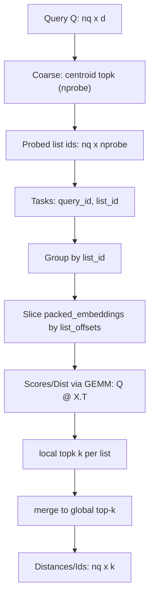

# torch-ivf

**A PyTorch-native IVF with a Faiss-like API.**  
The goal is to support CPU / CUDA / ROCm / DirectML with **the same code** (with a strong focus on Windows + ROCm).

- 🔁 **Easy migration with a Faiss-like API** (equivalent APIs for `IndexFlatL2` / `IndexFlatIP`, and `IndexIVFFlat`)
- 📈 **18.6x vs faiss-cpu (throughput, exact)** (`nq=19600`, `search_mode=csr`, torch-ivf `float16` on ROCm GPU vs faiss-cpu `float32`: 195,175 / 10,479 ~18.6x)
- 📈 **10.0x vs faiss-cpu (throughput, default-friendly)** (`nq=19600`, `search_mode=auto`, float32: 99,568 / 9,987 ~10.0x)
- 🧩 **Same code if your PyTorch backend runs** (CPU/CUDA/ROCm/DirectML. *One codebase across backends*)
- 🧪 **Measured results + repro steps included** (env/jsonl + scripts bundled. *Reproducible benchmarks included*)

> Japanese README: `README.ja.md`

---

## 📌 For Faiss Users (1 minute)

Here’s a quick mapping to the Faiss APIs. See the tutorial as well ([`docs/tutorial.en.md`](docs/tutorial.en.md)).

```python
from torch_ivf.index import IndexFlatL2, IndexFlatIP, IndexIVFFlat
```

| What you want | Faiss | torch-ivf |
|---|---|---|
| Flat (L2/IP) | `faiss.IndexFlatL2 / faiss.IndexFlatIP` | `torch_ivf.index.IndexFlatL2 / torch_ivf.index.IndexFlatIP` |
| IVF (L2/IP) | `faiss.IndexIVFFlat` | `torch_ivf.index.IndexIVFFlat` |
| Tuning | `nprobe`, etc. | `nprobe` + `search_mode` + `max_codes` |

**Recommended for GPU**: `search_mode="auto"` (a lighter path for tiny batches, and `csr` for throughput)  
Auto switch rule: `probe = min(nprobe, nlist)`, `avg_group_size = (nq * probe) / nlist`, use `csr` when `avg_group_size >= auto_search_avg_group_threshold * (nlist / 512)` (CUDA/ROCm: `device.type == "cuda"`).

`auto_search_avg_group_threshold` defaults to 8.0.  
Scoring the benchmark JSONL with `scripts/score_auto_threshold.py` (preset: latency, nq=8/32/64/128/256/512, metric: QPS×recall) shows threshold=6 as the best by a small margin, with 8 as the runner-up. Tune as needed (e.g. `--preset throughput` or custom weights).

Example:
```bash
uv run python scripts/score_auto_threshold.py --jsonl benchmarks/benchmarks.jsonl --preset latency --nq-list 8,32,64,128,256,512 --top 3
```

---

## Where Is It Fast? (one-screen summary)

- **Strong in throughput** (e.g. `nq >= 512`)  
  `search_mode=csr` tends to work well and can beat **faiss-cpu by multiples**.
- **Weak in tiny batches** (e.g. `nq <= 32`)  
  Kernel-launch overhead can dominate; CPU or `search_mode=matrix` may win.
- **Recommended default**  
  On GPU, keep `search_mode="auto"` and **send larger query batches if possible** (auto chooses a lighter path for tiny batches, and `csr` for throughput).

---

## 📊 Benchmarks (representative values)

### Throughput vs faiss-cpu (paired, exact)

> Setup: `nb=262144, train_n=20480, d=128, nlist=512, nprobe=32, k=20, max_codes=0, --warmup 1 --repeat 5`  
> Updated: `2026-02-01T14:47:02` (`scripts/benchmark_sweep_ivf_params.py`, same base/query for both libraries)
>
> Note: higher ratios can be possible depending on `(nlist, nprobe)` and your data distribution; treat this as a representative point and consult `benchmarks/benchmarks.jsonl` for sweeps.

| library | device | dtype | search_mode | QPS |
|---|---|---|---|---:|
| torch-ivf | ROCm GPU | float16 | csr | **195,175** |
| faiss-cpu | CPU | float32 | faiss | 10,479 |

Repro:
```bash
uv run python scripts/benchmark_sweep_ivf_params.py --torch-device cuda --torch-search-mode csr --dtype float16 --pairs 512:32 --max-codes 0 --topk 20 --warmup 1 --repeat 5 --faiss-threads -1
```

> Example setup: `nb=262144, train_n=20480, nlist=512, nprobe=32, k=20, float32, --warmup 1 --repeat 5`  
> Environment: AMD64 Family 26 Model 112 Stepping 0, AuthenticAMD / Windows 11 / PyTorch ROCm 7.1.52802-561cc400e1  
> Updated: `2026-02-01T16:01:05` (`scripts/benchmark_sweep_nq.py`, `search_ms` is median)
>
> Note: this table is **fixed to `search_mode=auto`** to show the recommended default (auto picks a lighter path for tiny batches and `csr` for throughput). For maximum throughput, set `search_mode=csr`.
> faiss-cpu uses the default thread settings (environment-dependent). For reproducibility, fix `OMP_NUM_THREADS` (e.g. Linux/macOS `export OMP_NUM_THREADS=16` / Windows `set OMP_NUM_THREADS=16`).

| nq | torch-ivf (ROCm GPU, auto) | faiss-cpu (CPU) |
|---:|---:|---:|
| 512 | **24,032 QPS** | 6,264 QPS |
| 2,048 | **51,328 QPS** | 8,564 QPS |
| 19,600 | **99,568 QPS** | 9,987 QPS |

### Progress (vs v0.1.0)

Same setup (throughput, `nq=19600`, `search_mode=auto`, float32):

| version | torch-ivf QPS | faiss-cpu QPS | ratio |
|---|---:|---:|---:|
| v0.1.0 (`2025-12-25T15:32:17`) | 69,632 | 10,196 | 6.83x |
| v0.1.1 (`2026-02-01T16:01:05`) | 99,568 | 9,987 | 9.97x |

**Speed-leaning params (optional; recall trade-off)**  
If you report QPS with these, include the exact params alongside the numbers.
- `max_codes` (e.g. `32768`) to cap candidates per query.
- `SearchParams(profile="approx", candidate_budget=32768, budget_strategy="distance_weighted", list_ordering="residual_norm_asc")` (L2 only).
candidate_budget (per-list) is the primary speed/quality knob on this setup: fast=16,384, balanced=65,536, quality=131,072 (see sweep table below).
Note: On this setup, max_codes did not improve throughput (fastest was max_codes=0). Prefer tuning candidate_budget for speed/quality.

### Approximation presets (per-list budgets)

`SearchParams.profile` supports preset profiles that enable approximate search with per-list candidate budgets:

- `approx_fast`: `candidate_budget=32768`, `use_per_list_sizes=True`
- `approx_balanced`: `candidate_budget=65536`, `use_per_list_sizes=True`
- `approx_quality`: `candidate_budget=131072`, `use_per_list_sizes=True` (aims for recall≈0.995 vs unlimited on the benchmark below)

Suggested (candidate_budget / per_list, csr, nq=19600; this setup): fast=16,384 (recall~0.831) / balanced=65,536 (recall~0.976) / quality=131,072 (just below 0.995 recall).
Tune based on your dataset; see the JSONL sweep for details.


Example:

```python
from torch_ivf.index import SearchParams

params = SearchParams(profile="approx_quality")
scores, ids = index.search(xq, k=20, params=params)

# You can still override explicitly:
params = SearchParams(profile="approx_quality", candidate_budget=98304)
```

### Approximation preset results (per-list, csr)

> Same environment as the table above. `seed=1234`, `search_mode=csr`.

| candidate_budget | QPS | recall@k vs unlimited |
|---:|---:|---:|
| 16,384 | 69.0k | 0.830992 |
| 32,768 | 43.4k | 0.927214 |
| 65,536 | 57.7k | 0.975880 |
| 131,072 | 57.6k | 0.994811 |

Note: 131,072 reaches ~0.995 recall but is still slightly below the 0.995 gate.

### Add performance (batch size sweep)

> Updated: `2025-12-21T13:28:06` (`scripts/benchmark.py`, `add_ms` is elapsed time for one add)

| nb | torch-ivf (ROCm GPU) add_ms | torch-ivf (CPU) add_ms |
|---:|---:|---:|
| 65,536 | 810.0 ms | 1,175.5 ms |
| 131,072 | 1,100.8 ms | 2,358.4 ms |
| 262,144 | 848.8 ms | 4,738.9 ms |

### Chart: QPS vs nq (tiny-batch → throughput)

Blue: torch-ivf (ROCm GPU, matrix) / Red: torch-ivf (ROCm GPU, csr) / Green: torch-ivf (ROCm GPU, auto)


---

## 📦 Installation (PyTorch prerequisite)

torch-ivf **does not force-install PyTorch**.  
Install PyTorch first (CUDA/ROCm/DirectML/CPU), then install torch-ivf.

- If you already have PyTorch (recommended):
  ```bash
  pip install torch-ivf
  ```
- If you want a quick CPU setup (also installs PyTorch via pip):
  ```bash
  pip install "torch-ivf[pytorch]"
  ```

---

## 🚀 Quick Start

### Minimal code (embed into your own code)

```python
import torch
from torch_ivf.index import IndexIVFFlat

d = 128
xb = torch.randn(262144, d, device="cuda", dtype=torch.float32)
xq = torch.randn(2048, d, device="cuda", dtype=torch.float32)

index = IndexIVFFlat(d=d, nlist=512, nprobe=32, metric="l2").to("cuda")
index.search_mode = "auto"
index.train(xb[:20480])
index.add(xb)

dist, ids = index.search(xq, k=20)
print(dist.shape, ids.shape)

# Speed vs self-recall trade-off (only if needed)
# index.max_codes = 32768
```

1) Demo with synthetic data (quick sanity check):
```bash
python examples/ivf_demo.py --device cpu --verify
python examples/ivf_demo.py --device cuda --verify
```

2) Tutorial (for users):
- [`docs/tutorial.en.md`](docs/tutorial.en.md)
- [`docs/tutorial.ja.md`](docs/tutorial.ja.md)

---

## Key Points (reduce transfer overhead)

- Create tensors on the target device (`torch.randn(..., device=device)`)
- Call `add` / `search` with **large batches** when possible (thousands+)
- Move the index only once (`index = IndexIVFFlat(...).to(device)`) and keep internal buffers on the same device
- If using DataLoader, use `pin_memory=True` and `tensor.to(device, non_blocking=True)`

---

## Benchmarks (scripts)

- [`scripts/benchmark.py`](scripts/benchmark.py): torch-ivf benchmark (CPU/ROCm). Appends JSON to [`benchmarks/benchmarks.jsonl`](benchmarks/benchmarks.jsonl)
- [`scripts/benchmark_faiss_cpu.py`](scripts/benchmark_faiss_cpu.py): faiss-cpu reference benchmark
- [`scripts/benchmark_sweep_ivf_params.py`](scripts/benchmark_sweep_ivf_params.py): sweep `(nlist, nprobe)` and compare torch-ivf vs faiss-cpu on the same data
- [`scripts/benchmark_sweep_nq.py`](scripts/benchmark_sweep_nq.py): sweep `nq` (tiny-batch vs throughput boundary)
- [`scripts/benchmark_sweep_max_codes.py`](scripts/benchmark_sweep_max_codes.py): sweep `max_codes` (speed / self-recall)
- [`scripts/benchmark_sweep_candidate_budget.py`](scripts/benchmark_sweep_candidate_budget.py): sweep `candidate_budget` (approx speed vs recall)
- [`scripts/dump_env.py`](scripts/dump_env.py): generate [`benchmarks/env.json`](benchmarks/env.json)
- [`scripts/profile_ivf_search.py`](scripts/profile_ivf_search.py): show `torch.profiler` table for `IndexIVFFlat.search`

---

## Minimal Repro Steps (recommended)

Shortest steps to reproduce the chart/table in this README:

```bash
uv run python scripts/dump_env.py
uv run python scripts/benchmark_sweep_nq.py --torch-device cuda --torch-search-mode auto
uv run python scripts/benchmark_sweep_max_codes.py --torch-device cuda --torch-search-mode csr
```

Latest sweep timestamp (this README): `2025-12-25T15:32:17`  
Example timestamp filter (exact match):
```bash
uv run python scripts/score_auto_threshold.py --jsonl benchmarks/benchmarks.jsonl --preset latency --nq-list 8,32,64,128,256,512 --top 3 --timestamp 2025-12-25T15:32:17
```

Results are appended to [`benchmarks/benchmarks.jsonl`](benchmarks/benchmarks.jsonl). Update the representative values in this README to match the latest records.

---

## Why Is It Fast? (defeat bottlenecks “by structure”)

torch-ivf is not just “faster distance compute”. In IVF workloads, **(A) random candidate access** and **(B) huge selection (`topk`)** often dominate; torch-ivf focuses on fixing these with layout + search-pipeline design.

### 1) First, confirm “what is slow” with profiling

To avoid blind optimizations, we use `torch.profiler` to find hotspots.

- Tool: [`scripts/profile_ivf_search.py`](scripts/profile_ivf_search.py)
- What we found:
  - `matrix` path: `aten::index_select` / `aten::gather` / a large `aten::topk` often dominate.
  - `csr` path: the share of “random access (gather-like)” drops, and `slice` + GEMM becomes the main work.

### 2) Replace gather → slice (pack lists contiguously to eliminate random access)

What hurts GPUs is “jumping around” when reading candidate vectors (lots of `gather/index_select`).

torch-ivf packs vectors **contiguously per inverted list** at `add` time, so search can read candidates via `slice`.

- Conceptual layout:
  - `packed_embeddings`: vectors reordered per list (contiguous)
  - `list_offsets[l]:list_offsets[l+1]`: `[start:end)` range for list `l`
  - `list_ids`: mapping from packed row → original id

This changes candidate access from:

- Before: `index_select/gather` (random)
- Now: `packed_embeddings[start:end]` (contiguous `slice`)

and improves the memory-access pattern.

### 3) Replace one huge topk → local topk + merge (keep selection small, optimize repetition)

The `matrix` path tends to “pack candidates into a fixed-shape matrix, then do one huge `topk`”. If candidate counts inflate, `topk` and intermediate tensor traffic dominate.

The `csr` path processes per list:

1. Get list candidates `X` by `slice`
2. Compute distances/scores via `Q @ X.T`
3. Run `local_topk(k)` inside the list
4. `merge` into the global top-k (online / buffered)

Keeping `topk` small makes throughput scale better.

### 4) Prefer GEMM form (leverage vendor BLAS)

Whenever possible, we express distance computation as GEMM:

- IP: `scores = Q @ X.T`
- L2: `||q-x||^2 = ||q||^2 + ||x||^2 - 2 (Q @ X.T)`

This makes it easier to leverage ROCm/CUDA BLAS (rocBLAS/cuBLAS), improving GPU throughput.

### 5) Processing image (search flow)



---

## Development (uv)

```bash
uv sync
uv run pytest
```

---

## Documentation

- [`docs/concept.md`](docs/concept.md) – background and goals
- [`docs/spec.md`](docs/spec.md) – specification (API/behavior)
- [`docs/plan.md`](docs/plan.md) – progress checklist
- [`docs/tutorial.ja.md`](docs/tutorial.ja.md) – tutorial (Japanese)
- [`docs/tutorial.en.md`](docs/tutorial.en.md) – tutorial (English)
