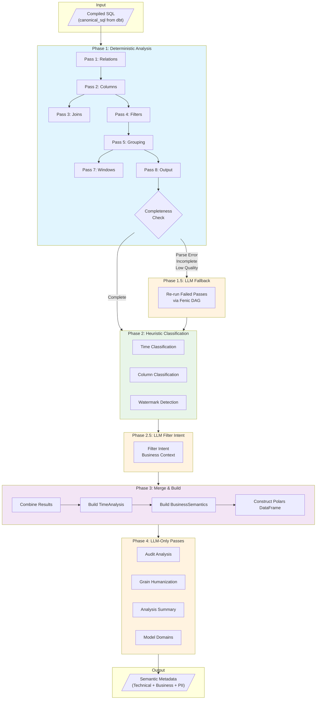
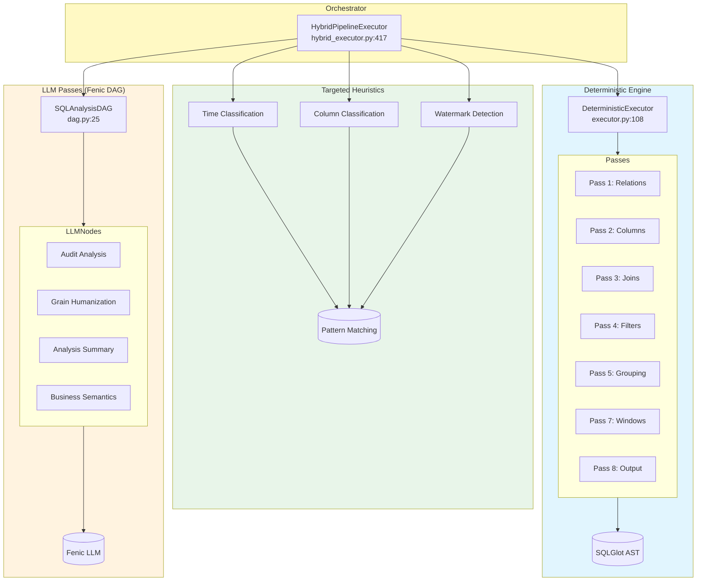
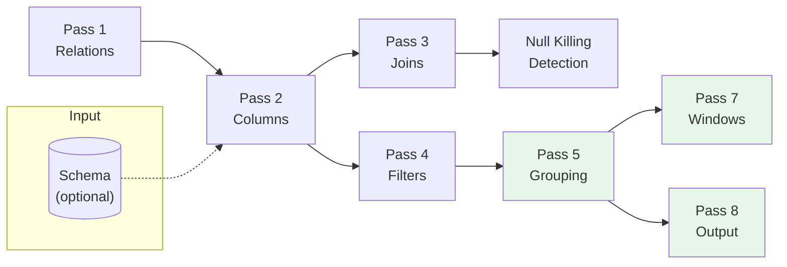
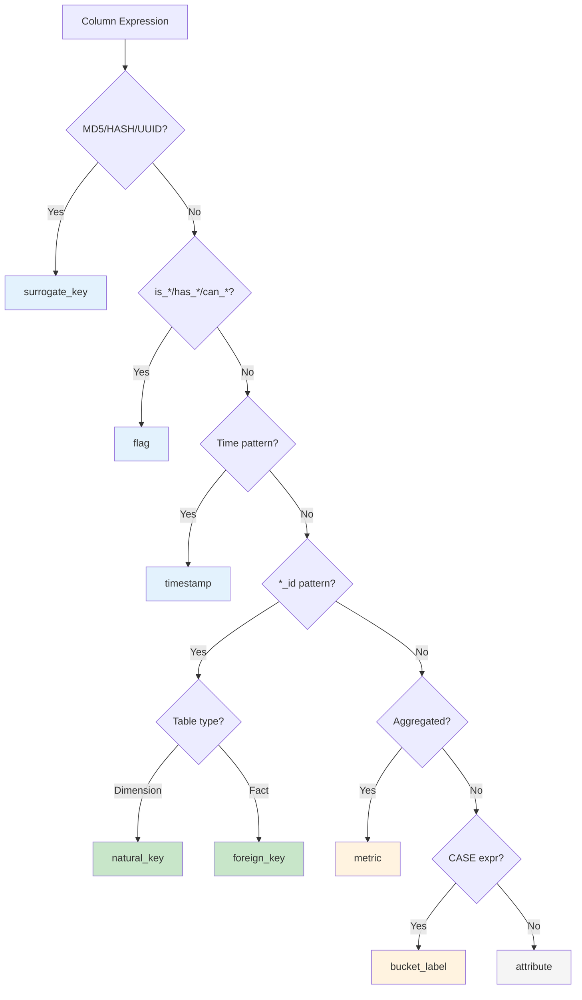
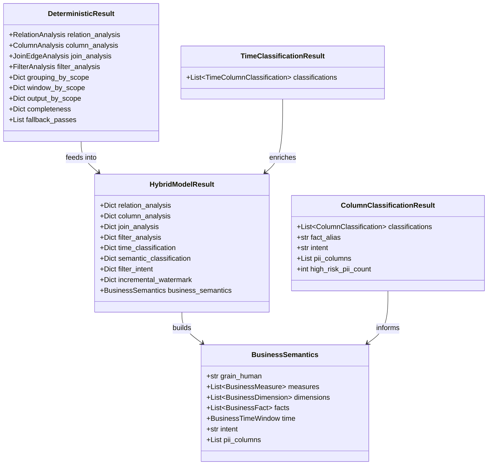
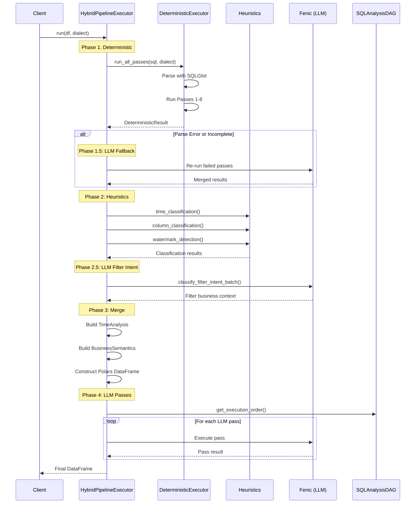
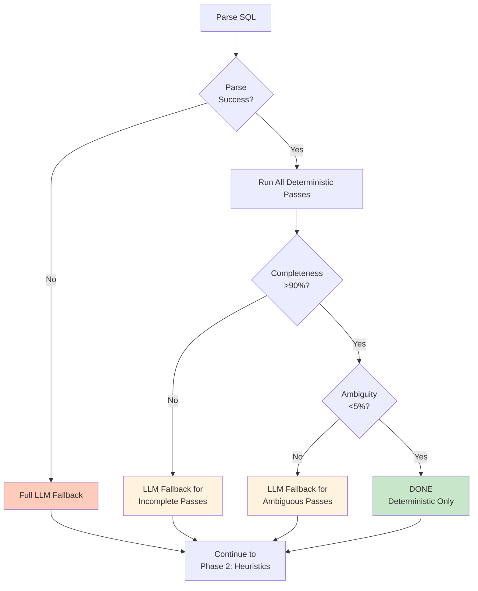

# Hybrid LLM/Heuristic Analysis Architecture

This document describes the architecture of the semantic SQL analysis pipeline, which combines deterministic parsing, heuristic classification, and LLM-powered analysis to extract rich business metadata from SQL queries.

## Table of Contents

1. [Overview](#overview)
2. [High-Level Data Flow](#high-level-data-flow)
3. [Component Architecture](#component-architecture)
4. [Execution Phases](#execution-phases)
5. [Data Models](#data-models)
6. [Fenic Integration Patterns](#fenic-integration-patterns)
7. [Quality Framework](#quality-framework)
8. [Known Redundancies & Improvements](#known-redundancies--improvements)
9. [Configuration](#configuration)

---

## Overview

The semantic analysis pipeline processes SQL from dbt models through a **hybrid deterministic + LLM approach**:

- **Deterministic Analysis**: Fast, reliable SQLGlot-based parsing for technical metadata
- **Heuristic Classification**: Pattern-based classification for time columns, PII, watermarks
- **LLM Analysis**: Business context extraction where patterns aren't sufficient

**Design Principles:**

1. **Deterministic First**: Use SQLGlot parsing for all technical metadata extraction
2. **LLM Only Where Needed**: Reserve LLM calls for business context interpretation
3. **Graceful Degradation**: Fall back to heuristics when LLM fails
4. **Batch Efficiency**: Group LLM calls for throughput optimization

---

## High-Level Data Flow



### Phase Legend

| Phase     | Color  | Engine           | Description           |
| --------- | ------ | ---------------- | --------------------- |
| Phase 1   | Blue   | Python + SQLGlot | Deterministic parsing |
| Phase 1.5 | Orange | Fenic (LLM)      | Fallback for failures |
| Phase 2   | Green  | Python           | Heuristic patterns    |
| Phase 2.5 | Orange | Fenic (LLM)      | Business context      |
| Phase 3   | Purple | Python + Polars  | Result aggregation    |
| Phase 4   | Orange | Fenic (LLM)      | Enrichment passes     |

---

## Component Architecture

### Directory Structure

```
src/lineage/ingest/static_loaders/semantic/
├── deterministic/                    # Pure Python + SQLGlot
│   ├── executor.py                   # DeterministicExecutor (orchestrates passes)
│   ├── relations.py                  # Pass 1: Relation extraction
│   ├── columns.py                    # Pass 2: Column resolution
│   ├── joins.py                      # Pass 3: Join analysis
│   ├── filters.py                    # Pass 4: Filter extraction
│   ├── grouping.py                   # Pass 5: Grouping analysis
│   ├── windows.py                    # Pass 7: Window functions
│   ├── output.py                     # Pass 8: Output shape
│   ├── null_killing.py               # Join null-killing detection
│   ├── graph_enrichment.py           # Graph DB hints for resolution
│   ├── completeness.py               # Completeness checking
│   ├── quality.py                    # Quality metrics
│   └── targeted/                     # Targeted heuristics
│       ├── time_classification.py    # Time column detection
│       ├── column_classification.py  # Semantic role + PII
│       ├── incremental_watermark.py  # Watermark detection
│       ├── filter_intent.py          # Filter business context
│       └── pii_detection.py          # PII patterns (legacy)
│
├── pipeline/                         # Fenic integration
│   ├── hybrid_executor.py            # HybridPipelineExecutor
│   ├── executor.py                   # PipelineExecutor (LLM DAG runner)
│   ├── dag.py                        # SQLAnalysisDAG (pass dependencies)
│   └── schema.py                     # Polars schema builders
│
├── passes/                           # LLM pass definitions
│   ├── base.py                       # BasePass interface
│   ├── relation_analysis.py          # LLM relation pass (fallback)
│   ├── column_analysis.py            # LLM column pass (fallback)
│   ├── join_edge_analysis.py         # LLM join pass (fallback)
│   ├── filter_analysis.py            # LLM filter pass (fallback)
│   ├── grouping_analysis.py          # LLM grouping pass (fallback)
│   ├── time_analysis.py              # LLM time pass
│   ├── window_analysis.py            # LLM window pass
│   ├── output_shape_analysis.py      # LLM output pass
│   ├── audit_analysis.py             # Data quality audit
│   ├── business_semantics.py         # Business context
│   ├── grain_humanization.py         # Grain descriptions
│   └── analysis_summary.py           # Overview generation
│
└── models/                           # Pydantic data models
    ├── base.py                       # Core models
    ├── technical.py                  # Technical analysis models
    ├── business.py                   # Business semantics models
    └── analytical.py                 # TimeAnalysis, etc.
```

### Component Relationships



---

## Execution Phases

### Phase 1: Deterministic Analysis

**Executor:** `DeterministicExecutor` ([executor.py:108](../src/lineage/ingest/static_loaders/semantic/deterministic/executor.py#L108))

**Process:**

1. Parse SQL with SQLGlot
2. Annotate types (if schema provided)
3. Run passes sequentially (shared AST)
4. Check completeness and quality
5. Flag passes needing LLM fallback

**Pass Dependencies:**



> **Note:** Green passes (5, 7, 8) are scope-aware and produce per-scope results.

**Output:** `DeterministicResult` dataclass containing:

- `relation_analysis`, `column_analysis`, `join_analysis`, `filter_analysis`
- `grouping_by_scope`, `window_by_scope`, `output_by_scope` (scoped dicts)
- `completeness`, `quality_by_pass`, `fallback_passes`

### Phase 1.5: LLM Fallback

**Trigger Conditions:**

- Parse error (SQLGlot failed)
- Completeness below threshold (>10% unresolved columns)
- Quality issues (high ambiguity)

**Process:**

1. Group models by needed fallback passes
2. Run LLM passes via DAG for flagged models
3. Merge LLM results into `DeterministicResult`

### Phase 2: Heuristic Classification

**Location:** `deterministic/targeted/`

| Classifier            | File                       | Input                              | Output                       |
| --------------------- | -------------------------- | ---------------------------------- | ---------------------------- |
| Time Classification   | `time_classification.py`   | GroupingAnalysis, FilterAnalysis   | `TimeClassificationResult`   |
| Column Classification | `column_classification.py` | GroupingAnalysis, RelationAnalysis | `ColumnClassificationResult` |
| Watermark Detection   | `incremental_watermark.py` | FilterAnalysis                     | `IncrementalWatermarkResult` |

**Time Classification Rules:**

```
is_time_column ← Name matches: date, timestamp, year, month, day, created_at, etc.
                 OR expression contains: DATE_TRUNC, EXTRACT, etc.

time_role:
  - "range_boundary" ← Column used in WHERE time predicates
  - "bucket"         ← Column used in GROUP BY
  - "attribute"      ← Other time columns (day_of_week, is_weekend)

grain ← Inferred from DATE_TRUNC argument or column name
```

**Column Classification Rules:**



**Derivation Classification:**

| Derivation    | Detection Pattern                 |
| ------------- | --------------------------------- |
| `aggregated`  | SUM, COUNT, AVG, MIN, MAX, etc.   |
| `conditional` | CASE, IF, IFF, COALESCE           |
| `window`      | ROW_NUMBER, RANK, LAG, LEAD, etc. |
| `cast`        | CAST, ::, CONVERT                 |
| `calculated`  | Other expressions with operators  |
| `direct`      | Simple column reference           |

**PII Detection:**

| Confidence | Patterns                                           |
| ---------- | -------------------------------------------------- |
| HIGH       | name, email, phone, ssn, credit_card, dob, address |
| MEDIUM     | ip_address, device_id, account_number              |

### Phase 2.5: LLM Filter Intent

**Why LLM:** Filter business context requires understanding beyond patterns (e.g., "active users" vs "all users")

**Process:**

1. Batch all filter predicates across models
2. Call `classify_filter_intent_batch()` with Fenic
3. Return business context for each predicate

### Phase 3: Merge & Build

**Responsibilities:**

1. Convert `TimeClassificationResult` → `TimeAnalysis` with normalized bounds
2. Build `BusinessSemantics` from column classifications
3. Infer query intent from column roles
4. Construct Polars DataFrame with explicit schema (for Fenic compatibility)

**Time Bound Normalization:**

```python
# Convert inclusive end to exclusive based on grain
"2024-01-31" (inclusive, month grain) → "2024-02-01" (exclusive)
"2024-12-31" (inclusive, year grain)  → "2025-01-01" (exclusive)
```

### Phase 4: LLM-Only Passes

**Passes:** `audit_analysis`, `grain_humanization`, `analysis_summary`, `model_domains`

**Execution:** Via `SQLAnalysisDAG` with topological ordering

---

## Data Models

### Data Model Overview



### Technical Analysis Models

```
RelationAnalysis
├── relations: List[Relation]
│   └── alias, base, kind (table/view/cte/subquery), scope
├── cte_defs: Dict[str, str]
├── subqueries: Dict[str, ...]
└── tables: List[str]

ColumnAnalysis
├── column_refs: List[ColumnRef]
│   └── alias, column, source_table, resolved
├── unresolved_qualified: List[str]
└── unresolved_unqualified: List[str]

JoinEdgeAnalysis
└── joins: List[JoinEdge]
    └── left_alias, right_alias, join_type, condition, is_null_killing

FilterAnalysis
├── where: List[Filter]
├── having: List[Filter]
└── qualify: List[Filter]

GroupingAnalysis (per scope)
├── select: List[SelectItem]
│   └── alias, expr, kind (dimension/measure), source_aliases
├── group_by: List[str]
├── is_aggregated: bool
├── measures: List[str]
└── result_grain: List[str]

WindowAnalysis (per scope)
└── windows: List[WindowSpec]
    └── func, partition_by, order_by, frame

OutputShapeAnalysis (per scope)
├── order_by: List[OrderByItem]
├── limit: Optional[int]
├── offset: Optional[int]
└── select_distinct: bool
```

### Classification Models

```
TimeClassificationResult
└── classifications: List[TimeColumnClassification]
    └── column_alias, expr, is_time_column, time_role, grain

ColumnClassificationResult
├── classifications: List[ColumnClassification]
│   ├── column_alias, expr
│   ├── semantic_role: natural_key | foreign_key | metric | attribute | ...
│   ├── derivation: direct | aggregated | calculated | conditional | window | cast
│   ├── table_type: fact | dimension | bridge | unknown
│   ├── business_name: str
│   ├── is_categorical: bool
│   ├── cardinality_hint: low | medium | high
│   ├── is_pii: bool
│   ├── pii_type: name | email | phone | ...
│   └── pii_confidence: high | medium | low
├── fact_alias: Optional[str]
├── intent: str
├── pii_columns: List[str]
└── high_risk_pii_count: int

IncrementalWatermarkResult
├── classifications: List[IncrementalWatermarkClassification]
│   └── predicate, is_watermark, watermark_type, watermark_column
├── has_watermark: bool
└── watermark_summary: Optional[str]
```

### Business Semantics Models

```
BusinessSemantics
├── grain_human: str                    # "per customer × month"
├── measures: List[BusinessMeasure]
│   └── name, expr, source_alias, default_agg
├── dimensions: List[BusinessDimension]
│   └── name, source, pii
├── facts: List[BusinessFact]
│   └── name, source, is_grain_defining
├── time: BusinessTimeWindow
│   └── column, attributes, grain
├── intent: str                         # aggregation | ranking | time_series
└── pii_columns: List[str]
```

---

## Execution Sequence



---

## Fenic Integration Patterns

### Pattern 1: Sync UDF for Deterministic Analysis

```python
@udf(return_type=StringType)
def relations_json(model_id: str, canonical_sql: str) -> str:
    """Run Pass 1 in-process, return JSON."""
    executor = DeterministicExecutor(schema=schema_dict)
    result = executor.run_pass_1_relations(canonical_sql, dialect)
    return json.dumps(result.model_dump())

df = df.with_column("relations_json", relations_json(col("model_id"), col("sql")))
```

**Benefits:**

- In-process execution (no pickling overhead)
- Shared parsed AST for downstream passes
- Complex Pydantic models via JSON serialization

### Pattern 2: Async UDF for Graph Enrichment

```python
@async_udf(return_type=StringType, max_concurrency=20, timeout_seconds=2)
async def enrichment_json(model_id: str, relations_json_str: str) -> str:
    """Enrich with graph DB hints, fail-open on timeout."""
    try:
        payload = json.loads(relations_json_str)
        enriched = await enricher.enrich_model(model_id, bases, columns)
        return json.dumps(enriched.model_dump())
    except Exception:
        return "{}"  # Fail-open
```

**Benefits:**

- Async I/O for graph queries (20 concurrent)
- 2-second timeout prevents blocking
- Safe fail-open for non-critical enrichment

### Pattern 3: Batch LLM via semantic.map()

```python
df = session.create_dataframe(input_rows)  # One row per column
df = df.with_column(
    "classification",
    fenic.semantic.map(
        CLASSIFICATION_PROMPT,
        response_format=ColumnClassification,
        column=col("column"),
        context=col("context"),
        model_alias="micro",
    ),
)
```

**Benefits:**

- Fenic batches LLM requests automatically
- Structured output via Pydantic
- Few-shot examples for quality

---

## Quality Framework

### Completeness Checking

**File:** [completeness.py](../src/lineage/ingest/static_loaders/semantic/deterministic/completeness.py)

```python
check_completeness(results, unresolved_threshold=0.10):
    # For each pass, calculate completeness_score
    # column_analysis: % resolved columns
    # grouping_analysis: % columns with valid kind

needs_fallback(completeness):
    # If column completeness < 0.90, flag for LLM fallback
```

### Quality Metrics

**File:** [quality.py](../src/lineage/ingest/static_loaders/semantic/deterministic/quality.py)

```python
PassQuality:
    completeness_score: float
    unresolved_count: int
    ambiguous_count: int
    ambiguity_score: float
    examples: List[str]  # Ambiguous column examples

should_fallback(ambiguity_threshold):
    # High ambiguity → trigger LLM fallback
```

### Fallback Decision Tree



---

## Known Redundancies & Improvements

### 1. PII Detection Duplication

**Current State:**

- Legacy `pii_detection.py` exists as separate pass
- PII fields (`is_pii`, `pii_type`, `pii_confidence`) merged into `column_classification.py`

**Recommendation:** Remove `pii_detection.py` once all consumers use column classification

### 2. Column Kind vs Semantic Role

**Current State:**

- Deterministic analysis: `kind = "dimension" | "measure"`
- Column classification: `semantic_role` with 9+ categories

**Recommendation:** Use `semantic_role` as authoritative; deprecate simple `kind`

### 3. Intent/Domain Double Classification

**Current State:**

- Column classification prompt infers intent/domain per-column
- LLM passes re-classify at query level

**Recommendation:** Remove intent from column classification; rely on aggregated query-level pass

### 4. Scoped vs Non-Scoped Results ✅ RESOLVED

**Current State:**

- Technical analysis: `grouping_by_scope`, `window_by_scope`, `output_by_scope`
- Business semantics: Uses only "outer" scope

**Resolution:** Documented as intentional design decision. `BusinessSemantics` describes
the **final output** of a model, not intermediate computations:

1. **Consumer-focused**: Agents and catalogs care about what the model delivers
   (final grain, measures, dimensions), not CTE implementation details.

2. **CTE-agnostic**: CTEs are implementation details; refactoring them doesn't
   change business semantics. A model computing revenue via CTE vs inline subquery
   has identical business meaning.

3. **Technical analysis covers internals**: `grouping_by_scope`, `window_by_scope`
   already provide per-scope details for debugging/optimization use cases.

See `BusinessSemantics` docstring in `models/business.py` for full rationale.

### 5. Time Analysis Paths

**Current State:**

- `TimeAnalysis` built from heuristic `TimeClassificationResult` in Phase 3
- `TimeAnalysisPass` (LLM) exists but disabled by default

**Recommendation:** Remove `TimeAnalysisPass` from DAG; heuristic is sufficient

### 6. Graph Enrichment Underutilization

**Current State:**

- Graph enrichment runs between Pass 1 and 2
- Provides `relation_hints` and `column_hints`
- Only used in quality checking, not core resolution

**Recommendation:** Wire enrichment hints into column resolution for better accuracy

### 7. Polars Schema Boilerplate ✅ RESOLVED

**Current State:**

- `pipeline/schema.py` - centralized final output schema (`build_hybrid_result_schema()`)
- `column_classification.py` - local batch input schemas (`_build_classification_input_schema()`)
- `filter_intent.py` - local batch input schemas (`_build_filter_intent_batch_schema()`)

**Resolution:** Current organization is intentional:

1. **Final output schema** lives in `pipeline/schema.py` (centralized)
2. **Batch input schemas** stay with their pass implementations (co-located)

This separation keeps context together: batch schemas are tightly coupled to their
specific LLM prompts and should evolve with them. The final output schema is
shared across the pipeline and belongs in a central location.

See docstring in `pipeline/schema.py` for full rationale

---

## Configuration

### PipelineConfig

```python
@dataclass
class PipelineConfig:
    enable_audit: bool = True            # Run audit analysis pass
    model_assignments: Dict[str, str]    # Pass → model size mapping
    semantic_analysis_model_size: str    # Default: "medium"
```

### Model Size Mapping

| Size   | Use Case                       | Latency |
| ------ | ------------------------------ | ------- |
| micro  | Column classification (simple) | ~100ms  |
| small  | Batch operations               | ~200ms  |
| medium | Query metadata (default)       | ~500ms  |
| large  | Complex reasoning              | ~1s     |

### Thresholds

| Threshold                    | Default | Purpose                                  |
| ---------------------------- | ------- | ---------------------------------------- |
| `unresolved_threshold`       | 0.10    | Max unresolved ratio before LLM fallback |
| `ambiguity_threshold`        | 0.05    | Max ambiguity ratio before LLM fallback  |
| `CARDINALITY_LOW_THRESHOLD`  | 100     | Below = "low" cardinality                |
| `CARDINALITY_HIGH_THRESHOLD` | 10,000  | Above = "high" cardinality               |

---

## Related Documentation

- [SEMANTIC_SCHEMA_DESIGN.md](SEMANTIC_SCHEMA_DESIGN.md) - Graph schema for semantic metadata
- [ARCHITECTURE.md](ARCHITECTURE.md) - Overall system architecture
- [README_SEMANTIC.md](../reference/README_SEMANTIC.md) - Usage guide
