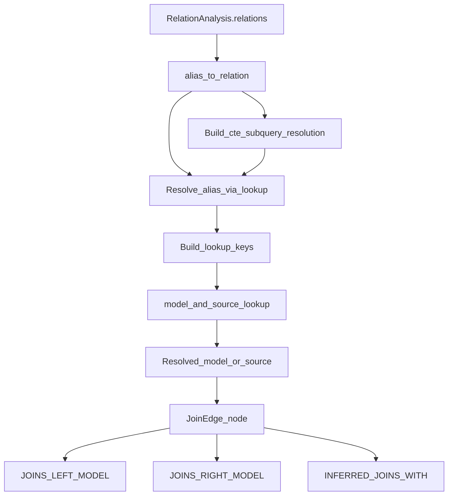
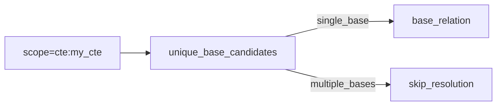

# Semantic Join Resolution

This document describes how semantic join resolution works during the SQL analysis ingest
pipeline, including model/source matching, CTE/subquery handling, and known limitations.

## Goals

- Resolve join aliases to concrete `DbtModel` or `DbtSource` nodes.
- Preserve physical/logical separation by resolving against graph metadata, not warehouse queries.
- Keep resolution conservative to avoid false positives.

## Where This Runs

Join resolution is part of the semantic analysis loader and runs after relation analysis
has extracted aliases, scopes, and base relation identifiers.

Key implementation:

- `typedef_data_intelligence/src/lineage/ingest/static_loaders/semantic/loader.py`
- `_collect_join_edges()` and `_resolve_alias_via_lookup()`

## High-Level Flow



## Resolution Strategy

### 1. Base Lookup Dictionary

We pre-build a lookup table from the graph:

- `DbtModel` names
- Physical relation names (`database.schema.relation_name`)
- `DbtSource` names

This yields a case-insensitive map of:

- `table`
- `schema.table`
- `database.schema.table`

Each entry maps to a `(node_id, node_label)` tuple so join edges can target either
`DbtModel` or `DbtSource`.

### 2. Alias → Relation Mapping

`RelationAnalysis.relations` is converted into an `alias_to_relation` mapping for the
current model. We only resolve aliases that represent concrete relations:

- `table`
- `view`
- `cte`
- `subquery`

### 3. CTE and Subquery Resolution

CTEs and subqueries are resolved only when the scope maps to a **single** underlying
base relation. This is intentionally conservative to avoid incorrect matches.



Resolution rules:

- CTE resolution uses the CTE name (from scope like `cte:my_cte`).
- Subquery resolution uses the subquery alias (from scope like `subquery:alias`).
- If multiple base relations appear in the same scope, no resolution occurs.

### 4. Join Edge Materialization

Resolved aliases are linked to `JoinEdge` nodes:

- `INFERRED_JOINS_WITH`: `DbtModel` or `DbtSource` → `JoinEdge`
- `JOINS_LEFT_MODEL` / `JOINS_RIGHT_MODEL`: `JoinEdge` → `DbtModel` or `DbtSource`

If only one side resolves, the join is marked partial.

## Debugging and Logging

When debug logging is enabled for `lineage.ingest.static_loaders.semantic.loader`,
we emit example unresolved pairs to spot systematic misses.

Example workflow for **semantic-only** analysis (no full ingest):

```bash
uv run python - <<'PY'
import logging, os
from pathlib import Path
from lineage.cli import load_ingest_config
from lineage.backends.lineage.factory import create_storage_for_cli
from lineage.backends.data_query.factory import create_data_backend_for_cli
from lineage.integration import LineageIntegration

logging.basicConfig(level=logging.DEBUG,
    format='%(asctime)s - %(name)s - %(levelname)s - %(message)s')
logging.getLogger("lineage.ingest.static_loaders.semantic.loader").setLevel(logging.DEBUG)

cfg = load_ingest_config(Path("typedef_data_intelligence/config.ingest.yml"))
storage = create_storage_for_cli(cfg.lineage)
data_backend = create_data_backend_for_cli(cfg.data, read_only=True)

base = Path(os.environ["GITHUB_DBT_PROJECT_LOCAL_PATH"]) / os.environ["GITHUB_DBT_PROJECT_REPO_NAME"]
if os.environ.get("DBT_PROJECT_ROOT"):
    base = base / os.environ["DBT_PROJECT_ROOT"]
artifacts_dir = base / "target"

LineageIntegration(
    storage,
    semantic_config=cfg.population.semantic_analysis,
    profiling_config=cfg.population.profiling,
    clustering_config=cfg.population.clustering,
    semantic_view_config=cfg.population.semantic_view_loader,
    data_backend=data_backend,
).reanalyze_semantics_only(artifacts_dir, skip_clustering=True, verbose=True)
PY
```

## Known Limitations

- **Multi-base CTEs**: we skip resolution when a CTE or subquery references multiple base
  relations.
- **Column-qualified inference**: we do not infer a base relation from join predicates.
- **CTE chains**: nested CTEs are only resolved if a single base relation can be proven.

## Future Work

- Heuristics for multi-base CTEs (dominant table selection or join predicate scoring).
- Optional source schema mapping to enable `schema.table` matching for sources.
- Column-level fallback when alias → base cannot be resolved.
- Persist CTE/subquery resolution decisions for auditability and tuning.
