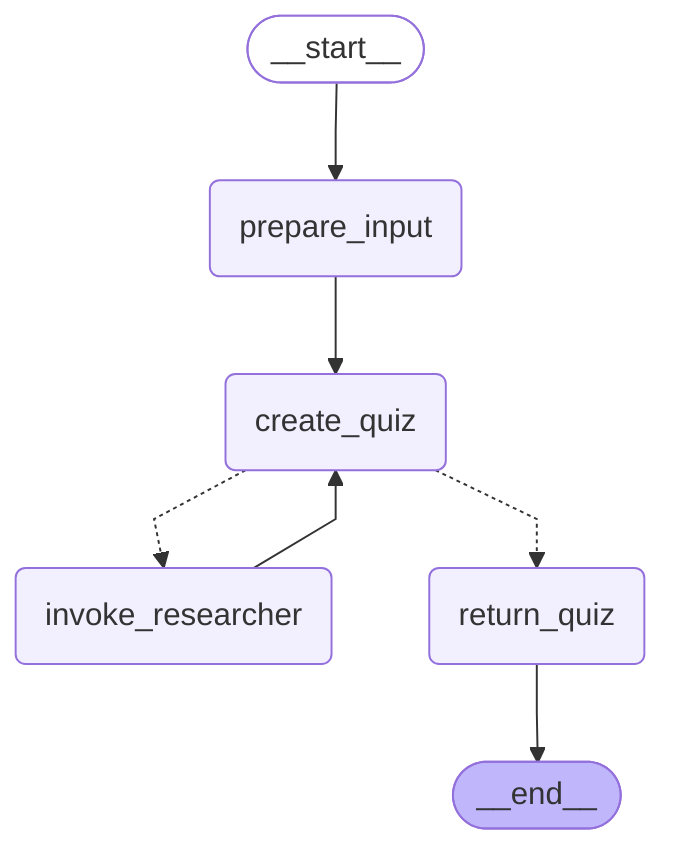
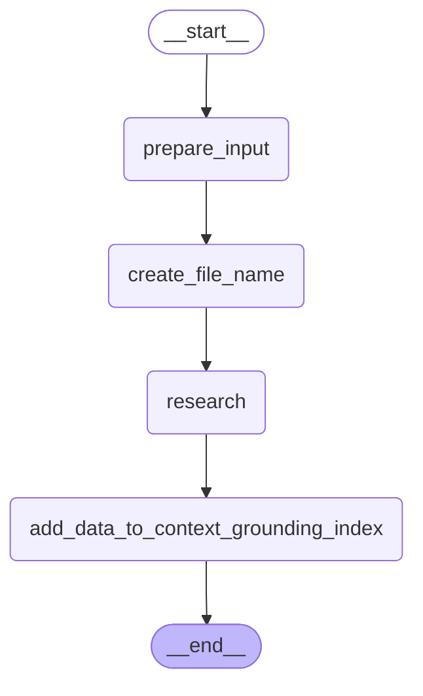

# RAG Sample

## Overview

The RAG Sample project demonstrates the implementation of a Retrieval-Augmented Generation (RAG) system using [UiPath Context Grounding](https://docs.uipath.com/automation-cloud/automation-cloud/latest/admin-guide/about-context-grounding).
The system comprises two langchain agents:
1. **Quiz-Generator-RAG-Agent**: Attempts to generate a quiz using the given topic, leveraging only the information obtained through RAG.
    In case it fails to gather sufficient relevant data, the system might opt to invoke the _Researcher-RAG-Agent_.
2. **Researcher-RAG-Agent**: Retrieves pertinent information from the Internet based on the provided search instructions and uploads
    it into a UiPath Context Grounding Index.

## System Architecture

The system utilizes LangGraph to create a directed graph of agents that can communicate and share state.

### Quiz Generator Agent Graph



### Researcher Agent Graph


## Agent Responsibilities

- **Quiz Generator Agent**:
  - Receives user topics and executes searches using RAG.
  - Decides if there is enough relevant information to generate a quiz.
  - May ask _Researcher Agent_ for additional information.
  - Returns final quiz to the user, complying to the requested output format _(question, difficulty, expected answer)_.

- **Researcher Agent**:
  - Retrieves information using a Tavily search tool.
  - Uploads the data to a storage bucket (that the Context Grounding Index relies on).
  - Triggers the  index ingestion.

## Steps to Execute Project on UiPath Cloud Platform
### Prerequisites
1. **Create an Orchestrator Storage Bucket**

For this demo we'll create it in the _Shared_ folder.


2. **Create a Context Grounding Index**

Next, we'll create a Context Grounding Index


When configuring _Index General Details_, we'll select the previously created storage bucket as data source.


That's it! Next, we'll deploy the agents.

### Deploy the agents
1. **Clone the Repository**
   ```bash
   git clone https://github.com/UiPath/uipath-langchain-python.git
   ```

2. **Navigate to the Sample Directory**
   - **Windows:**
     ```bash
     cd .\uipath-langchain-python\samples\RAG-quiz-generator
     ```

   - **Unix-like Systems (Linux, macOS):**
     ```bash
     cd ./uipath-langchain-python/samples/RAG-quiz-generator
     ```

3. **Create and Activate a Virtual Python Environment**
   ```bash
   pip install uv
   uv venv -p 3.11 .venv
   .venv\Scripts\activate  # Windows
   source .venv/bin/activate  # Unix-like Systems
   uv sync
   ```

4. **Authenticate with UiPath Cloud Platform**
   ```bash
   uipath auth
   ```
   > **Note:** After successful authentication in the browser, select the tenant for publishing the agent package.
```
👇 Select tenant:
  0: DefaultTenant
  1: Tenant2
  2: Tenant3
...
Select tenant: 2
```

5. **Package and Publish Agents**
   ```bash
   uipath pack
   uipath publish --my-workspace
   ```
```
⠋ Publishing most recent package: RAG-agents.1.0.0.nupkg ...
✓  Package published successfully!
⠇ Getting process information ...
🔗 Process configuration link: [LINK]
💡 Use the link above to configure any environment variables
```
> Note: when publishing to _my-workspace_ a process will be auto-provisioned for you.
> However, our package contains 2 agents (i.e. 2 entrypoints) thus we'll need to create an additional process.

6. **Configure Agent Processes in Orchestrator**

Follow the returned URL from the publish command:

1. **Researcher Agent**

Make sure _researcher-RAG-agent_ entrypoint is selected, set TAVILY and ANTHROPIC api keys and click on **Next**.


> Note: We can leave everything empty in the _input_ section.

On the _package requirements_ page click **Next**.


> Make sure the process name is _researcher-RAG-agent_.

2. **Quiz Generator Agent**

Lastly, we need to create the quiz generator agent.
Create a new process in _my-workspace_.


7. **Run the agents on UiPath Cloud Platform**

We can run the agent from _Processes_ page


> ℹ️ Here is how we can easily copy any folder path.


8. **Conclusions**

We can monitor our agent execution from the job info panel.


_Quiz-generator-RAG-agent_ may choose to invoke researcher agent
multiple times before creating the quiz. The output should look like this:


We can also check the storage bucket content.


This is the information fetched by our _researcher agent_ that the _quiz generator_ used to create the quiz using RAG.
We can download this file/files to analyze them.


## Local Debugging
You can locally debug individual agents by invoking them directly:

#### Researcher Agent
Run the researcher agent with:

```bash
uipath run researcher-RAG-agent '{"search_instructions":"Need data about spanish cuisine", "index_name":"sample-RAG-index", "index_folder_path":"<index_folder_path>"}'
# or use .json file input
uipath run researcher-RAG-agent -f input.example/researcher-debug-input.json
```
> **_NOTE:_**  This assumes that an index named _sample-RAG-index_ is created in the folder identified by the index_folder_path parameter.


#### Quiz Generator Agent
Run the quiz generator agent with:

```bash
uipath run quiz-generator-RAG-agent '{"quiz_topic":"spanish cuisine", "index_name":"sample-RAG-index", "index_folder_path":"<index_folder_path>"}'
# or use .json file input
uipath run quiz-generator-RAG-agent -f input.example/quiz-generator-debug-input.json
```
> **_NOTE:_**  This assumes that an agent named _researcher-RAG-agent_ is created in the folder identified by the folder_path parameter passed to _InvokeProcess_ method.
> <br> ℹ️ check [researcher-RAG-agent.py](src/agents/quiz-generator-RAG-agent.py) file.

