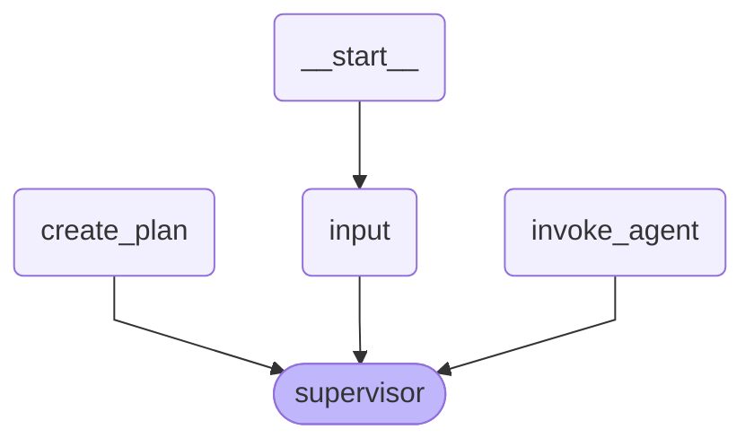
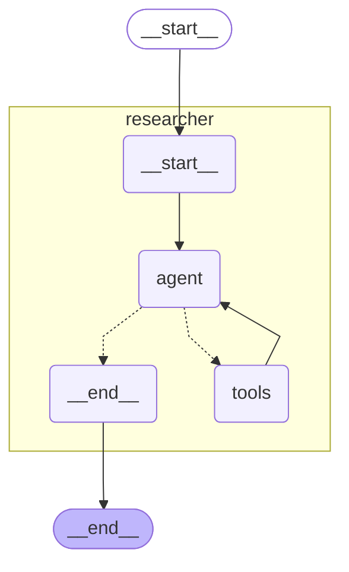
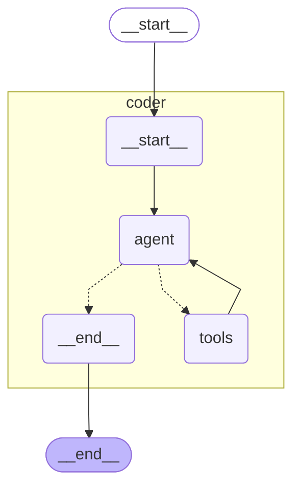

# Multi-Agent Task Execution System

This repository implements a multi-agent system that decomposes complex tasks into discrete steps, routing them to specialized agents for execution. The system comprises three main components:

1. **Planner Agent**: Orchestrates the workflow by planning task execution and routing subtasks to worker agents.
2. **Researcher Agent**: Gathers information, formulas, and reference materials without performing calculations.
3. **Coder Agent**: Executes calculations and evaluates formulas with specific values.

Each agent operates independently and can be deployed as a separate process, while still being packaged together as part of an Orchestrator Agent Package.

## System Architecture

The system utilizes LangGraph to create a directed graph of agents that can communicate and share state.

### Planner Agent Graph


### Researcher Agent Graph


### Coder Agent Graph


## Agent Responsibilities

- **Planner Agent**:
  - Takes user questions and formulates execution plans.
  - Routes tasks to appropriate worker agents.
  - Manages execution flow and state tracking.
  - Returns final results to the user.

- **Researcher Agent**:
  - Retrieves information using a Tavily search tool.
  - Provides factual content, definitions, and formulas.
  - Does not perform calculations (strictly enforced).

- **Coder Agent**:
  - Executes calculations using Python code.
  - Evaluates formulas with specific input values.
  - Returns precise numerical results.

## Usage

### Running the System

To run the entire system, use the following command with the complete JSON input:

```bash
uipath run planner '{"question": "First, please state the Pythagorean theorem. Give only the formula, using variables a, b, and c. Then apply this formula to calculate the value when a=2 and b=3."}'
```

### Debugging Individual Agents

You can debug individual agents by invoking them directly:

#### Researcher Agent
Run the researcher agent with:

```bash
uipath run researcher '{\"messages":[{\"content\":\"State the Pythagorean theorem formula using variables a, b, and c\",\"type\":\"human\"}]}'
```

#### Coder Agent
Run the coder agent with:

```bash
uipath run coder '{"messages":[{"content":"Let me help you state the Pythagorean theorem formula. The Pythagorean theorem is a fundamental mathematical formula that describes the relationship between the sides of a right triangle.\n\nThe formula is:\n\na² + b² = c²\n\nWhere:\n- a and b are the lengths of the two legs (the sides adjacent to the right angle)\n- c is the length of the hypotenuse (the longest side, opposite to the right angle).","type":"human","name":"researcher-agent"},{"content":"Calculate the result using the formula when a=2 and b=3","type":"human"}]}'
```

## Sample Workflow

1. User submits a question about the Pythagorean theorem.
2. Planner creates an execution plan with two steps:
   - Step 1: Researcher agent retrieves the Pythagorean theorem formula.
   - Step 2: Coder agent applies the formula to calculate the result for a=2, b=3.
3. Planner executes Step 1 by invoking the researcher agent.
4. Researcher agent returns the formula a² + b² = c².
5. Planner executes Step 2 by invoking the coder agent.
6. Coder agent calculates c = √(2² + 3²) = √(4 + 9) = √13 ≈ 3.606.
7. Planner combines the responses and returns the final answer to the user.

## Steps to Execute Project on UiPath Cloud Platform

1. **Clone the Repository**
   ```bash
   git clone https://github.com/UiPath/uipath-langchain-python.git
   ```

2. **Navigate to the Sample Directory**
   - **Windows:**
     ```bash
     cd .\uipath-langchain-python\samples\multi-agent-planner-researcher-coder-distributed
     ```

   - **Unix-like Systems (Linux, macOS):**
     ```bash
     cd ./uipath-langchain-python/samples/multi-agent-planner-researcher-coder-distributed
     ```

3. **Create and Activate a Virtual Python Environment**
   ```bash
   pip install uv
   uv venv -p 3.11 .venv
   .venv\Scripts\activate  # Windows
   source .venv/bin/activate  # Unix-like Systems
   uv sync
   ```

4. **Authenticate with UiPath Cloud Platform**
   ```bash
   uipath auth
   ```
   > **Note:** After successful authentication in the browser, select the tenant for publishing the agent package.
```
👇 Select tenant:
  0: DefaultTenant
  1: Tenant2
  2: Tenant3
...
Select tenant: 2
```

5. **Package and Publish Agents**
   ```bash
   uipath pack
   uipath publish
   ```
Select the feed to publish your package:
```
👇 Select package feed:
  0: Orchestrator Tenant Processes Feed
  1: Orchestrator Folder1 Feed
  2: Orchestrator Folder2 Feed
  3: Orchestrator Personal Workspace Feed
  ...
Select feed number: 3
```
> Note: When publishing to personal workspace feed, a process will be auto-created for you.

6. **Create Agent Processes in Orchestrator**
   - **Planner Agent**
     
     

   - **Researcher Agent**
     
     

   - **Coder Agent**
     
     

   > **Note:** Ensure that the display names for the coder and researcher agent processes are *coder-agent* and *researcher-agent*,
        and that all 3 agents are placed in the same folder.

    > **Warning:** An agent can invoke itself if needed, but this must be done with caution. Be mindful that using the same name for invocation may lead to unintentional loops. To prevent recursion issues, implement safeguards like exit conditions.

7. **Run the Planner Agent with Any Input Question**
   > **Tip:** For a five-step action plan, consider using the following input:
   ```
   Could you find a Python solution for the N-Queens puzzle for N=8? Please analyze why this solution works,
   considering the key programming concepts it employs.
   Then, revise the solution to handle a dynamic value of N, where N is any positive integer.
   After that, research the time and space complexity of this new solution.
   Lastly, demonstrate this revised Python solution with N=10.
   ```

## Implementation Details

The system is implemented using:

- LangGraph for agent orchestration
- LangChain for agent creation and tool integration
- Claude 3.5 Sonnet for LLM capabilities
- Tavily for search functionality in the researcher agent
- Python REPL for code execution in the coder agent

## Requirements

- Python 3.11+
- LangGraph
- LangChain
- Anthropic API key
- Tavily API key
