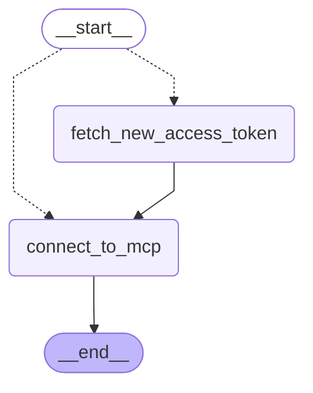

# LangGraph Agent with OAuth and MCP Servers

This project demonstrates how to build a LangGraph agent that connects to a remote UiPath MCP server, using an external UiPath application to handle OAuth authentication.

## Overview

The agent uses:
- UiPathChat with Claude 3.5 Sonnet as the language model
- LangGraph for orchestration
- Remote tool execution via UiPath MCP server
- Dynamic access token refresh through client credentials grant (OAuth)

## Architecture



The workflow follows a ReAct pattern:
1. Query is sent to the agent
2. The agent first attempts to connect to the remote MCP server using the current `UIPATH_ACCESS_TOKEN`.
3. If the token is missing or expired, the workflow triggers a call to the UiPath external application endpoint to fetch a fresh token and stores it in the environment.
4. Once connected, the MCP tools are loaded into the ReAct agent.
5. The agent receives both system context and the human task, deciding whether to invoke tools or provide a direct answer.
6. The process repeats until the agent has enough information to produce a final response.
7. The response is collected and returned as the workflow output.

## Prerequisites

- Python 3.11+
- `uipath-langchain`
- `langchain-mcp-adapters`
- `langgraph`
- `httpx`
- `python-dotenv`
- UiPath OAuth credentials and MCP server URL in environment
- UiPath external application configured with `OR.Jobs` scope (or appropriate scope for your MCP server)

## Installation

```bash
uv venv -p 3.11 .venv
.venv\Scripts\activate
uv sync
```

Set your MCP Remote Server URL and client secret as environment variables in .env

```bash
UIPATH_CLIENT_SECRET=your_client_secret
UIPATH_MCP_SERVER_URL=https://your-uipath-instance/account/tenant/mcp_/mcp/server_slug
```

Configure the following constants in `main.py`:
- `UIPATH_CLIENT_ID` - Your external application client ID
- `UIPATH_URL` - Your UiPath instance base URL
- `UIPATH_SCOPE` - OAuth scope (default: `OR.Jobs`)

## Debugging

For debugging issues:

1. Check logs for any connection or runtime errors:
   ```bash
   uipath run agent --debug '{"task": "What is 2 + 2?"}'
   ```


