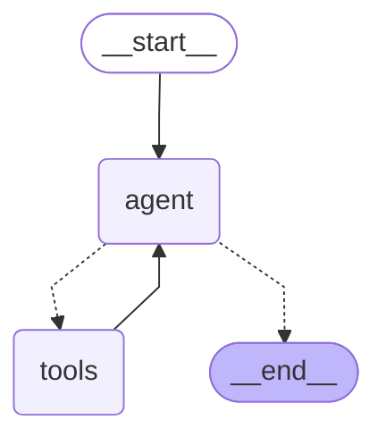

# LangGraph Agent with Claude and Tool MCP Servers

This project demonstrates how to create an agent using LangGraph with Claude 3.5 Sonnet and multiple tool servers using the MCP (Model Context Protocol) standard.

## Overview

The agent uses:
- Claude 3.5 Sonnet as the language model
- LangGraph for orchestration
- Multiple MCP tool servers:
  - Math server for mathematical operations
  - Weather server for weather data retrieval

## Architecture



The workflow follows a ReAct pattern:
1. Query is sent to the agent (Claude)
2. Agent decides whether to use tools or provide a final answer
3. If tools are needed, the request is sent to the appropriate tool server
4. Results from tools are sent back to the agent
5. Process repeats until the agent has enough information to provide a final answer

## Prerequisites

- Python 3.11+
- `langchain-anthropic`
- `langchain-mcp-adapters`
- `langgraph`
- Anthropic API key set as an environment variable

## Installation

```bash
uv venv -p 3.11 .venv
.venv\Scripts\activate
uv sync
```

Set your API keys as environment variables in .env

```bash
ANTHROPIC_API_KEY=your_anthropic_api_key
```

## Usage

1. Ensure your tool servers are implemented correctly (see `math_server.py` and `weather_server.py`)
2. Run the agent with a query:

```bash
uipath run agent '{"messages": [{"type": "human", "content": "What is 2+2"}]}'
```

## Debugging

For debugging issues:

1. Check that your MCP servers are running correctly:
   ```bash
   python math_server.py  # Run standalone to verify it works
   python weather_server.py
   ```

2. Check logs for any connection or runtime errors:
   ```bash
   uipath run agent --debug '{"messages": [{"type": "human", "content": "What is 2+2"}]}'
   ```

## Extending with New Tools

To add a new tool:

1. Create a new MCP-compatible server (similar to math_server.py)
2. Add it to the MultiServerMCPClient configuration dictionary
3. The agent will automatically discover and use the new tool's capabilities
