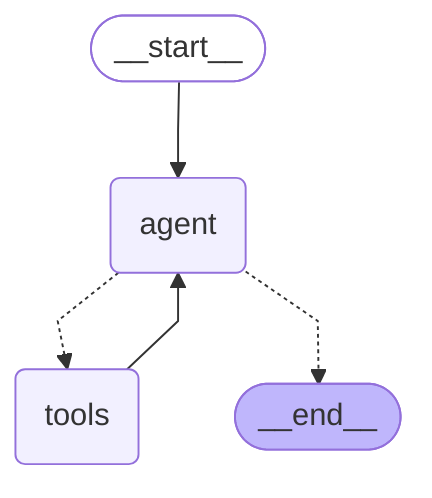

# LangGraph Agent with Claude and Tool MCP Servers

This project demonstrates how to create an agent using LangGraph with Claude 3.5 Sonnet which connects to a Remote MCP Server.

## Overview

The agent uses:
- Claude 3.5 Sonnet as the language model
- LangGraph for orchestration
- Connects to a Remote MCP server

## Architecture



The workflow follows a ReAct pattern:
1. Query is sent to the agent (Claude)
2. Agent decides whether to use tools or provide a final answer
3. If tools are needed, the request is sent to the remote MCP server
4. Results from tools are sent back to the agent
5. Process repeats until the agent has enough information to provide a final answer

## Prerequisites

- Python 3.11+
- `langchain-anthropic`
- `langchain-mcp-adapters`
- `langgraph`
- Anthropic API key set as an environment variable

## Installation

```bash
uv venv -p 3.11 .venv
.venv\Scripts\activate
uv sync
```

Set your API keys and MCP Remote Server URL as environment variables in .env

```bash
ANTHROPIC_API_KEY=your_anthropic_api_key
UIPATH_MCP_SERVER_URL=https://alpha.uipath.com/account/tenant/mcp_/mcp/server_slug/sse
```

## Debugging

For debugging issues:

1. Check logs for any connection or runtime errors:
   ```bash
   uipath run agent --debug '{"messages": [{"type": "human", "content": "What is 2+2"}]}'
   ```


