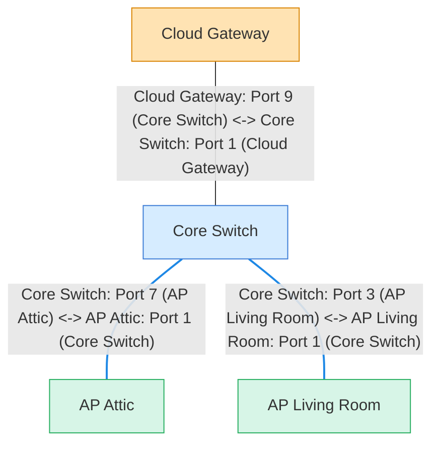

# unifi-network-maps

[](https://github.com/merlijntishauser/unifi-network-maps/actions/workflows/ci.yml)
[](https://github.com/merlijntishauser/unifi-network-maps/actions/workflows/codeql.yml)
[](https://github.com/merlijntishauser/unifi-network-maps/actions/workflows/publish.yml)
[](https://pypi.org/project/unifi-network-maps/)

Dynamic UniFi network maps generated from LLDP topology. Output can be a range of options including Markdown,
Mermaid, SVG (including an Isometric view), and MkDocs.

Python 3.12+ is supported (3.13 preferred).

## Installation

PyPI:

```bash
pip install unifi-network-maps
```

From source:

```bash
python -m venv .venv
source .venv/bin/activate
pip install -r requirements-build.txt
pip install .
```

## Configuration

Set environment variables (no secrets in code). The CLI loads `.env` automatically if present:

```bash
export UNIFI_URL=https://192.168.1.1
export UNIFI_SITE=default
export UNIFI_USER=local_admin
export UNIFI_PASS=********
export UNIFI_VERIFY_SSL=false
export UNIFI_REQUEST_TIMEOUT_SECONDS=10
```

Use a custom env file:

```bash
unifi-network-maps --env-file ./site.env --stdout
```

## Quickstart

Basic map (tree layout by LLDP hops):

```bash
unifi-network-maps --stdout
```

Write Markdown for notes tools:

```bash
unifi-network-maps --markdown --output ./network.md
```

## Usage

Show ports + clients:

```bash
unifi-network-maps --include-ports --include-clients --stdout
```

SVG output (orthogonal layout + icons):

```bash
unifi-network-maps --format svg --output ./network.svg
```

Isometric SVG output:

```bash
unifi-network-maps --format svg-iso --output ./network.svg
```

MkDocs output (ports included, no clients):

```bash
unifi-network-maps --format mkdocs --output ./docs/unifi-network.md
```

MkDocs output with clients:

```bash
unifi-network-maps --format mkdocs --include-clients --output ./docs/unifi-network.md
```

MkDocs output with dual Mermaid blocks for Material theme switching:

```bash
unifi-network-maps --format mkdocs --mkdocs-dual-theme --output ./docs/unifi-network.md
```

LLDP tables for troubleshooting:

```bash
unifi-network-maps --format lldp-md --output ./lldp.md
```

Legend only:

```bash
unifi-network-maps --legend-only --stdout
```

JSON payload (devices + clients + VLAN inventory):

```bash
unifi-network-maps --format json --output ./payload.json
```

## Home Assistant integration

The live Home Assistant integration (Config Flow + coordinator + custom card) lives in a separate repo:
- https://github.com/merlijntishauser/unifi-network-maps-ha

## Examples (mock data)

These examples are generated from `examples/mock_data.json` (safe, anonymized fixture).
Mock generation requires dev dependencies (`pip install -r requirements-dev.txt -c constraints.txt`).
Regenerate the fixture + SVG with `make mock-data`.

Generate mock data (dev-only, uses Faker):

```bash
unifi-network-maps --generate-mock examples/mock_data.json --mock-seed 1337
```

Generate the isometric SVG:

```bash
unifi-network-maps --mock-data examples/mock_data.json   --include-ports --include-clients --format svg-iso   --output examples/output/network_ports_clients_iso.svg
```


Mermaid example with ports:



## MkDocs Material example

See `examples/mkdocs/` for a ready-to-use setup that renders Mermaid diagrams
with Material for MkDocs, including a sample `unifi-network` page and legend.

The built-in themes live at `src/unifi_network_maps/assets/themes/default.yaml` and
`src/unifi_network_maps/assets/themes/dark.yaml`.


## Options

The CLI groups options by category (`Source`, `Functional`, `Mermaid`, `SVG`, `Output`, `Debug`).

Source:
- `--site`: override `UNIFI_SITE`.
- `--env-file`: load environment variables from a specific `.env` file.
- `--mock-data`: use mock data JSON instead of the UniFi API.

Mock:
- `--generate-mock`: write mock data JSON and exit.
- `--mock-seed`: seed for deterministic mock generation.
- `--mock-switches`: number of switches to generate.
- `--mock-aps`: number of access points to generate.
- `--mock-wired-clients`: number of wired clients to generate.
- `--mock-wireless-clients`: number of wireless clients to generate.

Functional:
- `--include-ports`: show port labels (Mermaid shows both ends; SVG shows compact labels).
- `--include-clients`: add active wired clients as leaf nodes.
- `--client-scope wired|wireless|all`: which client types to include (default wired).
- `--only-unifi`: only include neighbors that are UniFi devices; when clients are included, filters to UniFi-managed clients (by explicit UniFi flags or vendor/OUI).
- `--no-cache`: disable UniFi API cache reads and writes.

Mermaid:
- `--direction LR|TB`: diagram direction for Mermaid (default TB).
- `--group-by-type`: group nodes by gateway/switch/AP in Mermaid subgraphs.
- `--legend-scale`: scale legend font/link sizes for Mermaid outputs (default 1.0).
- `--legend-style auto|compact|diagram`: legend rendering mode (auto uses compact for mkdocs).
- `--legend-only`: render just the legend as a separate Mermaid graph (Mermaid only).

SVG:
- `--svg-width/--svg-height`: override SVG output dimensions.
- `--theme-file`: load a YAML theme for Mermaid + SVG colors (see `examples/theme.yaml` and `examples/theme-dark.yaml`).

Output:
- `--format mermaid|svg|svg-iso|lldp-md|mkdocs|json`: output format (default mermaid).
- `--stdout`: write output to stdout.
- `--markdown`: wrap Mermaid output in a code fence.
- `--mkdocs-sidebar-legend`: write assets to place the compact legend in the MkDocs right sidebar.
- `--mkdocs-dual-theme`: render light/dark Mermaid blocks for Material theme switching.
- `--mkdocs-timestamp-zone`: timezone for mkdocs timestamp (`Europe/Amsterdam` default; use `off` to disable).

Debug:
- `--debug-dump`: dump gateway + sample devices to stderr for debugging.
- `--debug-sample N`: number of non-gateway devices in debug dump (default 2).

## Theme file

Example theme YAML (override only the values you want):

```yaml
mermaid:
  nodes:
    gateway:
      fill: "#ffe3b3"
      stroke: "#d98300"
  poe_link: "#1e88e5"
svg:
  links:
    standard:
      from: "#2ecc71"
      to: "#1b8f4a"
    poe:
      from: "#1e88e5"
      to: "#0d47a1"
  nodes:
    switch:
      from: "#d6ecff"
      to: "#b6dcff"
```

## Notes

- Default output is top-to-bottom (TB) and rendered as a hop-based tree from the gateway(s).
- Nodes are color-coded by type (gateway/switch/AP/client) with a sensible default palette.
- PoE links are highlighted in blue and annotated with a power icon when detected from `port_table`.
- Wireless client links render as dashed lines to indicate the last-known upstream.
- SVG output uses vendored device glyphs from `src/unifi_network_maps/assets/icons`.
- Isometric SVG output uses MIT-licensed icons from `markmanx/isopacks`.
- SVG port labels render inside child nodes for readability.


## AI Disclosure

This project used OpenAI Codex as a coding assistant for portions of the implementation and documentation.
