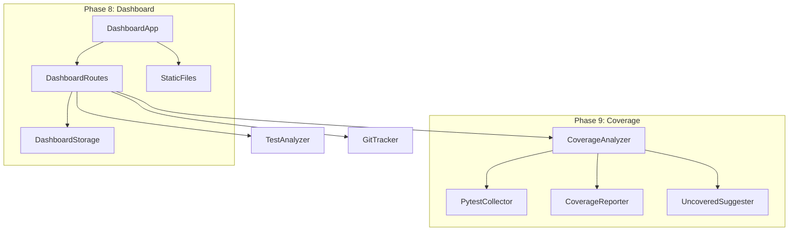

# Phase 8 & 9 实现方案

## 开发顺序

建议先实现 Phase 9（覆盖率分析），因为 Dashboard 需要覆盖率数据作为核心数据源。

---

## Phase 9: 覆盖率分析

### 模块结构

```
src/verify_ai/coverage/
├── __init__.py           # 导出公共接口
├── analyzer.py           # CoverageAnalyzer 主类
├── collectors.py         # 覆盖率收集器（pytest-cov 集成）
├── reporter.py           # 报告生成（HTML/JSON/Console）
└── models.py             # 数据模型（CoverageReport, FileMetrics）
```

### 核心类设计

**CoverageAnalyzer** - 主分析器

- `run_with_coverage(test_path)` - 运行测试并收集覆盖率
- `analyze_uncovered(project_path)` - 分析未覆盖代码
- `suggest_tests_for_uncovered()` - 为未覆盖代码建议测试

**CoverageReport** - 报告模型

- `total_lines` / `covered_lines` / `coverage_percent`
- `file_reports: list[FileMetrics]`
- `uncovered_functions: list[FunctionInfo]`

### CLI 命令

```bash
vai coverage [PATH]           # 运行覆盖率分析
vai coverage --threshold 80   # 设置阈值，低于则失败
vai coverage --format html    # 输出格式（html/json/text）
vai coverage --suggest        # 建议需要添加测试的函数
```

### API 端点

- `POST /api/coverage` - 运行覆盖率分析
- `GET /api/coverage/report` - 获取最新报告
- `GET /api/coverage/uncovered` - 获取未覆盖函数列表

### 关键实现

使用 `coverage.py` 库（已是 Python 生态标准）：

```python
# collectors.py
import coverage

class PytestCoverageCollector:
    def run(self, test_path: Path, source_path: Path) -> CoverageData:
        cov = coverage.Coverage(source=[str(source_path)])
        cov.start()
        # 运行 pytest
        pytest.main([str(test_path)])
        cov.stop()
        return self._parse_results(cov)
```

### 配置扩展

在 [verify-ai.yaml](examples/sample_project/verify-ai.yaml) 中添加：

```yaml
coverage:
  enabled: true
  threshold: 80.0
  exclude: ["tests/", "examples/"]
  formats: ["html", "json"]
```

---

## Phase 8: Web Dashboard

### 模块结构

```
src/verify_ai/dashboard/
├── __init__.py           # 导出 create_app
├── app.py                # FastAPI 应用
├── routes.py             # Dashboard API 路由
├── storage.py            # 数据存储（SQLite）
├── models.py             # 数据模型
└── static/               # 前端静态文件
    ├── index.html        # 主页面
    ├── css/
    │   └── style.css
    └── js/
        └── dashboard.js
```

### Dashboard 功能

1. **项目概览**
  - 测试通过率
  - 代码覆盖率趋势
  - 最近验证结果
2. **覆盖率视图**
  - 文件级别覆盖率热力图
  - 未覆盖代码高亮
  - 覆盖率历史趋势图
3. **测试执行历史**
  - 测试执行记录列表
  - 失败测试详情
  - 修复建议
4. **Git 集成视图**
  - 提交关联的测试结果
  - PR 验证状态

### CLI 命令

```bash
vai dashboard                 # 启动 Dashboard（默认 8080 端口）
vai dashboard --port 3000     # 指定端口
vai dashboard --no-browser    # 不自动打开浏览器
```

### API 端点

- `GET /dashboard/` - 返回 Dashboard 主页面
- `GET /api/dashboard/stats` - 项目统计数据
- `GET /api/dashboard/coverage/trend` - 覆盖率趋势
- `GET /api/dashboard/tests/history` - 测试执行历史
- `GET /api/dashboard/commits` - 提交与测试关联

### 技术选型

- **后端**: FastAPI（复用现有框架）
- **前端**: 纯 HTML + CSS + JavaScript（轻量级，无需构建工具）
- **图表**: Chart.js（CDN 引入）
- **数据存储**: SQLite（`~/.verify-ai/dashboard.db`）

### 数据收集

在 `vai verify` 执行后自动记录数据：

```python
# 在 cli.py 的 verify 命令中
def verify(...):
    result = run_verification(...)
    # 自动保存到 Dashboard 数据库
    DashboardStorage().save_verification_result(result)
```

---

## 依赖关系




---

## 新增依赖

```toml
# pyproject.toml
dependencies = [
    # ... 现有依赖
    "coverage>=7.0.0",        # 覆盖率分析
]

[project.optional-dependencies]
dashboard = [
    "aiosqlite>=0.19.0",      # 异步 SQLite
]
```

---

## 测试文件

```
tests/
├── test_coverage.py          # 覆盖率模块测试
└── test_dashboard.py         # Dashboard 模块测试
```

---

## 文件修改清单

### Phase 9 新增文件

- `src/verify_ai/coverage/__init__.py`
- `src/verify_ai/coverage/analyzer.py`
- `src/verify_ai/coverage/collectors.py`
- `src/verify_ai/coverage/reporter.py`
- `src/verify_ai/coverage/models.py`
- `tests/test_coverage.py`

### Phase 8 新增文件

- `src/verify_ai/dashboard/__init__.py`
- `src/verify_ai/dashboard/app.py`
- `src/verify_ai/dashboard/routes.py`
- `src/verify_ai/dashboard/storage.py`
- `src/verify_ai/dashboard/models.py`
- `src/verify_ai/dashboard/static/index.html`
- `src/verify_ai/dashboard/static/css/style.css`
- `src/verify_ai/dashboard/static/js/dashboard.js`
- `tests/test_dashboard.py`

### 现有文件修改

- [cli.py](src/verify_ai/cli.py) - 添加 `coverage` 和 `dashboard` 命令
- [server/api.py](src/verify_ai/server/api.py) - 添加覆盖率 API 端点
- [config.py](src/verify_ai/config.py) - 添加 `CoverageConfig` 和 `DashboardConfig`
- [pyproject.toml](pyproject.toml) - 添加新依赖
- [README.md](README.md) - 更新路线图状态

