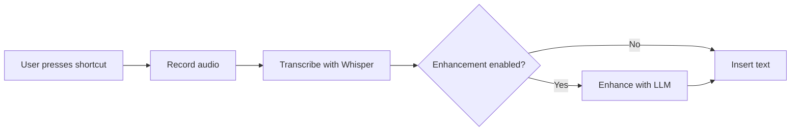
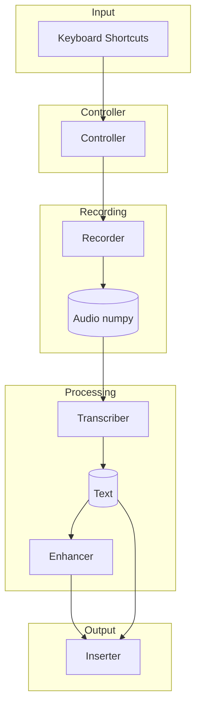
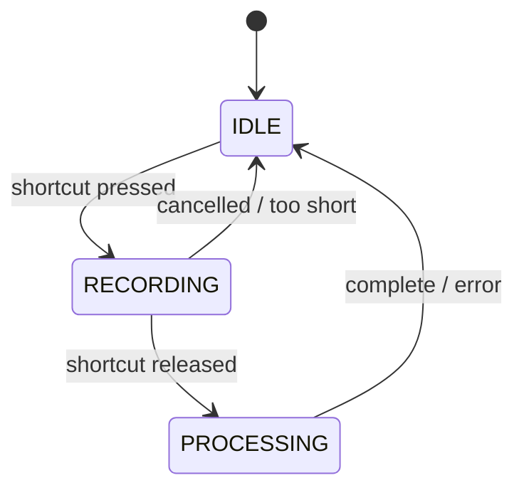

# WhOSSpr Flow

Open Source Speech-to-Text for macOS - A clone of Whispr Flow.

## Features

| Feature | Description |
|---------|-------------|
| Local Whisper transcription | Uses OpenAI Whisper models locally for privacy |
| Configurable model sizes | Choose from tiny, base, small, medium, or large models |
| Keyboard shortcuts | Hold-to-dictate or toggle dictation modes |
| Universal text injection | Works with any application (browsers, terminals, editors) |
| Optional LLM enhancement | Improve transcribed text with OpenAI-compatible APIs |
| JSON configuration | Easy setup via config files or command-line parameters |

## Quick Start

```bash
# 1. Install WhOSSpr (no system dependencies needed)
uv sync

# 2. Create default configuration
uv run whosspr config --init

# 3. Check permissions (grant when prompted)
uv run whosspr check

# 4. Start dictation service
uv run whosspr start
```

## Default Shortcuts

| Shortcut | Action |
|----------|--------|
| `Ctrl+Cmd+1` (hold) | Hold to record, release to transcribe |
| `Ctrl+Cmd+2` | Toggle dictation on/off |

## Configuration

Copy `config.example.json` to `whosspr.json` and customize:

```json
{
  "whisper": {
    "model_size": "base",
    "language": "en",
    "device": "auto"
  },
  "shortcuts": {
    "hold_to_dictate": "ctrl+cmd+1",
    "toggle_dictation": "ctrl+cmd+2"
  },
  "enhancement": {
    "enabled": false,
    "api_base_url": "https://api.openai.com/v1",
    "api_key": "",
    "model": "gpt-4o-mini"
  }
}
```

## Whisper Model Sizes

| Model | Size | Speed | Accuracy | VRAM |
|-------|------|-------|----------|------|
| tiny | 39M | Fastest | Basic | ~1GB |
| base | 74M | Fast | Good | ~1GB |
| small | 244M | Medium | Better | ~2GB |
| medium | 769M | Slow | Great | ~5GB |
| large | 1.5B | Slowest | Best | ~10GB |
| turbo | 809M | Fast | High | ~6GB |

**Recommendation:** Start with `base` for a balance of speed and accuracy.

## Requirements

| Requirement | Details |
|-------------|---------|
| OS | macOS 10.14+ (optimized for Apple Silicon) |
| Python | 3.12+ |
| Permissions | Microphone access, Accessibility access |
| RAM | 2GB+ (more for larger models) |

## Installation

### Using uv (recommended)

```bash
uv sync
```

### Using pip

```bash
pip install -e .
```

## Permissions Setup

WhOSSpr requires two macOS permissions:

| Permission | Purpose | How to Grant |
|------------|---------|--------------|
| Microphone | Record audio | System Preferences → Privacy → Microphone → Enable Terminal |
| Accessibility | Insert text | System Preferences → Privacy → Accessibility → Add Terminal |

Verify with:
```bash
uv run whosspr check
```

## Usage

### Starting the Service

```bash
uv run whosspr start
```

### Command-line Options

| Option | Description |
|--------|-------------|
| `--model` | Whisper model size (tiny/base/small/medium/large/turbo) |
| `--language` | Language code (e.g., en, es, fr) |
| `--device` | Device for inference (auto/cpu/mps/cuda) |
| `--enhancement` | Enable LLM text enhancement |
| `--api-key` | API key for enhancement |

### Examples

```bash
# Use small model with Spanish
uv run whosspr start --model small --language es

# Use MPS (Apple Silicon GPU)
uv run whosspr start --device mps

# Enable enhancement
uv run whosspr start --enhancement --api-key sk-xxx
```

## Text Enhancement

WhOSSpr can improve transcribed text using an OpenAI-compatible API:

```bash
# Using OpenAI
export OPENAI_API_KEY=sk-your-api-key
uv run whosspr start --enhancement

# Using local LLM (Ollama)
uv run whosspr start --enhancement \
  --api-key ollama \
  --api-base-url http://localhost:11434/v1
```

## Troubleshooting

| Problem | Solution |
|---------|----------|
| Permission denied | Run `whosspr check`, grant permissions, restart terminal |
| No audio input | Check microphone connection and permissions |
| Text not appearing | Verify Accessibility permission, try different app |
| Model download fails | Check internet, try `--model tiny` |
| High CPU/memory | Use smaller model, try `--device mps` on Apple Silicon |

## Development

### Running Tests

```bash
# All automated tests
uv run pytest

# With coverage
uv run pytest --cov=whosspr

# Manual E2E tests (interactive)
WHOSSPR_MANUAL_TESTS=1 uv run pytest tests/test_e2e_manual.py -v -s
```
## License

Apache 2.0

# Architecture

This document describes the architecture of WhOSSpr Flow, an open-source speech-to-text application for macOS.

## Overview

WhOSSpr Flow captures audio from the microphone, transcribes it using OpenAI Whisper, optionally enhances the text with an LLM, and inserts the result into the active application.



## Module Structure

| Module | Lines | Description |
|--------|-------|-------------|
| `cli.py` | 284 | Command-line interface (Typer) |
| `controller.py` | 255 | Main orchestration logic |
| `enhancer.py` | 206 | LLM text enhancement (OpenAI API) |
| `config.py` | 180 | Configuration schema and loading |
| `keyboard.py` | 173 | Global keyboard shortcuts (pynput) |
| `transcriber.py` | 116 | Speech-to-text (Whisper) |
| `recorder.py` | 115 | Audio recording (sounddevice) |
| `permissions.py` | 58 | macOS permission checks |
| `inserter.py` | 53 | Text insertion via clipboard |
| `__init__.py` | 4 | Package version |
| **Total** | **1444** | |

## Module Responsibilities

| Module | Responsibility |
|--------|---------------|
| `cli.py` | Argument parsing, config loading, permission checks, service lifecycle, Rich console feedback |
| `config.py` | Type-safe Pydantic schema, JSON loading/saving, defaults, config file discovery |
| `controller.py` | State management (IDLE→RECORDING→PROCESSING), shortcut-to-recording connection, transcription pipeline |
| `recorder.py` | Callback-based non-blocking recording, 16kHz float32 audio, start/stop/cancel, duration tracking |
| `transcriber.py` | Lazy model loading, device auto-detection (CUDA/MPS/CPU), model size support, memory management |
| `keyboard.py` | Shortcut parsing ("ctrl+cmd+1"), hold/toggle modes, modifier normalization, callback invocation |
| `inserter.py` | Copy to clipboard, paste with Cmd+V, universal application support |
| `enhancer.py` | OpenAI-compatible API, API key resolution, custom prompts, grammar/punctuation improvement |
| `permissions.py` | Microphone access check, accessibility access check, pass/fail status |

## Data Flow



## State Machine



## Design Principles

| Principle | Description |
|-----------|-------------|
| Simple Modules | Each module has single responsibility, none exceeds ~300 lines |
| Sequential Processing | Record→transcribe→enhance→insert runs sequentially (user waits anyway) |
| Loose Coupling | Controller imports others; other modules don't import each other (except config) |
| Direct Initialization | Components created when needed, no lazy patterns or factories |
| Callbacks for UI | Controller uses on_state/on_text/on_error callbacks to separate UI from logic |

## Threading Model

| Component | Threading |
|-----------|-----------|
| sounddevice | Handles audio callback internally |
| pynput | Runs keyboard listener in separate thread |
| Processing | Sequential - no background threads for transcription |

This simplifies debugging and reduces race conditions.

## Configuration Schema

| Section | Field | Type | Default |
|---------|-------|------|---------|
| `whisper` | `model_size` | ModelSize | `base` |
| `whisper` | `language` | str | `en` |
| `whisper` | `device` | DeviceType | `auto` |
| `shortcuts` | `hold_to_dictate` | str | `ctrl+cmd+1` |
| `shortcuts` | `toggle_dictation` | str | `ctrl+cmd+2` |
| `enhancement` | `enabled` | bool | `false` |
| `enhancement` | `api_key` | str | `""` |
| `enhancement` | `model` | str | `gpt-4o-mini` |
| `audio` | `sample_rate` | int | `16000` |
| `audio` | `channels` | int | `1` |

## Test Structure

| Test File | Coverage |
|-----------|----------|
| `test_config.py` | Config loading/saving |
| `test_recorder.py` | Audio recording |
| `test_transcriber.py` | Whisper wrapper |
| `test_keyboard.py` | Shortcut parsing/handling |
| `test_controller.py` | Orchestration logic |
| `test_enhancer.py` | LLM enhancement |
| `test_cli.py` | CLI commands |
| `test_e2e_manual.py` | Interactive tests (require user) |

## Dependencies

| Package | Purpose |
|---------|---------|
| sounddevice | Audio recording (no portaudio headers needed) |
| openai-whisper | Local speech-to-text |
| pynput | Global keyboard shortcuts |
| pyperclip | Clipboard operations |
| typer + rich | CLI framework |
| pydantic | Configuration validation |
| openai | LLM API client |
