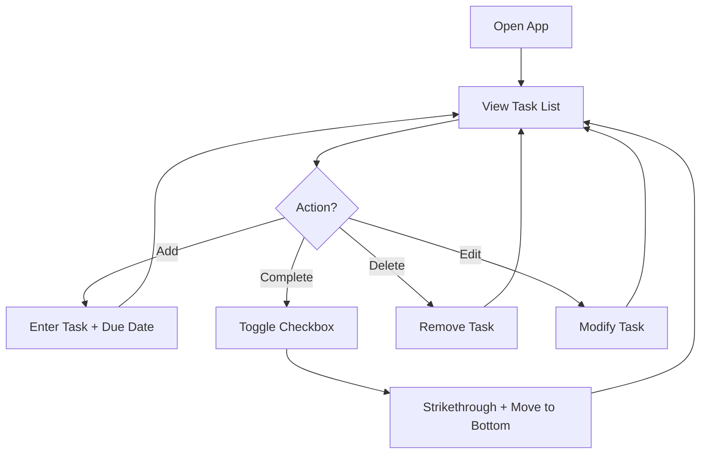
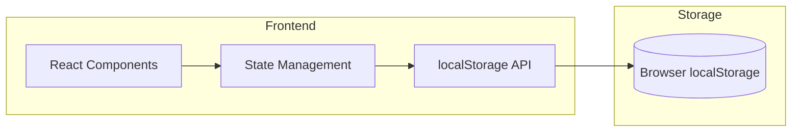

# Idea Summary

> Idea ID: IDEA-012
> Folder: Draft Idea - 01232026 225812
> Version: v1
> Created: 2026-01-23
> Status: Refined

## Overview

A simple, personal checklist web application with due date tracking. Built with React + Vite for modern development experience, using browser localStorage for persistence. No backend required - runs entirely in the browser.

## Problem Statement

Need a lightweight, local-only task management tool without the complexity of cloud-based solutions or account requirements.

## Target Users

- Personal use (single user)
- Anyone wanting a simple, private checklist without cloud dependencies

## Proposed Solution

A minimal React web app that allows users to:
- Create, edit, and delete tasks
- Set optional due dates
- See visual indicators for overdue/due-today tasks
- Mark tasks as complete
- Persist data in browser localStorage

## Key Features

| Feature | Description | Priority |
|---------|-------------|----------|
| Add Task | Create new task with title and optional due date | Must Have |
| Task List | Display all tasks in a flat list | Must Have |
| Complete Task | Toggle task completion (strikethrough) | Must Have |
| Due Date Visual | Highlight overdue (red) and due-today (yellow) | Must Have |
| Delete Task | Remove task from list | Must Have |
| Edit Task | Modify task title or due date | Should Have |
| Clear Completed | Bulk delete completed tasks | Nice to Have |

## User Flow

## Technical Approach

**Stack:**
- **Framework:** React 18+ with Vite
- **Styling:** CSS Modules or Tailwind CSS
- **Storage:** Browser localStorage (JSON serialization)
- **Build:** Vite (dev server + production build)

## Success Criteria

- [ ] Can add tasks with optional due dates
- [ ] Can mark tasks complete/incomplete
- [ ] Overdue tasks highlighted in red
- [ ] Due-today tasks highlighted in yellow
- [ ] Can delete tasks
- [ ] Data persists across browser sessions (localStorage)
- [ ] App loads instantly (< 1s)

## Constraints & Considerations

- **No backend** - purely client-side
- **Single device** - localStorage is browser-specific
- **No sync** - data stays on the device
- **Browser support** - Modern browsers only (localStorage required)

## Brainstorming Notes

- User explicitly chose simplest option: flat list, visual indicators, localStorage
- React + Vite preferred over pure HTML/JS for modern DX
- No notifications needed - just visual highlighting
- Personal use only - no sharing/collaboration features

## Source Files

- new idea.md

## Next Steps

- [ ] Create UI mockup with frontend-design skill
- [ ] Proceed to Requirement Gathering (if approved)
