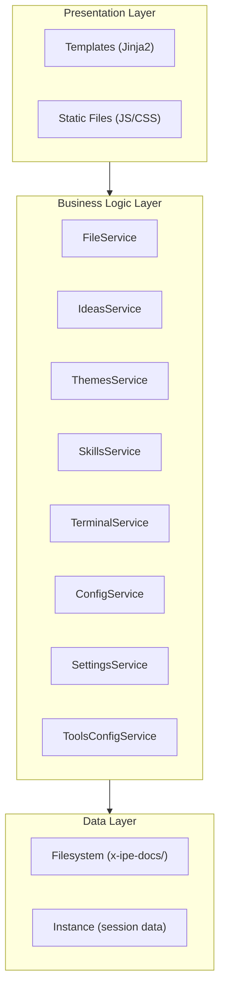
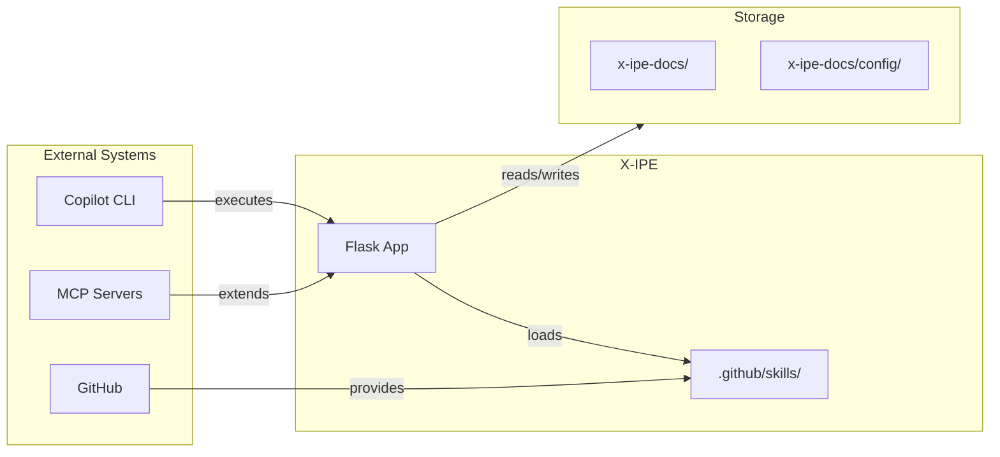

# Idea Summary

> Idea ID: IDEA-010
> Folder: Draw Architecture Diagram for itself
> Version: v1
> Created: 2026-01-24
> Status: Refined

## Overview

Use X-IPE's newly created architecture diagram skills (`tool-architecture-dsl` + `tool-architecture-draw`) to create self-documenting architecture diagrams for the X-IPE application itself. This is a practical demonstration of the skills while producing valuable documentation.

## Problem Statement

X-IPE lacks visual architecture documentation. As the application grows with 16+ features and 8+ services, developers and AI agents need clear visual references to understand:
1. How internal components are organized (layered architecture)
2. How X-IPE integrates with external systems (AI agents, GitHub, MCP)

## Target Users

1. **AI Agents** - Need architecture context when modifying X-IPE codebase
2. **Developers** - Understanding system structure before contributing
3. **Project Maintainers** - Documentation for onboarding and planning

## Proposed Solution

Create two architecture diagrams using the `tool-architecture-dsl` and `tool-architecture-draw` skills:

### 1. Module View (Internal Architecture)
Shows X-IPE's layered architecture with services as components:

### 2. Landscape View (External Integrations)
Shows X-IPE's connections to external systems:

## Key Features

1. **Module View Diagram**
   - 3-layer architecture (Presentation → Business → Data)
   - 8 services shown as components
   - Dependencies clearly visualized

2. **Landscape View Diagram**
   - X-IPE as central application
   - 3 external integrations (Copilot, GitHub, MCP)
   - Data flow arrows with labels

3. **Output Format**
   - HTML files using `tool-architecture-draw`
   - Stored in `x-ipe-docs/architecture/`
   - Exportable to PNG/SVG

## Success Criteria

- [ ] Module View diagram created with all 8 services
- [ ] Landscape View diagram shows Copilot, GitHub, MCP integrations
- [ ] Diagrams stored in current idea folder (`x-ipe-docs/ideas/Draw Architecture Diagram for itself/`)
- [ ] HTML outputs render correctly
- [ ] Diagrams follow Architecture DSL grammar

## Constraints & Considerations

1. **DSL Grammar** - Must follow `tool-architecture-dsl` syntax exactly
2. **Skill Integration** - Use `tool-architecture-draw` for HTML rendering
3. **Accuracy** - Diagrams must reflect actual codebase structure
4. **Maintainability** - DSL source files should be easy to update

## Brainstorming Notes

**Scope Decisions:**
- Medium detail level for Module View (services as components, not methods)
- Recommended integrations for Landscape View (Copilot, GitHub, MCP)
- Both DSL and HTML outputs
- Store in current idea folder first (`x-ipe-docs/ideas/Draw Architecture Diagram for itself/`)

**Architecture Analysis:**
- 8 backend services identified in `src/services/`
- Clear 3-layer architecture pattern (Flask + Services + Filesystem)
- External integrations via MCP, GitHub API, and direct filesystem access

## Ideation Artifacts

- Original idea: `new idea.md` (raw input)
- Architecture skills reference:
  - `.github/skills/tool-architecture-dsl/SKILL.md`
  - `.github/skills/tool-architecture-draw/SKILL.md`

## Source Files

- new idea.md

## Next Steps

- [ ] Proceed to **Idea to Architecture** task
  - Use `tool-architecture-dsl` to create DSL definitions
  - Use `tool-architecture-draw` to render HTML diagrams
  - Store outputs in current idea folder (`x-ipe-docs/ideas/Draw Architecture Diagram for itself/`)

## References & Common Principles

### Applied Principles

- **Layered Architecture Pattern:** Separating presentation, business logic, and data access concerns - [Microsoft Docs](https://docs.microsoft.com/en-us/azure/architecture/guide/architecture-styles/n-tier)
- **C4 Model Concepts:** Context and Container diagrams for architecture documentation - [C4Model.com](https://c4model.com/)

### Further Reading

- [Architecture DSL Skill](.github/skills/tool-architecture-dsl/SKILL.md) - DSL grammar reference
- [Architecture Draw Skill](.github/skills/tool-architecture-draw/SKILL.md) - HTML rendering rules
