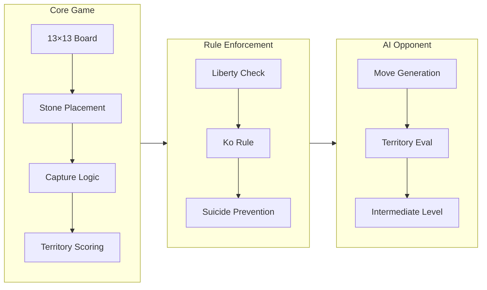
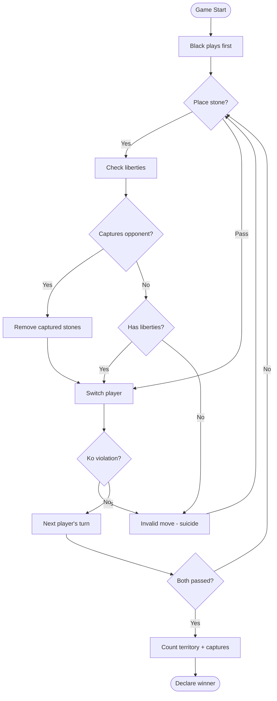
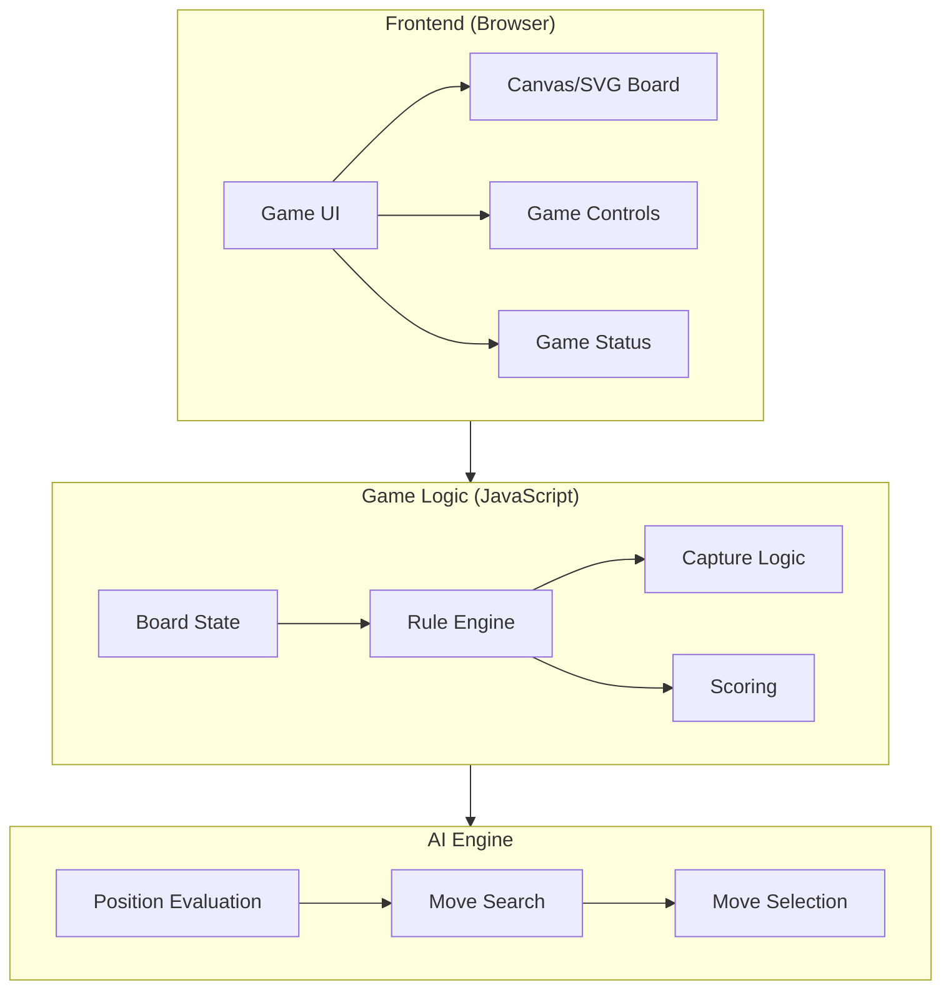

# Idea Summary

> Idea ID: IDEA-015
> Folder: Go Board Game - 01242026 191518
> Version: v1
> Created: 2026-01-24
> Status: Refined

## Overview

A web-based implementation of the classic board game **Go** (圍棋/Wéiqí) for single-player gameplay against an AI opponent on a 13×13 board, featuring classic visual styling and intermediate-level AI difficulty.

## Problem Statement

Go is one of the oldest and most strategically deep board games, but learning and practicing requires either a human opponent or access to specialized software. A simple web-based version would allow anyone to practice Go in their browser without installation.

## Target Users

- **Beginners** learning the rules of Go
- **Intermediate players** wanting to practice strategy
- **Casual players** looking for quick games during breaks
- **Go enthusiasts** without access to local opponents

## Proposed Solution

A browser-based Go game with:
- Clean, responsive web interface
- Single-player vs AI mode
- 13×13 board (optimal for learning)
- Japanese scoring rules
- Classic wood/stone visual theme

## Key Features

### Feature List

| Feature | Description | Priority |
|---------|-------------|----------|
| **Game Board** | Interactive 13×13 grid with click-to-place stones | Must Have |
| **Stone Rendering** | Classic black/white stones on wood texture | Must Have |
| **Capture Detection** | Automatically remove captured stones | Must Have |
| **Ko Rule** | Prevent immediate recapture loops | Must Have |
| **Pass/Resign** | Allow passing turn or resigning game | Must Have |
| **Territory Scoring** | Japanese rules with komi (6.5 points for White) | Must Have |
| **AI Opponent** | Intermediate-level computer opponent | Must Have |
| **New Game** | Reset board and start fresh | Must Have |
| **Move History** | Show list of moves played | Nice to Have |
| **Undo Move** | Take back last move (vs AI only) | Nice to Have |

## Game Rules Summary

## Technical Architecture

## Success Criteria

- [ ] Player can place stones on valid intersections
- [ ] Captured stones are automatically removed
- [ ] Ko rule prevents illegal repetition
- [ ] AI makes reasonable moves (not random)
- [ ] Game ends correctly when both players pass
- [ ] Territory is counted accurately with komi
- [ ] Works in modern browsers (Chrome, Firefox, Safari)
- [ ] Responsive design (playable on tablet)

## Constraints & Considerations

- **No backend required** - Pure client-side JavaScript
- **13×13 only** - Simpler scope than supporting multiple sizes
- **Single player only** - No multiplayer/networking complexity
- **Intermediate AI** - Not professional level, but challenging for learners
- **Japanese scoring** - Simpler to implement than Chinese scoring

## Brainstorming Notes

**Key insights from brainstorming:**
1. 13×13 is ideal - faster games than 19×19, more strategic than 9×9
2. Web browser platform allows instant access without installation
3. Classic visual style appeals to traditional Go aesthetics
4. Intermediate AI is achievable with pattern-based evaluation + minimax

**AI Implementation Options:**
- Simple: Random legal moves with basic capture priority
- Intermediate: Pattern matching + territory evaluation + 2-3 ply search
- Advanced: Monte Carlo Tree Search (MCTS) - may be overkill for v1

**Recommendation:** Start with pattern-based AI that prioritizes:
1. Capturing opponent stones
2. Protecting own groups
3. Expanding territory
4. Avoiding self-atari (putting own stones in danger)

## Source Files

- new idea.md

## Ideation Artifacts

- **UI Mockup:** [mockup-v1.html](./mockup-v1.html) - Interactive prototype with classic wood/stone aesthetic

## Next Steps

- [ ] Review UI mockup
- [ ] Proceed to Requirement Gathering

## References & Common Principles

### Applied Principles

- **Liberties & Capture:** Stones must have empty adjacent points (liberties) to survive. Surrounding all liberties captures the group. - [Rules of Go - Wikipedia](https://en.wikipedia.org/wiki/Rules_of_Go)
- **Ko Rule:** Prevents infinite capture loops by prohibiting immediate recapture of a single stone. - [Official Game Rules](https://officialgamerules.org/game-rules/go/)
- **Territory Scoring:** Count empty intersections surrounded by your stones + captured stones. White gets 6.5 komi for going second. - [Dicebreaker Guide](https://www.dicebreaker.com/games/go/how-to/how-to-play-go)
- **Two Eyes = Life:** A group with two separate internal spaces cannot be captured. - [British Go Association](https://www.britgo.org/files/rules/GoQuickRef.pdf)

### Further Reading

- [How to Play Go - Complete Rules](https://officialgamerules.org/game-rules/go/) - Comprehensive rules guide
- [Sensei's Library](https://senseis.xmp.net/) - Go encyclopedia with strategy articles
- [OGS (Online Go Server)](https://online-go.com/) - Reference implementation for online Go
