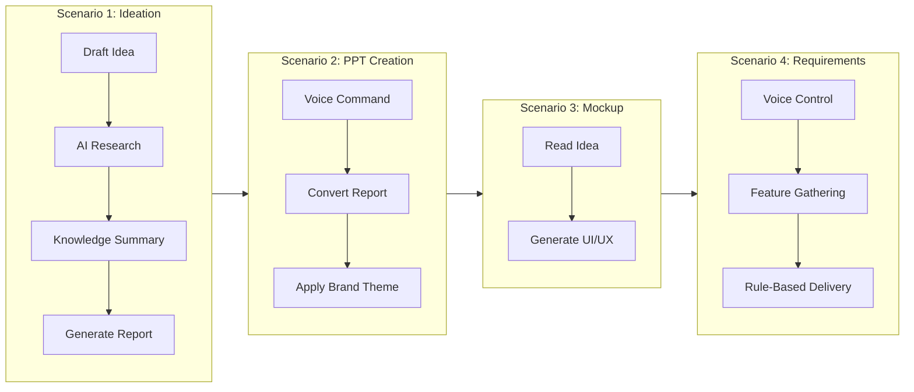

# Idea Summary

> Idea ID: IDEA-012
> Folder: 203. Playground-AI-Capability-Sharing
> Version: v1
> Created: 2026-01-26
> Status: Refined

## Overview

A 30-minute AI Capability Sharing presentation designed to **drive interest and curiosity about AI** among a mixed audience (technical and business). The presentation showcases AI capabilities through 4 live demo scenarios in an integrated project environment, using the Chanel brand theme.

## Problem Statement

Teams need to understand how AI can transform their daily workflows, but abstract explanations don't resonate. A live demonstration through practical, relatable scenarios will create genuine interest and curiosity about AI adoption.

## Target Users

- **Primary:** Mixed audience (IT and Business stakeholders)
- **Context:** Internal knowledge sharing session
- **Goal:** Inspire curiosity, not teach technical details

## Proposed Solution

An 8-slide presentation with live demonstrations covering:
1. **Mindset Framework** - "Small Loop + Big Loop" concept
2. **4 Live Demo Scenarios** - Practical workflows using AI capabilities
3. **Forward-Looking Close** - Preview of next week's deep dive

## Presentation Structure

```infographic
sequence-stairs-front-compact-card
data
  title Presentation Flow (30 min | 8 slides)
  sequences
    - label Slide 1: Opening
      desc AI Capabilities Overview
      icon rocket launch
    - label Slide 2: Mindset
      desc Small Loop + Big Loop
      icon brain
    - label Slides 3-6: Demos
      desc 4 Live Scenarios
      icon play circle
    - label Slide 7: Takeaways
      desc What This Means
      icon lightbulb
    - label Slide 8: Next Week
      desc Deep Dive Preview
      icon calendar
```

## AI Capabilities Showcased

```infographic
list-grid-badge-card
data
  title AI Capabilities to Demo
  lists
    - label Web AI Agent Access
      desc Interact with AI through web application
      icon web
    - label Brainstorming
      desc Collaborative idea refinement
      icon brain
    - label Web Searching
      desc Research and learn best practices
      icon magnify
    - label File System Access
      desc Read and write project files
      icon folder
    - label PPT Creation
      desc Generate presentations with themes
      icon presentation
    - label UI/UX Mockup
      desc Create visual prototypes
      icon palette
    - label Rule-Based Works
      desc Structured task execution
      icon cog
    - label Programming Tools
      desc Code generation and execution
      icon code tags
    - label Voice to Text
      desc Speech recognition commands
      icon microphone
    - label Live Translation
      desc Real-time language translation
      icon translate
    - label AI Memory
      desc Context retention across sessions
      icon database
```

## Demo Scenarios Detail

### Demo Workflow Overview



### Scenario Capability Mapping

```infographic
compare-swot
data
  title Scenario-to-Capability Mapping
  compares
    - label Scenario 1: Ideation
      children
        - label Brainstorming
        - label Web Searching
        - label File System Access
        - label Programming Tools
    - label Scenario 2: PPT Creation
      children
        - label Voice to Text
        - label File System Access
        - label PPT Creation
        - label Programming Tools
    - label Scenario 3: UI/UX Mockup
      children
        - label File System Access
        - label Create UI/UX Mockup
        - label Programming Tools
    - label Scenario 4: Requirements
      children
        - label Voice to Text
        - label Live Translation
        - label Rule-Based Works
        - label AI Memory
```

## Mindset Framework: Small Loop + Big Loop

```infographic
hierarchy-mindmap-branch-gradient-capsule-item
data
  root
    label AI Adoption Mindset
    children
      - label Big Loop (Factory)
        children
          - label Robots in factory
          - label Pipelines speed up production
          - label Business performance
      - label Small Loop (Robot)
        children
          - label Full power enabled
          - label Iterative self-upgrade
          - label Evolving pipeline
```

**Key Message:** *"If we think AI is good, let's empower ourselves - 'IT department' first."*

## Slide-by-Slide Breakdown

| Slide | Title | Content | Time |
|-------|-------|---------|------|
| 1 | AI Capability Review Through Practice | Overview of capabilities + scenarios | 2 min |
| 2 | AI Mindset: Small Loop + Big Loop | Framework explanation | 3 min |
| 3 | Scenario 1: Ideation Refinement | Live demo - POS App brainstorming | 6 min |
| 4 | Scenario 2: Create Reporting PPT | Live demo - Voice → PPT with theme | 5 min |
| 5 | Scenario 3: Create UI/UX Mockup | Live demo - Generate mockup | 5 min |
| 6 | Scenario 4: Ideation to Requirements | Live demo - Voice → Features | 5 min |
| 7 | What This Demo Means | Future of work, personal experience | 2 min |
| 8 | Next Week Preview | AI Agent deep dive teaser | 2 min |

## Demo Example: POS Application

For Scenario 1, the live demo will use a **Boutique POS Application** example:
- Human drafts initial idea
- AI researches POS best practices online
- AI summarizes knowledge about building POS systems
- AI generates structured report

## Success Criteria

- [ ] All 4 live demos execute successfully without errors
- [ ] Audience shows engagement (questions, interest)
- [ ] Presentation completes within 30 minutes
- [ ] Key mindset concept (loops) is understood
- [ ] Curiosity is sparked for next week's session

## Technical Setup Required

- Web browser with AI Agent access
- Microphone for voice commands
- Pre-configured project environment
- Chanel brand theme loaded
- Stable internet connection

## Brainstorming Notes

Key insights from refinement session:
- **Audience:** Mixed technical/business - keep explanations accessible
- **Objective:** Drive curiosity, not deep technical training
- **Tone:** Positive and inspiring (limitations saved for Q&A)
- **Demo approach:** All live - creates authentic impact
- **Theme:** Chanel brand styling for professional look
- **Structure:** 8 slides, 30 minutes - roughly 3-4 min per slide

## Source Files

- new idea.md (original brainstorm notes)

## Next Steps

- [ ] Proceed to **Create PPT** using this refined idea
- [ ] Prepare demo environment with all scenarios
- [ ] Practice timing for 30-minute delivery
- [ ] Set up backup recordings in case of demo failure

## References & Common Principles

### Applied Principles

- **Show, Don't Tell:** Live demos create more impact than slides with bullet points
- **Storytelling Structure:** Opening → Framework → Examples → Conclusion
- **Mixed Audience Communication:** Use analogies (factory/robot) for technical concepts

### Presentation Best Practices

- Keep slides minimal - the demo is the star
- Have fallback plan if live demo fails
- End with curiosity hook for next session
