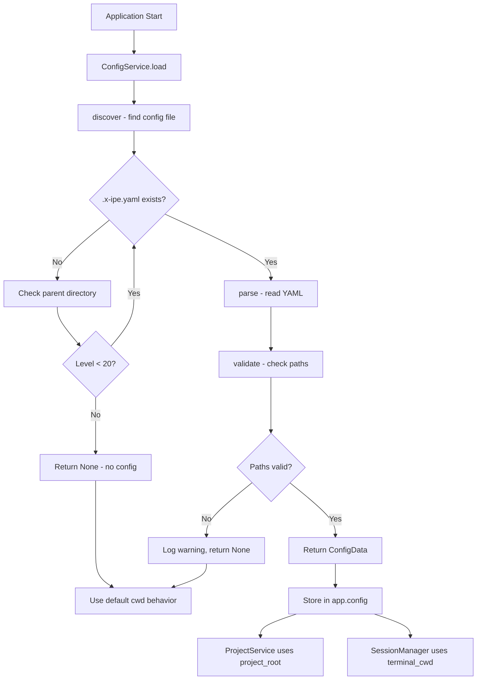
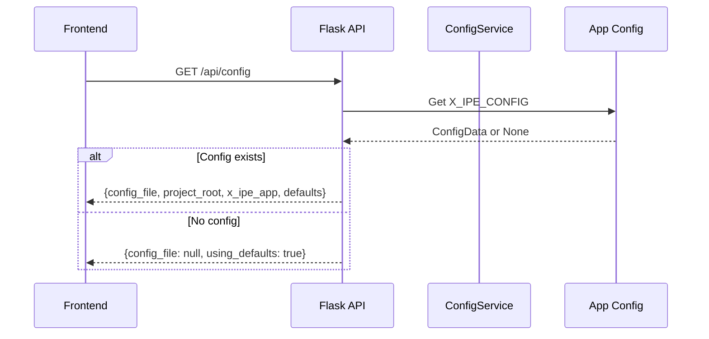

# Technical Design: Project Root Configuration

> Feature ID: FEATURE-010 | Version: v1.0 | Last Updated: 01-23-2026

---

## Version History

| Version | Date | Description |
|---------|------|-------------|
| v1.0 | 01-23-2026 | Initial design: ConfigService, config discovery, path validation, integrations |

---

## Part 1: Agent-Facing Summary

> **Purpose:** Quick reference for AI agents navigating large projects.
> **📌 AI Coders:** Focus on this section for implementation context.

### Key Components to Implement

| Component | Responsibility | Scope/Impact | Tags |
|-----------|----------------|--------------|------|
| `ConfigService` | Config file discovery, parsing, validation | Backend service | #config #yaml #service |
| `ConfigData` | Data class holding resolved config values | Data model | #dataclass #model |
| `/api/config` endpoint | Expose config state to frontend | API route | #api #rest |
| Settings page update | Read-only config display section | Frontend HTML | #frontend #ui #settings |
| `ProjectService` integration | Apply `file_tree_scope` default | Backend modification | #integration |
| `SessionManager` integration | Apply `terminal_cwd` default | Backend modification | #integration |

### Scope & Boundaries

**In Scope:**
- `ConfigService` class with `discover()`, `parse()`, `validate()` methods
- Config discovery traversing up to 20 parent directories
- Path resolution relative to config file location
- Validation for required fields and path existence
- `/api/config` endpoint returning config state
- Settings page "Project Configuration" read-only section
- `ProjectService` defaulting to `project_root` path when configured
- `SessionManager` using `terminal_cwd` for new terminal sessions
- Graceful fallback on any config error
- Backward compatible (no config = existing behavior)

**Out of Scope:**
- Config file editing via UI
- Environment variable expansion
- Config hot-reload
- Multiple config files

### Dependencies

| Dependency | Source | Design Link | Usage Description |
|------------|--------|-------------|-------------------|
| `ProjectService` | FEATURE-001 | [technical-design.md](../FEATURE-001/technical-design.md) | Modify to use config's `file_tree_scope` |
| `SessionManager` | FEATURE-005 | [technical-design.md](../FEATURE-005/technical-design.md) | Modify to use config's `terminal_cwd` |
| `SettingsService` | FEATURE-006 | [technical-design.md](../FEATURE-006/technical-design.md) | Settings page integration |
| PyYAML | External | pyyaml.org | YAML parsing |
| Flask | External | flask.palletsprojects.com | Web framework |

### Major Flows

**Flow 1: Config Discovery at Startup**
1. Application starts (`main.py`)
2. `ConfigService.discover()` called with cwd
3. Check cwd for `.x-ipe.yaml`, then parent directories (max 20)
4. If found → `ConfigService.parse()` → `ConfigService.validate()`
5. Store `ConfigData` in Flask app context
6. `ProjectService` and `SessionManager` read from app context

**Flow 2: Settings Page Config Display**
1. User navigates to Settings page
2. Frontend fetches `GET /api/config`
3. Backend returns config state (file path, resolved paths, defaults)
4. Frontend renders read-only "Project Configuration" card

### Usage Example

```python
# Backend: ConfigService initialization (in main.py)
from src.services import ConfigService

config_service = ConfigService()
config_data = config_service.load()  # Discover, parse, validate

if config_data:
    app.config['X_IPE_CONFIG'] = config_data
    app.config['PROJECT_ROOT'] = config_data.get_file_tree_path()
else:
    app.config['X_IPE_CONFIG'] = None
    app.config['PROJECT_ROOT'] = os.getcwd()

# Usage in ProjectService
project_root = app.config.get('PROJECT_ROOT', os.getcwd())
service = ProjectService(project_root)

# Usage in SessionManager for terminal cwd
config_data = app.config.get('X_IPE_CONFIG')
if config_data:
    terminal_cwd = config_data.get_terminal_cwd()
else:
    terminal_cwd = os.getcwd()
```

```javascript
// Frontend: Config display on Settings page
async function loadConfig() {
    const response = await fetch('/api/config');
    const data = await response.json();
    
    if (data.config_file) {
        // Show config details
        document.getElementById('configFile').textContent = data.config_file;
        document.getElementById('projectRoot').textContent = data.project_root;
        document.getElementById('xIpeApp').textContent = data.x_ipe_app;
    } else {
        // Show "not detected" state
        document.getElementById('configStatus').textContent = 'No .x-ipe.yaml found';
    }
}
```

---

## Part 2: Implementation Guide

> **Purpose:** Human-readable details for developers.
> **📌 Emphasis on visual diagrams for comprehension.

### Workflow Diagram: Config Discovery



### Workflow Diagram: API Request Flow



### Data Model: ConfigData

```python
@dataclass
class ConfigData:
    """
    Holds resolved configuration from .x-ipe.yaml
    
    All paths are absolute after resolution.
    """
    config_file_path: str           # Absolute path to .x-ipe.yaml
    version: int                    # Config version (currently 1)
    project_root: str               # Absolute path to project root
    x_ipe_app: str                  # Absolute path to X-IPE app
    file_tree_scope: str            # "project_root" or "x_ipe_app"
    terminal_cwd: str               # "project_root" or "x_ipe_app"
    
    def get_file_tree_path(self) -> str:
        """Return the path for file tree based on file_tree_scope."""
        if self.file_tree_scope == "project_root":
            return self.project_root
        return self.x_ipe_app
    
    def get_terminal_cwd(self) -> str:
        """Return the path for terminal cwd based on terminal_cwd setting."""
        if self.terminal_cwd == "project_root":
            return self.project_root
        return self.x_ipe_app
    
    def to_dict(self) -> dict:
        """Convert to dictionary for API response."""
        return {
            'config_file': self.config_file_path,
            'version': self.version,
            'project_root': self.project_root,
            'x_ipe_app': self.x_ipe_app,
            'file_tree_scope': self.file_tree_scope,
            'terminal_cwd': self.terminal_cwd
        }
```

### Config File Schema

```yaml
# .x-ipe.yaml - placed at project root
version: 1                           # Required: schema version
paths:
  project_root: "."                  # Required: relative to this file
  x_ipe_app: "./x-ipe"              # Required: path to X-IPE app
defaults:
  file_tree_scope: "project_root"   # Optional: default "project_root"
  terminal_cwd: "project_root"      # Optional: default "project_root"
```

### Component 1: ConfigService

**File:** `src/services/config_service.py`

```python
import os
import yaml
from pathlib import Path
from dataclasses import dataclass
from typing import Optional

CONFIG_FILE_NAME = '.x-ipe.yaml'
MAX_PARENT_LEVELS = 20

@dataclass
class ConfigData:
    """Resolved configuration from .x-ipe.yaml"""
    config_file_path: str
    version: int
    project_root: str
    x_ipe_app: str
    file_tree_scope: str
    terminal_cwd: str
    
    def get_file_tree_path(self) -> str:
        return self.project_root if self.file_tree_scope == "project_root" else self.x_ipe_app
    
    def get_terminal_cwd(self) -> str:
        return self.project_root if self.terminal_cwd == "project_root" else self.x_ipe_app
    
    def to_dict(self) -> dict:
        return {
            'config_file': self.config_file_path,
            'version': self.version,
            'project_root': self.project_root,
            'x_ipe_app': self.x_ipe_app,
            'file_tree_scope': self.file_tree_scope,
            'terminal_cwd': self.terminal_cwd
        }


class ConfigService:
    """
    Service for discovering and parsing .x-ipe.yaml configuration.
    
    FEATURE-010: Project Root Configuration
    """
    
    def __init__(self, start_dir: Optional[str] = None):
        """
        Initialize ConfigService.
        
        Args:
            start_dir: Starting directory for config discovery.
                       Defaults to current working directory.
        """
        self.start_dir = Path(start_dir or os.getcwd()).resolve()
        self._config_data: Optional[ConfigData] = None
        self._error: Optional[str] = None
    
    def load(self) -> Optional[ConfigData]:
        """
        Discover, parse, and validate config file.
        
        Returns:
            ConfigData if valid config found, None otherwise.
        """
        config_path = self._discover()
        if not config_path:
            return None
        
        raw_config = self._parse(config_path)
        if not raw_config:
            return None
        
        config_data = self._validate(config_path, raw_config)
        if config_data:
            self._config_data = config_data
        return config_data
    
    def _discover(self) -> Optional[Path]:
        """
        Search for .x-ipe.yaml from start_dir up to 20 parent levels.
        
        Returns:
            Path to config file if found, None otherwise.
        """
        current = self.start_dir
        
        for _ in range(MAX_PARENT_LEVELS):
            config_path = current / CONFIG_FILE_NAME
            if config_path.exists() and config_path.is_file():
                return config_path
            
            parent = current.parent
            if parent == current:  # Reached filesystem root
                break
            current = parent
        
        return None
    
    def _parse(self, config_path: Path) -> Optional[dict]:
        """
        Parse YAML content from config file.
        
        Returns:
            Parsed dict if successful, None on error.
        """
        try:
            with open(config_path, 'r', encoding='utf-8') as f:
                return yaml.safe_load(f)
        except yaml.YAMLError as e:
            self._error = f"YAML parse error: {e}"
            return None
        except IOError as e:
            self._error = f"Cannot read config file: {e}"
            return None
    
    def _validate(self, config_path: Path, raw: dict) -> Optional[ConfigData]:
        """
        Validate config content and resolve paths.
        
        Returns:
            ConfigData if valid, None on validation error.
        """
        config_dir = config_path.parent
        
        # Check version
        version = raw.get('version')
        if version != 1:
            self._error = f"Unsupported config version: {version}"
            return None
        
        # Check required paths
        paths = raw.get('paths', {})
        if not paths.get('project_root'):
            self._error = "Missing required field: paths.project_root"
            return None
        if not paths.get('x_ipe_app'):
            self._error = "Missing required field: paths.x_ipe_app"
            return None
        
        # Resolve paths relative to config file location
        project_root = (config_dir / paths['project_root']).resolve()
        x_ipe_app = (config_dir / paths['x_ipe_app']).resolve()
        
        # Validate paths exist
        if not project_root.exists() or not project_root.is_dir():
            self._error = f"project_root path does not exist: {project_root}"
            return None
        if not x_ipe_app.exists() or not x_ipe_app.is_dir():
            self._error = f"x_ipe_app path does not exist: {x_ipe_app}"
            return None
        
        # Get defaults with fallbacks
        defaults = raw.get('defaults', {})
        file_tree_scope = defaults.get('file_tree_scope', 'project_root')
        terminal_cwd = defaults.get('terminal_cwd', 'project_root')
        
        # Validate scope values
        valid_scopes = ('project_root', 'x_ipe_app')
        if file_tree_scope not in valid_scopes:
            self._error = f"Invalid file_tree_scope: {file_tree_scope}"
            return None
        if terminal_cwd not in valid_scopes:
            self._error = f"Invalid terminal_cwd: {terminal_cwd}"
            return None
        
        return ConfigData(
            config_file_path=str(config_path),
            version=version,
            project_root=str(project_root),
            x_ipe_app=str(x_ipe_app),
            file_tree_scope=file_tree_scope,
            terminal_cwd=terminal_cwd
        )
    
    @property
    def error(self) -> Optional[str]:
        """Return the last error message, if any."""
        return self._error
    
    @property
    def config(self) -> Optional[ConfigData]:
        """Return the loaded config data."""
        return self._config_data
```

### Component 2: API Endpoint

**File:** `src/app.py`

```python
@app.route('/api/config', methods=['GET'])
def get_config():
    """
    Get current configuration state.
    
    FEATURE-010: Project Root Configuration
    """
    config_data = app.config.get('X_IPE_CONFIG')
    
    if config_data:
        return jsonify({
            'detected': True,
            **config_data.to_dict()
        })
    else:
        return jsonify({
            'detected': False,
            'config_file': None,
            'using_defaults': True,
            'project_root': app.config.get('PROJECT_ROOT', os.getcwd()),
            'message': 'No .x-ipe.yaml found. Using default paths.'
        })
```

### Component 3: Main.py Integration

**File:** `main.py`

```python
from src.services import ConfigService

def create_app():
    # ... existing setup ...
    
    # FEATURE-010: Load config at startup
    config_service = ConfigService()
    config_data = config_service.load()
    
    if config_data:
        app.config['X_IPE_CONFIG'] = config_data
        app.config['PROJECT_ROOT'] = config_data.get_file_tree_path()
        print(f"[Config] Loaded .x-ipe.yaml from: {config_data.config_file_path}")
        print(f"[Config] Project root: {config_data.project_root}")
    else:
        app.config['X_IPE_CONFIG'] = None
        app.config['PROJECT_ROOT'] = os.getcwd()
        if config_service.error:
            print(f"[Config] Warning: {config_service.error}")
        else:
            print("[Config] No .x-ipe.yaml found, using default paths")
    
    # ... rest of app setup ...
```

### Component 4: Settings Page Update

**File:** `src/templates/settings.html` (add after Project Folders section)

```html
<!-- Project Configuration Section (FEATURE-010) -->
<div class="settings-card card">
    <div class="card-header">
        <span>
            <i class="bi bi-file-earmark-code me-2"></i>
            Project Configuration
        </span>
    </div>
    <div class="card-body" id="configSection">
        <!-- Populated by JavaScript -->
        <div class="text-center text-muted py-3">
            <span class="spinner-border spinner-border-sm me-2"></span>
            Loading configuration...
        </div>
    </div>
</div>
```

```javascript
// Add to settings page JavaScript
async function loadConfigInfo() {
    const section = document.getElementById('configSection');
    
    try {
        const response = await fetch('/api/config');
        const data = await response.json();
        
        if (data.detected) {
            section.innerHTML = `
                <div class="table-responsive">
                    <table class="table table-sm mb-0">
                        <tbody>
                            <tr>
                                <th style="width: 140px;">Config File</th>
                                <td><code>${escapeHtml(data.config_file)}</code></td>
                            </tr>
                            <tr>
                                <th>Project Root</th>
                                <td><code>${escapeHtml(data.project_root)}</code></td>
                            </tr>
                            <tr>
                                <th>X-IPE App</th>
                                <td><code>${escapeHtml(data.x_ipe_app)}</code></td>
                            </tr>
                            <tr>
                                <th>File Tree Scope</th>
                                <td><span class="badge bg-secondary">${data.file_tree_scope}</span></td>
                            </tr>
                            <tr>
                                <th>Terminal CWD</th>
                                <td><span class="badge bg-secondary">${data.terminal_cwd}</span></td>
                            </tr>
                        </tbody>
                    </table>
                </div>
            `;
        } else {
            section.innerHTML = `
                <div class="alert alert-info mb-0">
                    <i class="bi bi-info-circle me-2"></i>
                    <strong>No configuration file detected.</strong>
                    <p class="mb-0 mt-2 small">
                        Create a <code>.x-ipe.yaml</code> file at your project root to configure 
                        custom paths. Currently using: <code>${escapeHtml(data.project_root)}</code>
                    </p>
                </div>
            `;
        }
    } catch (error) {
        console.error('Failed to load config:', error);
        section.innerHTML = `
            <div class="alert alert-warning mb-0">
                <i class="bi bi-exclamation-triangle me-2"></i>
                Failed to load configuration info
            </div>
        `;
    }
}

// Call on page load
document.addEventListener('DOMContentLoaded', () => {
    loadConfigInfo();
});
```

### Component 5: SessionManager Integration

**File:** `src/services/terminal_service.py` (modify `SessionManager.create_session`)

```python
class SessionManager:
    # ... existing code ...
    
    def create_session(self, app_config: dict = None) -> str:
        """
        Create a new terminal session.
        
        FEATURE-010: Use config's terminal_cwd if available.
        """
        session_id = str(uuid.uuid4())
        
        # Determine working directory
        cwd = os.getcwd()
        if app_config:
            config_data = app_config.get('X_IPE_CONFIG')
            if config_data:
                cwd = config_data.get_terminal_cwd()
            elif app_config.get('PROJECT_ROOT'):
                cwd = app_config['PROJECT_ROOT']
        
        session = PersistentSession(cwd=cwd)
        self._sessions[session_id] = session
        return session_id
```

---

## Part 3: Implementation Steps

### Phase 1: Backend Core (ConfigService)

1. Add `ConfigData` dataclass to `services/config_service.py`
2. Add `ConfigService` class with `discover()`, `parse()`, `validate()` methods
3. Write unit tests for ConfigService
4. Verify tests pass

### Phase 2: Integration

1. Modify `main.py` to initialize ConfigService at startup
2. Store ConfigData in `app.config['X_IPE_CONFIG']`
3. Set `app.config['PROJECT_ROOT']` based on config
4. Add `/api/config` endpoint to `app.py`
5. Modify `SessionManager.create_session()` to use config's terminal_cwd
6. Write integration tests
7. Verify tests pass

### Phase 3: Frontend

1. Add "Project Configuration" card to `settings.html`
2. Add JavaScript to fetch and display config info
3. Handle both detected and not-detected states
4. Manual testing on Settings page

---

## Part 4: Edge Cases & Error Handling

| Scenario | Expected Behavior |
|----------|-------------------|
| No `.x-ipe.yaml` found | Return None, use default cwd |
| YAML parse error | Log warning, return None, use defaults |
| Missing `paths.project_root` | Log warning, return None, use defaults |
| Missing `paths.x_ipe_app` | Log warning, return None, use defaults |
| Path doesn't exist | Log warning, return None, use defaults |
| Path is file not directory | Log warning, return None, use defaults |
| Invalid `file_tree_scope` value | Log warning, return None, use defaults |
| Permission denied reading file | Log warning, return None, use defaults |
| Config at filesystem root `/` | Valid, use as project_root |
| Path with spaces | Handle correctly via pathlib |
| Symlinked directories | Follow symlinks, validate target |

---

## Part 5: Testing Checklist

### Unit Tests (ConfigService)

- [ ] `test_discover_finds_config_in_cwd`
- [ ] `test_discover_finds_config_in_parent`
- [ ] `test_discover_stops_at_20_levels`
- [ ] `test_discover_stops_at_filesystem_root`
- [ ] `test_discover_returns_none_when_not_found`
- [ ] `test_parse_valid_yaml`
- [ ] `test_parse_invalid_yaml_returns_none`
- [ ] `test_parse_file_not_readable_returns_none`
- [ ] `test_validate_missing_version_fails`
- [ ] `test_validate_wrong_version_fails`
- [ ] `test_validate_missing_project_root_fails`
- [ ] `test_validate_missing_x_ipe_app_fails`
- [ ] `test_validate_nonexistent_path_fails`
- [ ] `test_validate_file_instead_of_dir_fails`
- [ ] `test_validate_invalid_scope_fails`
- [ ] `test_validate_resolves_relative_paths`
- [ ] `test_validate_defaults_optional_fields`
- [ ] `test_load_integrates_all_steps`
- [ ] `test_config_data_get_file_tree_path`
- [ ] `test_config_data_get_terminal_cwd`
- [ ] `test_config_data_to_dict`

### API Tests

- [ ] `test_get_config_with_detected_config`
- [ ] `test_get_config_without_config`

### Integration Tests

- [ ] `test_app_startup_loads_config`
- [ ] `test_project_service_uses_config_path`
- [ ] `test_terminal_uses_config_cwd`

---

## Design Change Log

| Date | Phase | Change Summary |
|------|-------|----------------|
| 01-23-2026 | Initial Design | Initial technical design created for FEATURE-010. ConfigService with discover/parse/validate, ConfigData dataclass, /api/config endpoint, Settings page integration, SessionManager terminal_cwd support. |
| 01-23-2026 | Refactoring | Updated file paths: `src/services.py` split into `src/services/` package. ConfigService and ConfigData now in `src/services/config_service.py`, SessionManager in `src/services/terminal_service.py`. Imports via `from src.services import X` still work due to `__init__.py` re-exports. |
