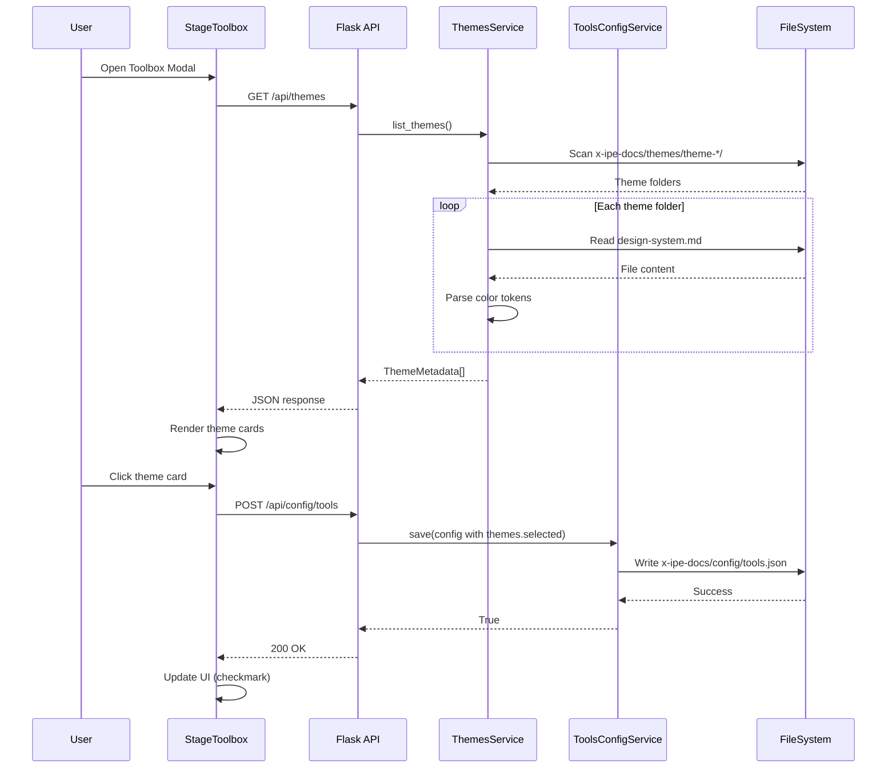

# Technical Design: Design Themes

> Feature ID: FEATURE-012 | Version: v1.0 | Last Updated: 01-24-2026

---

## Version History

| Version | Date | Description |
|---------|------|-------------|
| v1.0 | 01-24-2026 | Initial design: ThemesService, API endpoints, sidebar menu, toolbox integration |

---

## Part 1: Agent-Facing Summary

> **Purpose:** Quick reference for AI agents navigating large projects.
> **📌 AI Coders:** Focus on this section for implementation context.

### Key Components Implemented

| Component | Responsibility | Scope/Impact | Tags |
|-----------|----------------|--------------|------|
| `ThemesService` | Theme discovery, parsing, metadata extraction | Backend service | #themes #service #backend |
| `GET /api/themes` | List all themes with metadata | API endpoint | #themes #api #list |
| `GET /api/themes/<name>` | Get single theme details | API endpoint | #themes #api #detail |
| `ThemesSection` | Theme cards UI in Stage Toolbox | Frontend component | #themes #frontend #toolbox |
| `themes.selected` | Theme selection in x-ipe-docs/config/tools.json | Configuration | #themes #config #persistence |

### Scope & Boundaries

**In Scope:**
- Theme folder discovery (`x-ipe-docs/themes/theme-*/`)
- Color token parsing from design-system.md
- Sidebar themes menu (folder tree navigation)
- Toolbox modal themes section with visual cards
- Theme selection persistence in x-ipe-docs/config/tools.json

**Out of Scope:**
- Theme editor UI (future v2.0)
- Per-idea theme selection (global only)
- Theme creation/deletion API

### Dependencies

| Dependency | Source | Design Link | Usage Description |
|------------|--------|-------------|-------------------|
| `ToolsConfigService` | FEATURE-011 | [technical-design.md](../FEATURE-011/technical-design.md) | Store/load theme selection in x-ipe-docs/config/tools.json |
| `FileService` | Foundation | [file_service.py](../../../src/services/file_service.py) | Folder scanning and file reading |
| `StageToolboxModal` | FEATURE-011 | [stage-toolbox.js](../../../static/js/features/stage-toolbox.js) | Extend modal with themes section |
| `ProjectSidebar` | FEATURE-001 | [index.html](../../../src/templates/index.html) | Add themes menu item |

### Major Flow

1. **Theme Discovery:** On app load, `ThemesService` scans `x-ipe-docs/themes/theme-*/` folders
2. **Metadata Extraction:** Parse each `design-system.md` to extract color tokens and description
3. **API Response:** `GET /api/themes` returns list with name, description, colors, files
4. **Toolbox Display:** `ThemesSection` renders cards with auto-generated color swatches
5. **Selection:** User clicks card → POST updates `x-ipe-docs/config/tools.json` → UI shows checkmark
6. **Sidebar Access:** Click "Themes" in sidebar → folder tree of `x-ipe-docs/themes/` → click file to view

### Usage Example

```python
# Backend: Theme discovery and API
from src.services import ThemesService

themes_service = ThemesService(project_root="/path/to/project")
themes = themes_service.list_themes()
# Returns: [{'name': 'theme-default', 'description': '...', 'colors': {...}, 'files': [...]}]

theme = themes_service.get_theme('theme-default')
# Returns: {'name': 'theme-default', 'design_system': '...md content...', 'files': [...]}
```

```javascript
// Frontend: Theme selection in toolbox
const toolbox = new StageToolboxModal();
toolbox.open();
// Themes section appears at top with visual cards
// Click card to select, checkmark appears, saves to config
```

---

## Part 2: Implementation Guide

> **Purpose:** Human-readable details for developers.
> **📌 Emphasis on visual diagrams for comprehension.

### Workflow Diagram



### Data Models

```python
# ThemeMetadata - returned by list_themes()
@dataclass
class ThemeMetadata:
    name: str               # e.g., "theme-default"
    description: str        # First paragraph from design-system.md
    colors: dict            # {primary, secondary, accent, neutral}
    files: list[str]        # ["design-system.md", "component-visualization.html"]
    path: str               # Relative path: "x-ipe-docs/themes/theme-default"

# ThemeDetail - returned by get_theme()
@dataclass
class ThemeDetail:
    name: str
    description: str
    colors: dict
    files: list[str]
    path: str
    design_system: str      # Full content of design-system.md
    visualization_path: str # Path to component-visualization.html
```

### API Specifications

#### GET /api/themes

**Response:**
```json
{
  "themes": [
    {
      "name": "theme-default",
      "description": "Neutral, clean design system",
      "colors": {
        "primary": "#0f172a",
        "secondary": "#475569",
        "accent": "#10b981",
        "neutral": "#e2e8f0"
      },
      "files": ["design-system.md", "component-visualization.html"],
      "path": "x-ipe-docs/themes/theme-default"
    }
  ],
  "selected": "theme-default"
}
```

#### GET /api/themes/<name>

**Response:**
```json
{
  "name": "theme-default",
  "description": "Neutral, clean design system",
  "colors": {...},
  "files": [...],
  "path": "x-ipe-docs/themes/theme-default",
  "design_system": "# Design System\n\n## Colors\n...",
  "visualization_path": "x-ipe-docs/themes/theme-default/component-visualization.html"
}
```

### x-ipe-docs/config/tools.json Schema Update

```json
{
  "version": "2.0",
  "themes": {
    "selected": "theme-default"
  },
  "stages": {
    "ideation": {...},
    ...
  }
}
```

### Component Architecture

```
┌─────────────────────────────────────────────────────────────┐
│                    StageToolboxModal                         │
├─────────────────────────────────────────────────────────────┤
│  ┌─────────────────────────────────────────────────────┐   │
│  │              ThemesSection (NEW)                     │   │
│  │  ┌─────────┐ ┌─────────┐ ┌─────────┐ ┌─────────┐   │   │
│  │  │ThemeCard│ │ThemeCard│ │ThemeCard│ │ThemeCard│   │   │
│  │  │ default │ │  ocean  │ │ forest  │ │ sunset  │   │   │
│  │  └─────────┘ └─────────┘ └─────────┘ └─────────┘   │   │
│  └─────────────────────────────────────────────────────┘   │
│  ┌─────────────────────────────────────────────────────┐   │
│  │              Accordion: Ideation Stage              │   │
│  └─────────────────────────────────────────────────────┘   │
│  ┌─────────────────────────────────────────────────────┐   │
│  │              Accordion: Requirement Stage           │   │
│  └─────────────────────────────────────────────────────┘   │
│  ...                                                        │
└─────────────────────────────────────────────────────────────┘
```

### Implementation Steps

#### Phase 1: Backend - ThemesService (2 files)

1. **Create `src/services/themes_service.py`:**
   - `ThemesService` class with `__init__(project_root)`
   - `list_themes()` - scan and return ThemeMetadata list
   - `get_theme(name)` - return ThemeDetail with file content
   - `_parse_color_tokens(content)` - extract colors from markdown
   - `_extract_description(content)` - get first paragraph

2. **Update `src/services/__init__.py`:**
   - Export `ThemesService`

#### Phase 2: API Endpoints (1 file)

3. **Update `src/app.py`:**
   - Initialize `themes_service` global
   - Add `GET /api/themes` endpoint
   - Add `GET /api/themes/<name>` endpoint

#### Phase 3: Config Schema Update (1 file)

4. **Update `src/services/tools_config_service.py`:**
   - Add `themes` section to `DEFAULT_CONFIG`
   - Ensure backwards compatibility for existing configs

#### Phase 4: Frontend - Sidebar Menu (1 file)

5. **Update `src/templates/index.html`:**
   - Add "Themes" menu item to sidebar
   - Wire click handler to load `x-ipe-docs/themes/` in file tree

#### Phase 5: Frontend - Toolbox Integration (2 files)

6. **Update `static/js/features/stage-toolbox.js`:**
   - Add `_renderThemesSection()` method
   - Fetch themes from API on modal open
   - Handle theme card click → update config
   - Add `_generateColorSwatches(colors)` helper

7. **Update `static/css/features/stage-toolbox.css`:**
   - Add `.themes-section` styles
   - Add `.theme-card` styles (grid, hover, selected states)
   - Add `.theme-color-swatch` styles

### Color Token Parsing Logic

```python
def _parse_color_tokens(self, content: str) -> dict:
    """
    Extract first 4 hex colors from design-system.md.
    
    Looks for patterns like: #0f172a, #fff, #10b981
    Returns: {primary, secondary, accent, neutral}
    """
    import re
    pattern = r'#[0-9A-Fa-f]{6}|#[0-9A-Fa-f]{3}'
    matches = re.findall(pattern, content)
    
    colors = {
        'primary': matches[0] if len(matches) > 0 else '#1a1a2e',
        'secondary': matches[1] if len(matches) > 1 else '#4a4a6a',
        'accent': matches[2] if len(matches) > 2 else '#10b981',
        'neutral': matches[3] if len(matches) > 3 else '#e5e7eb'
    }
    return colors
```

### Edge Cases & Error Handling

| Scenario | Expected Behavior |
|----------|-------------------|
| `x-ipe-docs/themes/` doesn't exist | Return empty list, themes section shows "No themes" |
| Theme missing design-system.md | Skip theme, log warning |
| Malformed design-system.md | Use fallback gray colors |
| Selected theme deleted | Fall back to `theme-default` |
| `theme-default` missing | Show "No default theme" warning |
| >8 themes | Themes grid becomes scrollable |

### Files to Create/Modify

| File | Action | Description |
|------|--------|-------------|
| `src/services/themes_service.py` | Create | ThemesService class |
| `src/services/__init__.py` | Modify | Export ThemesService |
| `src/app.py` | Modify | Add /api/themes endpoints |
| `src/services/tools_config_service.py` | Modify | Add themes to DEFAULT_CONFIG |
| `src/templates/index.html` | Modify | Add Themes sidebar menu |
| `static/js/features/stage-toolbox.js` | Modify | Add themes section to modal |
| `static/css/features/stage-toolbox.css` | Modify | Add themes styling |

---

## Design Change Log

| Date | Phase | Change Summary |
|------|-------|----------------|
| 01-24-2026 | Initial Design | Initial technical design created. ThemesService for discovery/parsing, 2 API endpoints, sidebar menu item, toolbox modal integration with visual theme cards. |
