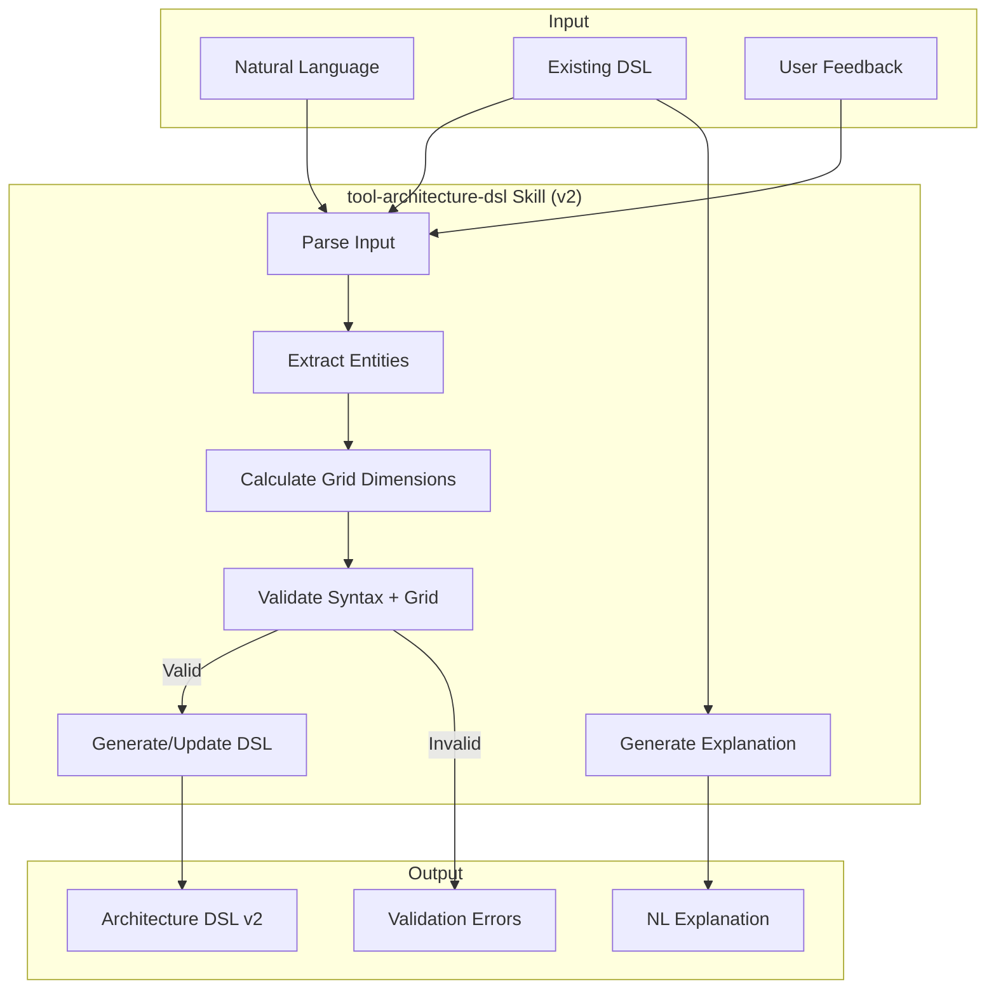

# Technical Design: Architecture DSL Skill

> Feature ID: FEATURE-015 | Version: v2.0 | Last Updated: 01-24-2026

## Version History

| Version | Date | Description |
|---------|------|-------------|
| v2.0 | 01-24-2026 | Grid-based layout system (12-column Bootstrap-inspired) |
| v1.0 | 01-24-2026 | Initial design - tool skill for Architecture DSL |

---

## Part 1: Agent-Facing Summary

> **Purpose:** Quick reference for AI agents navigating large projects.
> **📌 AI Coders:** Focus on this section for implementation context.

### Scope & Boundaries

**In Scope:**
- Tool skill at `.github/skills/tool-architecture-dsl/`
- DSL grammar reference document (v2 grid syntax)
- Example DSL files (Module View, Landscape View)
- Integration with `x-ipe-docs/config/tools.json`
- Migration guide from v1 to v2

**Out of Scope:**
- Rendering/visualization (FEATURE-016)
- Parser runtime code (skill is AI-native, no code execution)
- Frontend components

### Key Components Implemented

| Component | Responsibility | Scope/Impact | Tags |
|-----------|----------------|--------------|------|
| `SKILL.md` | Main skill definition with v2 grid workflow | Skill entry point | #skill #dsl #architecture #grid |
| `references/grammar.md` | Complete v2 DSL grammar specification | DSL syntax rules | #grammar #dsl #reference #v2 |
| `examples/module-view.dsl` | Module View example file | Learning reference | #example #module-view |
| `examples/module-view-v2.dsl` | v2 Grid-based Module View example | Learning reference | #example #module-view #v2 |
| `examples/landscape-view.dsl` | Landscape View example file | Learning reference | #example #landscape-view |

### Dependencies

| Dependency | Source | Design Link | Usage Description |
|------------|--------|-------------|-------------------|
| `infographic-syntax-creator` | Existing Skill | [SKILL.md](../../.github/skills/infographic-syntax-creator/SKILL.md) | Reference for skill structure and DSL patterns |
| `x-ipe-docs/config/tools.json` | FEATURE-011 | [technical-design.md](../FEATURE-011/technical-design.md) | Tool toggle configuration |
| `tool-architecture-dsl-v1-backup` | v1 Backup | [SKILL.md](../../.github/skills/tool-architecture-dsl-v1-backup/SKILL.md) | Flexbox-based v1 for reference |

### Major Flow

1. **NL → DSL (v2):** User describes architecture → Skill extracts entities → Generates valid DSL with grid layout
2. **DSL → NL:** User provides DSL → Skill parses structure → Generates explanation including grid dimensions
3. **Validation (v2):** User provides DSL → Skill checks syntax/semantics + grid validation → Returns errors/warnings
4. **Refinement:** User provides DSL + feedback → Skill updates DSL (adjusting grid) → Returns modified DSL

### Usage Example (v2)

```markdown
# In SKILL.md usage section:

## Generating DSL from Natural Language

**User Input:**
"Create a 3-tier architecture with a React frontend, Express API layer, and PostgreSQL database"

**Agent Output:**
```architecture-dsl
@startuml module-view
title "3-Tier Web Application"
direction top-to-bottom
grid 12 x 6

layer "Presentation" {
  color "#fce7f3"
  border-color "#ec4899"
  rows 2
  
  module "Frontend" {
    cols 12
    rows 2
    grid 2 x 1
    align center center
    component "React App" { cols 1, rows 1 }
    component "Redux Store" { cols 1, rows 1 }
  }
}

layer "Application" {
  color "#dbeafe"
  border-color "#3b82f6"
  rows 2
  
  module "API" {
    cols 12
    rows 2
    grid 3 x 1
    align center center
    component "Express Server" { cols 1, rows 1 }
    component "REST Controllers" { cols 1, rows 1 }
    component "Middleware" { cols 1, rows 1 }
  }
}

layer "Data" {
  color "#dcfce7"
  border-color "#22c55e"
  rows 2
  
  module "Persistence" {
    cols 12
    rows 2
    grid 2 x 1
    align center center
    component "PostgreSQL" { cols 1, rows 1 }
    component "Prisma ORM" { cols 1, rows 1 }
  }
}

@enduml
```
```

---

## Part 2: Implementation Guide

> **Purpose:** Human-readable details for developers.
> **📌 Emphasis on visual diagrams for comprehension.

### Skill Structure

```
.github/skills/tool-architecture-dsl/
├── SKILL.md                    # Main skill definition (v2 grid-based)
├── references/
│   └── grammar.md              # Complete v2 DSL grammar
└── examples/
    ├── module-view.dsl         # Module View example (v1)
    ├── module-view-v2.dsl      # Module View example (v2 grid)
    └── landscape-view.dsl      # Landscape View example

.github/skills/tool-architecture-dsl-v1-backup/
├── SKILL.md                    # v1 Flexbox-based skill (archived)
└── references/
    └── grammar.md              # v1 grammar (archived)
```

### Grid System Mental Model (v2)

```
┌──────────────────────────────────────────────────────────────────────────┐
│ Document: grid 12 x 6                                                    │
│ ┌──────────────────────────────────────────────────────────────────────┐ │
│ │ Layer: rows 2                                                        │ │
│ │ ┌────────────────┐ ┌────────────────────────────────────────────────┐ │ │
│ │ │ Module: cols 4 │ │ Module: cols 8                                 │ │ │
│ │ │ grid 1 x 3     │ │ grid 2 x 3                                     │ │ │
│ │ │ ┌────────────┐ │ │ ┌──────────────┐ ┌──────────────┐              │ │ │
│ │ │ │ Component  │ │ │ │ Component    │ │ Component    │              │ │ │
│ │ │ │ cols 1     │ │ │ │ cols 1       │ │ cols 1       │              │ │ │
│ │ │ │ rows 1     │ │ │ │ rows 1       │ │ rows 1       │              │ │ │
│ │ │ └────────────┘ │ │ └──────────────┘ └──────────────┘              │ │ │
│ │ │ ┌────────────┐ │ │ ┌──────────────┐ ┌──────────────┐              │ │ │
│ │ │ │ Component  │ │ │ │ Component    │ │ Component    │              │ │ │
│ │ │ └────────────┘ │ │ └──────────────┘ └──────────────┘              │ │ │
│ │ │ ┌────────────┐ │ │ ┌─────────────────────────────┐                │ │ │
│ │ │ │ Component  │ │ │ │ Component (cols 2)          │ ← spans 2 cols │ │ │
│ │ │ └────────────┘ │ │ └─────────────────────────────┘                │ │ │
│ │ └────────────────┘ └────────────────────────────────────────────────┘ │ │
│ └──────────────────────────────────────────────────────────────────────┘ │
│                           ... more layers ...                            │
└──────────────────────────────────────────────────────────────────────────┘
```

### Workflow Diagram (v2)



### DSL Grammar Summary (v2)

```
document     := header elements* '@enduml'
header       := '@startuml' view-type
view-type    := 'module-view' | 'landscape-view'

# Grid System (v2 - Module View)
grid         := 'grid' NUMBER 'x' NUMBER     # Document: 12 x total_rows
rows         := 'rows' NUMBER                 # Layer: rows in document grid
cols         := 'cols' NUMBER                 # Module: 1-12, must sum to 12
grid         := 'grid' NUMBER 'x' NUMBER     # Module: internal component grid
align        := 'align' H_ALIGN V_ALIGN      # Module: component alignment
gap          := 'gap' SIZE                   # Module: component spacing

# Module View Elements (v2)
layer        := 'layer' STRING ('as' ALIAS)? '{' layer-content* '}'
layer-content := rows | module | color | border-color | text-align
module       := 'module' STRING ('as' ALIAS)? '{' module-content* '}'
module-content := cols | rows | grid | align | gap | component | color | text-align
component    := 'component' STRING ('{' cols-prop ',' rows-prop '}')? stereotype?
cols-prop    := 'cols' NUMBER
rows-prop    := 'rows' NUMBER

# Landscape View Elements (unchanged)
zone         := 'zone' STRING '{' zone-content* '}'
app          := 'app' STRING ('as' ALIAS)? '{' app-props* '}'
database     := 'database' STRING ('as' ALIAS)?
flow         := ALIAS '-->' ALIAS ':' STRING

# Common
comment      := "'" text | "/'" text "'/"
H_ALIGN      := 'left' | 'center' | 'right'
V_ALIGN      := 'top' | 'center' | 'bottom'
SIZE         := NUMBER 'px' | NUMBER 'rem'
NUMBER       := [0-9]+
```

### SKILL.md Structure (v2)

```markdown
---
name: tool-architecture-dsl
description: Translate between natural language and Architecture DSL v2 (grid-based)...
---

# Architecture DSL Skill (v2)

## What's New in v2
[Grid system overview]

## Overview
[Purpose and capabilities]

## When to Use
[Decision matrix vs other tools]

## Workflow
[Step-by-step process with grid considerations]

## Layout Principles (v2)
[P1-P11 grid-based principles]

## DSL Syntax Reference
[Quick reference with v2 grid syntax]

## Migration from v1
[v1 → v2 syntax mapping]

## Examples
[Inline examples + links to example files]

## Capabilities
- NL → DSL Translation
- DSL → NL Explanation  
- DSL Validation (with grid validation)
- DSL Refinement
```

### Config Integration

**Location:** `x-ipe-docs/config/tools.json`

```json
{
  "stages": {
    "ideation": {
      "ideation": {
        "tool-architecture-dsl": true,  // Uses v2 grid syntax
        "antv-infographic": false,
        "mermaid": true
      }
    }
  }
}
```

**Toggle Behavior:**
- `true`: Skill available in ideation workflow
- `false`: Skill disabled, not suggested by AI

### Implementation Steps

#### Phase 1: Create v2 Skill Structure ✅

1. ✅ Backup v1 skill to `tool-architecture-dsl-v1-backup/`
2. ✅ Update `SKILL.md` with v2 grid syntax
3. ✅ Update `references/grammar.md` with v2 grammar

#### Phase 2: Update Examples (Next)

1. Create `examples/module-view-v2.dsl`:
   - X-IPE architecture with grid layout
   - All v2 features demonstrated
   
2. Verify `examples/landscape-view.dsl` still valid

#### Phase 3: Update Documentation

1. ✅ Update FEATURE-015 specification with v2 ACs
2. ✅ Update FEATURE-015 technical design with v2 grammar
3. Note FEATURE-016 renderer will need updates for grid

### Edge Cases & Error Handling (v2)

| Scenario | Expected Behavior |
|----------|-------------------|
| Missing `grid 12 x N` | Error: "Missing grid declaration" |
| `cols` sum ≠ 12 | Error: "Module cols sum to N, expected 12" |
| Missing `rows` on layer | Error: "Missing rows declaration in layer" |
| Component `cols` > module grid | Error: "Component cols exceeds module grid" |
| Undefined alias in flow | Error: "Undefined alias 'xxx' in flow" |
| Invalid status value | Warning: "Unknown status 'xxx'" |
| Empty container | Valid - renders empty box |

### Validation Rules (v2)

```
1. SYNTAX: Document must start with @startuml and end with @enduml
2. VIEW_TYPE: Only module-view or landscape-view allowed
3. GRID_DOC: Document must have grid C x R declaration (Module View)
4. GRID_LAYER: Layers must have rows declaration (Module View)
5. GRID_MODULE: Module cols in layer must sum to 12 (Module View)
6. ALIAS_UNIQUE: All aliases in document must be unique
7. ALIAS_DEFINED: Flow references must use defined aliases
8. STATUS_VALUES: app status must be healthy|warning|critical
```

### NL → DSL Translation Patterns (v2)

| Natural Language Pattern | DSL Output (v2) |
|-------------------------|-----------------|
| "three layers: X, Y, Z" | `grid 12 x 6` + 3 layers with `rows 2` |
| "module A contains B, C" | `module "A" { grid 2 x 1 component "B" { cols 1 } ... }` |
| "split into 3 equal modules" | 3 modules with `cols 4` each |
| "one wide, one narrow" | `cols 8` + `cols 4` |
| "stack vertically" | `grid 1 x N` in module |
| "center components" | `align center center` |
| "2×3 grid of components" | `grid 2 x 3` with 6 components |

---

## Design Change Log

| Date | Phase | Change Summary |
|------|-------|----------------|
| 01-24-2026 | v2.0 | Grid-based layout system. Replaced flexbox with 12-column grid. Added `grid`, `cols`, `rows`, `align`, `gap` syntax. Backup v1 to separate folder. |
| 01-24-2026 | v1.0 | Initial technical design created. Tool skill structure based on infographic-syntax-creator pattern. Four implementation phases defined. |
