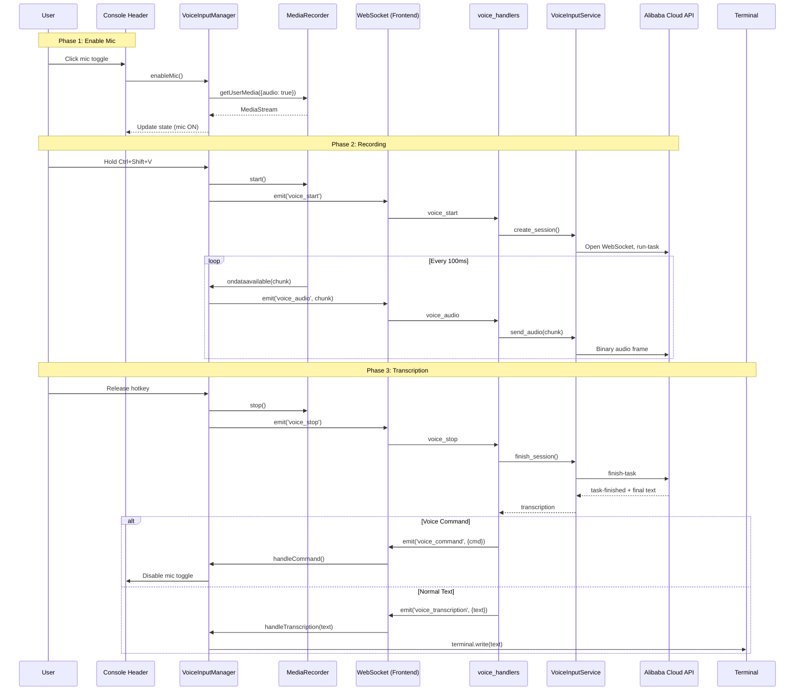
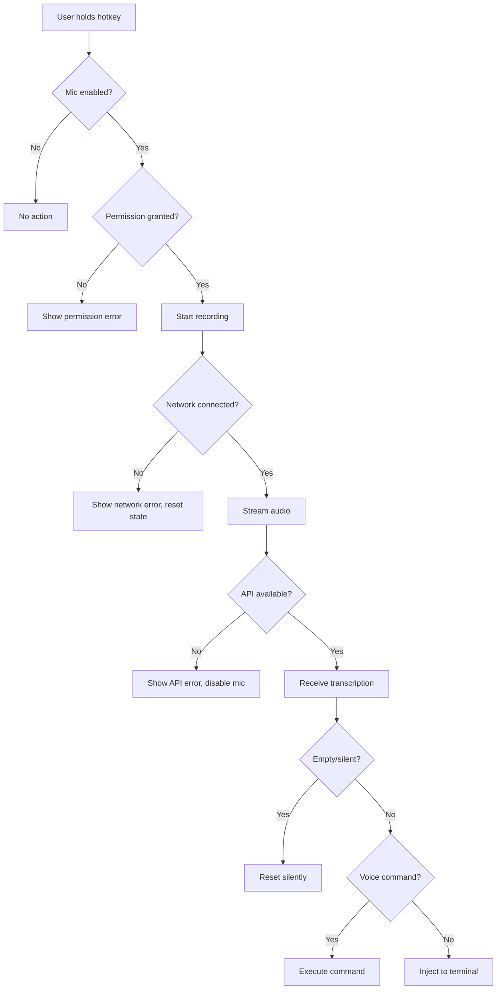

# Technical Design: Console Voice Input

> Feature ID: FEATURE-021 | Version: v1.0 | Last Updated: 01-25-2026

---

## Design Principles

### Module Size Rule (800-Line Threshold)

> **Rule:** When adding new functionality to an existing file, if the result would exceed **800 lines of code**, extract the new functionality into a **standalone module**.

**Rationale:**
- Files over 800 lines become difficult to navigate and maintain
- Standalone modules enable better separation of concerns
- Easier to test, debug, and refactor isolated modules
- Reduces merge conflicts in collaborative development

**Application to FEATURE-021:**
- `terminal-v2.js` is already ~500 lines
- Voice input adds ~400 lines of functionality
- **Decision:** Create standalone `static/js/features/voice-input.js`
- Terminal only exports `getFocusedTerminal()` helper (minimal change)

---

## Part 1: Agent-Facing Summary

> **Purpose:** Quick reference for AI agents navigating large projects.
> **📌 AI Coders:** Focus on this section for implementation context.

### Key Components Implemented

| Component | Responsibility | Scope/Impact | Tags |
|-----------|----------------|--------------|------|
| `VoiceInputService` | Backend service for Alibaba Cloud speech API relay | Server-side speech recognition | #voice #speech #backend #websocket |
| `VoiceInputManager` | Frontend JS class for audio capture & UI | Browser audio recording, UI state | #voice #frontend #mediarecorder |
| `ConsoleHeaderVoice` | Console header UI with mic toggle, voice indicator | UI components in console bar | #ui #console #voice |
| `voice_handlers` | Socket.IO handlers for voice WebSocket events | Real-time audio streaming | #websocket #voice #socketio |

### Scope & Boundaries

**In Scope:**
- Mic toggle button in console header
- Push-to-talk audio capture (Ctrl+Shift+V)
- Alibaba Cloud gummy-realtime-v1 API integration
- Text injection into focused terminal pane
- Voice command "close mic"

**Out of Scope:**
- Voice commands for terminal control
- Real-time streaming to terminal
- Configurable hotkey
- Multi-language simultaneous detection

### Dependencies

| Dependency | Source | Design Link | Usage Description |
|------------|--------|-------------|-------------------|
| `TerminalInstance` | FEATURE-005 | [terminal-v2.js](../../../static/js/terminal-v2.js) | Target for text injection, focus management |
| `PaneManager` | FEATURE-005 | [terminal-v2.js](../../../static/js/terminal-v2.js) | Get focused terminal pane |
| `socketio` | FEATURE-005 | [app.py](../../../src/app.py) | WebSocket infrastructure for voice events |
| `session_manager` | FEATURE-005 | [terminal_service.py](../../../src/services/terminal_service.py) | Terminal session reference |

### Major Flow

1. User clicks mic toggle → Request mic permission → Mic enabled (cyan)
2. User holds `Ctrl+Shift+V` → Start MediaRecorder → Stream audio via WebSocket
3. Backend receives audio → Relay to Alibaba Cloud API → Receive transcription
4. Backend sends transcription → Frontend injects into focused terminal
5. User says "close mic" → Command recognized → Mic disabled

### Usage Example

```javascript
// Frontend: Initialize voice input
const voiceManager = new VoiceInputManager();
voiceManager.init();

// Enable mic (user clicks toggle)
await voiceManager.enableMic();

// Recording starts when hotkey held
document.addEventListener('keydown', (e) => {
    if (e.ctrlKey && e.shiftKey && e.key === 'V') {
        voiceManager.startRecording();
    }
});

document.addEventListener('keyup', (e) => {
    if (e.key === 'V') {
        voiceManager.stopRecording(); // Triggers transcription
    }
});

// Transcription result handler
voiceManager.onTranscription = (text) => {
    const terminal = PaneManager.getFocusedTerminal();
    terminal.write(text);
};
```

```python
# Backend: Voice input service using dashscope SDK
from src.services.voice_input_service_v2 import VoiceInputService, is_voice_command

voice_service = VoiceInputService(api_key=os.environ['ALIBABA_SPEECH_API_KEY'])

# In WebSocket handler
@socketio.on('voice_start')
def handle_voice_start():
    session_id = voice_service.create_session(socket_sid=request.sid)
    voice_service.start_recognition(session_id)  # Uses dashscope SDK
    emit('voice_ready', {'session_id': session_id})

@socketio.on('voice_audio')
def handle_voice_audio(data):
    session_id = get_session_for_socket(request.sid)
    audio_chunk = bytes(data['audio'])
    voice_service.send_audio(session_id, audio_chunk)  # Forwards to recognizer

@socketio.on('voice_stop')
def handle_voice_stop():
    session_id = get_session_for_socket(request.sid)
    transcription = voice_service.stop_recognition(session_id)  # Gets final text
    
    # Check for voice commands
    if is_voice_command(transcription):
        emit('voice_command', {'command': 'close_mic'})
    else:
        emit('voice_result', {'text': transcription})
```

---

## Part 2: Implementation Guide

> **Purpose:** Human-readable details for developers.
> **📌 Emphasis on visual diagrams for comprehension.

### Architecture Overview

```
┌─────────────────────────────────────────────────────────────────────────┐
│                              BROWSER                                     │
├─────────────────────────────────────────────────────────────────────────┤
│  ┌─────────────────┐    ┌──────────────────┐    ┌───────────────────┐  │
│  │  Console Header │    │ VoiceInputManager│    │  TerminalInstance │  │
│  │  [🎤] [🔊]      │───▶│  MediaRecorder   │───▶│  xterm.js         │  │
│  └─────────────────┘    │  Socket.IO       │    │  write(text)      │  │
│                         └────────┬─────────┘    └───────────────────┘  │
│                                  │ audio chunks                         │
└──────────────────────────────────┼──────────────────────────────────────┘
                                   │ Socket.IO
┌──────────────────────────────────┼──────────────────────────────────────┐
│                              SERVER                                      │
├──────────────────────────────────┼──────────────────────────────────────┤
│                         ┌────────▼─────────┐                            │
│                         │  voice_handlers  │                            │
│                         │  (Socket.IO)     │                            │
│                         └────────┬─────────┘                            │
│                                  │                                       │
│                         ┌────────▼─────────┐                            │
│                         │VoiceInputService │                            │
│                         │(dashscope SDK)   │                            │
│                         │TranslationRecog- │                            │
│                         │ nizerRealtime    │                            │
│                         └────────┬─────────┘                            │
│                                  │ SDK handles connection               │
└──────────────────────────────────┼──────────────────────────────────────┘
                                   │
┌──────────────────────────────────┼──────────────────────────────────────┐
│                         ALIBABA CLOUD                                    │
├──────────────────────────────────┼──────────────────────────────────────┤
│                         ┌────────▼─────────┐                            │
│                         │ gummy-realtime-v1│                            │
│                         │ Speech Recognition│                           │
│                         └──────────────────┘                            │
└─────────────────────────────────────────────────────────────────────────┘
```

### Workflow Diagram: Voice Input Flow



### Workflow Diagram: Error Handling



### Data Models

#### VoiceSession (Backend)

```python
@dataclass
class VoiceSession:
    session_id: str
    socket_sid: str
    alibaba_ws: WebSocket  # Connection to Alibaba Cloud
    state: Literal['idle', 'recording', 'processing']
    created_at: datetime
    audio_buffer: bytes  # Fallback buffer
    partial_text: str  # Partial transcription for streaming
```

#### VoiceInputState (Frontend)

```typescript
interface VoiceInputState {
    micEnabled: boolean;
    isRecording: boolean;
    isProcessing: boolean;
    permissionState: 'prompt' | 'granted' | 'denied';
    error: string | null;
    partialText: string;
}
```

### API Specification

#### WebSocket Events (Frontend → Backend)

| Event | Payload | Description |
|-------|---------|-------------|
| `voice_start` | `{}` | Start new voice recording session |
| `voice_audio` | `{audio: ArrayBuffer}` | Audio chunk (100ms, PCM 16kHz) |
| `voice_stop` | `{}` | Stop recording, request transcription |
| `voice_cancel` | `{}` | Cancel current recording |

#### WebSocket Events (Backend → Frontend)

| Event | Payload | Description |
|-------|---------|-------------|
| `voice_session` | `{session_id: string}` | Voice session created |
| `voice_partial` | `{text: string}` | Partial transcription (streaming) |
| `voice_transcription` | `{text: string}` | Final transcription |
| `voice_command` | `{command: string}` | Voice command recognized |
| `voice_error` | `{message: string, code: string}` | Error occurred |

### Alibaba Cloud API Integration

#### Connection Setup

```python
# Endpoint
WS_ENDPOINT = "wss://dashscope.aliyuncs.com/api-ws/v1/inference"

# Headers
headers = {
    "Authorization": f"Bearer {api_key}",
    "Content-Type": "application/json"
}

# run-task message
run_task = {
    "header": {
        "task_id": str(uuid.uuid4()),
        "event": "run-task",
        "attributes": {}
    },
    "payload": {
        "model": "gummy-realtime-v1",
        "task": "transcription",
        "parameters": {
            "format": "pcm",
            "sample_rate": 16000,
            "channels": 1
        }
    }
}
```

#### Audio Streaming Protocol

1. Send `run-task` JSON message
2. Wait for `task-started` event
3. Send binary audio frames (100ms chunks, ~3200 bytes each)
4. Receive `result-generated` events with partial/final text
5. Send `finish-task` on recording end
6. Wait for `task-finished` event

### Implementation Steps

#### Phase 1: Backend Service (Est. 3 hours)

| Step | Task | Files |
|------|------|-------|
| 1.1 | Create VoiceInputService class | `src/services/voice_input_service.py` |
| 1.2 | Implement Alibaba Cloud WebSocket client | `src/services/voice_input_service.py` |
| 1.3 | Add session management (create, audio, finish) | `src/services/voice_input_service.py` |
| 1.4 | Register Socket.IO handlers for voice events | `src/app.py` |
| 1.5 | Add API key configuration | `src/config.py`, `.env` |

#### Phase 2: Frontend - VoiceInputManager (Est. 3 hours)

| Step | Task | Files |
|------|------|-------|
| 2.1 | Create VoiceInputManager class | `static/js/features/voice-input.js` |
| 2.2 | Implement permission handling | `static/js/features/voice-input.js` |
| 2.3 | Implement MediaRecorder capture | `static/js/features/voice-input.js` |
| 2.4 | Add WebSocket event handlers | `static/js/features/voice-input.js` |
| 2.5 | Implement hotkey detection (Ctrl+Shift+V) | `static/js/features/voice-input.js` |

#### Phase 3: Frontend - UI Components (Est. 2 hours)

| Step | Task | Files |
|------|------|-------|
| 3.1 | Move connection status to left side | `static/css/features/console.css`, template |
| 3.2 | Add mic toggle button | `src/templates/index.html`, `static/css/features/console.css` |
| 3.3 | Add voice indicator (waveform bars) | `src/templates/index.html`, `static/css/features/console.css` |
| 3.4 | Add transcription preview bar | `src/templates/index.html`, `static/css/features/console.css` |
| 3.5 | Wire UI to VoiceInputManager | `static/js/features/voice-input.js` |

#### Phase 4: Terminal Integration (Est. 1.5 hours)

| Step | Task | Files |
|------|------|-------|
| 4.1 | Add getFocusedTerminal() to PaneManager | `static/js/terminal-v2.js` |
| 4.2 | Implement text injection to terminal | `static/js/features/voice-input.js` |
| 4.3 | Handle terminal focus changes | `static/js/features/voice-input.js` |

#### Phase 5: Voice Commands (Est. 1 hour)

| Step | Task | Files |
|------|------|-------|
| 5.1 | Add command pattern matching | `src/services/voice_input_service.py` |
| 5.2 | Implement "close mic" command | `static/js/features/voice-input.js` |
| 5.3 | Add command feedback toast | `static/js/features/voice-input.js` |

#### Phase 6: Error Handling & Polish (Est. 1.5 hours)

| Step | Task | Files |
|------|------|-------|
| 6.1 | Add network error handling | All voice files |
| 6.2 | Add permission error UI | `static/js/features/voice-input.js` |
| 6.3 | Add debouncing for rapid hotkey presses | `static/js/features/voice-input.js` |
| 6.4 | Add 30-second auto-stop | `static/js/features/voice-input.js` |
| 6.5 | Add localStorage for mic state persistence | `static/js/features/voice-input.js` |

**Total Estimated Time: ~12 hours**

### File Structure

```
src/
├── services/
│   ├── __init__.py (add VoiceInputService import)
│   └── voice_input_service.py (NEW)
├── app.py (add voice handlers)
└── config.py (add ALIBABA_SPEECH_API_KEY)

static/
├── js/
│   ├── features/
│   │   └── voice-input.js (NEW)
│   └── terminal-v2.js (add getFocusedTerminal)
└── css/
    └── features/
        └── console.css (add voice UI styles)

src/templates/
└── index.html (add voice UI elements)
```

### Edge Cases & Error Handling

| Scenario | Detection | Response |
|----------|-----------|----------|
| No terminal focused | `PaneManager.getFocused() === null` | Use last active pane |
| Network disconnect during recording | WebSocket `onerror`/`onclose` | Show error, reset state, don't inject |
| Browser denies mic permission | `PermissionState === 'denied'` | Show tooltip, keep mic OFF |
| Silent audio (no speech) | Alibaba returns empty text | Reset silently, no error |
| Recording > 30 seconds | Timer in VoiceInputManager | Auto-stop, proceed with transcription |
| Rapid hotkey presses | Debounce flag in VoiceInputManager | Ignore until operation completes |
| API quota exceeded | HTTP 429 or specific error code | Show error, disable mic for 60s |
| Focus changes during recording | Track focused pane at injection time | Inject to newly focused pane |

### Security Considerations

| Concern | Mitigation |
|---------|------------|
| API key exposure | Store in environment variable, never send to frontend |
| Audio data privacy | Process in-memory only, never store on disk |
| WebSocket security | Use WSS (TLS) for all connections |
| Permission abuse | Request mic only when user enables toggle |

### Testing Strategy

| Test Category | Scope | Tools |
|---------------|-------|-------|
| Unit Tests | VoiceInputService methods | pytest, unittest.mock |
| Integration Tests | WebSocket event handlers | pytest-socketio |
| Frontend Tests | VoiceInputManager state | Jest, mock MediaRecorder |
| E2E Tests | Full voice flow (mocked API) | Playwright |

---

## Design Change Log

| Date | Phase | Change Summary |
|------|-------|----------------|
| 01-25-2026 | Initial Design | Initial technical design created for FEATURE-021 Console Voice Input. Architecture: Frontend VoiceInputManager with MediaRecorder → Backend VoiceInputService → Alibaba Cloud gummy-realtime-v1. 6 implementation phases, ~12 hours estimated. |
