# Technical Design: Element Inspector

> Feature ID: FEATURE-022-B | Version: v1.0 | Last Updated: 01-28-2026

---

## Part 1: Agent-Facing Summary

> **Purpose:** Quick reference for AI agents navigating large projects.
> **📌 AI Coders:** Focus on this section for implementation context.

### Key Components Implemented

| Component | Responsibility | Scope/Impact | Tags |
|-----------|----------------|--------------|------|
| `InspectorScript` | Injected JS in iframe for hover/click detection | Browser viewport content | #inspector #frontend #injection |
| `InspectorManager` | Parent frame manager for highlights/tooltips | UIUXFeedbackManager extension | #inspector #ui #state |
| `HighlightOverlay` | DOM overlay for element highlighting | Visual feedback | #inspector #css #overlay |
| `ProxyService` (extend) | Inject inspector script into HTML | Proxy enhancement | #proxy #injection #backend |

### Dependencies

| Dependency | Source | Design Link | Usage Description |
|------------|--------|-------------|-------------------|
| `UIUXFeedbackManager` | FEATURE-022-A | [technical-design.md](../FEATURE-022-A/technical-design.md) | Extends to add inspect toggle and selection state |
| `ProxyService._rewrite_html()` | FEATURE-022-A | [technical-design.md](../FEATURE-022-A/technical-design.md) | Inject inspector script into proxied HTML |
| `postMessage API` | Browser | MDN | Cross-frame communication between iframe and parent |

### Scope & Boundaries

**In Scope:**
- Hover highlighting with CSS outline
- Element tag tooltip display
- Single and multi-select (Ctrl/Cmd+click)
- Selection count in toolbar
- Inspect mode toggle

**Out of Scope:**
- Context menu (FEATURE-022-C)
- Screenshot capture (FEATURE-022-C)
- Feedback storage (FEATURE-022-D)

### Major Flow

1. User clicks "Inspect" toggle → InspectorManager enables inspect mode
2. InspectorManager sends `{type: 'inspect-mode', enabled: true}` via postMessage to iframe
3. InspectorScript in iframe listens for mousemove → identifies element under cursor
4. InspectorScript sends `{type: 'hover', element: {...}}` to parent
5. InspectorManager receives message → renders HighlightOverlay at element position
6. User clicks element → InspectorScript sends `{type: 'select', element: {...}}`
7. InspectorManager adds element to selection array → updates overlay color to orange

### Usage Example

```javascript
// InspectorManager (in parent frame)
class InspectorManager {
    constructor(iframeElement) {
        this.iframe = iframeElement;
        this.inspectMode = false;
        this.selectedElements = []; // CSS selectors
        this.hoverElement = null;
        
        window.addEventListener('message', this.handleMessage.bind(this));
    }
    
    toggleInspect() {
        this.inspectMode = !this.inspectMode;
        this.iframe.contentWindow.postMessage({
            type: 'inspect-mode',
            enabled: this.inspectMode
        }, '*');
    }
    
    handleMessage(event) {
        const { type, element } = event.data;
        if (type === 'hover') {
            this.showHighlight(element, 'hover');
        } else if (type === 'select') {
            this.addToSelection(element);
        }
    }
}

// InspectorScript (injected into iframe)
// Listens for mousemove, click events and reports to parent
document.addEventListener('mousemove', (e) => {
    const element = document.elementFromPoint(e.clientX, e.clientY);
    window.parent.postMessage({
        type: 'hover',
        element: {
            tag: element.tagName.toLowerCase(),
            className: element.className.split(' ')[0],
            selector: generateSelector(element),
            rect: element.getBoundingClientRect()
        }
    }, '*');
});
```

---

## Part 2: Implementation Guide

> **Purpose:** Human-readable details for developers.
> **📌 Emphasis on visual diagrams for comprehension.

### Workflow Diagram

```mermaid
sequenceDiagram
    participant U as User
    participant T as Toolbar
    participant IM as InspectorManager
    participant IF as IFrame
    participant IS as InspectorScript
    
    U->>T: Click "Inspect" toggle
    T->>IM: toggleInspect()
    IM->>IF: postMessage({type: 'inspect-mode', enabled: true})
    IF->>IS: message event received
    IS-->>IS: Enable hover tracking
    
    U->>IF: Move cursor over element
    IS->>IS: mousemove → elementFromPoint()
    IS->>IM: postMessage({type: 'hover', element: {...}})
    IM->>IM: showHighlight(element, 'hover')
    
    U->>IF: Click element
    IS->>IS: click → preventDefault()
    IS->>IM: postMessage({type: 'select', element: {...}})
    IM->>IM: addToSelection(element)
    IM->>T: updateSelectionCount()
```



### Component Architecture


### Data Models

#### ElementInfo (postMessage payload)

```typescript
interface ElementInfo {
    tag: string;           // 'div', 'button', 'a'
    className: string;     // First class only, '' if none
    id: string;            // Element ID if present
    selector: string;      // Unique CSS selector
    rect: {
        x: number;         // Relative to viewport
        y: number;
        width: number;
        height: number;
    };
}
```

#### InspectorState

```typescript
interface InspectorState {
    enabled: boolean;
    hoverElement: ElementInfo | null;
    selectedElements: string[];  // CSS selectors
}
```

### Message Protocol

| Message Type | Direction | Payload | Description |
|--------------|-----------|---------|-------------|
| `inspect-mode` | Parent → Child | `{enabled: boolean}` | Toggle inspect mode |
| `hover` | Child → Parent | `{element: ElementInfo}` | Element under cursor |
| `hover-leave` | Child → Parent | `{}` | Cursor left all elements |
| `select` | Child → Parent | `{element: ElementInfo, multiSelect: boolean}` | Element clicked |
| `clear-selection` | Child → Parent | `{}` | Click on empty area |

### CSS Selector Generation

Generate unique selectors for element identification:

```javascript
function generateSelector(element) {
    // Priority: id > class + nth > tag + nth
    if (element.id) {
        return `#${element.id}`;
    }
    
    const tag = element.tagName.toLowerCase();
    const className = element.className?.split(' ')[0];
    
    if (className) {
        const siblings = element.parentElement?.querySelectorAll(`${tag}.${className}`);
        if (siblings?.length === 1) {
            return `${tag}.${className}`;
        }
        const index = Array.from(siblings || []).indexOf(element);
        return `${tag}.${className}:nth-of-type(${index + 1})`;
    }
    
    // Fallback: tag + position
    const siblings = element.parentElement?.children;
    const index = Array.from(siblings || []).indexOf(element);
    return `${tag}:nth-child(${index + 1})`;
}
```

### Implementation Steps

#### 1. Backend: Extend ProxyService

**File:** `src/x_ipe/services/proxy_service.py`

```python
INSPECTOR_SCRIPT = '''
<script data-x-ipe-inspector="true">
(function() {
    let inspectEnabled = false;
    
    window.addEventListener('message', function(e) {
        if (e.data.type === 'inspect-mode') {
            inspectEnabled = e.data.enabled;
        }
    });
    
    document.addEventListener('mousemove', function(e) {
        if (!inspectEnabled) return;
        const el = document.elementFromPoint(e.clientX, e.clientY);
        if (!el || el === document.body || el === document.documentElement) {
            window.parent.postMessage({type: 'hover-leave'}, '*');
            return;
        }
        window.parent.postMessage({
            type: 'hover',
            element: {
                tag: el.tagName.toLowerCase(),
                className: (el.className || '').split(' ')[0] || '',
                id: el.id || '',
                selector: generateSelector(el),
                rect: el.getBoundingClientRect()
            }
        }, '*');
    }, true);
    
    document.addEventListener('click', function(e) {
        if (!inspectEnabled) return;
        e.preventDefault();
        e.stopPropagation();
        const el = e.target;
        window.parent.postMessage({
            type: 'select',
            element: {
                tag: el.tagName.toLowerCase(),
                className: (el.className || '').split(' ')[0] || '',
                id: el.id || '',
                selector: generateSelector(el),
                rect: el.getBoundingClientRect()
            },
            multiSelect: e.ctrlKey || e.metaKey
        }, '*');
    }, true);
    
    function generateSelector(el) {
        if (el.id) return '#' + el.id;
        const tag = el.tagName.toLowerCase();
        const cls = (el.className || '').split(' ')[0];
        if (cls) {
            const siblings = el.parentElement?.querySelectorAll(tag + '.' + cls);
            if (siblings?.length === 1) return tag + '.' + cls;
            const idx = Array.from(siblings || []).indexOf(el);
            return tag + '.' + cls + ':nth-of-type(' + (idx + 1) + ')';
        }
        const siblings = el.parentElement?.children || [];
        const idx = Array.from(siblings).indexOf(el);
        return tag + ':nth-child(' + (idx + 1) + ')';
    }
})();
</script>
'''
```

**Inject in `_rewrite_html()`:**
```python
def _rewrite_html(self, html: str, base_url: str) -> str:
    # ... existing rewriting ...
    
    # Inject inspector script before </body>
    body = soup.find('body')
    if body:
        script_tag = BeautifulSoup(INSPECTOR_SCRIPT, 'html.parser')
        body.append(script_tag)
    
    return str(soup)
```

#### 2. Frontend: InspectorManager Class

**File:** `src/x_ipe/static/js/uiux-feedback.js` (extend)

Add InspectorManager to UIUXFeedbackManager:

```javascript
// Add to UIUXFeedbackManager class
initInspector() {
    this.inspector = {
        enabled: false,
        hoverElement: null,
        selectedElements: []  // CSS selectors
    };
    
    // Listen for messages from iframe
    window.addEventListener('message', this.handleInspectorMessage.bind(this));
}

handleInspectorMessage(event) {
    const { type, element, multiSelect } = event.data;
    
    switch (type) {
        case 'hover':
            this.showHoverHighlight(element);
            break;
        case 'hover-leave':
            this.hideHoverHighlight();
            break;
        case 'select':
            this.handleElementSelect(element, multiSelect);
            break;
        case 'clear-selection':
            this.clearSelection();
            break;
    }
}

toggleInspect() {
    this.inspector.enabled = !this.inspector.enabled;
    this.updateInspectButton();
    
    const iframe = this.elements.iframe;
    if (iframe?.contentWindow) {
        iframe.contentWindow.postMessage({
            type: 'inspect-mode',
            enabled: this.inspector.enabled
        }, '*');
    }
}
```

#### 3. Frontend: Highlight Overlay

**File:** `src/x_ipe/static/css/uiux-feedback.css` (extend)

```css
/* Hover highlight */
.inspector-highlight {
    position: absolute;
    pointer-events: none;
    border: 2px solid #3b82f6;
    background: rgba(59, 130, 246, 0.08);
    border-radius: 4px;
    z-index: 1000;
    transition: all 0.05s ease;
}

/* Selected highlight */
.inspector-highlight.selected {
    border-color: #f59e0b;
    background: rgba(245, 158, 11, 0.08);
}

/* Tooltip */
.inspector-tooltip {
    position: absolute;
    background: #3b82f6;
    color: white;
    padding: 4px 10px;
    border-radius: 4px;
    font-family: 'JetBrains Mono', monospace;
    font-size: 11px;
    font-weight: 500;
    white-space: nowrap;
    z-index: 1001;
    pointer-events: none;
}
```

#### 4. Toolbar Updates

Add to render() HTML:

```html
<div class="browser-toolbar">
    <button id="refresh-btn" class="toolbar-btn">
        <i class="bi bi-arrow-clockwise"></i>
        Refresh
    </button>
    <div class="toolbar-divider"></div>
    <button id="inspect-btn" class="toolbar-btn">
        <i class="bi bi-crosshair"></i>
        Inspect
    </button>
    <button id="select-all-btn" class="toolbar-btn" disabled>
        <i class="bi bi-grid-3x3"></i>
        Select All
    </button>
    <span id="selection-count" class="toolbar-info"></span>
</div>
```

### Edge Cases & Error Handling

| Scenario | Expected Behavior | Implementation |
|----------|-------------------|----------------|
| Cursor leaves viewport | Hide highlight immediately | `hover-leave` message |
| Element removed from DOM | Selection remains as selector | Keep selector in array |
| iframe not loaded | Inspect button disabled | Check iframe.contentWindow |
| Rapid cursor movement | Throttle hover updates | 50ms debounce |
| Overlapping elements | Select deepest element | elementFromPoint() handles this |
| URL changes | Clear all selections | Listen for iframe load event |

### File Changes Summary

| File | Change Type | Description |
|------|-------------|-------------|
| `src/x_ipe/services/proxy_service.py` | Modify | Add INSPECTOR_SCRIPT injection |
| `src/x_ipe/static/js/uiux-feedback.js` | Modify | Add InspectorManager methods |
| `src/x_ipe/static/css/uiux-feedback.css` | Modify | Add highlight/tooltip styles |
| `tests/test_proxy.py` | Modify | Add tests for script injection |
| `tests/test_inspector.py` | Create | Frontend inspector tests |

---

## Design Change Log

| Date | Phase | Change Summary |
|------|-------|----------------|
| 01-28-2026 | Initial Design | Initial technical design for Element Inspector. Extends FEATURE-022-A proxy with script injection and adds InspectorManager to UIUXFeedbackManager. |

---
