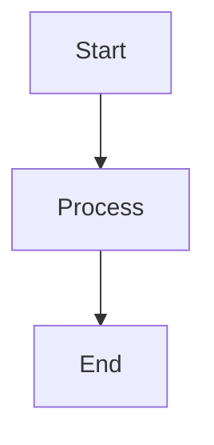

# Specification: {FEATURE-ID} - {Feature Title}

## Version History
| Version | Date | Description | Change Request |
|---------|------|-------------|----------------|
| 1.0 | YYYY-MM-DD | Initial specification | - |

## Overview
[Brief description of what this feature does]

## In Scope
- [What IS included]
- [Specific functionality]

## Out of Scope
- [What is NOT included]
- [Deferred to other features]

## Technical Scope
- [ ] Frontend
- [ ] Backend
- [ ] Full Stack (Frontend + Backend)
- [ ] API Only
- [ ] Database/Data Layer
- [ ] Infrastructure/DevOps

## Dependencies
- [Other features this depends on]
- [External dependencies]

## Linked Mockups

| Mockup Function Name | Mockup Link |
|---------------------|-------------|
| ... | ... |

## User Stories
- As a [user type], I want to [action] so that [benefit]

## Acceptance Criteria
- [ ] [Measurable criterion 1]
- [ ] [Measurable criterion 2]

## Business Logic Refinement
(To be filled in Business Refinement phase)
- [Detailed business rules]
- [Edge cases and constraints]

## Technical Design

### Logic Workflows


### Key Libraries/Frameworks
| Library/Framework | Version | Why Chosen |
|-------------------|---------|------------|
| | | |

### Technical Approaches
- [Architectural decisions]

### Usage Example (REQUIRED)
```python
# Code snippet showing implementation usage
```

## Task Breakdown
| Task ID | Task Name | Description | Dependencies | Status |
|---------|-----------|-------------|--------------|--------|
| | | | | Proposed |

(Task Breakdown table to be filled in Feature Planning phase)
