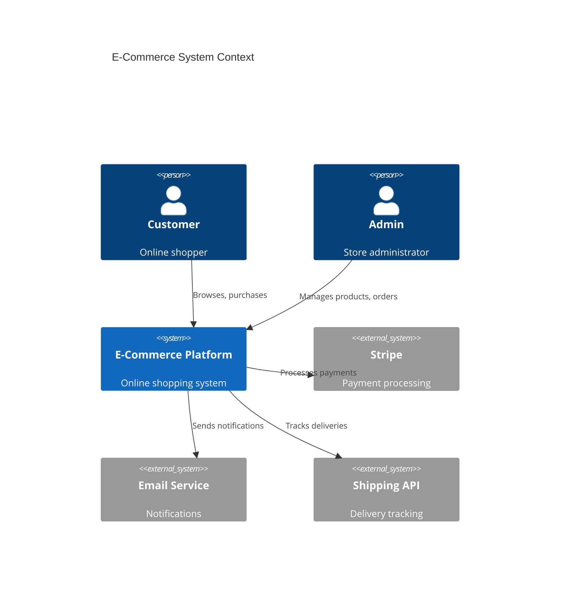
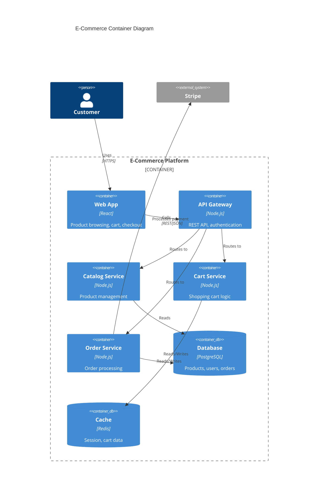
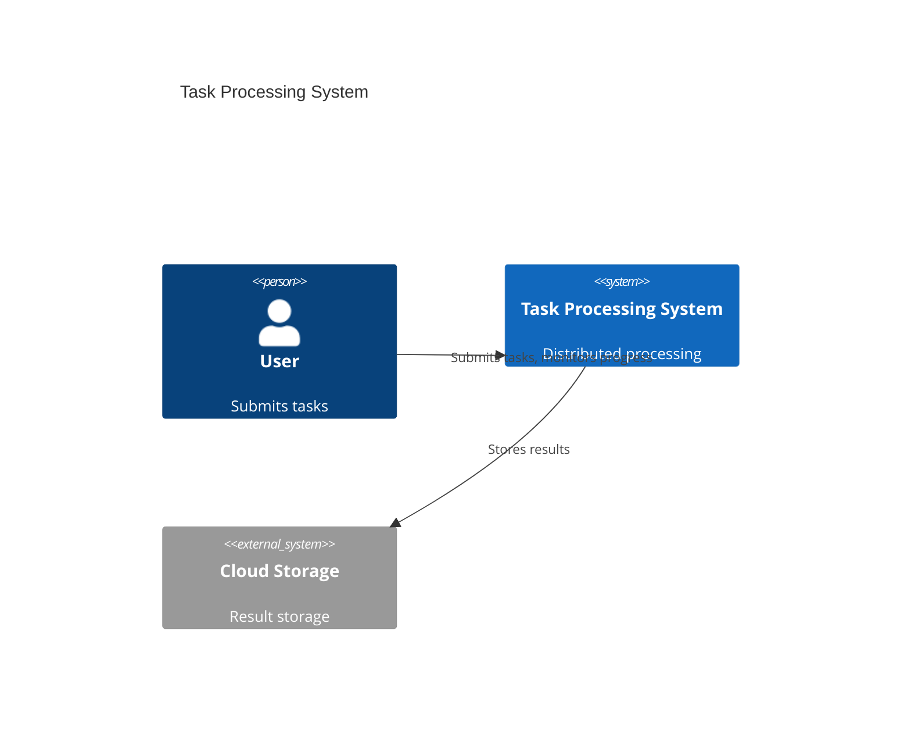
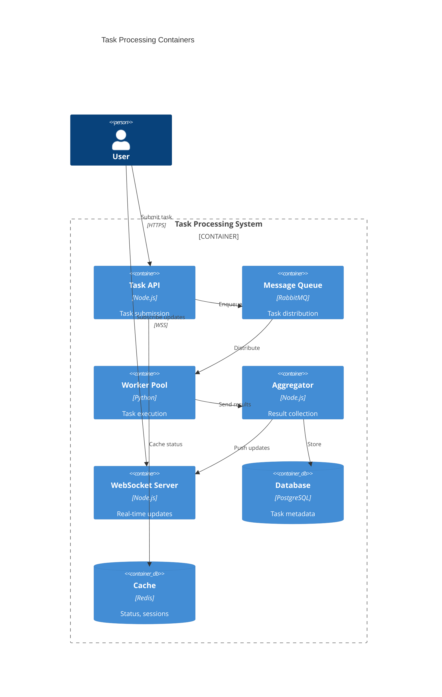
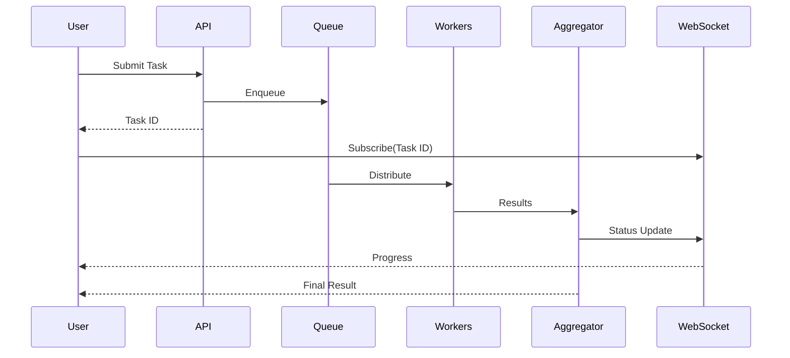

# Idea to Architecture - Examples

> Reference from SKILL.md: `See [references/examples.md](references/examples.md)`

---

## Example 1: Architecture with Mermaid Tool

**Scenario:** Create architecture diagrams for e-commerce-idea after ideation

**Input:**
- `Current Idea Folder`: `x-ipe-docs/ideas/e-commerce-idea` (from previous Ideation task)

**Config:** `x-ipe-docs/config/tools.json`
```json
{
  "version": "2.0",
  "stages": {
    "ideation": {
      "architecture": {
        "mermaid": true,
        "excalidraw": false
      }
    }
  }
}
```

**Idea Summary Excerpt:**
```markdown
## Key Features
- User registration and authentication
- Product catalog with search
- Shopping cart and checkout
- Payment processing (Stripe integration)
- Order management and tracking
```

**Execution:**
```
1. Execute Task Flow from task-execution-guideline skill

2. Validate Current Idea Folder:
   - Current Idea Folder = x-ipe-docs/ideas/e-commerce-idea
   - Folder exists ✓
   - idea-summary-v1.md exists ✓

3. Load Config:
   - Read x-ipe-docs/config/tools.json
   - stages.ideation.architecture.mermaid: true → enabled
   - stages.ideation.architecture.excalidraw: false → disabled

4. Read Idea Summary:
   - Load x-ipe-docs/ideas/e-commerce-idea/idea-summary-v1.md
   - Extract: user auth, product catalog, cart, payment, orders

5. Identify Architecture Needs:
   - Priority 1: System Architecture (multiple services)
   - Priority 2: Data Flow (checkout process)
   - Priority 3: Sequence Diagram (payment flow)

6. Create Diagrams:
   - Generate system-architecture-v1.md with C4 diagrams
   - Generate data-flow-v1.md with checkout flow
   - Generate sequence-v1.md with payment sequence

7. Save Artifacts:
   - x-ipe-docs/ideas/e-commerce-idea/architecture/system-architecture-v1.md
   - x-ipe-docs/ideas/e-commerce-idea/architecture/data-flow-v1.md
   - x-ipe-docs/ideas/e-commerce-idea/architecture/sequence-v1.md

8. Update Summary:
   - Create x-ipe-docs/ideas/e-commerce-idea/idea-summary-v2.md with diagram links

9. Human Review:
   - Present diagrams for approval
   - "Review the architecture diagrams in the architecture/ folder"

10. Output:
    task_output_links:
      - x-ipe-docs/ideas/e-commerce-idea/architecture/system-architecture-v1.md
      - x-ipe-docs/ideas/e-commerce-idea/architecture/data-flow-v1.md
      - x-ipe-docs/ideas/e-commerce-idea/architecture/sequence-v1.md
      - x-ipe-docs/ideas/e-commerce-idea/idea-summary-v2.md

11. Resume Task Flow from task-execution-guideline skill
```

**Generated System Architecture (system-architecture-v1.md):**
```markdown
# E-Commerce System Architecture

## Context Diagram (C4 Level 1)



## Container Diagram (C4 Level 2)


```

---

## Example 2: Architecture WITHOUT Tools (Manual Mode)

**Input:**
- `Current Idea Folder`: `x-ipe-docs/ideas/simple-tool`

**Config:** `x-ipe-docs/config/tools.json`
```json
{
  "version": "2.0",
  "stages": {
    "ideation": {
      "architecture": {
        "mermaid": false,
        "excalidraw": false
      }
    }
  }
}
```

**Execution:**
```
1. Validate Current Idea Folder:
   - Current Idea Folder = x-ipe-docs/ideas/simple-tool ✓

2. Load Config:
   - All architecture tools disabled
   - Ask human: "No architecture tools enabled. Proceed with manual description?"

3. If human approves manual mode:
   - Create architecture-description.md with:
     - Component listing
     - Relationship descriptions
     - Data flow narrative
   - Save to x-ipe-docs/ideas/simple-tool/architecture/architecture-description.md

4. Output:
   task_output_links:
     - x-ipe-docs/ideas/simple-tool/architecture/architecture-description.md

5. If human declines:
   - Skip architecture creation
   - Note in idea summary: "Architecture deferred - no tools available"
   - Proceed to next task
```

**Generated Manual Description (architecture-description.md):**
```markdown
# Simple Tool - Architecture Description

## System Components

### 1. Frontend
- **Type:** Web Application
- **Responsibility:** User interface, input handling
- **Technology Suggestion:** React or Vue.js

### 2. Backend API
- **Type:** REST API Server
- **Responsibility:** Business logic, data processing
- **Technology Suggestion:** Node.js or Python

### 3. Database
- **Type:** Relational Database
- **Responsibility:** Data persistence
- **Technology Suggestion:** PostgreSQL or SQLite

## Component Relationships

| From | To | Communication | Purpose |
|------|-----|---------------|---------|
| Frontend | Backend API | HTTP/REST | User requests |
| Backend API | Database | SQL | Data operations |

## Data Flow

1. User interacts with Frontend
2. Frontend sends request to Backend API
3. Backend API processes request
4. Backend API queries/updates Database
5. Response flows back to Frontend
6. Frontend displays result to user
```

---

## Example 3: Missing Idea Folder (Blocked)

**Input:**
- `Current Idea Folder`: N/A (not provided)

**Execution:**
```
1. Check Current Idea Folder:
   - Value is N/A → BLOCKED

2. List available folders:
   $ ls x-ipe-docs/ideas/
   - e-commerce-idea/
   - mobile-app/
   - simple-tool/

3. Ask human:
   "Which idea folder should I create architecture diagrams for?
   
   Available folders:
   1. e-commerce-idea
   2. mobile-app
   3. simple-tool"

4. Wait for human selection

5. Human selects: "e-commerce-idea"

6. Set Current Idea Folder = x-ipe-docs/ideas/e-commerce-idea

7. Continue with architecture creation...
```

---

## Example 4: No Idea Summary (Blocked)

**Input:**
- `Current Idea Folder`: `x-ipe-docs/ideas/new-project`

**Execution:**
```
1. Validate Current Idea Folder:
   - Folder exists ✓
   - Check for idea-summary-vN.md → NOT FOUND

2. BLOCKED - Missing prerequisite:
   "No idea summary found in x-ipe-docs/ideas/new-project/
    
    Action needed: Run Ideation task first to create idea-summary-v1.md"

3. Return:
   status: blocked
   reason: "Missing idea summary - run Ideation first"
```

---

## Example 5: Microservices Architecture

**Scenario:** Complex system with multiple services

**Idea Summary Excerpt:**
```markdown
## Overview
Distributed task processing system with:
- Task submission API
- Worker pool for parallel processing
- Result aggregation service
- Real-time status updates via WebSocket
```

**Generated Diagrams:**

**system-architecture-v1.md:**
```markdown
# Task Processing System Architecture

## System Context



## Container Diagram



## Task Flow


```
