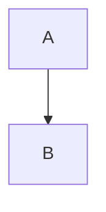
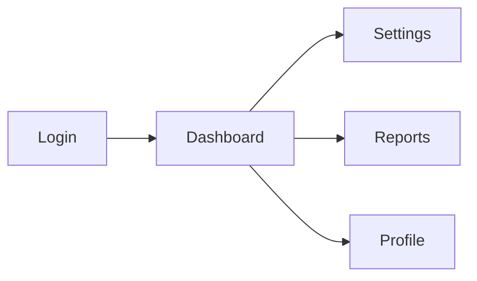
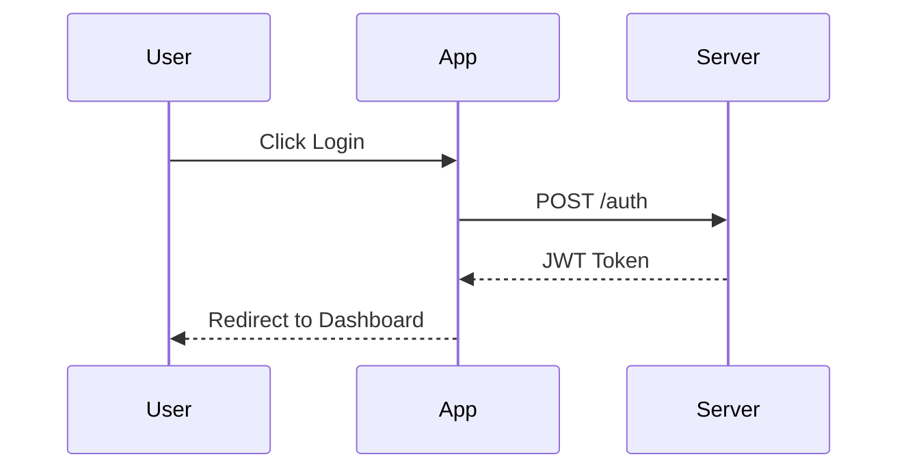
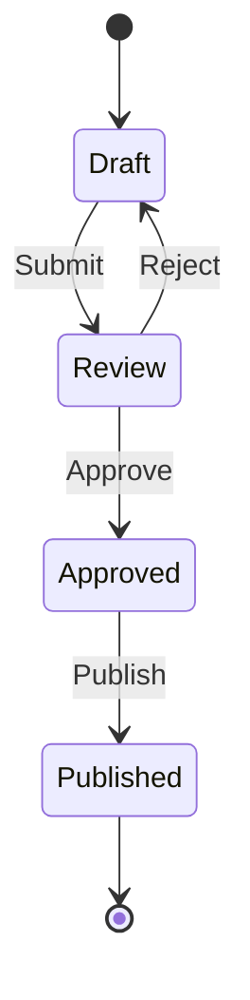

# Visualization Guidelines

Use visualization tools based on `x-ipe-docs/config/tools.json` config.

---

## When `stages.ideation.ideation.antv-infographic: true`

Invoke `infographic-syntax-creator` skill to generate visual representations. Embed in markdown:

````markdown
```infographic
infographic <template-name>
data
  ...
```
````

### Recommended Infographic Templates

| Information Type | Recommended Template | Example Use |
|-----------------|---------------------|-------------|
| Feature list | `list-grid-badge-card`, `list-row-horizontal-icon-arrow` | Key Features section |
| Process/Workflow | `sequence-snake-steps-simple`, `sequence-timeline-simple` | User journey, implementation phases |
| Pros/Cons | `compare-binary-horizontal-badge-card-arrow` | Trade-off analysis |
| SWOT Analysis | `compare-swot` | Strategic analysis |
| Priority Matrix | `compare-quadrant-quarter-simple-card` | Feature prioritization |
| Architecture | `hierarchy-tree-tech-style-badge-card` | System overview |
| Mind Map | `hierarchy-mindmap-branch-gradient-capsule-item` | Concept exploration |
| Metrics/KPIs | `chart-pie-compact-card`, `chart-column-simple` | Success metrics |

---

## When `stages.ideation.ideation.mermaid: true`

Generate mermaid diagrams directly. Embed in markdown:

````markdown

````

### Recommended Mermaid Diagrams

| Information Type | Mermaid Type | Example Use |
|-----------------|--------------|-------------|
| User Flow | `flowchart TD/LR` | User journey, process steps |
| Architecture | `flowchart TD` | System components |
| Sequence | `sequenceDiagram` | API interactions, user actions |
| State Machine | `stateDiagram-v2` | Status transitions |
| Timeline | `timeline` | Project phases, milestones |
| Entity Relationship | `erDiagram` | Data models |

---

## When `stages.ideation.ideation.tool-architecture-dsl: true`

Generate Architecture DSL directly in markdown. IPE renders `architecture-dsl` code blocks as interactive diagrams.

**Skill:** Invoke `tool-architecture-dsl` skill to learn DSL syntax.

**When to Use:**
- Layered/tiered architecture diagrams (Module View)
- Application landscapes (Landscape View)
- System integration maps
- Ideas that require visual representation of technical structure

**Embed in markdown:**

````markdown
```architecture-dsl
@startuml module-view
title "System Architecture"
theme "theme-default"
direction top-to-bottom
grid 12 x 4

layer "Presentation" {
  color "#fce7f3"
  border-color "#ec4899"
  rows 2
  
  module "Frontend" {
    cols 6
    rows 2
    grid 2 x 2
    align center center
    component "Web App" { cols 1, rows 1 }
    component "Mobile App" { cols 1, rows 1 }
  }
  
  module "API Gateway" {
    cols 6
    rows 2
    grid 1 x 1
    component "Gateway" { cols 1, rows 1 }
  }
}

layer "Data" {
  color "#dcfce7"
  border-color "#22c55e"
  rows 2
  
  module "Storage" {
    cols 12
    rows 2
    grid 3 x 1
    component "PostgreSQL" { cols 1, rows 1 }
    component "Redis" { cols 1, rows 1 }
    component "S3" { cols 1, rows 1 }
  }
}

@enduml
```
````

### Architecture DSL Quick Reference

| Diagram Type | Use Case | Key Syntax |
|--------------|----------|------------|
| **Module View** | Layered architecture, service breakdown | `@startuml module-view`, `layer`, `module`, `component` |
| **Landscape View** | System integrations, external dependencies | `@startuml landscape-view`, `zone`, `app`, `database`, arrows |

### Layer Colors

| Layer | Background | Border |
|-------|------------|--------|
| Presentation | `#fce7f3` | `#ec4899` |
| Business/Application | `#dbeafe` | `#3b82f6` |
| Data | `#dcfce7` | `#22c55e` |

### Example: 3-Tier Architecture

```architecture-dsl
@startuml module-view
title "E-Commerce Platform"
theme "theme-default"
direction top-to-bottom
grid 12 x 6

layer "Presentation" {
  color "#fce7f3"
  border-color "#ec4899"
  rows 2
  
  module "Web" { cols 4, rows 2, grid 1 x 1, component "React SPA" { cols 1, rows 1 } }
  module "Mobile" { cols 4, rows 2, grid 1 x 1, component "React Native" { cols 1, rows 1 } }
  module "Admin" { cols 4, rows 2, grid 1 x 1, component "Admin Portal" { cols 1, rows 1 } }
}

layer "Business" {
  color "#dbeafe"
  border-color "#3b82f6"
  rows 2
  
  module "Services" {
    cols 12
    rows 2
    grid 4 x 1
    align center center
    component "Order Service" { cols 1, rows 1 }
    component "Product Service" { cols 1, rows 1 }
    component "User Service" { cols 1, rows 1 }
    component "Payment Service" { cols 1, rows 1 }
  }
}

layer "Data" {
  color "#dcfce7"
  border-color "#22c55e"
  rows 2
  
  module "Databases" {
    cols 8
    rows 2
    grid 2 x 1
    component "PostgreSQL" { cols 1, rows 1 }
    component "MongoDB" { cols 1, rows 1 }
  }
  module "Cache" {
    cols 4
    rows 2
    grid 1 x 1
    component "Redis" { cols 1, rows 1 }
  }
}

@enduml
```

### Example: Landscape View

```architecture-dsl
@startuml landscape-view
title "Integration Landscape"

zone "Internal Systems" {
  app "CRM" as crm { tech: Salesforce }
  app "ERP" as erp { tech: SAP }
}

zone "External Services" {
  app "Payment" as pay { tech: Stripe }
  app "Email" as email { tech: SendGrid }
}

zone "Our Platform" {
  app "API" as api { tech: Node.js }
  database "DB" as db
}

api --> crm : "Sync customers"
api --> erp : "Sync orders"
api --> pay : "Process payments"
api --> email : "Send notifications"
api --> db : "Store data"

@enduml
```

---

## Visualization Examples

### Feature List (antv-infographic)

```infographic
infographic list-grid-badge-card
data
  title Core Features
  lists
    - label Fast Performance
      desc Sub-second response times
      icon flash
    - label Secure by Default
      desc End-to-end encryption
      icon shield check
    - label Easy Integration
      desc REST API & SDKs
      icon puzzle
    - label Real-time Sync
      desc Live collaboration
      icon sync
```

### User Flow (mermaid)



### Implementation Phases (antv-infographic)

```infographic
infographic sequence-roadmap-vertical-simple
data
  title Implementation Roadmap
  sequences
    - label Phase 1: MVP
      desc Core features only
    - label Phase 2: Beta
      desc User testing & feedback
    - label Phase 3: Launch
      desc Public release
    - label Phase 4: Scale
      desc Performance optimization
```

### Pros/Cons Analysis (antv-infographic)

```infographic
infographic compare-binary-horizontal-badge-card-arrow
data
  compares
    - label Pros
      children
        - label Lower cost
        - label Faster delivery
        - label Better UX
    - label Cons
      children
        - label Learning curve
        - label Migration effort
```

### Sequence Diagram (mermaid)



### State Diagram (mermaid)



---

## When NOT to Use Visualizations

- Simple bullet lists (< 3 items)
- Highly technical specifications
- Code examples or API documentation
- Legal/compliance text
- **When both `stages.ideation.ideation.antv-infographic` and `stages.ideation.ideation.mermaid` are `false`** → Use standard markdown
