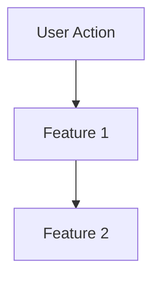

# Idea Summary Template

> Use this template when creating `idea-summary-vN.md` files.

```markdown
# Idea Summary

> Idea ID: IDEA-XXX
> Folder: {folder_name}
> Version: vN
> Created: {date}
> Status: Refined

## Overview
{Brief description of the refined idea}

## Problem Statement
{What problem does this idea solve?}

## Target Users
{Who will benefit?}

## Proposed Solution
{High-level description of the solution}

## Key Features

{IF antv-infographic enabled → use infographic DSL}
{IF mermaid enabled → use mermaid for flow}
{IF both disabled → use bullet list}

<!-- Example if antv-infographic: true -->
```infographic
infographic list-grid-badge-card
data
  title Key Features
  lists
    - label Feature 1
      desc Description of feature 1
      icon flash
    - label Feature 2
      desc Description of feature 2
      icon shield
```

<!-- Example if mermaid: true (for user flow) -->


## Success Criteria
- [ ] Criterion 1
- [ ] Criterion 2

## Constraints & Considerations
- Constraint 1
- Constraint 2

## Brainstorming Notes
{Key insights from brainstorming session}

## Ideation Artifacts (If Tools Used)
{Link to any mockups, prototypes, or visual artifacts created during brainstorming}
- Mockup: {path or description}
- Prototype: {path or URL}

## Source Files
- file1.md
- file2.txt

## Next Steps
- [ ] Proceed to Idea Mockup

## References & Common Principles
{Include if the idea involves common/established topics}

### Applied Principles
- **Principle 1:** {Description} - [Source](URL)
- **Principle 2:** {Description} - [Source](URL)

### Further Reading
- [Resource 1](URL) - {Brief description}
- [Resource 2](URL) - {Brief description}
```
