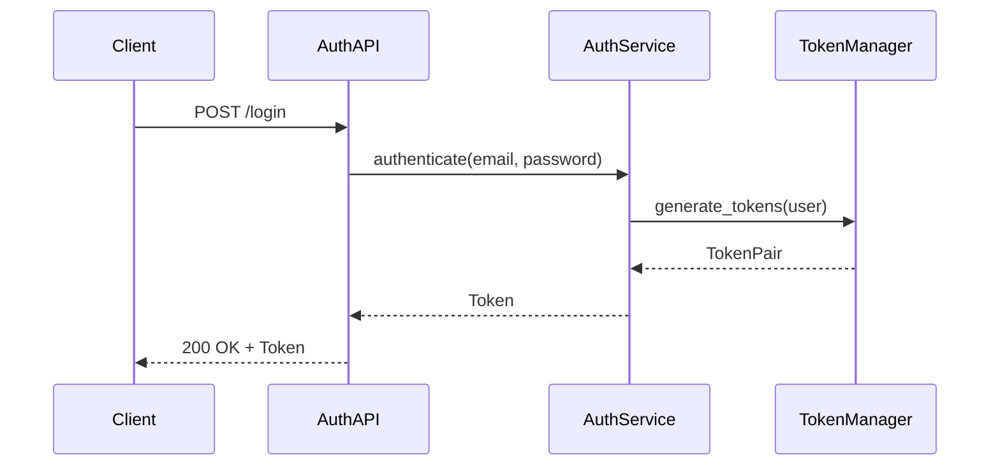

# Task Type: Technical Design

## Purpose

Create technical design for a single feature by:
1. Querying feature board for full Feature Data Model
2. Reading feature specification document
3. Researching best practices and existing patterns
4. Creating two-part technical design document
5. NO board status update (handled by category skill)

---

## Important Notes

### Skill Prerequisite
- If you HAVE NOT learned `task-execution-guideline` skill, please learn it first before executing this skill.

**Important:** If Agent DO NOT have skill capability, can directly go to `skills/` folder to learn skills. And SKILL.md file is the entry point to understand each skill.

---

## Task Type Default Attributes

| Attribute | Value |
|-----------|-------|
| Task Type | Technical Design |
| Category | feature-stage |
| Next Task Type | Code Implementation |
| Require Human Review | Yes |
| Feature Phase | Technical Design |

---

## Task Type Required Input Attributes

| Attribute | Default Value | Description |
|-----------|---------------|-------------|
| Auto Proceed | False | Whether to auto-proceed to next task |
| Mockup List | N/A | Path to mockup file(s) from previous Idea Mockup task or context |

### Mockup List Attribute

**Purpose:** Provides UI/UX mockup reference for frontend-related technical designs.

**Source:** This value can be obtained from:
1. Previous task output (Idea Mockup task's `task_output_links`)
2. Human input (explicit mockup path provided)
3. Feature specification's "Linked Mockups" section
4. Idea summary document's "Mockups & Prototypes" section
5. Default: N/A (no mockup available)

**Loading Logic:**
```
1. IF previous task was "Idea Mockup":
   → Extract mockup path from previous task's task_output_links
   → Set Mockup List = extracted path

2. ELSE IF human provides explicit Mockup List:
   → Use human-provided value

3. ELSE IF specification.md has "Linked Mockups" section:
   → Extract mockup paths from specification
   → Set Mockup List = extracted paths

4. ELSE IF idea-summary-vN.md has "Mockups & Prototypes" section:
   → Extract mockup paths from idea summary
   → Set Mockup List = extracted paths

5. ELSE:
   → Set Mockup List = N/A
```

**Usage:** When Mockup List is provided AND Technical Scope includes [Frontend] or [Full Stack], the agent MUST:
1. Open and analyze the mockup file(s)
2. Extract UI component requirements from mockup
3. Design frontend components based on mockup layout
4. Reference mockup in Part 2 Implementation Guide

---

## Skill/Task Completion Output

This skill MUST return these attributes to the Task Data Model upon task completion:

```yaml
Output:
  category: feature-stage
  status: completed | blocked
  next_task_type: Code Implementation
  require_human_review: Yes
  auto_proceed: {from input Auto Proceed}
  mockup_list: {from input Mockup List, pass to next task if applicable}
  task_output_links: [x-ipe-docs/requirements/FEATURE-XXX/technical-design.md]
  feature_id: FEATURE-XXX
  feature_title: {title}
  feature_version: {version}
  feature_phase: Technical Design
```

---

## Definition of Ready (DoR)

| # | Checkpoint | Required |
|---|------------|----------|
| 1 | Feature exists on feature board | Yes |
| 2 | Feature status is "Done Feature Refinement" | Yes |
| 3 | Feature specification document exists | Yes |

---

## Execution Flow

Execute Technical Design by following these steps in order:

| Step | Name | Action | Gate to Next |
|------|------|--------|--------------|
| 1 | Query Board | Get Feature Data Model from feature board | Feature data received |
| 2 | Read Spec | Thoroughly read feature specification | Spec understood |
| 3 | Reference Arch | Check existing architecture patterns | Patterns identified |
| 4 | Research | Search for best practices and libraries | Research complete |
| 5 | Create Design | Write two-part technical design document | Design written |
| 6 | Complete | Verify DoD, output summary, request human review | Human review |

**⛔ BLOCKING RULES:**
- Step 1: BLOCKED if feature not on board or status not "Done Feature Refinement"
- Step 6 → Human Review: Human MUST approve technical design before Test Generation

---

## Design Principles

### KISS (Keep It Simple, Stupid)

- Design simple, maintainable solutions
- Avoid over-engineering
- Choose boring technology when possible
- Complex solutions need strong justification

**Good:** Direct database queries for simple CRUD
**Bad:** Adding message queues for simple data fetching

---

### YAGNI (You Aren't Gonna Need It)

- Design ONLY for current requirements
- No "future-proofing" without clear need
- Defer decisions until last responsible moment
- Avoid speculative generality

**Good:** Simple auth for MVP, expand later if needed
**Bad:** Building OAuth, SSO, MFA when only email/password needed

---

### DRY (Don't Repeat Yourself)

- Identify common patterns across features
- Extract shared logic into reusable components
- Reference existing architecture designs
- But: Don't DRY prematurely (wait for 3+ duplications)

**Good:** Reuse existing error handling patterns
**Bad:** Creating abstractions before seeing actual duplication

---

### Module Size Rule (800-Line Threshold)

> **Rule:** When adding new functionality to an existing file, if the result would exceed **800 lines of code**, extract the new functionality into a **standalone module**.

**Rationale:**
- Files over 800 lines become difficult to navigate and maintain
- Standalone modules enable better separation of concerns
- Easier to test, debug, and refactor isolated modules
- Reduces merge conflicts in collaborative development

**How to Apply:**
1. Before adding code to existing file, check current line count
2. Estimate new functionality size
3. If `current + new > 800`, create new module
4. Keep integration points minimal (exports/imports)

**Good:** Creating `voice-input.js` (400 lines) separate from `terminal-v2.js` (500 lines)
**Bad:** Adding voice input directly to terminal-v2.js making it 900+ lines

---

## Two-Part Document Structure

Technical design documents MUST use this two-part structure. Adapt content based on implementation type (API, CLI, frontend, backend, etc.).

### Part 1: Agent-Facing Summary

> **Purpose:** Enable AI agents to quickly understand and reference designs across large projects.
> 
> **📌 Note for AI Coders:** Focus primarily on Part 1 for implementation. Part 2 is supplementary for complex scenarios.

**Required Elements:**
- **Key Components Implemented:** What modules/classes/services were created or modified
- **Scope & Boundaries:** What this design covers and what it doesn't
- **Dependencies:** Components from other features/foundation this feature relies on
- **Major Flow:** High-level description of how components interact
- **Usage Example:** Code snippet showing how to use the implemented feature

---

### Mockup Reference (Conditional)

**🎨 When to Use Mockup List:**
```
IF Mockup List != N/A AND Technical Scope in specification.md includes [Frontend] OR [Full Stack]:
  1. OPEN and analyze the Mockup List file(s)
  2. Extract UI requirements from mockup:
     - Component hierarchy and structure
     - State management requirements
     - Event handlers and user interactions
     - CSS/styling approach
  3. Design frontend components based on mockup
  4. Include mockup-derived requirements in Part 2 Implementation Guide
  5. Reference mockup filenames in design decisions

ELSE IF Mockup List == N/A AND specification.md has "Linked Mockups" section:
  1. MUST review "Linked Mockups" section in specification.md
  2. Open and analyze each linked mockup file
  3. Follow same extraction process as above

ELSE (Backend/API Only/Database/Infrastructure OR no mockups available):
  - Skip mockup reference
  - Focus on service architecture, data models, APIs
```

**Design Document Note:**
When Technical Scope includes frontend, Part 2 SHOULD include:
- UI Component breakdown
- State management strategy
- Mockup-to-component mapping

**Format Guidelines:**
- Use tables for component listings (Component | Responsibility | Scope/Impact | Tags)
- Use dependency table for cross-feature/foundation dependencies
- Tags enable semantic search across project designs
- Keep concise - this is a reference summary, not documentation

**Dependency Table Format:**
| Dependency | Source | Design Link | Usage Description (≤50 words) |
|------------|--------|-------------|-------------------------------|
| `AuthService` | FEATURE-001 | [technical-design.md](../FEATURE-001/technical-design.md) | Used for user authentication before accessing protected endpoints |
| `DatabaseManager` | Foundation | [database.md](../../architecture/technical-designs/database.md) | Provides connection pooling and query execution |

### Part 2: Human-Readable Implementation Guide

> **Purpose:** Detailed guide for developers to understand and implement the design.
> 
> **📌 Note:** This section emphasizes visual diagrams and step-by-step guidance for human comprehension.

**Include as needed based on implementation type:**
- **Workflow Diagrams:** Mermaid sequence/flow diagrams for visual understanding (REQUIRED for complex flows)
- **Data Models:** Schema definitions, type structures
- **API/Interface Specs:** Endpoints, CLI commands, function signatures
- **Implementation Steps:** Ordered tasks to build the feature
- **Edge Cases:** Error handling, boundary conditions

**Format Guidelines:**
- **Prioritize visualization** - Use Mermaid diagrams liberally for:
  - Sequence diagrams for API/service interactions
  - Flowcharts for decision logic
  - Entity-relationship diagrams for data models
  - State diagrams for stateful components
- Adapt sections to implementation type:
  - API-based: Focus on endpoints, request/response, auth
  - CLI-based: Focus on commands, flags, output formats
  - Frontend: Focus on components, state, user interactions
  - Backend: Focus on services, data flow, integrations

---

## Document Location Rules

| Design Scope | Location |
|--------------|----------|
| Feature-specific design | `x-ipe-docs/requirements/FEATURE-XXX/technical-design.md` |
| Cross-feature/Architecture design | `x-ipe-docs/architecture/technical-designs/{component}.md` |

---

## ⚠️ Single File with Version History (IMPORTANT)

**Rule:** Maintain ONE technical design file per feature with version history inside.

**DO NOT create versioned files like:**
- ❌ `technical-design-v2.md`
- ❌ `technical-design-v1.md`

**Instead:**
- ✅ Keep single `technical-design.md` file
- ✅ Add/update Version History table at the top
- ✅ Update content in place with new version

**Version History Format (add at top of document after header):**
```markdown
## Version History

| Version | Date | Description |
|---------|------|-------------|
| v2.0 | 01-22-2026 | Major upgrade: xterm.js, session persistence, split-pane |
| v1.0 | 01-18-2026 | Initial design with VanillaTerminal |
```

**When updating existing design:**
1. Increment version in document header (v1.0 → v2.0)
2. Add new row to Version History table
3. Update design content in place
4. Keep the same filename: `technical-design.md`

---

## Execution Procedure

### Step 1: Query Feature Board

**Action:** Get full Feature Data Model for context

```
CALL feature-stage+feature-board-management skill:
  operation: query_feature
  feature_id: {feature_id from task_data}

RECEIVE Feature Data Model:
  feature_id: FEATURE-XXX
  title: {Feature Title}
  version: v1.0
  status: Done Feature Refinement
  specification_link: x-ipe-docs/requirements/FEATURE-XXX/specification.md
```

---

### Step 2: Read Specification

**Action:** Deeply understand requirements

```
1. READ {specification_link} from Feature Data Model
2. UNDERSTAND:
   - User stories and acceptance criteria
   - Business rules and constraints
   - Edge cases documented
   - Dependencies on other features
```

---

### Step 3: Reference Architecture

**Action:** Check existing architecture patterns

```
1. READ x-ipe-docs/architecture/ for existing patterns
2. IDENTIFY:
   - Reusable components
   - Established conventions
   - Integration requirements
3. AVOID reinventing existing solutions
```

---

### Step 4: Research Best Practices

**Action:** Research optimal implementation approaches

```
1. SEARCH for official documentation
2. LOOK for existing libraries (don't reinvent the wheel)
3. CHECK reference implementations
4. REVIEW API documentation for planned libraries

DOCUMENT findings for design decisions
```

---

### Step 5: Create Technical Design Document

**Action:** Write two-part technical design at `x-ipe-docs/requirements/FEATURE-XXX/technical-design.md`

**Adapt structure based on implementation type** (API, CLI, frontend, backend, etc.)

**Example Structure:**

```markdown
# Technical Design: {Feature Title}

> Feature ID: FEATURE-XXX | Version: v1.0 | Last Updated: YYYY-MM-DD

---

## Part 1: Agent-Facing Summary

> **Purpose:** Quick reference for AI agents navigating large projects.
> **📌 AI Coders:** Focus on this section for implementation context.

### Key Components Implemented

| Component | Responsibility | Scope/Impact | Tags |
|-----------|----------------|--------------|------|
| `AuthService` | User authentication | Login flow across apps | #auth #security #core |
| `TokenManager` | JWT generation/validation | Session management | #auth #jwt |

### Dependencies

| Dependency | Source | Design Link | Usage Description |
|------------|--------|-------------|-------------------|
| `UserRepository` | FEATURE-001 | [technical-design.md](../FEATURE-001/technical-design.md) | Query user records for credential validation |
| `ConfigManager` | Foundation | [config.md](../../architecture/technical-designs/config.md) | Load JWT secret and token expiry settings |

### Major Flow

1. Client submits credentials → AuthService validates → TokenManager generates JWT → Response returned
2. Subsequent requests include JWT → TokenManager validates → Access granted/denied

### Usage Example

```python
# Authentication flow
auth = AuthService()
token = auth.login(email="user@test.com", password="secure")

# Using the token
api.set_auth_header(token.access_token)
response = api.get("/protected-resource")
```

---

## Part 2: Implementation Guide

> **Purpose:** Human-readable details for developers.
> **📌 Emphasis on visual diagrams for comprehension.

### Workflow Diagram



### [Data Models / API Specs / CLI Commands - adapt to implementation type]

(Content varies based on whether this is API, CLI, frontend, etc.)

### Implementation Steps

1. **{Layer}:** [Tasks]
2. **{Layer}:** [Tasks]

### Edge Cases & Error Handling

| Scenario | Expected Behavior |
|----------|-------------------|
| Invalid password | 401 Unauthorized |
| Rate limit exceeded | 429 Too Many Requests |

---

## Design Change Log

| Date | Phase | Change Summary |
|------|-------|----------------|
| {YYYY-MM-DD} | Initial Design | Initial technical design created. |
```

---

## Design Change Log Format

When the technical design needs to be updated (during implementation, bug fix, or feature extension), add an entry:

| Date | Phase | Change Summary |
|------|-------|----------------|
| YYYY-MM-DD | {Phase where change occurred} | {Summary in ~100 words: what changed, why it changed, impact on components} |

**Valid Phases:** Technical Design, Test Generation, Code Implementation, Bug Fix, Feature Extension

---

## Definition of Done (DoD)

| # | Checkpoint | Required |
|---|------------|----------|
| 1 | Technical design document created | Yes |
| 2 | Part 1 has component table with tags | Yes |
| 3 | Part 1 has usage example | Yes |
| 4 | Part 2 has workflow diagrams (Mermaid) | Recommended |
| 5 | Part 2 adapted to implementation type | Yes |
| 6 | KISS/YAGNI/DRY principles followed | Yes |
| 7 | Mockup List analyzed (if provided AND frontend scope) | If Applicable |
| 8 | UI components derived from mockup (if frontend scope) | If Applicable |

**Important:** After completing this skill, always return to `task-execution-guideline` skill to continue the task execution flow and validate the DoD defined there.

---

## Anti-Patterns

| Anti-Pattern | Why Bad | Do Instead |
|--------------|---------|------------|
| Over-engineering | Wasted effort | Apply KISS principle |
| Future-proofing | YAGNI violation | Design for current needs |
| No research | Reinventing wheels | Research existing solutions |
| Monolithic design | Hard to change | Design modular components |
| Missing workflows | Hard to understand | Always include Mermaid diagrams |
| No tags | Hard for AI to find | Always add searchable tags |

---

## Patterns

### Pattern: API-Based Feature

**When:** Feature exposes REST/GraphQL endpoints
**Then:**
```
1. Focus Part 2 on API specification
2. Include request/response schemas
3. Document authentication requirements
4. Add sequence diagrams for complex flows
```

### Pattern: Background Service

**When:** Feature runs as background process
**Then:**
```
1. Design for fault tolerance
2. Include retry/backoff strategies
3. Document monitoring points
4. Add state diagrams for lifecycle
```

### Pattern: UI-Heavy Feature

**When:** Feature is primarily frontend
**Then:**
```
1. Focus on component architecture
2. Document state management
3. Include wireframes or mockup references
4. Describe user interaction flows
```

---

## Example

See [references/examples.md](references/examples.md) for detailed execution examples including:
- User authentication technical design
- Complex feature with multiple modules
- Missing specification (blocked)
- Design update from change request

---

## Notes

- Work on ONE feature at a time (feature_id from task_data)
- Query feature board first to get context
- Read specification thoroughly before designing
- Reference architecture docs for existing patterns
- Create two-part design document with tags
- Include Design Change Log section at end of document
- Do NOT update feature board status (category skill handles this)
- Output feature_phase = "Technical Design" for correct board update
